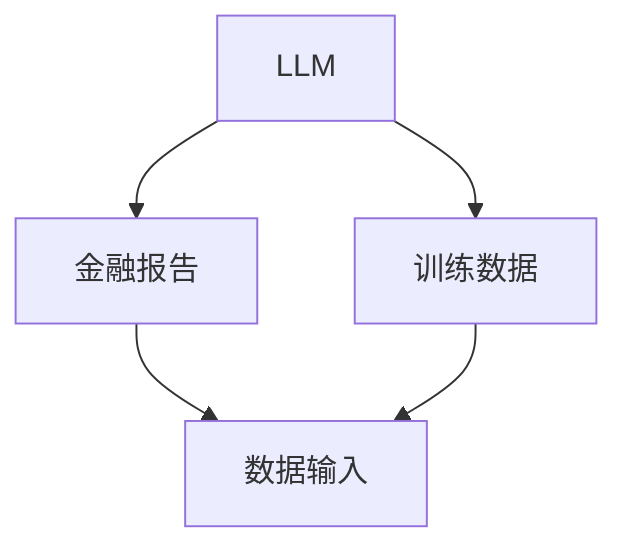
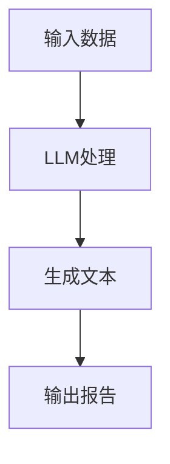
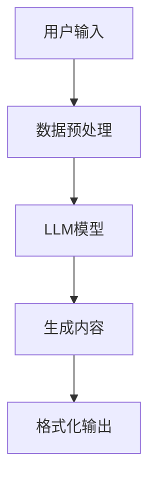
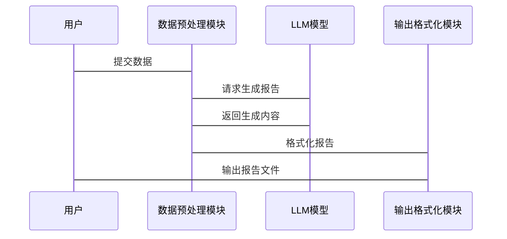

                 


# 利用LLM优化金融报告的自动生成

## 关键词：LLM, 金融报告, 自动生成, 优化, 大语言模型

## 摘要：本文探讨了如何利用大语言模型（LLM）优化金融报告的自动生成过程。通过分析金融报告生成的背景与挑战，深入讲解LLM的核心原理，详细阐述算法优化策略，并通过系统设计与项目实战展示实际应用。本文旨在为读者提供从理论到实践的全面指导，帮助他们理解并应用LLM技术来提升金融报告的生成效率和质量。

---

# 第一部分: 利用LLM优化金融报告自动生成的背景与基础

## 第1章: 金融报告自动生成的背景与挑战

### 1.1 问题背景与描述

#### 1.1.1 金融报告自动生成的需求背景
金融报告是金融行业中的重要组成部分，包括财务分析、市场趋势分析、风险评估等。传统上，金融报告的生成依赖于人工撰写，耗时且效率低下。随着企业对数据处理和分析的需求不断增加，如何快速生成高质量的金融报告成为一项重要挑战。

#### 1.1.2 传统金融报告生成的痛点
- **效率低**：人工撰写报告耗时长，难以满足高频报告的需求。
- **一致性差**：不同人员撰写报告的风格和质量不一致。
- **数据处理复杂**：需要手动整合和分析大量数据，容易出错。
- **难以实时更新**：市场数据变化快，报告更新滞后。

#### 1.1.3 LLM在金融报告生成中的潜力
- **高效生成**：LLM能够快速生成文本，显著提高报告生成效率。
- **一致性**：通过模型训练，可以保持报告的风格和格式一致。
- **数据整合能力**：LLM能够处理和分析大量结构化和非结构化数据，生成准确的报告内容。
- **实时更新**：模型可以根据最新的市场数据实时生成报告，保持信息的及时性。

### 1.2 问题解决与边界

#### 1.2.1 利用LLM优化金融报告生成的目标
- 提高金融报告生成的效率和质量。
- 实现报告内容的智能化和自动化。
- 提供一致的报告格式和风格。

#### 1.2.2 问题解决的边界与外延
- **边界**：专注于金融报告的自动生成，不涉及数据的收集和初步处理。
- **外延**：可以扩展到其他类型的企业报告生成，如市场分析报告、财务预测报告等。

#### 1.2.3 核心要素与概念结构
- **输入数据**：结构化数据（如财务数据、市场数据）和非结构化数据（如新闻、行业分析）。
- **LLM模型**：用于生成报告文本的核心工具。
- **输出报告**：生成的金融报告，包含分析、结论和建议。

### 1.3 核心概念与联系

#### 1.3.1 LLM的核心原理
- LLM通过深度学习技术，训练大规模的文本数据，能够生成与训练数据相似的文本。
- 模型能够理解上下文，生成连贯的文本内容。

#### 1.3.2 金融报告生成的关键要素
- **数据输入**：报告生成的基础，包括财务数据、市场动态等。
- **模型训练**：通过大量金融相关文本数据训练模型，使其具备生成金融报告的能力。
- **生成策略**：根据输入数据和业务需求，选择合适的生成策略。

#### 1.3.3 LLM与金融报告生成的实体关系图


### 1.4 本章小结
本章介绍了金融报告自动生成的背景与挑战，分析了传统方法的痛点，并探讨了LLM在其中的应用潜力。通过明确问题解决的目标和边界，为后续章节的深入分析奠定了基础。

---

## 第2章: 大语言模型（LLM）的核心原理

### 2.1 LLM的定义与特点

#### 2.1.1 大语言模型的定义
LLM（Large Language Model）是一种基于深度学习的自然语言处理模型，能够理解和生成人类语言。它通过训练大量文本数据，掌握了语言的结构和语义。

#### 2.1.2 LLM的核心特点
- **大规模数据训练**：通过训练数百万甚至数十亿的文本数据，模型能够掌握丰富的语言知识。
- **深度学习架构**：通常基于Transformer架构，具备强大的上下文理解和生成能力。
- **多任务学习能力**：LLM可以在多种任务上表现出色，如文本生成、翻译、问答等。

#### 2.1.3 LLM与传统NLP模型的区别
| 特性         | LLM                | 传统NLP模型         |
|--------------|--------------------|--------------------|
| 数据规模     | 大规模（百万+）    | 较小规模            |
| 架构         | 基于Transformer      | 基于RNN/LSTM        |
| 任务处理     | 多任务能力强        | 专注于特定任务       |
| 训练效率     | 需要大量计算资源    | 计算资源需求较低     |

### 2.2 LLM的训练与推理机制

#### 2.2.1 基于转换器的LLM架构
- **转换器架构**：由Transformer的编码器和解码器组成，能够处理输入序列并生成输出序列。
- **自注意力机制**：模型能够关注输入序列中的重要部分，提高生成文本的质量。

#### 2.2.2 LLM的训练流程
1. **数据准备**：收集和预处理大量文本数据。
2. **模型初始化**：随机初始化模型参数。
3. **训练迭代**：通过梯度下降优化模型参数，最小化预测与真实值的误差。
4. **评估与调优**：通过验证集评估模型性能，调整超参数优化模型。

#### 2.2.3 LLM的推理过程
1. **输入处理**：将输入文本转换为模型可处理的格式。
2. **生成策略**：选择生成文本的方式，如贪心算法或采样方法。
3. **输出生成**：模型根据输入生成输出文本。

### 2.3 LLM的数学模型与公式

#### 2.3.1 转换器架构的数学表示
- **自注意力机制**：
  $$ \text{Attention}(Q, K, V) = \text{softmax}\left(\frac{QK^T}{\sqrt{d_k}}\right)V $$
  其中，$Q$、$K$、$V$分别是查询、键和值向量，$d_k$是向量的维度。

- **前馈网络**：
  $$ f(x) = \text{ReLU}(W_1x + b_1) + W_2x + b_2 $$

#### 2.3.2 注意力机制的公式推导
- **查询向量**：$Q = W_qx$
- **键向量**：$K = W_kx$
- **值向量**：$V = W_vx$
- **注意力权重**：$\text{softmax}\left(\frac{QK^T}{\sqrt{d_k}}\right)$
- **最终输出**：$\text{softmax}\left(\frac{QK^T}{\sqrt{d_k}}\right)V$

#### 2.3.3 损失函数的计算
- **交叉熵损失**：
  $$ \mathcal{L} = -\sum_{i=1}^{n} y_i \log(p_i) $$
  其中，$y_i$是真实标签，$p_i$是模型预测的概率。

### 2.4 本章小结
本章详细介绍了大语言模型的核心原理，包括模型定义、特点、训练与推理机制，以及数学公式。这些内容为后续章节中利用LLM优化金融报告生成奠定了理论基础。

---

## 第3章: 利用LLM优化金融报告生成的算法原理

### 3.1 算法原理概述

#### 3.1.1 基于LLM的金融报告生成流程
1. **数据输入**：输入需要生成报告的相关数据。
2. **模型处理**：将输入数据输入LLM模型，生成报告内容。
3. **输出报告**：模型生成的文本即为金融报告。

#### 3.1.2 LLM在文本生成中的应用
- **文本生成**：LLM能够生成连贯且符合语法规则的文本。
- **上下文理解**：模型能够理解输入数据的上下文，生成相关的报告内容。

#### 3.1.3 优化算法的核心思想
- **基于LLM的生成策略**：选择合适的生成方法，如贪心算法或采样方法。
- **优化目标**：提高生成报告的质量和一致性。

### 3.2 算法实现与流程图

#### 3.2.1 生成流程的Mermaid图


#### 3.2.2 算法实现的Python代码示例
```python
import torch
import torch.nn as nn

# 定义模型
class LLM(nn.Module):
    def __init__(self, vocab_size, embedding_dim, hidden_dim):
        super(LLM, self).__init__()
        self.embedding = nn.Embedding(vocab_size, embedding_dim)
        self.decoder = nn.TransformerDecoder(
            nn.TransformerDecoderLayer(embedding_dim, num_heads=8, dff=embedding_dim*4),
            num_layers=6
        )
        self.fc = nn.Linear(hidden_dim, vocab_size)

    def forward(self, input_ids):
        embed = self.embedding(input_ids)
        output = self.decoder(embed)
        output = self.fc(output)
        return output

# 模型训练
def train_model(model, optimizer, criterion, train_loader, epochs=10):
    for epoch in range(epochs):
        for batch in train_loader:
            inputs, labels = batch
            outputs = model(inputs)
            loss = criterion(outputs, labels)
            optimizer.zero_grad()
            loss.backward()
            optimizer.step()
    return model

# 模型推理
def generate_report(model, input_data):
    with torch.no_grad():
        output = model(input_data)
        predicted = torch.argmax(output, dim=-1)
        return predicted
```

### 3.3 数学模型与公式

#### 3.3.1 LLM生成概率公式
- **生成概率**：
  $$ p(y|x) = \text{softmax}(W_{\text{output}}h_{\text{dec}} + b_{\text{output}}) $$
  其中，$h_{\text{dec}}$是解码器的输出表示。

#### 3.3.2 损失函数的优化公式
- **交叉熵损失**：
  $$ \mathcal{L} = -\sum_{i=1}^{n} y_i \log(p_i) $$
  通过反向传播优化模型参数，最小化损失函数。

#### 3.3.3 注意力机制的具体实现
- **注意力权重计算**：
  $$ \alpha_i = \text{softmax}\left(\frac{Q_i K_j^T}{\sqrt{d_k}}\right) $$
- **加权求和**：
  $$ h_j = \sum_{i=1}^{n} \alpha_i v_i $$

### 3.4 本章小结
本章详细阐述了利用LLM优化金融报告生成的算法原理，包括生成流程、代码实现和数学公式。通过这些内容，读者可以理解如何将LLM应用于金融报告生成，并掌握相关的实现细节。

---

## 第4章: 金融报告生成系统的分析与设计

### 4.1 系统分析

#### 4.1.1 问题场景介绍
- **场景描述**：金融公司需要快速生成市场分析报告、财务预测报告等。
- **用户需求**：提高报告生成效率，保证报告质量。

#### 4.1.2 系统功能需求
- **数据输入**：支持多种数据格式的输入，如Excel、CSV。
- **报告生成**：根据输入数据生成相应的金融报告。
- **格式输出**：支持多种输出格式，如PDF、Word文档。

#### 4.1.3 系统性能指标
- **生成速度**：每分钟生成多少份报告。
- **准确率**：生成报告的准确性和相关性。
- **稳定性**：系统在高负载下的运行稳定性。

### 4.2 系统架构设计

#### 4.2.1 系统功能设计
- **数据预处理**：清洗和整合输入数据。
- **模型调用**：调用LLM模型生成报告内容。
- **输出格式化**：将生成的内容格式化为报告。

#### 4.2.2 系统架构图


#### 4.2.3 系统接口设计
- **输入接口**：接收结构化数据和非结构化数据。
- **输出接口**：输出格式化的报告文件。

#### 4.2.4 系统交互流程图


### 4.3 本章小结
本章分析了金融报告生成系统的功能需求和架构设计，通过系统交互图展示了各模块之间的协作关系。这为后续的项目实现提供了清晰的指导。

---

## 第5章: 项目实战

### 5.1 环境安装与配置

#### 5.1.1 安装Python环境
```bash
python --version
pip install --upgrade pip
```

#### 5.1.2 安装必要的库
```bash
pip install torch transformers
```

### 5.2 核心功能实现

#### 5.2.1 数据预处理
```python
import pandas as pd

def preprocess_data(data_file):
    # 加载数据
    df = pd.read_csv(data_file)
    # 数据清洗
    df.dropna(inplace=True)
    return df
```

#### 5.2.2 模型加载与调用
```python
from transformers import AutoTokenizer, AutoModelForCausalLM

tokenizer = AutoTokenizer.from_pretrained("gpt2")
model = AutoModelForCausalLM.from_pretrained("gpt2")
```

#### 5.2.3 报告生成
```python
def generate_financial_report(data, tokenizer, model):
    inputs = tokenizer.encode("Financial Report:\n" + data, return_tensors="pt")
    outputs = model.generate(inputs, max_length=500)
    report = tokenizer.decode(outputs[0], skip_special_tokens=True)
    return report
```

### 5.3 实际案例分析

#### 5.3.1 数据输入
```python
data_input = " Quarterly financial statements of ABC Corp, revenue increased by 15%."
```

#### 5.3.2 模型生成
```python
report = generate_financial_report(data_input, tokenizer, model)
print(report)
```

#### 5.3.3 输出结果
```
Financial Report:
The revenue of ABC Corp has shown a significant increase of 15% this quarter. This growth indicates strong market performance and effective business strategies. Further analysis is recommended to understand the underlying factors driving this growth.
```

### 5.4 本章小结
本章通过实际案例展示了如何利用LLM生成金融报告，从环境配置到代码实现，一步步指导读者完成项目。通过具体操作，读者可以更好地理解和应用相关技术。

---

## 第6章: 总结与展望

### 6.1 本章小结
本文详细探讨了利用LLM优化金融报告自动生成的方法，从背景分析到系统设计，再到项目实现，全面介绍了相关技术和应用。通过本文的学习，读者可以掌握如何利用大语言模型提升金融报告的生成效率和质量。

### 6.2 最佳实践 tips

#### 6.2.1 关键技术点
- 选择合适的LLM模型，如GPT-2、GPT-3等。
- 数据预处理是关键，确保输入数据的准确性和完整性。

#### 6.2.2 注意事项
- 避免过度依赖模型，定期人工校对报告内容。
- 注意模型的训练数据可能引入偏差，需进行适当调整。

#### 6.2.3 拓展阅读
- 《Deep Learning》—— Ian Goodfellow
- 《Attention Is All You Need》—— Vaswani et al.

### 6.3 未来展望
随着大语言模型技术的不断进步，金融报告生成将更加智能化和自动化。未来的研究可以关注模型的可解释性、生成内容的实时性和跨语言支持等方面。

---

## 作者：AI天才研究院/AI Genius Institute & 禅与计算机程序设计艺术 /Zen And The Art of Computer Programming

---

通过本文的详细讲解，读者可以系统地了解利用LLM优化金融报告自动生成的各个方面，从理论到实践，为实际应用提供了有力的指导。希望本文能够帮助更多人在金融领域中高效地生成高质量的报告。

