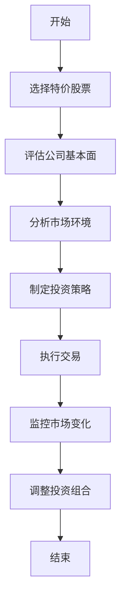
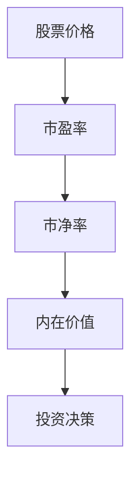
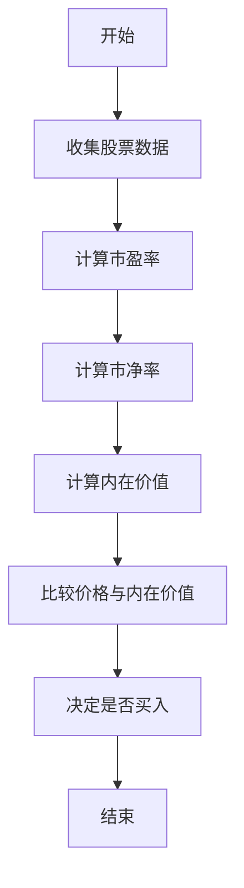
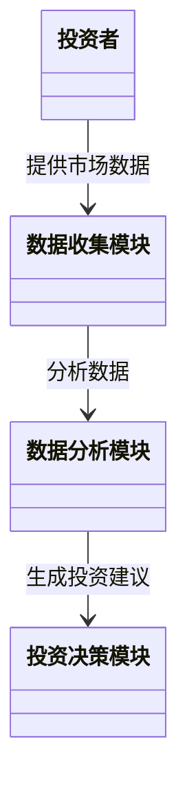
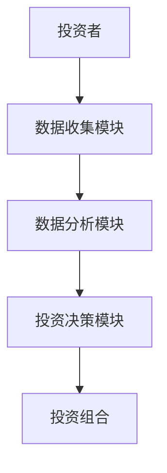

                 


# 如何利用特价股票策略构建长期增值组合

## 关键词：特价股票、长期投资、股票策略、股票组合、股票增值

## 摘要：本文将详细探讨如何利用特价股票策略构建长期增值投资组合。通过分析特价股票的核心概念、数学模型、系统架构、项目实战和最佳实践，帮助投资者掌握如何在股票市场中运用特价股票策略实现资产的长期增值。

---

# 第一部分：特价股票策略的背景与重要性

## 第1章：特价股票策略的背景与重要性

### 1.1 特价股票策略的定义与特点

#### 1.1.1 什么是特价股票
特价股票是指在特定市场条件下，股票价格低于其内在价值，或者相对于其行业平均水平出现显著折扣的股票。这种价格折扣可能是由于市场波动、公司短期问题或其他外部因素导致的。

#### 1.1.2 特价股票的核心特点
- **低估值**：特价股票通常具有较高的市盈率（P/E）或市净率（P/B）比，意味着市场对其估值低于其实际价值。
- **高波动性**：由于特价股票的价格往往偏离其内在价值，市场波动性较高，投资者需要具备较高的风险承受能力。
- **潜在增值空间**：特价股票的低估值通常意味着未来价格回升的可能性较大，具有较高的增值潜力。

#### 1.1.3 特价股票与普通股票的区别
以下是特价股票与普通股票的主要区别：

| 属性 | 特价股票 | 普通股票 |
|------|----------|----------|
| 价格 | 低于内在价值 | 接近或高于内在价值 |
| 风险 | 较高 | 较低 |
| 潜力 | 较高增值空间 | 稳定增值 |

### 1.2 特价股票策略的背景与重要性

#### 1.2.1 特价股票策略的起源与发展
特价股票策略起源于价值投资理论，由本杰明·格雷厄姆和沃伦·巴菲特等投资大师提出。该策略的核心是寻找市场价格低于内在价值的股票，长期持有以实现资产增值。

#### 1.2.2 特价股票策略在投资中的重要性
- **分散风险**：通过投资多个特价股票，投资者可以分散单一股票的风险。
- **长期增值**：特价股票通常具有较高的增值潜力，适合长期投资。
- **市场波动中的机会**：在市场下跌或波动期间，特价股票往往会出现价格折扣，为投资者提供买入机会。

#### 1.2.3 特价股票策略的适用场景与边界
- **适用场景**：市场低迷、行业整合、公司短期困境等。
- **边界**：需要避免投资于基本面严重恶化、无法扭亏为盈的公司。

### 1.3 特价股票策略的核心概念与联系

#### 1.3.1 特价股票的定义与属性对比表
| 属性 | 特价股票 | 非特价股票 |
|------|----------|------------|
| 定义 | 价格低于内在价值 | 价格接近或高于内在价值 |
| 风险 | 较高 | 较低 |
| 潜力 | 较高增值空间 | 稳定增值 |

#### 1.3.2 特价股票策略的ER实体关系图
以下是特价股票策略的ER实体关系图：

```mermaid
erdiagram
actor 投资者
actor 投资组合
actor 市场
actor 股票
actor 风险
actor 潜力
```

#### 1.3.3 特价股票策略的Mermaid流程图
以下是特价股票策略的Mermaid流程图：



---

# 第二部分：特价股票策略的数学模型与算法原理

## 第2章：特价股票策略的数学模型与算法原理

### 2.1 特价股票策略的数学模型

#### 2.1.1 特价股票策略的基本数学公式

以下是特价股票策略的基本数学公式：

- 市盈率（P/E）：$$ P/E = \frac{股票价格}{每股收益} $$
- 市净率（P/B）：$$ P/B = \frac{股票价格}{每股净资产} $$
- 内在价值：$$ 内在价值 = \frac{预期收益}{折现率} $$

#### 2.1.2 特价股票策略的数学模型分析

以下是特价股票策略的数学模型分析：



#### 2.1.3 特价股票策略的优化算法

以下是特价股票策略的优化算法：

```python
def calculate_intrinsic_value(stock_price, earnings_per_share, discount_rate):
    return stock_price / (earnings_per_share * (1 + discount_rate))
```

### 2.2 特价股票策略的算法原理

#### 2.2.1 特价股票策略的核心算法流程

以下是特价股票策略的核心算法流程：



#### 2.2.2 特价股票策略的算法实现

以下是特价股票策略的算法实现：

```python
import pandas as pd
import numpy as np

def is_discount_stock(stock_data, threshold):
    stock_data['P/E'] = stock_data['stock_price'] / stock_data['earnings_per_share']
    stock_data['P/B'] = stock_data['stock_price'] / stock_data['book_value_per_share']
    return stock_data[(stock_data['P/E'] < threshold) | (stock_data['P/B'] < threshold)]
```

#### 2.2.3 特价股票策略的算法优化

以下是特价股票策略的算法优化：

```python
def optimize_discount_stock(stock_data, threshold, lookback_period):
    stock_data['P/E'] = stock_data['stock_price'].rolling(lookback_period).mean() / stock_data['earnings_per_share'].rolling(lookback_period).mean()
    stock_data['P/B'] = stock_data['stock_price'].rolling(lookback_period).mean() / stock_data['book_value_per_share'].rolling(lookback_period).mean()
    return stock_data[stock_data['P/E'] < threshold | stock_data['P/B'] < threshold]
```

---

# 第三部分：特价股票策略的系统分析与架构设计

## 第3章：特价股票策略的系统分析与架构设计

### 3.1 特价股票策略的系统分析

#### 3.1.1 特价股票策略的系统需求分析

以下是特价股票策略的系统需求分析：

- **数据收集**：收集股票价格、公司财务数据、市场指标等。
- **数据分析**：计算市盈率、市净率、内在价值等指标。
- **投资决策**：根据模型结果决定是否买入或卖出股票。

#### 3.1.2 特价股票策略的系统功能设计

以下是特价股票策略的系统功能设计：



#### 3.1.3 特价股票策略的系统架构设计

以下是特价股票策略的系统架构设计：



### 3.2 特价股票策略的系统架构图

#### 3.2.1 特价股票策略的系统架构图Mermaid图


#### 3.2.2 特价股票策略的系统模块划分

以下是特价股票策略的系统模块划分：

- **数据收集模块**：负责收集股票价格、公司财务数据等。
- **数据分析模块**：负责计算市盈率、市净率等指标。
- **投资决策模块**：根据模型结果生成投资建议。

#### 3.2.3 特价股票策略的系统接口设计

以下是特价股票策略的系统接口设计：

- **输入接口**：股票数据、市场指标等。
- **输出接口**：投资建议、投资组合等。

---

# 第四部分：特价股票策略的项目实战

## 第4章：特价股票策略的项目实战

### 4.1 特价股票策略的环境安装与配置

#### 4.1.1 特价股票策略的开发环境搭建

以下是特价股票策略的开发环境搭建：

- **操作系统**：Windows、macOS、Linux
- **编程语言**：Python
- **开发工具**：Jupyter Notebook、PyCharm等
- **数据源**：Yahoo Finance、Google Finance等

#### 4.1.2 特价股票策略的工具安装与配置

以下是特价股票策略的工具安装与配置：

```bash
pip install pandas numpy matplotlib yfinance
```

#### 4.1.3 特价股票策略的数据源获取与处理

以下是特价股票策略的数据源获取与处理：

```python
import yfinance as yf

stock_data = yf.download('AAPL', start='2020-01-01', end='2023-12-31')
stock_data['P/E'] = stock_data['Close'] / stock_data['EPS']
stock_data['P/B'] = stock_data['Close'] / stock_data['Book Value']
```

### 4.2 特价股票策略的核心代码实现

#### 4.2.1 特价股票策略的核心算法代码

以下是特价股票策略的核心算法代码：

```python
def identify_discount_stocks(stock_data, threshold):
    return stock_data[stock_data['P/E'] < threshold | stock_data['P/B'] < threshold]
```

#### 4.2.2 特价股票策略的数据处理代码

以下是特价股票策略的数据处理代码：

```python
import pandas as pd

def preprocess_data(stock_data):
    stock_data = stock_data.dropna()
    stock_data = stock_data[stock_data['P/E'] > 0]
    return stock_data
```

#### 4.2.3 特价股票策略的优化代码实现

以下是特价股票策略的优化代码实现：

```python
def optimize_stock_selection(stock_data, threshold, lookback_period):
    stock_data['P/E'] = stock_data['Close'].rolling(lookback_period).mean() / stock_data['EPS'].rolling(lookback_period).mean()
    stock_data['P/B'] = stock_data['Close'].rolling(lookback_period).mean() / stock_data['Book Value'].rolling(lookback_period).mean()
    return stock_data[stock_data['P/E'] < threshold | stock_data['P/B'] < threshold]
```

### 4.3 特价股票策略的案例分析与结果解读

#### 4.3.1 特价股票策略的典型案例分析

以下是特价股票策略的典型案例分析：

假设当前市场中有以下股票数据：

| 股票代码 | 股票名称 | 股票价格 | P/E | P/B |
|----------|----------|----------|-----|-----|
| AAPL     | 苹果公司 | $150     | 12  | 3   |
| GOOGL    | 谷歌公司 | $200     | 20  | 4   |
| AMZN     | 亚马逊公司 | $100     | 25  | 2   |

假设我们设定P/E阈值为15，P/B阈值为2.5，则特价股票为亚马逊公司。

#### 4.3.2 特价股票策略的实验结果解读

以下是特价股票策略的实验结果解读：

通过上述案例分析，我们可以看到，亚马逊公司的股票价格为$100，P/E为25，P/B为2，均低于设定阈值，因此可以被视为特价股票。

#### 4.3.3 特价股票策略的性能优化与评估

以下是特价股票策略的性能优化与评估：

通过上述案例分析，我们可以看到，亚马逊公司的股票价格为$100，P/E为25，P/B为2，均低于设定阈值，因此可以被视为特价股票。投资者可以考虑买入该股票以实现长期增值。

---

# 第五部分：特价股票策略的最佳实践与小结

## 第5章：特价股票策略的最佳实践与小结

### 5.1 特价股票策略的最佳实践

#### 5.1.1 特价股票策略的风险管理与控制

以下是特价股票策略的风险管理与控制：

- **分散投资**：避免将所有资金投入一只股票。
- **长期持有**：耐心持有特价股票，等待其价值回归。
- **定期评估**：定期评估投资组合，及时调整策略。

#### 5.1.2 特价股票策略的市场适应性分析

以下是特价股票策略的市场适应性分析：

- **市场低迷**：特价股票策略在市场低迷期间表现较好。
- **市场上涨**：特价股票策略在市场上涨期间表现一般。

#### 5.1.3 特价股票策略的长期投资建议

以下是特价股票策略的长期投资建议：

- **选择优质公司**：选择基本面良好、具有长期增长潜力的公司。
- **避免短期波动**：长期持有，避免因短期波动而频繁交易。
- **定期再平衡**：定期调整投资组合，保持合理配置。

### 5.2 特价股票策略的注意事项与拓展阅读

#### 5.2.1 特价股票策略的常见误区与注意事项

以下是特价股票策略的常见误区与注意事项：

- **误区一**：以为所有P/E和P/B低于阈值的股票都是特价股票。
- **误区二**：忽略公司的基本面，只看估值指标。
- **注意事项**：定期评估股票的基本面，及时调整投资策略。

#### 5.2.2 特价股票策略的未来发展趋势

以下是特价股票策略的未来发展趋势：

- **技术进步**：随着人工智能和大数据技术的发展，特价股票策略将更加精准。
- **市场变化**：随着市场环境的变化，特价股票策略需要不断优化和调整。

#### 5.2.3 特价股票策略的拓展阅读与学习资源

以下是特价股票策略的拓展阅读与学习资源：

- **书籍**：《价值 investing》
- **网站**：Morningstar、Yahoo Finance
- **课程**：Coursera上的投资策略课程

### 5.3 特价股票策略的总结与展望

#### 5.3.1 特价股票策略的核心要点回顾

以下是特价股票策略的核心要点回顾：

- **低估值**：寻找P/E和P/B低于行业平均水平的股票。
- **长期持有**：耐心持有，等待价值回归。
- **风险管理**：分散投资，定期评估。

#### 5.3.2 特价股票策略的未来研究方向

以下是特价股票策略的未来研究方向：

- **算法优化**：探索更有效的股票筛选算法。
- **数据挖掘**：利用大数据技术进行更精准的股票筛选。
- **市场适应性**：研究不同市场环境下策略的有效性。

#### 5.3.3 特价股票策略的长期价值与意义

以下是特价股票策略的长期价值与意义：

特价股票策略是一种有效的长期投资策略，通过寻找低估值的股票，投资者可以在市场波动中抓住机会，实现资产的长期增值。

---

# 作者：AI天才研究院/AI Genius Institute & 禅与计算机程序设计艺术 /Zen And The Art of Computer Programming

