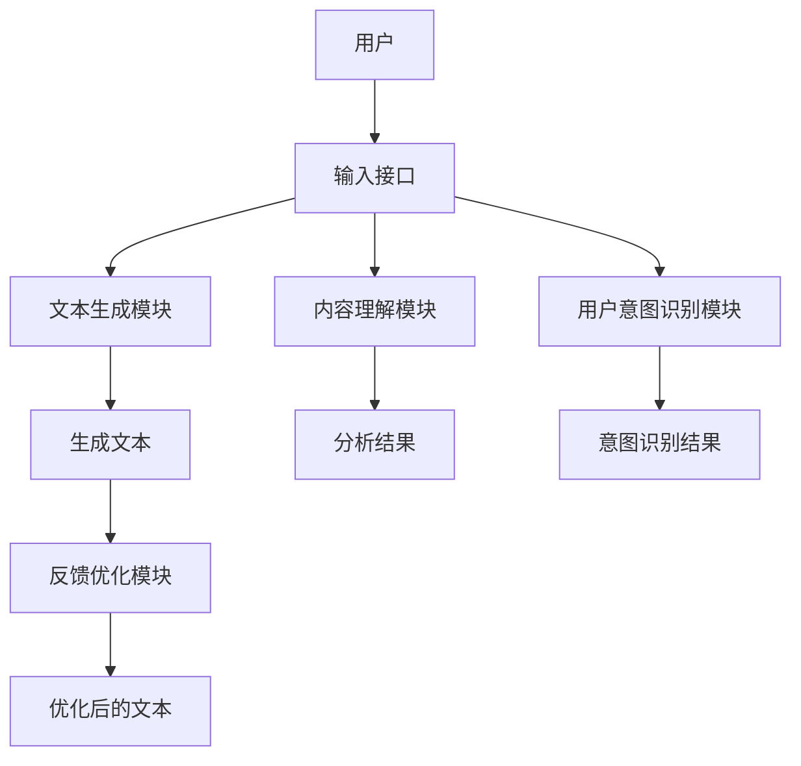
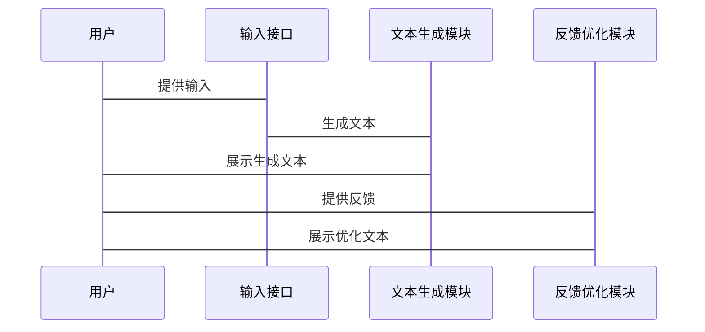

                 


# 实现基于AI Agent的智能写作助手

## 关键词：AI Agent, 智能写作助手, 自然语言处理, 生成式AI, 强化学习

## 摘要：本文详细探讨了基于AI Agent的智能写作助手的实现，从背景、核心概念、算法原理到系统架构，再到项目实战和最佳实践，全面解析如何利用AI技术提升写作效率和质量。文章结合理论与实践，提供详细的代码示例和系统设计，帮助读者理解并实现一个高效的智能写作助手。

---

## 第一部分：基于AI Agent的智能写作助手背景与核心概念

### 第1章：AI Agent与智能写作助手概述

#### 1.1 AI Agent的基本概念

##### 1.1.1 什么是AI Agent
AI Agent（人工智能代理）是一种能够感知环境、执行任务并做出决策的智能系统。它通过传感器获取信息，利用计算模型处理数据，并通过执行器采取行动。AI Agent可以是软件程序、机器人或其他智能设备，广泛应用于推荐系统、自动化控制等领域。

##### 1.1.2 AI Agent的核心特征
AI Agent具有以下核心特征：
1. **自主性**：能够在没有外部干预的情况下独立运行。
2. **反应性**：能够实时感知环境并做出反应。
3. **目标导向**：具备明确的目标，驱动其行为。
4. **学习能力**：通过数据和经验不断优化性能。

##### 1.1.3 AI Agent与传统软件的区别
AI Agent与传统软件的主要区别在于其智能性和适应性：
- **智能性**：AI Agent能够理解和处理复杂信息，做出决策。
- **适应性**：能够根据环境变化调整行为，而非固定执行预设任务。

#### 1.2 智能写作助手的定义与功能

##### 1.2.1 智能写作助手的定义
智能写作助手是一种基于AI技术的工具，旨在辅助用户完成文本创作任务。它能够理解用户意图，提供内容建议，自动生成文本，并根据反馈优化结果。

##### 1.2.2 主要功能模块
智能写作助手的主要功能模块包括：
1. **文本生成模块**：根据输入生成高质量文本。
2. **内容理解模块**：分析文本内容，识别主题和情感。
3. **用户意图识别模块**：理解用户的写作目标和需求。
4. **反馈优化模块**：根据用户反馈调整生成结果。

##### 1.2.3 智能写作助手的应用场景
智能写作助手适用于多种场景：
- **创意写作**：帮助作家生成故事灵感和情节。
- **学术写作**：辅助研究人员撰写论文和报告。
- **商业写作**：协助营销人员编写广告文案和商业计划书。

#### 1.3 AI Agent在智能写作中的作用

##### 1.3.1 AI Agent如何辅助写作
AI Agent通过以下方式辅助写作：
1. **实时生成建议**：根据上下文提供内容建议。
2. **语法和风格检查**：自动校对文本错误。
3. **主题扩展**：根据用户输入扩展相关主题。

##### 1.3.2 基于AI Agent的写作流程优化
AI Agent优化写作流程的方式包括：
1. **自动化内容生成**：快速生成初稿。
2. **智能改写**：根据反馈优化文本。
3. **实时协作**：支持多人在线协作。

##### 1.3.3 智能写作助手的核心价值
智能写作助手的核心价值在于：
1. **提高效率**：缩短写作时间。
2. **提升质量**：优化文本内容。
3. **激发创意**：提供新的写作思路。

### 第2章：AI Agent与智能写作助手的核心概念

#### 2.1 AI Agent的类型

##### 2.1.1 简单反射式AI Agent
简单反射式AI Agent基于预设规则对输入做出反应，适用于简单的任务，如自动回复邮件。

##### 2.1.2 基于规则的AI Agent
基于规则的AI Agent通过预定义的规则和逻辑处理信息，适用于结构化的任务，如数据分类。

##### 2.1.3 基于模型的AI Agent
基于模型的AI Agent利用机器学习模型处理数据，能够处理复杂任务，如自然语言理解。

##### 2.1.4 增强学习的AI Agent
增强学习的AI Agent通过与环境互动，学习最优策略，适用于需要动态调整的任务，如游戏AI。

#### 2.2 智能写作助手的功能模块

##### 2.2.1 文本生成模块
文本生成模块是智能写作助手的核心，负责根据输入生成文本。常用的生成方法包括：
- **基于规则的生成**：使用预定义的语法和词汇生成文本。
- **基于模型的生成**：利用神经网络模型生成自然语言文本。

##### 2.2.2 内容理解模块
内容理解模块负责分析文本内容，识别主题和情感。常用的技术包括：
- **关键词提取**：提取文本中的关键词。
- **主题模型**：如LDA模型，用于主题识别。
- **情感分析**：判断文本的情感倾向。

##### 2.2.3 用户意图识别模块
用户意图识别模块通过自然语言处理技术，理解用户的写作目标。常用方法包括：
- **意图识别模型**：基于机器学习的意图分类。
- **上下文理解**：分析对话历史，理解用户需求。

##### 2.2.4 反馈优化模块
反馈优化模块根据用户反馈调整生成结果。常用的方法包括：
- **基于强化学习的优化**：通过奖励机制优化生成结果。
- **基于监督学习的优化**：根据人工反馈调整模型参数。

#### 2.3 AI Agent与智能写作助手的关系

##### 2.3.1 AI Agent在写作中的角色
AI Agent在智能写作助手中的角色可以是：
1. **内容生成器**：负责生成文本。
2. **反馈优化器**：根据用户反馈优化生成结果。
3. **协作伙伴**：与用户协作完成写作任务。

##### 2.3.2 智能写作助手的系统架构
智能写作助手的系统架构通常包括以下部分：
1. **输入接口**：接收用户的输入。
2. **处理模块**：包括文本生成、内容理解和反馈优化。
3. **输出接口**：向用户展示结果。

##### 2.3.3 AI Agent与其他技术的结合
AI Agent可以与以下技术结合：
- **自然语言处理（NLP）**：用于文本理解和生成。
- **机器学习（ML）**：用于模式识别和预测。
- **大数据分析**：用于用户行为分析和内容推荐。

---

## 第二部分：AI Agent的算法原理与数学模型

### 第3章：基于生成式AI的文本生成算法

#### 3.1 Transformer模型的基本原理
Transformer模型由编码器和解码器组成，通过自注意力机制处理序列数据。其核心公式为：
$$ \text{Attention}(Q,K,V) = \text{softmax}(\frac{QK^T}{\sqrt{d}})V $$
其中，$Q$、$K$、$V$分别为查询、键和值向量，$d$为向量维度。

#### 3.2 注意力机制的数学公式
注意力机制通过计算查询与键的相似度，生成加权和的值：
$$ \text{Attention}(Q,K,V) = \text{softmax}(\frac{QK^T}{\sqrt{d}})V $$

#### 3.3 解码器的生成过程
解码器通过自注意力机制生成上下文相关的输出，逐步生成文本序列。

### 第4章：基于强化学习的AI Agent

#### 4.1 强化学习的基本原理
强化学习通过智能体与环境的交互，学习最优策略。其核心公式为：
$$ \nabla \theta = \frac{1}{N}\sum_{i=1}^{N} \nabla \log \pi_\theta(a|s) Q(s,a) $$
其中，$\theta$为策略参数，$a$为动作，$s$为状态，$Q$为价值函数。

#### 4.2 政策梯度方法
政策梯度方法通过最大化期望回报，优化策略参数。其更新公式为：
$$ \nabla \theta = \mathbb{E}_{s,a}[\nabla \log \pi_\theta(a|s) Q(s,a)] $$

#### 4.3 剩余价值函数的计算
剩余价值函数通过Actor-Critic架构计算，公式为：
$$ V(s) = Q(s,a) - \pi_\theta(a|s) $$

### 第5章：基于监督学习的文本生成

#### 5.1 监督学习的基本流程
监督学习通过标注数据训练模型，生成与标签匹配的输出。其损失函数为：
$$ \mathcal{L} = -\sum_{i=1}^{n} y_i \log p(y_i|x) $$

#### 5.2 损失函数的计算
交叉熵损失函数用于衡量预测值与真实值的差异：
$$ \mathcal{L} = -\sum_{i=1}^{n} y_i \log p(y_i|x) $$

---

## 第三部分：智能写作助手的系统架构与设计

### 第6章：系统功能模块设计

#### 6.1 文本生成模块
文本生成模块使用生成式AI生成高质量文本，支持多种生成模式，如固定长度和条件生成。

#### 6.2 内容理解模块
内容理解模块通过自然语言处理技术，分析文本内容，识别主题和情感。

#### 6.3 用户意图识别模块
用户意图识别模块通过机器学习模型，理解用户的写作目标和需求。

#### 6.4 反馈优化模块
反馈优化模块根据用户反馈，调整生成结果，优化文本质量。

### 第7章：系统架构设计

#### 7.1 系统功能设计
智能写作助手的系统功能包括：
1. **文本生成**：生成初稿。
2. **内容理解**：分析文本内容。
3. **用户意图识别**：理解用户需求。
4. **反馈优化**：优化生成结果。

#### 7.2 系统架构图
以下是系统架构的Mermaid图：



#### 7.3 系统交互流程图
以下是系统交互流程的Mermaid图：



---

## 第四部分：项目实战

### 第8章：环境安装与配置

#### 8.1 安装Python和TensorFlow
安装Python 3.8以上版本，并安装TensorFlow：
```bash
pip install tensorflow
```

#### 8.2 安装其他依赖
安装自然语言处理库和可视化库：
```bash
pip install numpy matplotlib
```

### 第9章：核心代码实现

#### 9.1 文本生成模块
以下是一个简单的文本生成代码示例：

```python
import tensorflow as tf
from tensorflow.keras import layers

# 定义生成式模型
def build_model(vocab_size, embedding_dim, max_length):
    model = tf.keras.Sequential([
        layers.Embedding(vocab_size, embedding_dim),
        layers.LSTM(128),
        layers.Dense(vocab_size, activation='softmax')
    ])
    return model

# 训练模型
model = build_model(...)
model.compile(optimizer='adam', loss='sparse_categorical_crossentropy')
model.fit(...)
```

#### 9.2 内容理解模块
以下是一个关键词提取的代码示例：

```python
from sklearn.feature_extraction.text import TfidfVectorizer

vectorizer = TfidfVectorizer()
tfidf_matrix = vectorizer.fit_transform(texts)
```

### 第10章：项目实战与案例分析

#### 10.1 案例分析
通过一个简单的写作任务，展示如何使用智能写作助手生成文本并优化结果。

#### 10.2 代码实现解读
详细解读上述代码，说明每部分的功能和实现细节。

### 第11章：项目小结

#### 11.1 项目总结
总结项目的实现过程，强调AI Agent在智能写作中的重要作用。

#### 11.2 经验分享
分享开发中的经验与教训，提供改进建议。

---

## 第五部分：最佳实践与总结

### 第12章：最佳实践

#### 12.1 性能优化建议
- 使用更高效的算法。
- 优化模型参数，减少计算量。
- 利用分布式计算加速训练。

#### 12.2 安全性考虑
- 数据隐私保护。
- 避免生成不适当内容。

#### 12.3 未来发展趋势
- 更加智能化和个性化。
- 多模态生成，结合图像和语音。

### 第13章：小结

#### 13.1 项目总结
智能写作助手是一个结合AI Agent、自然语言处理和机器学习的复杂系统，通过多模块协作实现高效的写作辅助。

#### 13.2 注意事项
在实际应用中，需要注意数据质量和模型的可解释性。

#### 13.3 拓展阅读
推荐相关领域的书籍和论文，供读者深入学习。

---

## 作者：AI天才研究院 & 禅与计算机程序设计艺术

---

**注意：** 由于篇幅限制，上述内容是一个详尽的目录和部分内容展示。实际撰写时，每个部分需要详细展开，确保文章的完整性和专业性。

