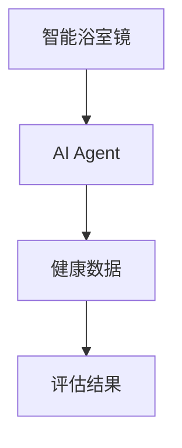
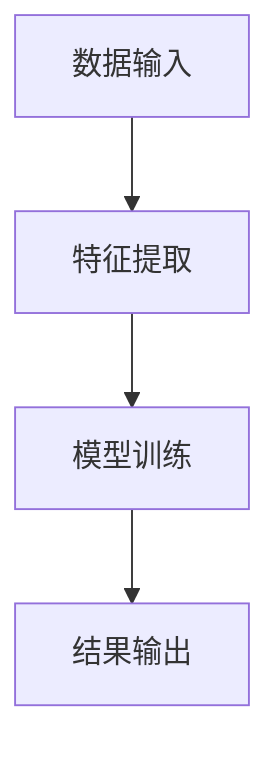
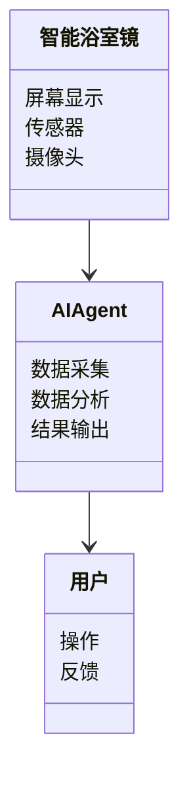
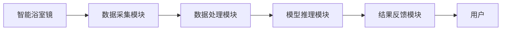
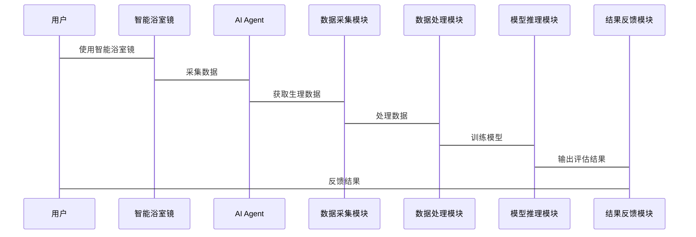

                 


# 智能浴室镜：AI Agent的健康状态评估

## 关键词：智能浴室镜、AI Agent、健康状态评估、数据采集、算法实现、系统架构、项目实战

## 摘要：  
智能浴室镜通过AI Agent技术实现健康状态评估，结合计算机视觉和机器学习算法，提供个性化的健康监测服务。本文从智能浴室镜的背景与概念出发，详细探讨AI Agent的原理与实现，系统分析其架构设计，并通过项目实战展示如何在实际中应用这些技术。本文旨在为开发者和技术爱好者提供一份全面的技术指南，帮助他们理解智能浴室镜的工作原理，并掌握其实现方法。

---

# 第一部分: 背景与概念

## 第1章: 智能浴室镜与AI Agent概述

### 1.1 智能浴室镜的定义与应用场景

#### 1.1.1 智能浴室镜的定义
智能浴室镜是一种结合了物联网（IoT）和人工智能（AI）技术的智能硬件，它不仅仅是一个普通的镜子，更是一个集成健康监测、信息交互和智能控制的平台。智能浴室镜通常配备高分辨率的显示屏、传感器和摄像头，能够实时采集用户的生理数据，如心率、体温、面部表情等。

#### 1.1.2 智能浴室镜的核心功能
智能浴室镜的核心功能包括：
- **健康监测**：通过摄像头和传感器采集用户的生理数据，实时评估用户的健康状态。
- **信息交互**：提供天气预报、日历提醒、新闻资讯等信息服务。
- **智能控制**：支持与其他智能家居设备联动，如调整室内温度、开启灯光等。

#### 1.1.3 智能浴室镜的市场现状与发展趋势
随着人们对健康关注度的提高，智能浴室镜的市场需求逐渐增长。市场上的产品主要集中在高端市场，未来的发展趋势包括：
- 更高的精度：通过AI技术提升健康监测的准确性。
- 更强的交互性：增强人机交互体验，提供更个性化的服务。
- 更多的生态联动：与智能家居、医疗机构等形成闭环生态。

---

### 1.2 AI Agent在健康评估中的作用

#### 1.2.1 AI Agent的基本概念
AI Agent（人工智能代理）是指能够感知环境、自主决策并执行任务的智能实体。它能够通过传感器获取数据，利用算法进行分析和推理，并根据结果采取相应的行动。

#### 1.2.2 AI Agent在健康评估中的应用场景
在智能浴室镜中，AI Agent主要用于以下场景：
- **实时监测**：通过摄像头和传感器实时采集用户的生理数据。
- **健康评估**：基于采集的数据，利用机器学习算法评估用户的健康状态。
- **个性化建议**：根据评估结果，提供个性化的健康建议。

#### 1.2.3 AI Agent与智能浴室镜的结合
AI Agent与智能浴室镜的结合使得智能浴室镜不仅仅是一个镜子，而是一个集数据采集、分析和反馈于一体的智能平台。AI Agent能够实时处理数据，快速做出决策，并通过智能镜子的显示屏向用户反馈结果。

---

## 第2章: 健康状态评估的核心概念

### 2.1 健康状态评估的定义与目标

#### 2.1.1 健康状态评估的定义
健康状态评估是指通过采集和分析用户的生理数据，评估用户的健康状况，并提供相应的健康建议。健康状态评估的核心在于数据的采集和分析，以及评估结果的应用。

#### 2.1.2 健康状态评估的目标
健康状态评估的目标包括：
- **实时监测**：及时发现用户的健康问题。
- **精准评估**：通过数据分析，提供精准的健康评估结果。
- **个性化建议**：根据评估结果，提供个性化的健康建议。

#### 2.1.3 健康状态评估的边界与外延
健康状态评估的边界包括：
- 数据采集的范围：如心率、体温、面部表情等。
- 数据分析的范围：如心理健康、身体状态等。
- 结果应用的范围：如健康建议、医疗预警等。

---

### 2.2 智能浴室镜健康评估的核心要素

#### 2.2.1 数据采集方式
智能浴室镜健康评估的核心要素包括数据采集、数据处理和结果反馈。数据采集是健康评估的基础，常见的数据采集方式包括：
- **摄像头采集**：通过摄像头采集用户的面部表情、肤色等信息。
- **传感器采集**：通过传感器采集用户的体温、心率等生理数据。

#### 2.2.2 数据处理与分析方法
数据处理与分析方法是健康评估的核心，常见的方法包括：
- **特征提取**：从原始数据中提取有用的特征，如面部的纹理特征、生理数据的时间序列特征等。
- **模型训练**：利用机器学习算法训练模型，如支持向量机（SVM）、随机森林（Random Forest）等。
- **模型推理**：利用训练好的模型对新数据进行推理，得到评估结果。

#### 2.2.3 结果呈现与反馈机制
结果呈现与反馈机制是健康评估的重要组成部分，常见的反馈机制包括：
- **可视化反馈**：通过显示屏向用户呈现评估结果。
- **语音反馈**：通过语音助手向用户反馈评估结果。
- **推送通知**：通过手机APP推送评估结果和健康建议。

---

# 第二部分: 核心概念与联系

## 第3章: AI Agent的原理与实现

### 3.1 AI Agent的核心原理

#### 3.1.1 数据采集与特征提取
数据采集与特征提取是AI Agent实现健康评估的基础。数据采集通过摄像头和传感器完成，特征提取则需要从原始数据中提取有用的特征，如面部的纹理特征、生理数据的时间序列特征等。

#### 3.1.2 数据分析与模型训练
数据分析与模型训练是AI Agent的核心，需要利用机器学习算法对数据进行训练，得到能够准确评估健康状态的模型。常见的算法包括支持向量机（SVM）、随机森林（Random Forest）、深度学习模型（如卷积神经网络CNN）等。

#### 3.1.3 模型推理与结果输出
模型推理与结果输出是AI Agent实现健康评估的关键步骤。通过训练好的模型对新数据进行推理，得到评估结果，并通过智能镜子的显示屏、语音助手或手机APP向用户反馈结果。

---

### 3.2 AI Agent与智能浴室镜的实体关系



---

## 第4章: 健康状态评估的算法原理

### 4.1 数据采集与预处理

#### 4.1.1 数据采集流程
数据采集流程包括：
1. 采集用户的生理数据，如心率、体温等。
2. 采集用户的面部表情、肤色等信息。
3. 将采集到的数据进行预处理，如去噪、归一化等。

#### 4.1.2 数据清洗与特征提取
数据清洗与特征提取是数据预处理的重要步骤，常见的方法包括：
- **去噪**：去除数据中的噪声，如环境噪声、传感器噪声等。
- **归一化**：将数据归一化到统一的范围内，方便模型训练。
- **特征提取**：从原始数据中提取有用的特征，如时间序列特征、空间特征等。

---

### 4.2 基于AI的健康评估算法

#### 4.2.1 算法流程图



---

## 第5章: 算法实现与优化

### 5.1 算法实现

#### 5.1.1 代码实现
以下是一个基于Python的健康评估算法实现示例：

```python
import numpy as np
from sklearn.svm import SVC

# 数据预处理
X = np.array([...])  # 特征数据
y = np.array([...])  # 标签数据

# 模型训练
model = SVC()
model.fit(X, y)

# 模型推理
new_data = np.array([...])  # 新数据
prediction = model.predict(new_data)
```

#### 5.1.2 算法优化
算法优化是提高模型准确性的关键，常见的优化方法包括：
- **参数调优**：通过网格搜索（Grid Search）等方法找到最优参数。
- **数据增强**：通过数据增强技术增加数据量，提高模型的泛化能力。
- **模型融合**：通过集成学习（Ensemble Learning）融合多个模型的结果，提高模型的准确性。

---

# 第三部分: 系统分析与架构设计

## 第6章: 系统功能设计

### 6.1 问题场景介绍
智能浴室镜健康评估系统需要解决的问题包括：
- 如何高效采集用户的生理数据。
- 如何准确分析用户的健康状态。
- 如何将评估结果反馈给用户。

### 6.2 领域模型设计



---

## 第7章: 系统架构设计

### 7.1 系统架构图



---

## 第8章: 系统交互设计

### 8.1 系统交互流程



---

## 第9章: 系统接口设计

### 9.1 接口设计
智能浴室镜与AI Agent之间的接口设计需要考虑数据的传输格式和通信协议。常见的接口设计包括：
- 数据接口：用于传输用户的生理数据。
- 控制接口：用于控制智能镜子的显示和反馈。

---

# 第四部分: 项目实战

## 第10章: 项目实战

### 10.1 环境安装

#### 10.1.1 系统环境
- 操作系统：Windows/Mac/Linux
- 开发工具：Python、Jupyter Notebook、VS Code等
- 依赖库：numpy、scikit-learn、tensorflow等

### 10.2 系统核心实现源代码

#### 10.2.1 数据采集模块
```python
import numpy as np
import cv2

# 采集用户的面部表情
def capture_face():
    cap = cv2.VideoCapture(0)
    while True:
        ret, frame = cap.read()
        cv2.imshow('Capture Face', frame)
        if cv2.waitKey(1) & 0xFF == ord('q'):
            break
    cap.release()
    cv2.destroyAllWindows()
    return frame
```

#### 10.2.2 数据处理模块
```python
import numpy as np
from sklearn.decomposition import PCA

# 数据预处理
def preprocess_data(X):
    # 标准化数据
    X标准化 = (X - np.mean(X)) / np.std(X)
    # 主成分分析
    pca = PCA(n_components=2)
    X_pca = pca.fit_transform(X标准化)
    return X_pca
```

#### 10.2.3 模型推理模块
```python
from sklearn.svm import SVC

# 模型训练
def train_model(X_train, y_train):
    model = SVC()
    model.fit(X_train, y_train)
    return model

# 模型推理
def predict_health(model, X_test):
    y_pred = model.predict(X_test)
    return y_pred
```

#### 10.2.4 结果反馈模块
```python
def feedback_result(result):
    print(f"健康状态评估结果：{result}")
```

### 10.3 代码应用解读与分析

#### 10.3.1 代码解读
上述代码展示了智能浴室镜健康评估系统的核心实现，包括数据采集、数据预处理、模型训练和结果反馈四个模块。

#### 10.3.2 代码分析
- 数据采集模块：通过摄像头采集用户的面部表情。
- 数据处理模块：对采集到的数据进行标准化和主成分分析（PCA）。
- 模型推理模块：利用支持向量机（SVM）模型对数据进行分类。
- 结果反馈模块：将评估结果反馈给用户。

### 10.4 实际案例分析和详细讲解剖析

#### 10.4.1 案例分析
假设我们有一个包含1000条数据的健康评估数据集，其中500条是健康状态正常，500条是健康状态异常。我们可以通过以下步骤进行健康评估：

1. 数据采集：采集用户的面部表情和生理数据。
2. 数据预处理：对采集到的数据进行标准化和PCA处理。
3. 模型训练：利用SVM模型对数据进行训练。
4. 模型推理：利用训练好的模型对新数据进行分类。
5. 结果反馈：将评估结果反馈给用户。

---

## 第11章: 项目小结

### 11.1 项目总结
智能浴室镜健康评估系统通过AI Agent技术实现了用户的健康状态评估，结合了数据采集、数据处理和模型推理等多个模块，能够实时监测用户的健康状态，并提供个性化的健康建议。

### 11.2 经验与教训
在项目实施过程中，我们总结出以下经验和教训：
- 数据采集的质量直接影响模型的准确性，因此数据预处理非常重要。
- 模型的选择需要根据数据的特性和任务的要求进行调整，不同的任务可能需要不同的模型。
- 系统的实时性和稳定性需要重点关注，尤其是在实际应用中。

### 11.3 注意事项
在实际应用中，需要注意以下几点：
- 数据隐私：用户的数据需要严格保密，防止数据泄露。
- 系统稳定性：确保系统的稳定运行，避免因系统故障导致数据丢失或评估结果错误。
- 用户体验：系统的界面设计和交互流程需要符合用户体验，确保用户能够方便地使用系统。

### 11.4 拓展阅读
以下是一些拓展阅读资料，供读者进一步学习：
- 《机器学习实战》
- 《深度学习入门：基于Python的CNN实践》
- 《人工智能：一种现代的方法》

---

# 第五部分: 最佳实践与小结

## 第12章: 最佳实践

### 12.1 技术选型
在技术选型时，需要根据实际需求和资源条件进行选择：
- 数据采集：摄像头和传感器的选择需要根据实际需求进行匹配。
- 数据处理：根据数据的特性和任务的要求选择合适的数据处理方法。
- 模型选择：根据数据的特性和任务的要求选择合适的机器学习模型。

### 12.2 开发流程
开发流程建议遵循以下步骤：
1. 需求分析：明确项目的目标和需求。
2. 数据采集：采集用户的数据。
3. 数据预处理：对数据进行清洗和特征提取。
4. 模型训练：选择合适的模型进行训练。
5. 模型推理：利用训练好的模型进行推理。
6. 系统集成：将各个模块集成到系统中。
7. 测试优化：对系统进行测试和优化。

---

## 第13章: 小结

### 13.1 核心内容回顾
智能浴室镜健康评估系统通过AI Agent技术实现了用户的健康状态评估，结合了数据采集、数据处理和模型推理等多个模块，能够实时监测用户的健康状态，并提供个性化的健康建议。

### 13.2 未来展望
未来的发展方向包括：
- 更高的精度：通过更先进的算法和更精确的传感器提高健康评估的准确性。
- 更强的交互性：增强人机交互体验，提供更个性化的服务。
- 更多的生态联动：与智能家居、医疗机构等形成闭环生态，提供更全面的健康服务。

---

# 作者：AI天才研究院/AI Genius Institute & 禅与计算机程序设计艺术 /Zen And The Art of Computer Programming

