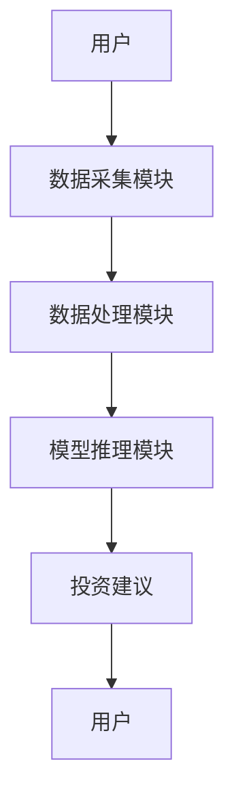
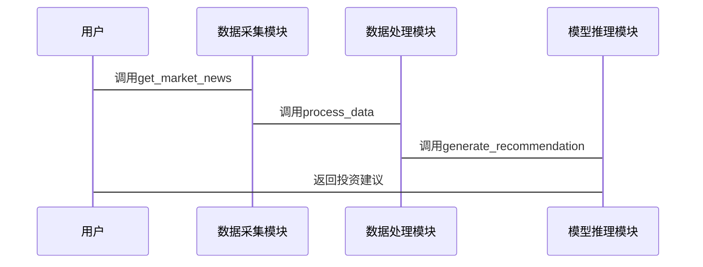

                 


# 构建AI Agent驱动的智能投资顾问

## 关键词：
AI Agent, 智能投资顾问, 人工智能, 金融投资, 自然语言处理, 强化学习, 机器学习

## 摘要：
本文详细探讨了构建AI Agent驱动的智能投资顾问系统的各个方面，包括背景分析、核心概念、算法原理、系统设计、项目实战等内容。通过结合自然语言处理和强化学习等技术，本文展示了如何利用AI Agent实现智能化的投资决策支持，为金融领域的智能化转型提供了新的思路。

---

# 第一部分: AI Agent驱动的智能投资顾问背景与概念

## 第1章: 问题背景与需求分析

### 1.1 问题背景介绍

#### 1.1.1 传统投资顾问的局限性
传统投资顾问依赖于人工分析和经验判断，存在以下问题：
- 服务范围有限：传统投资顾问通常服务于高净值客户，无法覆盖更广泛的用户群体。
- 信息处理效率低：面对海量的金融数据和市场动态，人工分析效率低下，难以及时响应客户需求。
- 个性化不足：难以根据客户的实时需求和市场变化提供个性化的投资建议。

#### 1.1.2 人工智能在金融领域的应用潜力
人工智能技术在金融领域的应用日益广泛，包括：
- 自动化交易：利用算法进行高频交易，提高交易效率。
- 风险评估：通过机器学习模型评估投资风险。
- 数据分析：利用自然语言处理技术分析新闻和财报，提取市场信息。

#### 1.1.3 AI Agent驱动投资顾问的必要性
AI Agent（智能体）能够实时感知环境、分析数据并做出决策，是构建智能投资顾问的核心技术。通过AI Agent，投资顾问系统可以实现：
- 实时数据分析：快速处理市场动态和客户需求。
- 自动化决策：根据市场变化和客户需求，自动生成投资建议。
- 智能交互：通过自然语言处理与客户进行实时互动，提供个性化的投资服务。

### 1.2 问题描述与目标

#### 1.2.1 投资顾问的核心功能与挑战
投资顾问的核心功能包括：
- 数据分析：分析市场数据、公司财报、新闻等信息。
- 投资建议：根据分析结果，为客户提供个性化的投资建议。
- 风险管理：评估投资风险，制定风险控制策略。

主要挑战：
- 数据多样性：市场数据来源广泛，包括文本、图像、数值等多种形式。
- 实时性要求高：投资决策需要快速响应市场变化。
- 模型可解释性：客户需要了解投资建议的依据。

#### 1.2.2 AI Agent在投资顾问中的角色定位
AI Agent在智能投资顾问系统中扮演以下角色：
- 数据收集与处理：从多种数据源收集市场信息，并进行清洗和预处理。
- 模型推理：利用机器学习和自然语言处理技术，分析数据并生成投资建议。
- 用户交互：通过自然语言处理技术与用户进行互动，提供个性化的投资服务。

#### 1.2.3 构建智能投资顾问的目标与边界
目标：
- 提供实时、个性化的投资建议。
- 实现自动化、智能化的投资决策支持。
- 提高投资效率，降低投资风险。

边界：
- 仅提供投资建议，不直接进行交易操作。
- 专注于数据分析与模型推理，不涉及实际的金融交易。
- 系统设计以客户隐私和数据安全为前提。

### 1.3 问题解决思路

#### 1.3.1 AI Agent的基本工作原理
AI Agent通过以下步骤实现投资建议生成：
1. 数据收集：从多种数据源（如新闻网站、金融数据库）获取市场信息。
2. 数据处理：清洗数据，提取有用信息。
3. 模型推理：利用机器学习和自然语言处理技术，分析数据并生成投资建议。
4. 用户交互：通过自然语言处理技术与用户互动，提供个性化的投资建议。

#### 1.3.2 智能投资顾问的核心功能模块
智能投资顾问系统的核心功能模块包括：
- 数据采集模块：从多种数据源获取市场信息。
- 数据处理模块：清洗和预处理数据。
- 模型推理模块：利用机器学习模型生成投资建议。
- 用户交互模块：通过自然语言处理技术与用户互动。

#### 1.3.3 技术实现的关键问题与解决方案
关键问题：
- 数据多样性：市场数据来源广泛，类型多样，如何高效处理？
- 模型可解释性：如何向用户解释投资建议的依据？
- 实时性要求：如何快速响应市场变化？

解决方案：
- 数据处理：使用分布式计算框架（如Spark）处理海量数据。
- 模型可解释性：采用可解释的机器学习模型（如线性回归、决策树）。
- 实时性：利用流处理技术（如Kafka、Flink）实时处理数据。

---

## 第2章: AI Agent与智能投资顾问的概念结构

### 2.1 核心概念与定义

#### 2.1.1 AI Agent的定义与特征
AI Agent是一种能够感知环境、自主决策并采取行动的智能体。其主要特征包括：
- **自主性**：能够在没有外部干预的情况下自主运行。
- **反应性**：能够实时感知环境并做出响应。
- **目标导向性**：具有明确的目标，并根据目标做出决策。

#### 2.1.2 智能投资顾问的定义与功能
智能投资顾问是一种基于AI技术的投资决策支持系统。其主要功能包括：
- **数据分析**：分析市场数据、公司财报等信息。
- **投资建议**：根据分析结果，生成投资建议。
- **风险评估**：评估投资风险，制定风险控制策略。

#### 2.1.3 两者的概念结构与关系
AI Agent是智能投资顾问的核心技术，智能投资顾问是AI Agent在金融领域的具体应用。AI Agent通过感知市场环境、分析数据并生成投资建议，帮助投资者做出更明智的决策。

### 2.2 核心要素与组成

#### 2.2.1 AI Agent的组成模块
AI Agent的主要组成模块包括：
- **感知模块**：感知环境并获取数据。
- **推理模块**：分析数据并生成决策。
- **行动模块**：根据决策采取行动。

#### 2.2.2 智能投资顾问的功能模块
智能投资顾问的主要功能模块包括：
- **数据采集模块**：从多种数据源获取市场信息。
- **数据处理模块**：清洗和预处理数据。
- **模型推理模块**：利用机器学习模型生成投资建议。
- **用户交互模块**：通过自然语言处理技术与用户互动。

#### 2.2.3 两者之间的交互关系
AI Agent通过感知市场环境并生成投资建议，智能投资顾问利用这些建议为用户提供个性化的投资服务。

### 2.3 概念属性特征对比

| 特性 | AI Agent | 智能投资顾问 |
|------|----------|--------------|
| 自主性 | 高       | 高           |
| 反应性 | 高       | 高           |
| 目标导向性 | 高       | 高           |
| 数据处理能力 | 强       | 强           |
| 应用场景 | 多领域   | 金融投资     |

---

## 第3章: AI Agent与智能投资顾问的ER实体关系图

### 3.1 实体关系分析

#### 3.1.1 用户与投资顾问的关系
用户通过投资顾问系统获取投资建议。

#### 3.1.2 AI Agent与数据源的关系
AI Agent从数据源获取市场信息。

#### 3.1.3 投资决策与市场数据的关系
投资决策基于市场数据生成。

### 3.2 实体关系图展示

```mermaid
er
    actor 用户
    actor AI Agent
    actor 数据源
    actor 投资决策
    actor 市场数据
    用户 --> 数据源: 查询
    用户 --> AI Agent: 请求分析
    AI Agent --> 数据源: 获取数据
    AI Agent --> 投资决策: 生成
    投资决策 --> 市场数据: 验证
```

---

# 第二部分: AI Agent驱动的智能投资顾问算法原理

## 第4章: AI Agent的核心算法原理

### 4.1 自然语言处理模型

#### 4.1.1 Transformer模型
Transformer模型是一种基于自注意力机制的深度学习模型，广泛应用于自然语言处理任务。

#### 4.1.2 BERT模型
BERT（Bidirectional Encoder Representations from Transformers）是一种预训练的Transformer模型，能够理解上下文信息。

#### 4.1.3 GPT模型
GPT（Generative Pre-trained Transformer）是一种生成式模型，能够生成自然语言文本。

### 4.2 强化学习策略

#### 4.2.1 Q-Learning算法
Q-Learning是一种经典的强化学习算法，通过学习策略函数来优化决策。

#### 4.2.2 Deep Q-Network (DQN)
DQN是一种基于深度神经网络的强化学习算法，能够处理高维状态空间。

#### 4.2.3 策略梯度法
策略梯度法通过优化策略函数来直接更新策略。

### 4.3 算法实现步骤

#### 4.3.1 数据预处理
1. 数据清洗：去除噪声数据。
2. 数据转换：将数据转换为模型输入格式。

#### 4.3.2 模型训练
1. 模型初始化：初始化模型参数。
2. 数据输入：将预处理后的数据输入模型。
3. 模型推理：生成投资建议。

#### 4.3.3 模型评估
1. 计算损失函数：评估模型预测结果与真实结果的差异。
2. 参数优化：通过反向传播更新模型参数。

---

## 第5章: 智能投资顾问的核心算法实现

### 5.1 算法实现步骤

#### 5.1.1 数据采集与处理
1. 从新闻网站获取市场新闻。
2. 从金融数据库获取公司财报。

#### 5.1.2 投资建议生成
1. 使用自然语言处理模型分析新闻和财报。
2. 使用强化学习算法生成投资建议。

#### 5.1.3 模型优化
1. 通过回测验证模型的准确性。
2. 根据回测结果优化模型参数。

---

# 第三部分: 系统分析与架构设计方案

## 第6章: 系统功能设计

### 6.1 功能模块划分

#### 6.1.1 数据采集模块
- 从新闻网站获取市场新闻。
- 从金融数据库获取公司财报。

#### 6.1.2 数据处理模块
- 清洗数据。
- 转换数据格式。

#### 6.1.3 模型推理模块
- 使用自然语言处理模型分析数据。
- 使用强化学习算法生成投资建议。

#### 6.1.4 用户交互模块
- 通过自然语言处理技术与用户互动。
- 提供个性化的投资建议。

### 6.2 功能流程图展示



---

## 第7章: 系统架构设计

### 7.1 系统架构图展示


---

## 第8章: 系统接口设计

### 8.1 接口定义

#### 8.1.1 数据采集接口
- 接口名称：get_market_news
- 接口参数：无
- 接口返回：市场新闻列表

#### 8.1.2 数据处理接口
- 接口名称：process_data
- 接口参数：数据源
- 接口返回：处理后的数据

#### 8.1.3 模型推理接口
- 接口名称：generate_recommendation
- 接口参数：处理后的数据
- 接口返回：投资建议

### 8.2 接口交互序列图展示



---

## 第9章: 项目实战

### 9.1 环境安装

#### 9.1.1 安装Python
```bash
python --version
pip install --upgrade pip
```

#### 9.1.2 安装依赖库
```bash
pip install numpy pandas scikit-learn transformers
```

### 9.2 核心代码实现

#### 9.2.1 数据采集模块

```python
import requests
from bs4 import BeautifulSoup

def get_market_news():
    url = "https://finance.yahoo.com"
    response = requests.get(url)
    soup = BeautifulSoup(response.text, 'html.parser')
    news_list = []
    for article in soup.find_all('article'):
        title = article.find('h3').text
        news_list.append(title)
    return news_list
```

#### 9.2.2 数据处理模块

```python
import pandas as pd

def process_data(data):
    df = pd.DataFrame(data)
    # 数据清洗
    df.dropna(inplace=True)
    return df
```

#### 9.2.3 模型推理模块

```python
from transformers import pipeline

def generate_recommendation(data):
    nlp = pipeline("question-answering")
    recommendation = nlp("What's the best investment strategy?", data)
    return recommendation
```

### 9.3 代码解读与分析

#### 9.3.1 数据采集模块
- 使用`requests`库获取网页内容。
- 使用`BeautifulSoup`解析网页内容，提取新闻标题。

#### 9.3.2 数据处理模块
- 使用`pandas`库处理数据，删除缺失值。

#### 9.3.3 模型推理模块
- 使用`transformers`库的`pipeline`生成投资建议。

### 9.4 案例分析与详细讲解

#### 9.4.1 案例分析
假设用户希望获取关于科技股的投资建议，系统会执行以下步骤：
1. 数据采集模块从新闻网站获取科技股相关的新闻。
2. 数据处理模块清洗和预处理数据。
3. 模型推理模块生成投资建议。

#### 9.4.2 实际应用中的问题与解决方案
- 问题：模型预测精度低。
- 解决方案：增加训练数据，优化模型参数。

### 9.5 项目小结

---

## 第10章: 总结与展望

### 10.1 最佳实践Tips
- 定期更新模型参数，确保模型的准确性。
- 提供多种模型选择，满足不同用户的需求。

### 10.2 小结
本文详细介绍了构建AI Agent驱动的智能投资顾问系统的各个方面，包括背景分析、核心概念、算法原理、系统设计、项目实战等内容。

### 10.3 注意事项
- 确保数据安全，保护用户隐私。
- 定期维护系统，确保其稳定运行。

### 10.4 拓展阅读
- 《深度学习实战》
- 《自然语言处理入门》

---

# 作者：AI天才研究院/AI Genius Institute & 禅与计算机程序设计艺术 /Zen And The Art of Computer Programming

---

# END

