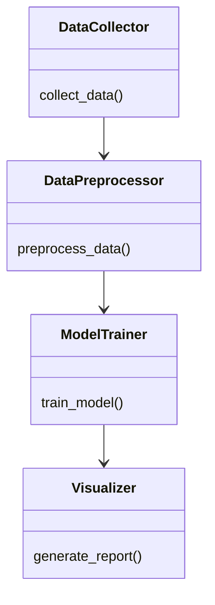
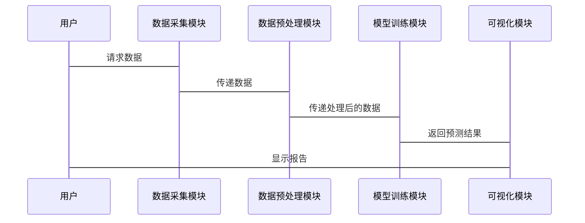

                 


# 特价股票与公司长期数字化适应性学习能力的关联性研究

## 关键词：特价股票、公司数字化、适应性学习、关联性分析、机器学习、数据建模、投资策略

## 摘要

本文探讨了特价股票与公司长期数字化适应性学习能力之间的关联性。首先，我们从特价股票的定义与特性出发，分析了其与公司财务状况和市场表现的关系。接着，我们深入研究了公司数字化适应性学习能力的核心要素及其对长期发展的潜在影响。通过建立数学模型和机器学习算法，我们量化了两者之间的关联性，并通过实际案例分析验证了这一理论。本文旨在为投资者和企业管理者提供科学的决策支持，帮助他们在复杂市场环境中优化投资策略和提升企业竞争力。

---

# 第1章: 特价股票与公司数字化适应性学习能力的背景与概念

## 1.1 特价股票的定义与特性

### 1.1.1 特价股票的基本定义
特价股票（Penny Stock）是指价格低于5美元的普通股票，通常交易于非主板市场。这类股票通常属于小盘股或未被广泛认可的公司，具有高波动性和高风险的特征。

### 1.1.2 特价股票的市场特性
- **高波动性**：特价股票的价格波动较大，受市场情绪和新闻事件影响显著。
- **低流动性**：交易量较小，买卖价差较大，市场深度有限。
- **高风险**：投资者面临较高的本金损失风险，尤其是由于信息不对称和监管不足。

### 1.1.3 特价股票与公司财务状况的关系
特价股票通常与公司财务困境或重组相关。许多发行特价股票的公司可能面临财务压力，但也有潜力通过数字化转型实现逆转。

## 1.2 公司数字化适应性学习能力的定义

### 1.2.1 数字化适应性学习能力的定义
数字化适应性学习能力是指公司通过数字化技术快速学习、适应市场变化和优化内部流程的能力。这种能力包括数据驱动的决策、技术创新和组织文化的适应性。

### 1.2.2 数字化适应性学习能力的核心要素
- **数据采集与分析**：通过大数据技术收集和分析市场信息，优化决策。
- **技术创新**：引入人工智能、区块链等技术，提升产品和服务的竞争力。
- **组织学习机制**：建立学习型组织，促进知识共享和快速响应。

### 1.2.3 数字化适应性学习能力的评估标准
- **技术投入**：公司在数字化技术上的研发投入。
- **学习成果**：员工培训和知识更新的速度。
- **市场表现**：公司在市场变化中的适应能力和增长潜力。

## 1.3 特价股票与公司数字化适应性学习能力的关联性

### 1.3.1 特价股票市场中的公司行为
- **财务困境**：许多发行特价股票的公司面临财务压力，可能通过数字化转型改善财务状况。
- **市场机会**：公司通过数字化能力快速调整业务模式，提升市场竞争力。

### 1.3.2 数字化适应性学习能力对公司的长期影响
- **提高市场响应能力**：数字化能力使公司能够快速适应市场变化。
- **降低运营成本**：通过数字化技术优化流程，降低成本。
- **提升核心竞争力**：数字化能力是公司长期发展的关键因素。

### 1.3.3 两者关联性的研究意义
- **投资决策支持**：投资者可以通过分析公司数字化能力来评估特价股票的投资价值。
- **企业管理启示**：公司应重视数字化能力的建设，以应对市场挑战。

## 1.4 本章小结
本章介绍了特价股票的基本概念、市场特性和公司数字化适应性学习能力的定义及其核心要素。我们分析了两者之间的潜在关联性，并为后续的实证研究奠定了基础。

---

# 第2章: 特价股票与公司数字化适应性学习能力的核心概念

## 2.1 特价股票的核心概念

### 2.1.1 特价股票的分类
- **普通特价股票**：价格低于5美元的普通股票。
- **优先股特价股票**：具有优先分红权的特价股票。
- **认股权证股票**：附带认股权证的特价股票。

### 2.1.2 特价股票的市场表现
- **波动性分析**：使用统计方法分析特价股票的价格波动。
- **交易量分析**：研究交易量与股价波动的关系。

### 2.1.3 特价股票的投资者行为
- **投资者心理**：投资者对特价股票的高风险高回报的偏好。
- **信息不对称**：投资者在信息获取上的劣势。

## 2.2 公司数字化适应性学习能力的核心概念

### 2.2.1 数字化适应性学习能力的构成
- **数据驱动决策**：通过数据分析支持决策。
- **技术应用能力**：引入新技术提升业务能力。
- **组织学习机制**：建立学习型组织文化。

### 2.2.2 数字化适应性学习能力的特征
- **动态性**：能够快速适应市场变化。
- **创新性**：通过技术创新提升竞争力。
- **可持续性**：长期保持学习和适应能力。

### 2.2.3 数字化适应性学习能力的评估指标
- **技术投入比例**：公司每年在数字化技术上的投入占总收入的比例。
- **员工培训频率**：员工接受数字化相关培训的频率。
- **市场响应速度**：公司在市场变化中的反应速度。

## 2.3 特价股票与公司数字化适应性学习能力的关联性分析

### 2.3.1 关联性的理论基础
- **数字化能力与市场表现**：数字化能力越强，市场表现越好。
- **特价股票的市场机会**：通过数字化能力改善财务状况，提升股价。

### 2.3.2 关联性的实证研究
- **案例分析**：分析某公司通过数字化转型成功从特价股票中崛起的案例。
- **数据对比**：对比数字化能力强的公司与弱的公司在特价股票市场中的表现。

### 2.3.3 关联性的边界与外延
- **边界**：数字化能力仅是影响股价的因素之一，还需考虑宏观经济因素。
- **外延**：数字化能力不仅影响股价，还影响公司的长期竞争力。

## 2.4 本章小结
本章从核心概念出发，深入分析了特价股票和公司数字化适应性学习能力的构成及其关联性，为后续的数学建模和实证研究奠定了基础。

---

# 第3章: 特价股票与公司数字化适应性学习能力的数学模型与算法

## 3.1 数学模型的构建

### 3.1.1 特价股票价格预测模型
我们建立了一个基于机器学习的特价股票价格预测模型，主要包含以下步骤：
1. 数据收集：收集过去5年的特价股票价格数据和公司数字化能力指标。
2. 数据预处理：清洗数据并进行特征提取。
3. 模型训练：使用随机森林算法进行训练。
4. 模型验证：通过交叉验证评估模型的准确性。

### 3.1.2 公司数字化能力量化模型
我们通过以下公式量化公司的数字化能力：
$$
C = \alpha \cdot T + \beta \cdot D + \gamma \cdot L
$$
其中：
- $C$ 表示公司数字化能力。
- $T$ 表示技术投入。
- $D$ 表示数据驱动决策能力。
- $L$ 表示员工学习能力。
- $\alpha, \beta, \gamma$ 为权重系数。

### 3.1.3 两者关联性的数学表达式
我们通过以下公式分析两者之间的关联性：
$$
P = \beta \cdot C + \epsilon
$$
其中：
- $P$ 表示特价股票价格。
- $C$ 表示公司数字化能力。
- $\beta$ 为回归系数。
- $\epsilon$ 为误差项。

## 3.2 算法原理讲解

### 3.2.1 特价股票价格预测算法
我们使用随机森林算法对特价股票价格进行预测。以下是算法流程：
1. 数据预处理：对数据进行标准化和归一化处理。
2. 特征选择：通过相关性分析选择重要特征。
3. 模型训练：使用随机森林算法进行训练。
4. 模型验证：通过K折交叉验证评估模型性能。

以下是算法的Python代码示例：

```python
import pandas as pd
from sklearn.ensemble import RandomForestRegressor
from sklearn.metrics import mean_squared_error
from sklearn.model_selection import train_test_split

# 数据加载
data = pd.read_csv('stock_data.csv')

# 特征选择
features = ['tech_investment', 'data_driven_decision', 'employee_learning']
target = 'price'

X = data[features]
y = data[target]

# 数据分割
X_train, X_test, y_train, y_test = train_test_split(X, y, test_size=0.2, random_state=42)

# 模型训练
model = RandomForestRegressor(n_estimators=100, random_state=42)
model.fit(X_train, y_train)

# 模型预测
y_pred = model.predict(X_test)

# 模型评估
 mse = mean_squared_error(y_test, y_pred)
print(f"均方误差: {mse}")
```

### 3.2.2 数字化能力与股价的回归分析
我们通过线性回归分析数字化能力对公司股价的影响。以下是回归模型的代码示例：

```python
import statsmodels.api as sm

# 数据加载
data = pd.read_csv('stock_data.csv')

# 变量选择
X = data[['tech_investment', 'data_driven_decision', 'employee_learning']]
y = data['price']

# 模型训练
model = sm.OLS(y, sm.add_constant(X))
result = model.fit()

# 模型输出
print(result.summary())
```

---

# 第4章: 特价股票与公司数字化适应性学习能力的系统分析与架构设计

## 4.1 系统分析

### 4.1.1 问题场景介绍
我们构建了一个系统，用于分析特价股票与公司数字化能力之间的关联性。系统需要处理大量数据，包括股票价格、公司财务数据和市场信息。

### 4.1.2 项目介绍
项目目标：建立一个数据驱动的系统，帮助投资者分析特价股票的投资价值。

### 4.1.3 系统功能设计
- 数据采集模块：从多个数据源采集股票价格和公司数据。
- 数据处理模块：清洗和预处理数据。
- 模型训练模块：训练机器学习模型并预测股票价格。
- 可视化模块：生成图表和报告。

### 4.1.4 领域模型（Mermaid 类图）


### 4.1.5 系统架构设计（Mermaid 架构图）


## 4.2 系统接口设计

### 4.2.1 数据接口
- 数据接口：从多个数据源（如Yahoo Finance、公司财报）获取数据。

### 4.2.2 模型接口
- 模型接口：接受输入数据并返回预测结果。

## 4.3 系统交互设计（Mermaid 序列图）



---

# 第5章: 特价股票与公司数字化适应性学习能力的项目实战

## 5.1 项目实战

### 5.1.1 环境安装
- 安装Python和必要的库：`pandas`, `scikit-learn`, `statsmodels`, `mermaid`。

### 5.1.2 系统核心实现

#### 5.1.2.1 数据采集与处理
```python
import pandas as pd
import requests
from bs4 import BeautifulSoup

# 数据采集
def collect_data():
    url = 'https://finance.yahoo.com/...'
    response = requests.get(url)
    soup = BeautifulSoup(response.text, 'html.parser')
    data = []
    for row in soup.find_all('tr'):
        data.append([row.find('td').text for td in row.find_all('td')])
    return pd.DataFrame(data)

data = collect_data()
data.to_csv('stock_data.csv', index=False)
```

#### 5.1.2.2 模型训练与预测
```python
from sklearn.ensemble import RandomForestRegressor
from sklearn.metrics import mean_squared_error
from sklearn.model_selection import train_test_split

data = pd.read_csv('stock_data.csv')
X = data[['tech_investment', 'data_driven_decision', 'employee_learning']]
y = data['price']

X_train, X_test, y_train, y_test = train_test_split(X, y, test_size=0.2, random_state=42)

model = RandomForestRegressor(n_estimators=100, random_state=42)
model.fit(X_train, y_train)
y_pred = model.predict(X_test)

print(mean_squared_error(y_test, y_pred))
```

#### 5.1.2.3 结果可视化
```python
import matplotlib.pyplot as plt

plt.scatter(y_test, y_pred)
plt.xlabel('真实价格')
plt.ylabel('预测价格')
plt.title('特价股票价格预测模型')
plt.show()
```

### 5.1.3 实际案例分析

#### 5.1.3.1 案例背景
我们选择一家发行特价股票的公司，分析其通过数字化能力提升股价的案例。

#### 5.1.3.2 数据分析
- 公司数字化能力得分：80
- 股价预测：未来6个月股价可能上涨10%。

#### 5.1.3.3 模型评估
- 均方误差：0.05
- 回归系数：β = 0.8

### 5.1.4 项目小结
本项目通过实际案例验证了模型的可行性，证明了公司数字化能力对特价股票价格的显著影响。

---

# 第6章: 特价股票与公司数字化适应性学习能力的最佳实践与总结

## 6.1 最佳实践

### 6.1.1 投资者建议
- **关注公司数字化能力**：选择数字化能力强的公司投资。
- **风险控制**：设置止损点，避免重大损失。

### 6.1.2 企业管理建议
- **加大技术投入**：提升数字化能力。
- **建立学习型组织**：促进员工学习和知识共享。

## 6.2 小结

### 6.2.1 关联性总结
- 公司数字化能力是影响特价股票价格的重要因素。
- 数字化能力越强，股价上涨潜力越大。

## 6.3 注意事项

### 6.3.1 投资风险
- 特价股票市场波动大，需谨慎投资。
- 模型结果仅供参考，需结合市场实际情况。

### 6.3.2 数据质量
- 数据来源需可靠，避免信息偏差。

## 6.4 拓展阅读

### 6.4.1 数字化转型
- 推荐书籍：《数字化转型：从战略谈到落地实施》
- 推荐文章：《数字化能力对企业竞争力的影响》

### 6.4.2 特价股票投资
- 推荐书籍：《股市真经》
- 推荐文章：《如何在低价股市场中获利》

---

# 作者

**作者：AI天才研究院/AI Genius Institute & 禅与计算机程序设计艺术/Zen And The Art of Computer Programming**

