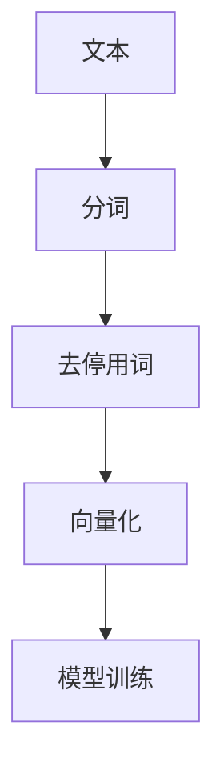
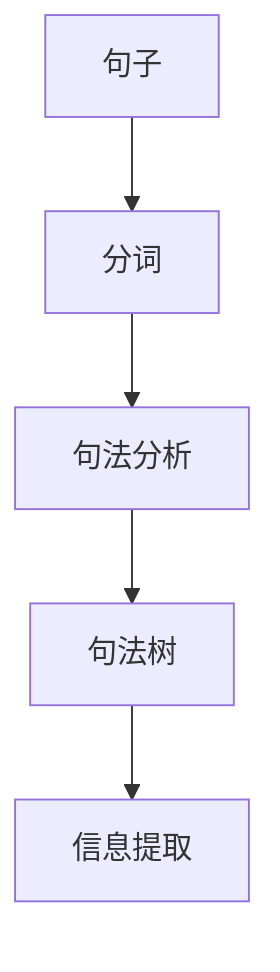
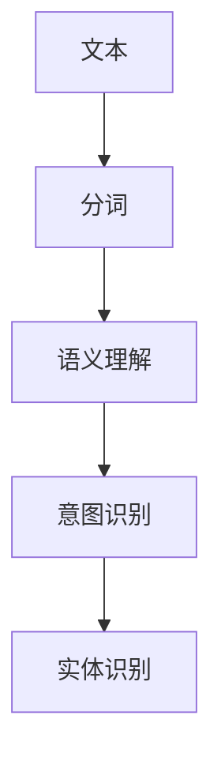

                 


# 自然语言理解在智能投资助手中的应用

> **关键词**：自然语言理解、智能投资助手、金融文本分析、情感分析、关键词提取、机器学习、深度学习  
> **摘要**：自然语言理解（NLU）作为人工智能的核心技术之一，在金融领域发挥着越来越重要的作用。本文将详细探讨自然语言理解在智能投资助手中的应用，从基础概念到核心算法，从系统设计到实际案例，全面解析如何利用自然语言理解技术帮助投资者进行更高效、更精准的投资决策。

---

## 第1章: 自然语言理解的核心概念

### 1.1 自然语言处理的背景与现状

#### 1.1.1 自然语言处理的定义与目标
自然语言处理（NLP）是人工智能领域的重要分支，旨在让计算机能够理解、解析和生成人类语言。其目标是实现人机交互的自然化，使计算机能够像人类一样理解和处理文本。

#### 1.1.2 自然语言处理的发展历程
1. 20世纪50年代：NLP的萌芽阶段，主要研究基于规则的文本处理。
2. 20世纪80年代：统计学方法的兴起，如基于词袋模型的文本分类。
3. 21世纪以来：深度学习的崛起，如神经网络语言模型的出现。

#### 1.1.3 当前自然语言处理的技术特点
- **数据驱动**：依赖大量标注数据进行训练。
- **模型复杂**：广泛使用深度学习模型，如Transformer架构。
- **应用广泛**：在搜索引擎、机器翻译、智能客服等领域得到广泛应用。

### 1.2 自然语言理解的基本原理

#### 1.2.1 语言的基本结构与特征
- **词汇**：语言的基本单位，如“股票”、“上涨”等。
- **句法**：词语之间的语法关系，如主语、谓语等。
- **语义**：词语和句子的实际含义，如“公司盈利增长”表示公司业绩向好。

#### 1.2.2 自然语言理解的三要素: 语法、语义和语用
- **语法**：研究句子的结构和形式。
- **语义**：研究词语和句子的含义。
- **语用**：研究语言的实际使用场景和意图。

#### 1.2.3 自然语言理解的挑战与解决方案
- **歧义性**：同一个词语或句子可能有多种含义。
- **上下文依赖性**：词语的含义可能因上下文而变化。
- **领域专用性**：金融领域的术语和表达方式具有特殊性。

### 1.3 自然语言理解在金融领域的应用

#### 1.3.1 金融领域的自然语言处理需求
- **财务报表分析**：从公司财报中提取关键信息，如收入、利润等。
- **新闻分析**：分析财经新闻，预测市场走势。
- **社交媒体分析**：通过社交媒体情绪分析，判断市场情绪。

#### 1.3.2 自然语言理解在投资决策中的作用
- **信息提取**：从新闻、财报中提取关键信息，帮助投资者做出决策。
- **情感分析**：分析市场情绪，预测股票价格波动。
- **风险预警**：通过语义分析，识别潜在风险因素。

#### 1.3.3 智能投资助手的核心功能与价值
- **信息整合**：将分散的金融信息整合，提供一站式服务。
- **实时分析**：实时分析市场动态，提供及时的投资建议。
- **个性化服务**：根据投资者的需求，提供定制化服务。

---

## 第2章: 自然语言理解的核心算法与技术

### 2.1 词袋模型与词嵌入

#### 2.1.1 词袋模型的原理与实现
- **词袋模型**：将文本表示为词语的集合，不考虑词语的顺序。
- **实现步骤**：
  1. 分词：将文本分割成词语。
  2. 去停用词：去除无意义的词语，如“的”、“了”等。
  3. 向量化：将词语表示为向量。

#### 2.1.2 词嵌入技术（如Word2Vec、GloVe）
- **Word2Vec**：通过神经网络训练词向量，使相似的词语具有相似的向量。
- **GloVe**：基于全局词频统计，构建词向量。

#### 2.1.3 词嵌入的金融应用案例
- **股票预测**：通过词嵌入技术分析财经新闻，预测股票价格。
- **情感分析**：通过词嵌入技术分析社交媒体情绪，预测市场走势。

#### 2.1.4 代码实现
```python
from sklearn.feature_extraction.text import CountVectorizer
from sklearn.linear_model import LogisticRegression

# 分词与向量化
vectorizer = CountVectorizer()
X = vectorizer.fit_transform(texts)
# 训练分类器
model = LogisticRegression()
model.fit(X, labels)
```

#### 2.1.5 图表展示


### 2.2 语法分析与句法结构

#### 2.2.1 语法分析的基本原理
- **句法分析**：研究句子的结构和语法关系。
- **依存句法分析**：分析词语之间的依赖关系。

#### 2.2.2 句法树的构建与应用
- **句法树**：将句子分解为树状结构，展示词语之间的关系。
- **应用案例**：通过句法树分析财经新闻的主谓关系，提取关键信息。

#### 2.2.3 语法分析在金融文本处理中的应用
- **信息抽取**：从句法树中提取实体和关系。
- **语义理解**：通过句法分析理解句子的含义。

#### 2.2.4 代码实现
```python
import spacy
nlp = spacy.load("en_core_web_sm")
doc = nlp(text)
for token in doc:
    print(token.text, token.pos_, token.dep_)
```

#### 2.2.5 图表展示


### 2.3 语义理解与上下文推理

#### 2.3.1 语义理解的定义与挑战
- **语义理解**：理解文本的实际含义，超越表面文字。
- **挑战**：处理歧义性、上下文依赖性等问题。

#### 2.3.2 上下文推理的算法与模型
- **指代消解**：确定代词的指代对象。
- **常识推理**：利用常识推理理解文本含义。

#### 2.3.3 语义理解在智能投资助手中的应用
- **意图识别**：识别用户的意图，如“查询股票信息”。
- **实体识别**：识别文本中的实体，如公司名称、股票代码等。

#### 2.3.4 代码实现
```python
from transformers import pipeline
nlp = pipeline("text-classification", model="bert-base-uncased")
result = nlp(text)
print(result)
```

#### 2.3.5 图表展示


---

## 第3章: 自然语言理解的系统架构与实现

### 3.1 系统架构设计

#### 3.1.1 智能投资助手的总体架构
- **输入层**：接收用户输入的文本。
- **处理层**：包括分词、语法分析、语义理解等模块。
- **输出层**：输出分析结果，如情感倾向、关键信息等。

#### 3.1.2 模块划分与功能分配
- **文本预处理模块**：负责分词、去停用词等。
- **语义理解模块**：负责语法分析、句法树构建等。
- **结果输出模块**：负责将分析结果输出给用户。

#### 3.1.3 系统的可扩展性与灵活性设计
- **模块化设计**：各模块独立，便于扩展和维护。
- **接口设计**：提供统一的接口，方便与其他系统集成。

### 3.2 数据流与信息处理流程

#### 3.2.1 数据输入与预处理
- **数据输入**：接收用户输入的文本，如“近期业绩不佳”。
- **数据预处理**：包括分词、去停用词、向量化等步骤。

#### 3.2.2 自然语言理解模块的处理流程
- **语法分析**：分析句子的结构和语法关系。
- **语义理解**：理解文本的实际含义和意图。

#### 3.2.3 结果输出与用户反馈
- **结果输出**：将分析结果输出给用户，如“该公司的业绩确实不佳”。
- **用户反馈**：收集用户的反馈，优化系统性能。

### 3.3 系统实现的关键技术

#### 3.3.1 自然语言理解算法的选择与实现
- **选择算法**：根据具体需求选择合适的算法，如词袋模型、Word2Vec等。
- **实现步骤**：包括数据预处理、模型训练、结果输出等。

#### 3.3.2 数据结构与算法优化
- **数据结构**：选择合适的数据结构，如树状结构、图结构等。
- **算法优化**：通过优化算法提高系统性能，如并行计算、缓存优化等。

#### 3.3.3 系统性能的优化与提升
- **硬件优化**：使用高性能硬件加速计算。
- **算法优化**：通过改进算法提高系统效率。
- **并行计算**：利用多线程或多进程提高计算效率。

---

## 第4章: 智能投资助手的系统设计与实现

### 4.1 系统功能模块划分

#### 4.1.1 用户交互模块
- **功能**：接收用户输入，输出分析结果。
- **实现**：通过命令行或图形界面实现用户交互。

#### 4.1.2 文本分析模块
- **功能**：包括分词、语法分析、语义理解等。
- **实现**：使用NLP工具如spaCy、NLTK等实现文本分析。

#### 4.1.3 数据存储模块
- **功能**：存储分析结果和用户数据。
- **实现**：使用数据库或文件系统存储数据。

### 4.2 系统功能流程设计

#### 4.2.1 用户输入
- **用户输入**：用户输入文本，如“该公司的业绩确实不佳”。

#### 4.2.2 文本预处理
- **分词**：将文本分割成词语。
- **去停用词**：去除无意义的词语。

#### 4.2.3 自然语言理解
- **语法分析**：分析句子的结构和语法关系。
- **语义理解**：理解文本的实际含义和意图。

#### 4.2.4 结果输出
- **输出结果**：将分析结果输出给用户，如“该公司的业绩确实不佳”。

### 4.3 系统的可扩展性设计

#### 4.3.1 模块化设计
- **模块化设计**：各模块独立，便于扩展和维护。
- **接口设计**：提供统一的接口，方便与其他系统集成。

#### 4.3.2 功能扩展
- **新增功能**：如增加情感分析、关键词提取等功能。
- **性能优化**：通过优化算法和硬件提高系统性能。

---

## 第5章: 智能投资助手的系统实现

### 5.1 系统环境搭建

#### 5.1.1 安装Python环境
- **安装Python**：下载并安装Python，版本建议为3.8或以上。
- **安装依赖库**：如 spaCy、NLTK、Transformers 等。

#### 5.1.2 安装NLP工具
- **安装spaCy**：`pip install spacy`
- **下载语言模型**：`python -m spacy download en_core_web_sm`

### 5.2 系统核心实现

#### 5.2.1 文本预处理
```python
import spacy

nlp = spacy.load("en_core_web_sm")
text = "The company's revenue increased by 10% last quarter."
doc = nlp(text)
for token in doc:
    print(token.text, token.pos_, token.dep_)
```

#### 5.2.2 情感分析
```python
from transformers import pipeline

sentiment_pipeline = pipeline("text-classification", model="bert-base-uncased")
result = sentiment_pipeline("The company's revenue increased by 10% last quarter.")
print(result)
```

#### 5.2.3 关键词提取
```python
from sklearn.feature_extraction.text import TfidfVectorizer

vectorizer = TfidfVectorizer()
X = vectorizer.fit_transform([text])
feature_names = vectorizer.get_feature_names_out()
print(feature_names)
```

### 5.3 项目实战

#### 5.3.1 实际案例分析
- **案例**：分析一篇财经新闻，提取关键信息和情感倾向。

#### 5.3.2 系统实现与测试
- **实现**：编写代码实现系统功能，如文本预处理、情感分析、关键词提取等。
- **测试**：通过测试用例验证系统功能的正确性。

#### 5.3.3 系统优化
- **优化**：通过优化算法和硬件提高系统性能，如使用GPU加速计算。

### 5.4 小结

#### 5.4.1 系统实现的关键点
- **文本预处理**：分词、去停用词、向量化等。
- **情感分析**：利用深度学习模型进行情感分类。
- **关键词提取**：通过TF-IDF等方法提取关键词。

#### 5.4.2 系统优化的注意事项
- **算法优化**：选择合适的算法和模型，如使用更高效的模型。
- **硬件优化**：使用高性能硬件加速计算，如GPU。

---

## 第6章: 系统优化与扩展

### 6.1 系统优化

#### 6.1.1 算法优化
- **模型选择**：选择更高效的模型，如使用预训练的BERT模型。
- **参数调优**：通过调整模型参数提高性能。

#### 6.1.2 硬件优化
- **GPU加速**：使用GPU加速深度学习模型的训练和推理。
- **分布式计算**：通过分布式计算提高系统的处理能力。

### 6.2 系统扩展

#### 6.2.1 多语言支持
- **多语言处理**：支持多种语言的文本分析，如中文、英文、日文等。
- **跨文化分析**：考虑不同文化背景下的语言差异。

#### 6.2.2 与其他技术的融合
- **机器学习**：结合机器学习技术，如时间序列分析，进行股票预测。
- **区块链**：结合区块链技术，进行智能合约的自动化执行。

### 6.3 案例分析与未来展望

#### 6.3.1 案例分析
- **案例**：分析一篇财经新闻，提取关键信息和情感倾向，预测股票价格。

#### 6.3.2 未来展望
- **技术进步**：随着深度学习技术的不断进步，自然语言理解在智能投资助手中的应用将更加广泛。
- **领域扩展**：自然语言理解技术将应用于更多领域，如智能客服、智能教育等。

---

## 第7章: 总结与展望

### 7.1 总结
本文详细探讨了自然语言理解在智能投资助手中的应用，从基础概念到核心算法，从系统设计到实际案例，全面解析了如何利用自然语言理解技术帮助投资者进行更高效、更精准的投资决策。

### 7.2 展望
随着深度学习技术的不断进步，自然语言理解在智能投资助手中的应用将更加广泛。未来，自然语言理解技术将与其他技术如机器学习、区块链等深度融合，推动金融领域的智能化发展。

---

## 作者

**作者**：AI天才研究院/AI Genius Institute & 禅与计算机程序设计艺术/Zen And The Art of Computer Programming

---

# 结束语

本文通过详细的技术分析和实际案例，展示了自然语言理解在智能投资助手中的巨大潜力。未来，随着技术的不断进步，自然语言理解将在金融领域发挥更大的作用，为投资者提供更智能、更高效的决策支持。

