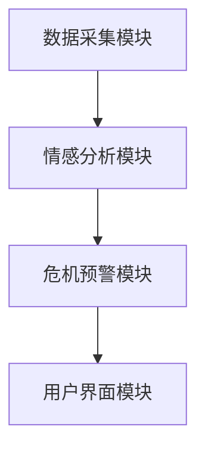
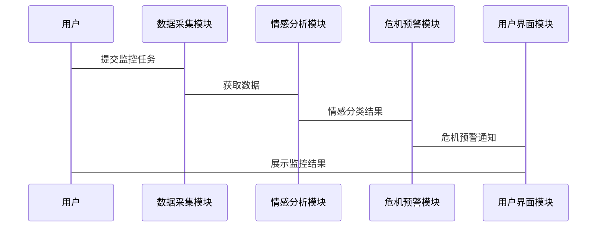

                 


# AI Agent在企业品牌声誉监控与危机预警中的应用

> 关键词：AI Agent, 品牌声誉, 危机预警, 自然语言处理, 机器学习, 危机管理

> 摘要：随着数字化时代的快速发展，企业品牌声誉管理面临着前所未有的挑战。传统的品牌声誉管理方法逐渐暴露出效率低、覆盖面窄、实时性差等问题。本文通过分析AI Agent在品牌声誉监控与危机预警中的应用，探讨其如何利用自然语言处理、机器学习等技术实现智能化的品牌声誉管理。文章从AI Agent的基本概念、核心原理、应用场景、算法实现、系统架构等方面进行详细阐述，并结合实际案例，展示AI Agent在品牌声誉监控与危机预警中的巨大潜力和实际价值。

---

# 第1章: 企业品牌声誉监控与危机预警的背景与挑战

## 1.1 问题背景

### 1.1.1 品牌声誉的重要性

企业品牌声誉是企业在市场中的形象和信誉的综合体现，直接影响消费者的信任度、客户忠诚度以及企业的市场价值。在数字化时代，消费者可以通过社交媒体、新闻网站等多种渠道快速获取信息并表达观点，这使得品牌声誉的波动更加频繁和复杂。

### 1.1.2 传统品牌声誉管理的局限性

传统的品牌声誉管理方法主要依赖人工监控和分析，这种方式存在以下问题：

1. **效率低**：人工监控需要大量的人力和时间，难以覆盖全网信息。
2. **覆盖面窄**：传统方法通常只能监控有限的渠道，如官方网站和主流媒体，无法覆盖社交媒体、论坛等新兴渠道。
3. **实时性差**：人工分析无法实现实时监控，容易错过危机预警的最佳时机。

### 1.1.3 数字化时代的新挑战

在数字化时代，品牌声誉管理面临以下新挑战：

1. **信息量巨大**：每天产生的海量信息使得人工监控变得几乎不可能。
2. **信息来源多样化**：信息不仅来自传统媒体，还包括社交媒体、用户评论等非结构化数据。
3. **危机传播速度快**：在社交媒体时代，危机信息的传播速度极快，企业需要更快的响应速度。

## 1.2 危机预警的必要性

### 1.2.1 危机对企业声誉的影响

危机事件对企业声誉的影响往往是灾难性的。例如，一次负面新闻可能导致品牌价值大幅下降，甚至引发连锁反应，影响企业的生存。

### 1.2.2 危机预警的定义与目标

危机预警是指通过技术手段提前发现潜在的危机信号，并及时采取措施进行干预。其目标是将危机的影响降到最低。

### 1.2.3 危机预警的典型场景

1. **社交媒体上的负面评论**：用户对企业产品或服务的不满。
2. **新闻媒体的负面报道**：媒体报道对企业形象的负面影响。
3. **竞争对手的攻击**：竞争对手通过虚假信息或恶意攻击来破坏企业的声誉。

## 1.3 AI Agent在品牌声誉管理中的作用

### 1.3.1 AI Agent的定义与特点

AI Agent（人工智能代理）是指能够感知环境、自主决策并执行任务的智能系统。其特点包括：

1. **自主性**：能够自主决策和行动。
2. **反应性**：能够实时感知环境并做出反应。
3. **学习能力**：能够通过数据学习和优化。

### 1.3.2 AI Agent在品牌声誉管理中的优势

1. **高效性**：AI Agent可以实时监控全网信息，快速识别潜在危机。
2. **准确性**：通过自然语言处理技术，AI Agent能够准确理解文本情感和意图。
3. **智能化**：AI Agent能够根据历史数据学习，不断优化监控和预警算法。

### 1.3.3 AI Agent与其他技术的结合

1. **自然语言处理（NLP）**：用于情感分析和文本理解。
2. **机器学习（ML）**：用于模式识别和预测。
3. **大数据技术**：用于处理海量数据。

## 1.4 本章小结

本章介绍了企业品牌声誉监控与危机预警的背景和挑战，阐述了传统方法的局限性，并提出了AI Agent在品牌声誉管理中的重要作用。AI Agent通过其自主性、反应性和学习能力，能够有效解决传统方法的不足，为企业提供智能化的品牌声誉管理解决方案。

---

# 第2章: AI Agent的核心概念与原理

## 2.1 AI Agent的基本概念

### 2.1.1 AI Agent的定义

AI Agent是一种能够感知环境、自主决策并执行任务的智能系统。它可以分为两类：

1. **简单反射型AI Agent**：基于规则进行决策。
2. **复杂型AI Agent**：基于学习和推理进行决策。

### 2.1.2 AI Agent的分类

1. **按智能水平**：
   - 单层AI Agent：基于规则的简单决策。
   - 多层AI Agent：结合学习和推理的复杂决策。
2. **按应用场景**：
   - 监控型AI Agent：用于实时监控和预警。
   - 分析型AI Agent：用于数据分析和预测。

### 2.1.3 AI Agent的核心要素

1. **感知模块**：用于获取环境信息。
2. **决策模块**：基于感知信息做出决策。
3. **执行模块**：执行决策任务。
4. **学习模块**：通过数据学习优化算法。

## 2.2 AI Agent的工作原理

### 2.2.1 数据采集与处理

AI Agent通过以下方式获取数据：

1. **API接口**：从社交媒体平台获取公开数据。
2. **爬虫技术**：从网站和论坛中抓取数据。
3. **实时流数据**：通过消息队列实时接收数据。

### 2.2.2 情感分析与语义理解

情感分析是AI Agent理解文本情感的关键技术。常用的情感分析模型包括：

1. **基于规则的情感分析**：通过预设的规则判断文本情感。
2. **基于机器学习的情感分析**：使用训练好的模型进行分类。
3. **基于深度学习的情感分析**：使用词嵌入和神经网络模型进行情感分析。

### 2.2.3 危机预警机制

危机预警机制包括以下步骤：

1. **数据采集**：获取全网相关信息。
2. **情感分析**：识别负面评论和潜在危机。
3. **事件分类**：根据危机的类型和严重程度进行分类。
4. **预警通知**：通过邮件、短信等方式通知相关人员。

## 2.3 AI Agent与品牌声誉管理的结合

### 2.3.1 品牌声誉监控的流程

1. **数据采集**：从社交媒体、新闻网站等渠道获取相关信息。
2. **情感分析**：判断文本的情感倾向。
3. **主题抽取**：提取文本的主题和关键词。
4. **危机识别**：识别潜在的危机事件。
5. **预警通知**：根据危机的严重程度发出预警。

### 2.3.2 AI Agent在危机预警中的应用

1. **实时监控**：AI Agent可以实时监控全网信息，快速识别潜在危机。
2. **情感分析**：通过情感分析技术，AI Agent能够准确判断信息的情感倾向。
3. **危机分类**：AI Agent可以根据危机的类型和严重程度进行分类，提供针对性的预警和应对方案。

### 2.3.3 AI Agent的实时性与准确性

1. **实时性**：AI Agent可以实现实时监控和预警，确保危机能够被及时发现和处理。
2. **准确性**：通过先进的自然语言处理技术和机器学习算法，AI Agent能够准确识别潜在危机。

## 2.4 本章小结

本章详细介绍了AI Agent的基本概念和核心原理，重点阐述了其在品牌声誉管理中的应用。通过数据采集、情感分析和危机预警等技术，AI Agent能够实现智能化的品牌声誉监控和危机预警。

---

# 第3章: 自然语言处理技术在品牌声誉监控中的应用

## 3.1 自然语言处理基础

### 3.1.1 NLP的核心任务

1. **文本分类**：将文本分为不同的类别。
2. **情感分析**：判断文本的情感倾向。
3. **主题抽取**：提取文本的主题和关键词。
4. **实体识别**：识别文本中的实体。

### 3.1.2 常见的NLP技术

1. **分词**：将文本分割成词语或短语。
2. **词性标注**：标注词语的词性。
3. **句法分析**：分析句子的语法结构。
4. **文本摘要**：提取文本的关键信息。

## 3.2 基于NLP的情感分析

### 3.2.1 情感分析的定义与分类

情感分析是通过自然语言处理技术判断文本的情感倾向。情感分析可以分为以下几类：

1. **二元情感分析**：将文本分为正面、负面或中性。
2. **多分类情感分析**：将文本分为多个情感类别。
3. **情感强度分析**：判断情感的强烈程度。

### 3.2.2 基于深度学习的情感分析模型

常用的情感分析模型包括：

1. **词嵌入模型**：如Word2Vec、GloVe。
2. **深度学习模型**：如LSTM、Transformer（如BERT）。

### 3.2.3 情感分析在品牌声誉监控中的应用

情感分析可以帮助企业快速识别负面评论，及时发现潜在危机。例如，当社交媒体上出现大量负面评论时，AI Agent可以通过情感分析快速识别并发出预警。

## 3.3 基于NLP的主题抽取

### 3.3.1 主题抽取的定义与方法

主题抽取是通过自然语言处理技术提取文本的主题和关键词。常用的方法包括：

1. **基于统计的方法**：如TF-IDF。
2. **基于机器学习的方法**：如LDA（主题模型）。
3. **基于深度学习的方法**：如BERT。

### 3.3.2 基于TF-IDF的主题抽取

TF-IDF（Term Frequency-Inverse Document Frequency）是一种常用的文本特征提取方法。通过计算词语在文档中的重要性，可以提取出文档的主题关键词。

### 3.3.3 基于深度学习的主题抽取

基于深度学习的主题抽取方法（如BERT）可以通过预训练的模型直接提取文本的主题信息。这种方法通常具有较高的准确性和鲁棒性。

## 3.4 本章小结

本章介绍了自然语言处理技术在品牌声誉监控中的应用，重点讲解了情感分析和主题抽取的核心原理和实现方法。通过这些技术，AI Agent可以准确理解文本情感和主题，为品牌声誉监控提供有力支持。

---

# 第4章: 品牌声誉监控与危机预警的场景分析

## 4.1 社交媒体上的品牌声誉监控

### 4.1.1 社交媒体的特点

社交媒体的特点包括：

1. **信息量大**：每天产生的海量信息。
2. **信息来源多样化**：用户、网红、机构等。
3. **信息传播速度快**：信息可以快速扩散。

### 4.1.2 基于AI Agent的社交媒体监控

AI Agent可以通过以下方式实现社交媒体监控：

1. **数据采集**：通过API接口获取社交媒体上的公开数据。
2. **情感分析**：识别社交媒体上的负面评论。
3. **危机预警**：根据情感分析结果发出预警。

### 4.1.3 案例分析

某知名品牌的社交媒体监控案例：

1. **数据采集**：通过Twitter API获取品牌相关的评论。
2. **情感分析**：识别负面评论，发现潜在危机。
3. **危机预警**：根据危机的严重程度发出预警，并提供应对建议。

## 4.2 竞争对手分析

### 4.2.1 竞争对手分析的必要性

竞争对手分析可以帮助企业了解竞争对手的品牌声誉，及时发现竞争对手的负面信息。

### 4.2.2 基于AI Agent的竞争对手分析

AI Agent可以通过以下方式实现竞争对手分析：

1. **数据采集**：从竞争对手的官方网站、社交媒体等渠道获取信息。
2. **情感分析**：分析竞争对手的产品评论和用户反馈。
3. **主题抽取**：提取竞争对手的品牌声誉相关主题。

### 4.2.3 案例分析

某竞争对手分析案例：

1. **数据采集**：从竞争对手的社交媒体和新闻网站获取信息。
2. **情感分析**：识别竞争对手的负面评论。
3. **主题抽取**：提取竞争对手品牌声誉的相关主题。

## 4.3 产品反馈分析

### 4.3.1 产品反馈分析的必要性

产品反馈分析可以帮助企业了解用户对产品的满意度，及时发现产品问题。

### 4.3.2 基于AI Agent的产品反馈分析

AI Agent可以通过以下方式实现产品反馈分析：

1. **数据采集**：从电商平台、论坛等渠道获取产品评论。
2. **情感分析**：识别用户的正面和负面评论。
3. **主题抽取**：提取用户反馈的主要问题。

### 4.3.3 案例分析

某电子产品的产品反馈分析案例：

1. **数据采集**：从亚马逊和知乎获取用户评论。
2. **情感分析**：识别用户的负面评论。
3. **主题抽取**：提取用户反馈的主要问题，如产品质量和售后服务。

## 4.4 本章小结

本章通过具体案例分析了AI Agent在品牌声誉监控中的应用场景，包括社交媒体监控、竞争对手分析和产品反馈分析。通过这些应用场景，企业可以更好地了解品牌声誉，及时发现和处理潜在危机。

---

# 第5章: AI Agent的算法原理与实现

## 5.1 情感分析算法原理

### 5.1.1 情感分析的流程

1. **数据预处理**：清洗和分词。
2. **特征提取**：提取文本特征。
3. **模型训练**：训练情感分析模型。
4. **模型预测**：对新文本进行情感分类。

### 5.1.2 情感分析的数学模型

常用的情感分析模型包括：

1. **逻辑回归模型**：用于二分类情感分析。
2. **支持向量机（SVM）模型**：用于文本分类。
3. **深度学习模型**：如LSTM和Transformer。

### 5.1.3 情感分析的Python实现

以下是基于Python的情感分析代码示例：

```python
from sklearn.feature_extraction.text import TfidfVectorizer
from sklearn.linear_model import LogisticRegression

# 数据预处理
def preprocess(text):
    return text.lower().strip()

# 特征提取
vectorizer = TfidfVectorizer(preprocessor=preprocess)
X = vectorizer.fit_transform(texts)

# 模型训练
model = LogisticRegression()
model.fit(X, labels)

# 模型预测
test_text = ["I hate this product"]
test_X = vectorizer.transform([test_text])
predicted_label = model.predict(test_X)
print(predicted_label)
```

## 5.2 危机预警算法原理

### 5.2.1 危机预警的流程

1. **数据采集**：获取全网相关信息。
2. **情感分析**：识别负面评论。
3. **事件分类**：根据危机的类型和严重程度进行分类。
4. **预警通知**：通过邮件、短信等方式通知相关人员。

### 5.2.2 危机预警的数学模型

危机预警的数学模型通常包括以下几个步骤：

1. **数据清洗**：去除噪声数据。
2. **特征提取**：提取文本特征。
3. **模型训练**：训练危机预警模型。
4. **模型预测**：对新数据进行危机预警。

### 5.2.3 危机预警的Python实现

以下是基于Python的危机预警代码示例：

```python
import pandas as pd
from sklearn.ensemble import RandomForestClassifier

# 数据加载
data = pd.read_csv("crisis_data.csv")

# 特征提取
features = data.drop(columns=["label"])
labels = data["label"]

# 模型训练
model = RandomForestClassifier()
model.fit(features, labels)

# 模型预测
test_data = pd.read_csv("test_data.csv")
test_features = test_data.drop(columns=["label"])
predicted_labels = model.predict(test_features)
print(predicted_labels)
```

## 5.3 本章小结

本章详细介绍了AI Agent在品牌声誉监控中的算法原理与实现，重点讲解了情感分析和危机预警的数学模型和Python代码实现。通过这些技术，AI Agent可以实现实时的品牌声誉监控和危机预警。

---

# 第6章: 系统分析与架构设计方案

## 6.1 系统功能设计

### 6.1.1 功能模块

1. **数据采集模块**：负责采集全网相关信息。
2. **情感分析模块**：负责对文本进行情感分类。
3. **危机预警模块**：负责识别潜在危机并发出预警。
4. **用户界面模块**：提供可视化界面供用户查看监控结果。

### 6.1.2 功能流程

1. 数据采集模块通过API接口和爬虫技术获取数据。
2. 情感分析模块对获取的数据进行情感分类。
3. 危机预警模块根据情感分析结果识别潜在危机并发出预警。
4. 用户界面模块将监控结果展示给用户。

## 6.2 系统架构设计

### 6.2.1 系统架构图

以下是一个基于Mermaid的系统架构图：



### 6.2.2 系统接口设计

1. 数据采集模块接口：
   - 输入：API接口和爬虫参数。
   - 输出：结构化数据。

2. 情感分析模块接口：
   - 输入：文本数据。
   - 输出：情感分类结果。

3. 危机预警模块接口：
   - 输入：情感分类结果。
   - 输出：危机预警通知。

## 6.3 系统交互设计

### 6.3.1 系统交互流程

1. 用户通过用户界面模块提交监控任务。
2. 数据采集模块通过API接口和爬虫技术获取数据。
3. 情感分析模块对获取的数据进行情感分类。
4. 危机预警模块根据情感分析结果识别潜在危机并发出预警。
5. 用户界面模块将监控结果展示给用户。

### 6.3.2 交互流程图

以下是一个基于Mermaid的系统交互流程图：



## 6.4 本章小结

本章通过系统功能设计、架构设计和交互设计，详细介绍了AI Agent在品牌声誉监控中的系统实现方案。通过合理的架构设计和模块划分，可以实现高效的品牌声誉监控和危机预警。

---

# 第7章: 项目实战——基于AI Agent的品牌声誉监控系统

## 7.1 项目背景

本项目旨在开发一个基于AI Agent的品牌声誉监控系统，实现对社交媒体、新闻网站等渠道的品牌声誉实时监控和危机预警。

## 7.2 项目环境安装

### 7.2.1 系统要求

1. Python 3.6+
2. 安装必要的Python库：scikit-learn、tflearn、beautifulsoup4等。

### 7.2.2 环境配置

```bash
pip install scikit-learn tflearn beautifulsoup4 requests
```

## 7.3 系统核心实现

### 7.3.1 数据采集模块

```python
import requests
from bs4 import BeautifulSoup

def scrape_website(url):
    response = requests.get(url)
    soup = BeautifulSoup(response.text, "html.parser")
    texts = soup.find_all("div", class_="article-content")
    return [text.get_text() for text in texts]
```

### 7.3.2 情感分析模块

```python
from sklearn.feature_extraction.text import TfidfVectorizer
from sklearn.linear_model import LogisticRegression

def preprocess(text):
    return text.lower().strip()

def train_model(texts, labels):
    vectorizer = TfidfVectorizer(preprocessor=preprocess)
    X = vectorizer.fit_transform(texts)
    model = LogisticRegression()
    model.fit(X, labels)
    return model, vectorizer

def predict_model(model, vectorizer, text):
    test_X = vectorizer.transform([text])
    return model.predict(test_X)[0]
```

### 7.3.3 危机预警模块

```python
from sklearn.ensemble import RandomForestClassifier

def preprocess_data(data):
    # 数据预处理代码
    pass

def train_crisis_model(data, labels):
    features = preprocess_data(data)
    model = RandomForestClassifier()
    model.fit(features, labels)
    return model

def predict_crisis(model, features):
    return model.predict(features)
```

### 7.3.4 用户界面模块

```python
import tkinter as tk

def create_ui():
    root = tk.Tk()
    root.title("品牌声誉监控系统")
    # UI实现代码
    root.mainloop()

create_ui()
```

## 7.4 项目案例分析

### 7.4.1 案例背景

某电子产品品牌希望通过本系统实现品牌声誉的实时监控。

### 7.4.2 数据采集

通过爬虫技术从社交媒体和新闻网站获取品牌相关的评论和报道。

### 7.4.3 情感分析

使用训练好的情感分析模型对获取的数据进行情感分类。

### 7.4.4 危机预警

根据情感分析结果识别潜在危机，并发出预警通知。

### 7.4.5 UI展示

通过用户界面模块展示监控结果和预警信息。

## 7.5 项目小结

本章通过实际项目案例详细介绍了基于AI Agent的品牌声誉监控系统的实现过程。从环境安装到系统核心实现，再到案例分析，读者可以全面了解AI Agent在品牌声誉监控中的具体应用。

---

# 第8章: 总结与展望

## 8.1 本章总结

本文详细介绍了AI Agent在企业品牌声誉监控与危机预警中的应用，从背景与挑战、核心概念与原理、自然语言处理技术、应用场景、算法原理与实现、系统架构设计到项目实战，全面阐述了AI Agent在品牌声誉管理中的巨大潜力和实际价值。

## 8.2 未来展望

随着人工智能技术的不断发展，AI Agent在品牌声誉管理中的应用将更加广泛和深入。未来的研究方向包括：

1. **更准确的情感分析模型**：开发更高效的深度学习模型，提高情感分析的准确性。
2. **更智能的危机预警系统**：结合实时数据和历史数据，实现更智能的危机预警。
3. **多语言支持**：支持多种语言的情感分析和危机预警，满足全球化的品牌管理需求。

## 8.3 最佳实践 tips

1. **数据质量**：确保数据的准确性和完整性。
2. **模型优化**：定期优化情感分析和危机预警模型，提高准确性。
3. **实时性**：确保系统的实时性，及时发现和处理潜在危机。

## 8.4 本章小结

本章总结了全文的核心内容，并对未来的研究方向和最佳实践提出了建议。通过不断优化和创新，AI Agent在品牌声誉管理中的应用将更加高效和智能化。

---

# 作者：AI天才研究院/AI Genius Institute & 禅与计算机程序设计艺术 /Zen And The Art of Computer Programming

