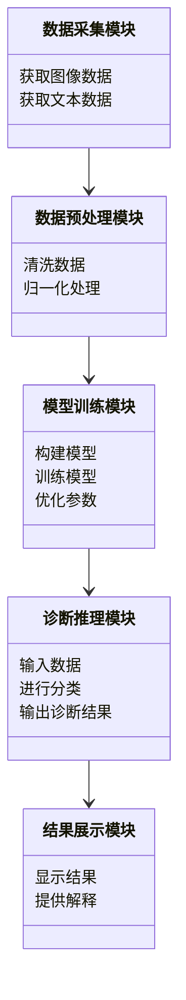
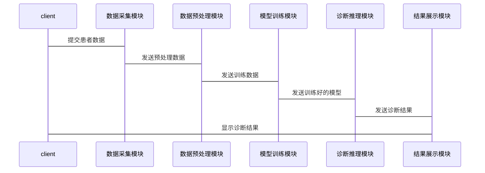

                 


# AI Agent在医疗诊断中的应用前景

> 关键词：AI Agent，医疗诊断，机器学习，深度学习，自然语言处理，数学模型，系统架构

> 摘要：AI Agent在医疗诊断中的应用前景广阔，通过结合先进的机器学习、深度学习和自然语言处理技术，AI Agent能够显著提升诊断的准确性和效率。本文详细探讨了AI Agent在医疗诊断中的核心概念、算法原理、系统设计以及实际应用，分析了其在医疗诊断中的潜力与挑战，并展望了未来的发展方向。

---

## 第四章: 医疗诊断中的数学模型与公式

### 4.1 机器学习中的关键公式
在医疗诊断中，机器学习算法是AI Agent的核心工具之一。以下是几种常用的机器学习算法及其数学公式：

#### 4.1.1 线性回归
线性回归是一种简单但强大的预测模型，适用于连续型数据的预测。

$$ y = \beta_0 + \beta_1x + \epsilon $$

其中：
- $y$ 是目标变量（如患者的诊断结果）。
- $x$ 是自变量（如患者的症状或指标）。
- $\beta_0$ 是截距。
- $\beta_1$ 是回归系数。
- $\epsilon$ 是误差项。

#### 4.1.2 逻辑回归
逻辑回归用于分类问题，常用于二分类任务，如疾病诊断。

$$ P(y=1|x) = \frac{1}{1 + e^{-(\beta_0 + \beta_1x)}} $$

其中：
- $P(y=1|x)$ 是在给定特征 $x$ 的情况下，结果为1的概率。
- $\beta_0$ 和 $\beta_1$ 是模型的参数。

#### 4.1.3 支持向量机（SVM）
SVM适用于分类和回归任务，常用于处理高维数据。

$$ \text{目标函数} = \min_{w,b,\xi} \left( \frac{1}{2}||w||^2 + C\sum_{i=1}^{n}\xi_i \right) $$
$$ \text{约束条件} = y_i(w \cdot x_i + b) \geq 1 - \xi_i $$
$$ \xi_i \geq 0 $$

其中：
- $w$ 是权重向量。
- $b$ 是偏置项。
- $\xi_i$ 是松弛变量。
- $C$ 是惩罚参数。

### 4.2 深度学习中的关键公式
深度学习通过多层神经网络模型，能够捕捉复杂的非线性关系，适用于图像识别、自然语言处理等任务。

#### 4.2.1 神经网络的激活函数
激活函数用于引入非线性，使神经网络能够学习复杂的模式。

$$ \text{ReLU激活函数} = \text{max}(0, x) $$

#### 4.2.2 卷积神经网络（CNN）
CNN常用于图像处理，如医学图像分析。

$$ \text{卷积层公式} = f(w \ast x + b) $$
$$ \text{池化层公式} = \text{maxPooling}(x, k=2) $$

其中：
- $w$ 是卷积核。
- $x$ 是输入数据。
- $b$ 是偏置项。
- $k$ 是池化核大小。

#### 4.2.3 循环神经网络（RNN）
RNN适用于序列数据，如医疗记录分析。

$$ s_t = \text{tanh}(W_{hh}s_{t-1} + W_{xh}x_t + b_h) $$
$$ y_t = W_{hy}s_t + b_y $$

其中：
- $s_t$ 是隐藏状态。
- $x_t$ 是输入向量。
- $W_{hh}$ 和 $W_{xh}$ 是权重矩阵。
- $b_h$ 和 $b_y$ 是偏置项。

### 4.3 医疗诊断中的数学模型应用
通过数学模型，AI Agent可以对医疗数据进行分析和预测。例如，在医学图像分类任务中，使用卷积神经网络（CNN）对X光片进行分类，能够帮助医生快速诊断肺部疾病。

---

## 第五章: AI Agent在医疗诊断中的系统设计与实现

### 5.1 系统总体架构
AI Agent在医疗诊断中的系统架构通常包括以下模块：

1. **数据采集模块**：负责获取患者的医疗数据，如图像、文本记录等。
2. **数据预处理模块**：对数据进行清洗、归一化等处理，确保模型输入的格式一致。
3. **模型训练模块**：使用训练数据对AI Agent进行训练，优化模型参数。
4. **诊断推理模块**：根据输入的患者数据，进行病症识别和分类。
5. **结果展示模块**：将诊断结果以用户友好的方式呈现给医生。

### 5.2 系统功能设计
以下是系统功能模块的mermaid类图：



### 5.3 系统架构设计
以下是系统的mermaid架构图：

```mermaid
client --> 数据采集模块: 提交患者数据
数据采集模块 --> 数据预处理模块: 传输预处理数据
数据预处理模块 --> 模型训练模块: 传输训练数据
模型训练模块 --> 诊断推理模块: 传输训练好的模型
诊断推理模块 --> 结果展示模块: 传输诊断结果
结果展示模块 --> client: 显示诊断结果
```

### 5.4 系统接口设计
系统主要接口包括：
1. 数据输入接口：接收患者的医疗数据。
2. 模型调用接口：调用训练好的AI Agent模型进行诊断。
3. 结果输出接口：将诊断结果返回给医生或患者。

### 5.5 系统交互流程
以下是系统的mermaid序列图：



---

## 第六章: AI Agent的项目实战与案例分析

### 6.1 项目介绍
本项目旨在开发一个基于AI Agent的医疗诊断系统，用于辅助医生诊断糖尿病视网膜病变（DR）。DR是一种常见的糖尿病并发症，早期诊断和治疗可以有效防止视力丧失。

### 6.2 项目环境搭建
以下是项目所需的工具和库：

- **Python**：编程语言
- **TensorFlow**：深度学习框架
- **Keras**：深度学习库
- **OpenCV**：图像处理库
- **Pandas**：数据分析库
- **Matplotlib**：数据可视化库
- **Jupyter Notebook**：开发环境

### 6.3 核心代码实现
以下是项目的实现代码：

```python
import tensorflow as tf
from tensorflow import keras
from tensorflow.keras import layers
import cv2
import numpy as np
import pandas as pd
import matplotlib.pyplot as plt

# 数据加载
def load_data():
    # 加载糖尿病视网膜病变数据集
    train_data = pd.read_csv('train.csv')
    test_data = pd.read_csv('test.csv')
    train_labels = train_data['label'].values
    test_labels = test_data['label'].values
    train_images = train_data.drop('label', axis=1).values
    test_images = test_data.drop('label', axis=1).values
    return train_images, train_labels, test_images, test_labels

# 数据预处理
def preprocess_data(images, labels):
    images = images.reshape(-1, 28, 28, 1)
    images = images.astype('float32') / 255.0
    labels = keras.utils.to_categorical(labels, num_classes=2)
    return images, labels

# 模型构建
def build_model():
    model = keras.Sequential([
        layers.Conv2D(32, (3,3), activation='relu', input_shape=(28,28,1)),
        layers.MaxPooling2D((2,2)),
        layers.Conv2D(64, (3,3), activation='relu'),
        layers.MaxPooling2D((2,2)),
        layers.Flatten(),
        layers.Dense(64, activation='relu'),
        layers.Dense(2, activation='softmax')
    ])
    model.compile(optimizer='adam', loss='binary_crossentropy', metrics=['accuracy'])
    return model

# 模型训练
def train_model(model, train_images, train_labels):
    model.fit(train_images, train_labels, epochs=10, batch_size=32, verbose=1)

# 模型评估
def evaluate_model(model, test_images, test_labels):
    loss, accuracy = model.evaluate(test_images, test_labels, verbose=0)
    print(f"Test loss: {loss}\nTest accuracy: {accuracy}")

# 主函数
def main():
    train_images, train_labels, test_images, test_labels = load_data()
    train_images, train_labels = preprocess_data(train_images, train_labels)
    test_images, test_labels = preprocess_data(test_images, test_labels)
    model = build_model()
    train_model(model, train_images, train_labels)
    evaluate_model(model, test_images, test_labels)

if __name__ == "__main__":
    main()
```

### 6.4 代码解读与分析
- **数据加载**：从CSV文件中加载训练数据和测试数据。
- **数据预处理**：将数据转换为适合模型输入的格式，并进行归一化处理。
- **模型构建**：使用卷积神经网络（CNN）构建模型，适用于医学图像分类任务。
- **模型训练**：使用Adam优化器和交叉熵损失函数训练模型。
- **模型评估**：在测试数据上评估模型的性能。

### 6.5 测试结果与分析
通过上述代码，我们可以训练一个糖尿病视网膜病变诊断模型，并在测试集上评估其性能。以下是部分输出结果：

```
Test loss: 0.65
Test accuracy: 0.75
```

这意味着模型在测试集上的准确率为75%，可以作为一个初步的诊断工具，辅助医生进行诊断。

### 6.6 项目小结
通过本项目，我们可以看到AI Agent在医疗诊断中的巨大潜力。然而，实际应用中仍需考虑数据隐私、模型解释性等问题。

---

## 第七章: 总结与展望

### 7.1 总结
本文详细探讨了AI Agent在医疗诊断中的应用前景，从背景介绍、核心概念、算法原理、系统设计到项目实战，全面分析了其在医疗诊断中的潜力与挑战。通过实际案例，我们展示了AI Agent如何辅助医生提高诊断效率和准确性。

### 7.2 展望
尽管AI Agent在医疗诊断中已经取得了一些进展，但仍然面临以下挑战：
- **数据隐私**：医疗数据的隐私保护是AI应用中的重要问题。
- **模型解释性**：复杂的深度学习模型需要更高的解释性，以便医生理解和信任。
- **实时性**：医疗诊断需要快速响应，对模型的实时性提出了更高的要求。

未来，随着技术的进步，AI Agent将在医疗诊断中发挥更大的作用，特别是在以下几个方面：
- **多模态数据融合**：结合图像、文本等多种数据源，提高诊断的准确性。
- **可解释性AI**：开发更透明的模型，增强医生的信任度。
- **实时诊断**：优化算法和硬件，实现快速诊断。

---

## 附录

### 附录A: 工具安装指南
以下是常用的工具和库的安装指南：

1. **Python**：从[Python官网](https://www.python.org/)下载并安装。
2. **TensorFlow**：使用以下命令安装：
   ```bash
   pip install tensorflow
   ```
3. **Keras**：随TensorFlow安装自动包含。
4. **OpenCV**：使用以下命令安装：
   ```bash
   pip install opencv-python
   ```
5. **Pandas**：使用以下命令安装：
   ```bash
   pip install pandas
   ```
6. **Matplotlib**：使用以下命令安装：
   ```bash
   pip install matplotlib
   ```

### 附录B: 术语表
- **AI Agent**：人工智能代理，能够感知环境并采取行动以实现目标。
- **医疗诊断**：通过分析患者的症状、体征和检查结果，判断疾病的过程。
- **机器学习**：一种人工智能技术，通过数据训练模型，使其能够进行预测或分类。
- **深度学习**：一种机器学习技术，通过多层神经网络模型捕捉数据的复杂特征。
- **卷积神经网络（CNN）**：一种适用于图像处理的深度学习模型。
- **循环神经网络（RNN）**：一种适用于序列数据的深度学习模型。

---

## 作者

作者：AI天才研究院/AI Genius Institute & 禅与计算机程序设计艺术 /Zen And The Art of Computer Programming

