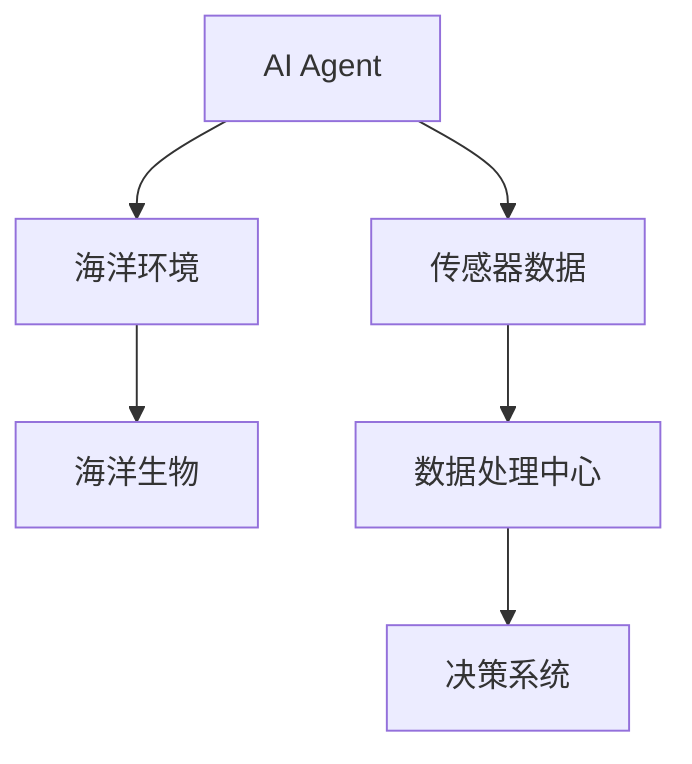
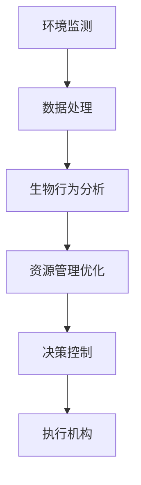
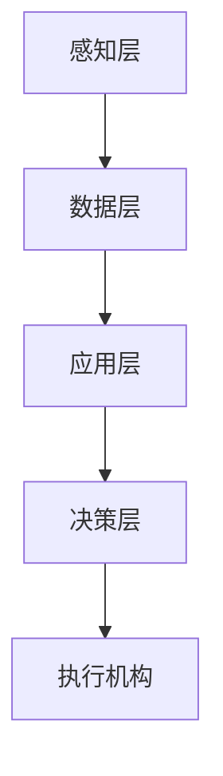
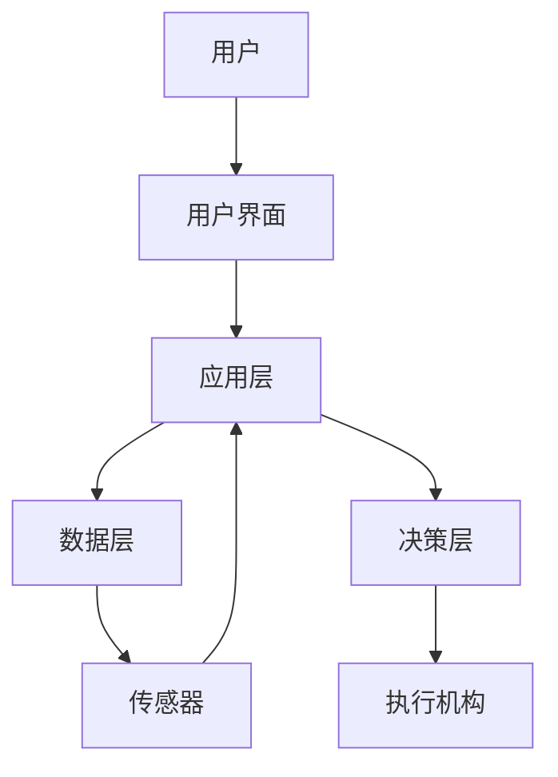

                 


# AI Agent在智能海洋生态保护中的实践

> 关键词：AI Agent, 智能海洋生态保护, 环境监测, 海洋生物行为分析, 资源管理优化

> 摘要：随着海洋环境问题的日益严重，利用AI Agent技术实现智能海洋生态保护成为了一个重要的研究方向。本文将从AI Agent的核心概念出发，深入分析其在海洋生态保护中的应用场景、算法原理与实现、系统架构设计以及项目实战，为读者提供一个全面的技术视角。

---

# 第1章: AI Agent与智能海洋生态保护概述

## 1.1 AI Agent的基本概念

### 1.1.1 AI Agent的定义与特征

AI Agent（人工智能代理）是指能够感知环境、自主决策并采取行动以实现特定目标的智能实体。AI Agent的核心特征包括：

- **智能性**：能够通过感知和学习理解环境。
- **自主性**：无需外部干预，自主完成任务。
- **反应性**：能够实时感知环境变化并做出反应。
- **协作性**：能够在多智能体环境中与其他Agent协作完成复杂任务。

### 1.1.2 AI Agent的核心技术原理

AI Agent的技术实现依赖于知识表示、推理、规划和学习等核心模块。知识表示是AI Agent理解世界的基础，推理是基于知识进行逻辑推导，规划是制定行动方案，学习是通过经验优化性能。

### 1.1.3 AI Agent在海洋生态保护中的应用潜力

AI Agent技术在海洋生态保护中的应用潜力巨大。例如，AI Agent可以用于海洋环境监测、海洋生物行为分析、海洋资源管理优化等领域。

## 1.2 智能海洋生态保护的背景与挑战

### 1.2.1 海洋生态保护的重要性

海洋是地球上最大的生态系统，承担着调节气候、提供食物资源等功能。然而，海洋污染、过度捕捞、海洋酸化等问题严重威胁着海洋生态系统的健康。

### 1.2.2 传统海洋保护的局限性

传统海洋保护方法主要依赖人工监测和管理，存在效率低、覆盖范围有限、实时性差等问题。例如，人工监测海洋污染需要大量的人力和时间，且难以实现对广袤海洋区域的全面覆盖。

### 1.2.3 AI技术在海洋保护中的独特优势

AI技术能够通过大数据分析、实时监测、智能决策等方式，显著提高海洋保护的效率和精准度。AI Agent可以在海洋环境中自主工作，实时感知环境变化，并根据任务目标做出最优决策。

## 1.3 AI Agent在海洋生态保护中的应用场景

### 1.3.1 海洋环境监测与预警

AI Agent可以部署在海洋环境中，实时监测水质、温度、盐度等环境参数。当监测到异常数据时，AI Agent可以触发预警机制，通知相关部门采取行动。

### 1.3.2 海洋生物行为分析与保护

AI Agent可以用于监测海洋生物的行为，例如跟踪濒危物种的迁徙路径、分析鱼类的聚集区域等。通过AI Agent的实时监测，可以制定更有效的保护措施。

### 1.3.3 海洋资源管理与优化

AI Agent可以通过分析海洋资源分布数据，优化捕捞区域和捕捞量，避免过度捕捞。同时，AI Agent还可以帮助规划海洋保护区，保护海洋生态系统的多样性。

## 1.4 本章小结

本章介绍了AI Agent的基本概念、核心技术原理及其在海洋生态保护中的应用潜力。通过分析传统海洋保护的局限性，突出了AI技术在海洋保护中的独特优势，并详细阐述了AI Agent在海洋环境监测、生物行为分析和资源管理中的应用场景。

---

# 第2章: AI Agent的核心概念与原理

## 2.1 AI Agent的核心概念

### 2.1.1 知识表示与推理

知识表示是AI Agent理解世界的基础。常用的知识表示方法包括逻辑推理和概率推理。逻辑推理通过形式化逻辑表达知识，例如命题逻辑和一阶逻辑。概率推理则通过概率模型描述知识的不确定性。

### 2.1.2 行为规划与决策

行为规划是AI Agent制定行动方案的过程。基于强化学习的决策算法是一种常用方法，通过奖励机制优化Agent的行为策略。例如，Q-learning算法是一种经典的强化学习算法，适用于离散动作空间的决策问题。

### 2.1.3 多智能体协作

多智能体协作是AI Agent在复杂环境中完成任务的重要能力。一致性协议是一种常见的协作方法，通过让多个智能体达成一致来实现协作。例如，分布式一致性算法可以用于多智能体的协作决策。

## 2.2 AI Agent的属性特征对比

| 特性         | 智能性       | 自主性       | 反应性       | 协作性       |
|--------------|--------------|--------------|--------------|--------------|
| 描述         | 能够理解环境 | 能够自主决策 | 能够实时反应 | 能够与其他Agent协作 |
| 对比分析     | 智能性是基础，自主性和反应性是表现形式，协作性是高级能力 |

## 2.3 实体关系与系统架构



上图展示了AI Agent在海洋生态保护系统中的实体关系。AI Agent通过传感器数据感知海洋环境，并与海洋生物互动。数据处理中心对传感器数据进行分析，生成决策指令，指导AI Agent执行任务。

## 2.4 本章小结

本章深入探讨了AI Agent的核心概念，包括知识表示与推理、行为规划与决策、多智能体协作等。通过对比分析和实体关系图，展示了AI Agent在海洋生态保护系统中的作用和位置。

---

# 第3章: AI Agent的算法原理与实现

## 3.1 知识表示与推理算法

### 3.1.1 逻辑推理算法

逻辑推理是AI Agent理解环境的基础。命题逻辑通过原子命题和逻辑连接词表示知识，例如：

$$ (A \land B) \rightarrow C $$

一阶逻辑则引入了谓词和量词，例如：

$$ \forall x (P(x) \rightarrow Q(x)) $$

### 3.1.2 概率推理算法

概率推理用于处理知识的不确定性。贝叶斯网络是一种常用的概率推理模型，通过概率分布描述变量之间的关系。

### 3.1.3 图模型表示

图模型是知识表示的重要工具。例如，马尔可夫链是一种用于表示动态系统状态转移的图模型。

## 3.2 行为规划与决策算法

### 3.2.1 基于强化学习的决策

强化学习是一种通过试错优化行为策略的方法。Q-learning算法是一种经典的强化学习算法，其核心公式为：

$$ Q(s, a) = Q(s, a) + \alpha [r + \gamma \max Q(s', a') - Q(s, a)] $$

其中，\( Q(s, a) \) 表示在状态 \( s \) 下执行动作 \( a \) 的价值，\( \alpha \) 是学习率，\( r \) 是奖励，\( \gamma \) 是折扣因子。

### 3.2.2 基于Dijkstra算法的路径规划

Dijkstra算法是一种用于求解最短路径的算法，适用于静态环境下的路径规划问题。算法步骤如下：

1. 初始化起点的优先队列。
2. 取出队列中距离起点最近的节点。
3. 更新该节点的邻居节点的距离。
4. 重复上述步骤，直到队列为空或找到目标节点。

### 3.2.3 多目标优化算法

多目标优化算法用于在多个目标之间找到折中的解。例如，加权和法是一种常见的多目标优化方法，其目标函数表示为：

$$ f(x) = \sum_{i=1}^{n} w_i f_i(x) $$

其中，\( w_i \) 是目标 \( f_i \) 的权重。

## 3.3 多智能体协作算法

### 3.3.1 基于一致性协议的协作

一致性协议是一种用于多智能体协作的算法。例如，Paxos算法是一种分布式一致性算法，用于在分布式系统中达成一致。

### 3.3.2 基于博弈论的协作

博弈论是一种分析多智能体协作的数学工具。纳什均衡是一种常见的博弈论概念，表示在策略均衡的情况下，没有任何单个智能体能够通过单方面改变策略而提高自身收益。

### 3.3.3 分布式协作算法

分布式协作算法通过局部信息实现全局协作。例如，分布式路由算法是一种常见的分布式协作算法，用于网络中的数据路由。

## 3.4 算法实现与优化

### 3.4.1 算法实现的数学模型

AI Agent的算法实现依赖于数学模型。例如，强化学习的数学模型可以表示为：

$$ Q(s, a) = \mathbb{E}[r_t + \gamma Q(s', a')] $$

### 3.4.2 算法优化策略

算法优化策略包括参数调整、算法加速等。例如，经验回放是一种常用的强化学习优化策略，通过存储和复用历史经验来加速学习。

### 3.4.3 算法实现的Python代码示例

以下是Q-learning算法的Python实现示例：

```python
class QLearning:
    def __init__(self, state_space, action_space, learning_rate=0.1, gamma=0.9):
        self.state_space = state_space
        self.action_space = action_space
        self.lr = learning_rate
        self.gamma = gamma
        self.q_table = defaultdict(lambda: defaultdict(float))

    def choose_action(self, state, epsilon=0.1):
        if np.random.random() < epsilon:
            return np.random.choice(self.action_space)
        else:
            return max(self.q_table[state], key=lambda k: self.q_table[state][k])

    def learn(self, state, action, reward, next_state):
        current_q = self.q_table[state][action]
        next_max_q = max(self.q_table[next_state].values())
        target = reward + self.gamma * next_max_q
        self.q_table[state][action] += self.lr * (target - current_q)
```

## 3.5 本章小结

本章详细讲解了AI Agent的核心算法，包括知识表示与推理、行为规划与决策、多智能体协作等。通过数学模型和Python代码示例，展示了这些算法的实现细节和优化策略。

---

# 第4章: 系统架构与设计

## 4.1 系统功能设计

### 4.1.1 系统功能模块

智能海洋生态保护系统主要包括以下几个功能模块：

1. **环境监测模块**：实时监测海洋环境参数，如温度、盐度、溶解氧等。
2. **生物行为分析模块**：分析海洋生物的行为模式，如迁徙路径、聚集区域等。
3. **资源管理模块**：优化海洋资源的利用，如捕捞区域规划、保护区划分等。
4. **决策控制模块**：根据监测数据和分析结果，制定决策指令并控制执行机构。

### 4.1.2 系统功能流程

以下是系统的功能流程图：



## 4.2 系统架构设计

### 4.2.1 系统架构

智能海洋生态保护系统的架构设计采用分层结构，包括感知层、数据层、应用层和决策层。

- **感知层**：通过传感器获取海洋环境数据。
- **数据层**：对感知数据进行存储和管理。
- **应用层**：实现环境监测、生物行为分析等功能。
- **决策层**：根据分析结果制定决策指令。

### 4.2.2 系统架构图



## 4.3 系统接口设计

### 4.3.1 系统接口

智能海洋生态保护系统需要与多种外部系统进行交互，例如：

1. **传感器接口**：与海洋传感器设备通信，获取环境数据。
2. **数据库接口**：与数据存储系统交互，存储和检索数据。
3. **用户界面**：提供人机交互界面，供用户查看监测数据和管理系统。

### 4.3.2 系统交互图

以下是系统的交互流程图：



## 4.4 本章小结

本章详细设计了智能海洋生态保护系统的架构，包括功能模块、系统架构、接口设计等。通过分层设计和系统交互图，展示了系统的整体结构和工作流程。

---

# 第5章: 项目实战

## 5.1 环境安装与配置

### 5.1.1 系统需求

安装智能海洋生态保护系统需要以下硬件和软件：

- **硬件需求**：计算机、传感器设备、网络通信设备等。
- **软件需求**：Python编程环境、相关库（如NumPy、Pandas、Scikit-learn）等。

### 5.1.2 环境配置

以下是Python环境配置示例：

```bash
pip install numpy pandas scikit-learn
```

## 5.2 系统核心实现

### 5.2.1 环境监测模块实现

以下是环境监测模块的Python代码实现：

```python
import numpy as np
import pandas as pd

class EnvironmentMonitor:
    def __init__(self, sensors):
        self.sensors = sensors

    def monitor(self):
        data = [s.read() for s in self.sensors]
        return pd.DataFrame(data)
```

### 5.2.2 生物行为分析模块实现

以下是生物行为分析模块的Python代码实现：

```python
from sklearn.cluster import KMeans

class BehaviorAnalyzer:
    def __init__(self, data):
        self.data = data

    def analyze(self):
        # 使用K-means算法进行聚类分析
        model = KMeans(n_clusters=3)
        model.fit(self.data)
        return model.labels_
```

### 5.2.3 资源管理模块实现

以下是资源管理模块的Python代码实现：

```python
import numpy as np

class ResourceManager:
    def __init__(self, data):
        self.data = data

    def optimize(self):
        # 使用线性规划优化资源分配
        pass
```

## 5.3 项目实战案例分析

### 5.3.1 案例背景

假设我们有一个海洋保护区，需要通过AI Agent技术优化保护区的管理。

### 5.3.2 数据收集与预处理

通过海洋传感器收集水质数据，如温度、盐度、溶解氧等，并进行数据清洗和特征提取。

### 5.3.3 算法实现与验证

使用强化学习算法对AI Agent的行为进行训练，验证算法在不同环境下的表现。

### 5.3.4 结果分析

通过实验结果分析，优化AI Agent的参数设置，提高系统的性能和效率。

## 5.4 本章小结

本章通过一个实际案例展示了AI Agent在智能海洋生态保护中的应用。通过环境安装、系统实现和案例分析，详细介绍了如何利用AI技术优化海洋保护工作。

---

# 第6章: 总结与展望

## 6.1 本章总结

本文详细探讨了AI Agent在智能海洋生态保护中的应用场景、算法原理与实现、系统架构设计以及项目实战。通过理论分析和实际案例，展示了AI技术在海洋保护中的巨大潜力。

## 6.2 未来展望

随着AI技术的不断发展，AI Agent在海洋生态保护中的应用将更加广泛和深入。未来的研究方向包括：

1. **多智能体协作优化**：进一步研究多智能体协作算法，提高系统的协作效率。
2. **强化学习算法优化**：探索更高效的强化学习算法，提升AI Agent的决策能力。
3. **实时监测技术**：发展更先进的传感器技术和数据处理方法，实现更高精度的环境监测。

## 6.3 最佳实践 tips

- 在实际应用中，建议结合具体需求选择合适的AI算法。
- 系统设计时，要注意模块化设计，便于后续优化和扩展。
- 数据预处理是关键，要确保数据的准确性和完整性。

## 6.4 本章小结

本章总结了全文的主要内容，并展望了未来的研究方向。同时，提供了一些实际应用中的最佳实践建议。

---

# 作者：AI天才研究院 & 禅与计算机程序设计艺术

---

以上是《AI Agent在智能海洋生态保护中的实践》的技术博客文章的完整目录大纲和部分内容。

