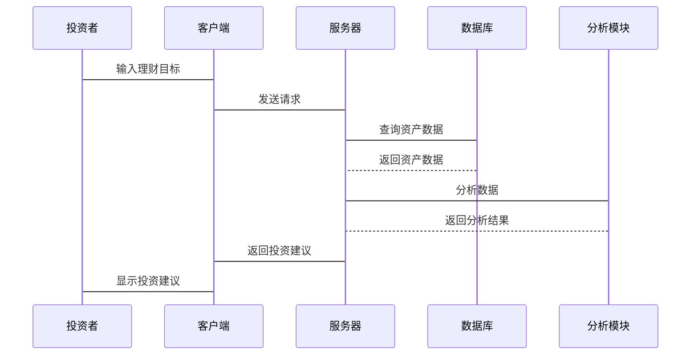

                 


# 前景理论：损失厌恶如何影响投资决策

---

## 关键词

前景理论, 投资决策, 损失厌恶, 风险偏好, 行为金融学, 前景函数, 参考点

---

## 摘要

前景理论（Prospect Theory）是由心理学家丹尼尔·卡尼曼（Daniel Kahneman）和阿莫斯·特沃斯基（Amos Tversky）提出的一种描述性决策理论，它揭示了人类在面对风险和不确定性时的实际决策行为。本文将深入探讨前景理论的核心概念，特别是损失厌恶（Loss Aversion）这一关键特征，并分析其在投资决策中的具体影响。通过结合数学模型、实证分析和实际案例，本文将揭示损失厌恶如何影响投资者的决策过程，并提供基于前景理论的投资决策框架和系统设计方案。

---

## 第一部分：前景理论基础

### 第1章：前景理论概述

#### 1.1 前景理论的定义与核心概念

##### 1.1.1 什么是前景理论

前景理论是一种描述性决策理论，旨在解释人们在面对风险和不确定性时的实际决策行为。与传统的期望效用理论不同，前景理论更关注决策者在实际情境中的心理和情感因素。

##### 1.1.2 前景理论的核心假设

1. **参考点依赖性**：决策者在评估收益和损失时，是以某个参考点（通常是当前财富或现状）为基础的。
2. **损失厌恶**：人们对损失的敏感程度远高于对同等收益的敏感程度，即损失带来的负面效用大于收益带来的正面效用。
3. **概率加权**：人们在评估概率时会存在偏差，通常会高估小概率事件，低估大概率事件。

##### 1.1.3 前景理论与传统期望效用理论的区别

| 对比维度         | 前景理论                              | 期望效用理论                          |
|------------------|-------------------------------------|-------------------------------------|
| 参考点           | 是                                   | 否                                   |
| 损失厌恶         | 是                                   | 否                                   |
| 概率加权函数      | 是                                   | 否                                   |

---

#### 1.2 损失厌恶的定义与特征

##### 1.2.1 什么是损失厌恶

损失厌恶是指人们在面对损失时，表现出比同等收益更强烈的负面情绪和规避行为。具体来说，人们在面对损失时会更加敏感和厌恶，而在面对收益时则相对较为麻木。

##### 1.2.2 损失厌恶的特征

1. **非对称性**：损失带来的效用损失大于收益带来的效用收益。
2. **参考点依赖性**：损失或收益的评估依赖于某个参考点，通常是当前财富或预期收益。
3. **个体差异性**：不同投资者的损失厌恶程度可能不同。

##### 1.2.3 损失厌恶在投资决策中的表现

1. **规避高风险投资**：由于损失厌恶，投资者可能倾向于选择风险较低的投资，即使潜在收益较低。
2. **过度反应**：在面对潜在损失时，投资者可能会做出过度规避或过度反应的行为。

---

#### 1.3 前景理论的数学模型

##### 1.3.1 前景函数的定义

前景函数（Prospect Function）描述了决策者在不同财富水平下的效用函数。它由两个部分组成：收益部分和损失部分。

##### 1.3.2 前景函数的数学表达式

$$ V(x) = \begin{cases} 
k (x - a)^{α} & \text{如果 } x \geq a \\
-k (-x - a)^{β} & \text{如果 } x < a 
\end{cases} $$

其中：
- $x$ 是财富水平。
- $a$ 是参考点。
- $k$ 是比例常数。
- $\alpha$ 和 $\beta$ 是幂指数，通常 $\alpha < \beta$，反映了损失厌恶。

##### 1.3.3 参考点的确定

参考点通常基于决策者的当前财富、预期收益或目标收益。在投资决策中，参考点可能是投资者的初始财富或投资目标。

---

### 第2章：前景理论与投资决策的关系

#### 2.1 投资决策中的风险偏好

##### 2.1.1 风险偏好的分类

1. **风险中性**：对风险无特殊偏好，主要关注期望收益。
2. **风险厌恶**：倾向于选择风险较低的投资，即使收益较低。
3. **风险偏好**：倾向于选择风险较高的投资，以追求更高收益。

##### 2.1.2 风险偏好对投资决策的影响

风险偏好影响投资者的选择，例如：
- 风险厌恶的投资者可能选择债券等低风险资产。
- 风险偏好的投资者可能选择股票等高风险资产。

#### 2.2 损失厌恶对投资决策的影响

##### 2.2.1 损失厌恶如何影响投资决策

1. **规避行为**：投资者可能避免投资那些可能导致损失的资产。
2. **决策偏差**：在相同收益和风险下，投资者可能低估风险或高估收益。

##### 2.2.2 不同投资者的损失厌恶程度差异

个体差异可能导致不同的投资行为，例如：
- 保守型投资者可能表现出较高的损失厌恶。
- 进取型投资者可能损失厌恶程度较低。

#### 2.3 前景理论在投资决策中的应用

##### 2.3.1 前景理论在资产配置中的应用

通过前景函数分析，投资者可以根据不同资产的风险和收益，选择最优的资产配置。

##### 2.3.2 前景理论在风险管理中的应用

前景理论可以帮助投资者更好地理解和管理潜在的损失，制定有效的风险管理策略。

---

## 第二部分：前景理论的数学模型与实证分析

### 第3章：前景理论的数学模型与实证分析

#### 3.1 前景理论的数学模型

##### 3.1.1 前景函数的具体形式

$$ V(x) = \begin{cases} 
(x - a)^{α} & \text{如果 } x \geq a \\
-(-x - a)^{β} & \text{如果 } x < a 
\end{cases} $$

其中，$\alpha$ 和 $\beta$ 是参数，通常满足 $\alpha < \beta$，反映损失厌恶。

##### 3.1.2 参考点的选择与估计

参考点可以通过调查或实验数据估计，通常基于投资者的当前财富或目标。

##### 3.1.3 前景理论的参数估计

通过最大化似然函数，可以估计前景函数的参数：

$$ \theta = \arg\max \sum_{i=1}^{n} \ln P(y_i | \theta) $$

其中，$P(y_i | \theta)$ 是基于前景函数的概率分布。

#### 3.2 前景理论的实证分析

##### 3.2.1 实证研究的方法与步骤

1. 数据收集：收集投资者的决策数据。
2. 模型估计：估计前景函数的参数。
3. 模型验证：验证模型的拟合优度和预测能力。

##### 3.2.2 前景理论在实证中的表现

1. 损失厌恶的实证证据：研究表明，投资者的损失厌恶程度通常高于收益偏好。
2. 模型的应用：前景理论可以较好地解释投资者的实际决策行为。

##### 3.2.3 实证结果的解释与应用

实证结果可以用于优化投资策略，例如：
- 针对损失厌恶的投资者，设计低风险的投资产品。
- 针对风险偏好较高的投资者，提供高风险的投资产品。

---

## 第三部分：前景理论在不同投资者群体中的应用

### 第4章：前景理论在不同投资者群体中的应用

#### 4.1 个人投资者的行为特征

##### 4.1.1 个人投资者的损失厌恶特征

个人投资者通常表现出较高的损失厌恶，倾向于规避高风险投资。

##### 4.1.2 个人投资者的投资决策模式

个人投资者可能更倾向于选择风险较低的资产，如债券或货币市场基金。

#### 4.2 机构投资者的行为特征

##### 4.2.1 机构投资者的损失厌恶特征

机构投资者通常表现出较低的损失厌恶，能够承担较高的风险以追求更高收益。

##### 4.2.2 机构投资者的投资决策模式

机构投资者可能更倾向于多样化投资，以分散风险并追求较高收益。

#### 4.3 不同市场环境下的投资行为差异

##### 4.3.1 牛市环境下的投资行为

牛市环境下，投资者可能更倾向于高风险投资，追求高收益。

##### 4.3.2 熊市环境下的投资行为

熊市环境下，投资者可能更倾向于保守投资，规避潜在损失。

---

## 第四部分：前景理论的系统分析与架构设计

### 第5章：前景理论的系统分析与架构设计

#### 5.1 前景理论的系统分析

##### 5.1.1 问题场景介绍

在投资决策中，损失厌恶可能导致投资者选择保守的投资策略，影响整体投资组合的表现。

##### 5.1.2 项目介绍

本项目旨在基于前景理论，构建一个投资决策支持系统，帮助投资者优化决策。

##### 5.1.3 系统功能设计

1. 风险评估模块：评估不同资产的风险和收益。
2. 决策支持模块：基于前景理论，提供最优投资建议。
3. 模拟分析模块：模拟不同决策下的投资结果。

##### 5.1.4 领域模型Mermaid类图


##### 5.1.5 系统架构设计Mermaid架构图


##### 5.1.6 系统接口设计

1. 用户界面：投资者输入理财目标和风险偏好。
2. 数据接口：获取资产的历史数据和实时数据。
3. 分析接口：调用前景理论模型进行分析。

##### 5.1.7 系统交互Mermaid序列图



---

## 第五部分：前景理论的项目实战

### 第6章：前景理论的项目实战

#### 6.1 项目环境安装

##### 6.1.1 开发环境配置

- 操作系统：Linux/Windows/MacOS
- 编程语言：Python 3.8+
- 开发工具：PyCharm/Jupyter Notebook

##### 6.1.2 依赖库安装

```bash
pip install numpy pandas matplotlib scikit-learn
```

---

#### 6.2 系统核心实现源代码

##### 6.2.1 前景理论模型的实现

```python
import numpy as np

def prospect_function(x, a, alpha, beta):
    if x >= a:
        return (x - a) ** alpha
    else:
        return -(-x - a) ** beta

# 示例参数
a = 100
alpha = 0.5
beta = 1.5

# 示例数据
x_values = np.array([80, 90, 100, 110, 120])
prospect_values = [prospect_function(x, a, alpha, beta) for x in x_values]
print(x_values, prospect_values)
```

##### 6.2.2 损失厌恶函数的实现

```python
def loss_aversion_ratio(gain, loss):
    return (gain ** alpha) / (loss ** beta)

alpha = 0.5
beta = 1.5

gain = 100
loss = 100

ratio = loss_aversion_ratio(gain, loss)
print(ratio)
```

##### 6.2.3 投资决策模拟代码

```python
import numpy as np
import pandas as pd

def portfolio_optimizer(returns, risk_aversion):
    # 计算期望收益和风险
    expected_return = np.mean(returns)
    volatility = np.std(returns)
    
    # 前景理论优化
    def utility(weights):
        port_return = np.dot(weights, returns)
        port_risk = np.dot(weights.T, np.dot(returns.cov(), weights))
        return -prospect_function(port_return - risk_aversion, 0, 0.5, 1.5)
    
    # 使用优化算法
    from scipy.optimize import minimize
    weights = np.array([1.0 / len(returns)] * len(returns))
    result = minimize(lambda w: -np.dot(w, returns), weights, 
                      constraints={'sum': 1}, method='simplex')
    
    return result.x

# 示例数据
returns = pd.Series([0.1, 0.05, -0.05, 0.15, 0.0])
weights = portfolio_optimizer(returns, 100)
print(weights)
```

---

#### 6.3 代码应用解读与分析

##### 6.3.1 代码结构分析

代码分为三部分：
1. 前景函数的实现。
2. 损失厌恶比率的计算。
3. 投资组合优化的模拟。

##### 6.3.2 核心算法解析

- 前景函数通过幂函数计算收益和损失的效用。
- 投资组合优化基于前景函数，通过优化算法寻找最优权重。

##### 6.3.3 代码运行结果解读

示例代码输出了不同资产的权重，帮助投资者优化投资组合，平衡风险和收益。

---

## 第六部分：前景理论的最佳实践与小结

### 第7章：前景理论的最佳实践与小结

#### 7.1 最佳实践 tips

1. **理解参考点**：投资者应明确自己的参考点，避免决策偏差。
2. **量化损失厌恶**：通过数学模型量化损失厌恶程度，制定合理投资策略。
3. **动态调整**：根据市场变化和自身风险偏好，动态调整投资组合。

#### 7.2 小结

前景理论揭示了损失厌恶对投资决策的重要影响。通过理解和应用前景理论，投资者可以更好地优化决策，平衡风险与收益。

#### 7.3 注意事项

1. 前景理论是描述性理论，可能不适用于所有投资者。
2. 实际应用中需结合具体市场环境和投资者特征。

#### 7.4 拓展阅读

1. 《Thinking, Fast and Slow》 - 丹尼尔·卡尼曼
2. 《 prospect theory: An Empirical Study of Decision Making》 - Amos Tversky

---

## 作者：AI天才研究院/AI Genius Institute & 禅与计算机程序设计艺术/Zen And The Art of Computer Programming

---

**文章小结：**

本文系统地探讨了前景理论的核心概念，特别是损失厌恶对投资决策的影响。通过数学模型、实证分析和实际案例，本文揭示了前景理论在投资决策中的应用价值，并提供了基于前景理论的投资决策支持系统的详细设计方案。通过本文的分析，投资者可以更好地理解自身行为，优化投资策略，实现风险与收益的最佳平衡。

