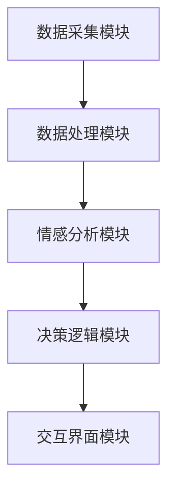

                 


# 开发具有情感计算能力的AI Agent

> 关键词：情感计算，AI Agent，情感分析，机器学习，深度学习

> 摘要：情感计算是一种通过计算机处理和识别人类情感的技术，而AI Agent是一种能够自主决策和执行任务的智能体。本文将探讨如何将情感计算应用于AI Agent的开发中，分析其核心算法、系统架构以及实际应用案例，帮助读者理解如何构建一个能够理解和处理人类情感的智能系统。

---

# 第一部分: 情感计算与AI Agent的背景与基础

## 第1章: 情感计算与AI Agent概述

### 1.1 情感计算的基本概念

#### 1.1.1 什么是情感计算
情感计算（Affective Computing）是计算机科学的一个分支，专注于理解和计算人类情感。通过分析面部表情、语调、语境和行为模式，情感计算可以识别和分类人类的情感状态，如快乐、悲伤、愤怒等。情感计算的核心目标是使计算机能够像人类一样理解和响应情感信息。

#### 1.1.2 情感计算的核心要素
情感计算涉及多个核心要素：
- **数据采集**：通过传感器或摄像头捕捉情感相关的数据。
- **特征提取**：从采集的数据中提取有用的特征，如语调、面部表情等。
- **情感识别**：利用算法对特征进行分析，识别出对应的情感状态。
- **情感推理**：基于识别的情感信息，进行情感推理和预测。

#### 1.1.3 情感计算的应用场景
情感计算的应用场景广泛，包括：
- **人机交互**：提升用户体验，使AI Agent能够更自然地与人类交互。
- **健康监测**：通过情感识别帮助诊断心理健康问题。
- **教育科技**：根据学生的情感状态调整教学策略。
- **市场营销**：分析消费者情感以优化产品设计和广告策略。

### 1.2 AI Agent的基本概念

#### 1.2.1 什么是AI Agent
AI Agent（人工智能代理）是一种能够感知环境并自主决策的智能体。AI Agent可以执行复杂任务，如信息检索、问题解决、决策制定等。与传统程序不同，AI Agent具有自主性、反应性和目标导向性。

#### 1.2.2 AI Agent的分类
AI Agent可以根据功能和智能水平分为以下几类：
- **反应式AI Agent**：基于当前感知做出实时反应。
- **认知式AI Agent**：具备高级推理和规划能力。
- **协作式AI Agent**：能够与其他Agent或人类协同工作。

#### 1.2.3 AI Agent的核心功能
AI Agent的核心功能包括：
- **感知环境**：通过传感器或接口获取环境信息。
- **决策制定**：基于感知信息做出决策。
- **执行动作**：根据决策执行相应的动作。
- **学习与适应**：通过学习不断优化自身性能。

### 1.3 情感计算与AI Agent的结合

#### 1.3.1 情感计算在AI Agent中的作用
情感计算为AI Agent提供了情感理解能力，使其能够更好地与人类交互。通过情感计算，AI Agent可以识别用户的情感状态，并根据情感信息调整交互策略。

#### 1.3.2 情感计算与AI Agent的协同工作
情感计算与AI Agent的协同工作包括以下几个方面：
- **情感识别**：AI Agent通过情感计算技术识别用户的情感状态。
- **情感驱动的决策**：AI Agent根据识别到的情感信息做出更智能的决策。
- **情感反馈**：AI Agent可以通过反馈机制让用户感受到其情感理解能力。

#### 1.3.3 情感计算AI Agent的优势
情感计算AI Agent的优势在于：
- **提升用户体验**：通过情感理解，AI Agent能够提供更个性化的服务。
- **增强交互能力**：情感计算使AI Agent能够更好地理解用户需求。
- **提高决策准确性**：情感信息可以辅助AI Agent做出更准确的决策。

### 1.4 本章小结

---

## 第2章: 情感计算的技术基础

### 2.1 情感分析的基本原理

#### 2.1.1 情感分析的定义
情感分析（Sentiment Analysis）是通过自然语言处理技术分析文本的情感倾向。情感分析可以帮助识别文本中的情感色彩，如正面、负面或中性。

#### 2.1.2 基于规则的情感分析
基于规则的情感分析通过预定义的规则和情感词典进行情感分类。例如，如果文本中包含大量正面词汇，则判定文本为正面情感。

#### 2.1.3 基于机器学习的情感分析
基于机器学习的情感分析利用训练好的模型对文本进行分类。常用算法包括支持向量机（SVM）和朴素贝叶斯（Naive Bayes）。

### 2.2 情感识别的技术方法

#### 2.2.1 基于文本的情感识别
基于文本的情感识别通过分析文本内容来判断情感。例如，通过分析社交媒体上的评论来判断用户的满意度。

#### 2.2.2 基于语音的情感识别
基于语音的情感识别通过分析语音的语调、音量和节奏来判断情感。例如，通过分析用户的语调来判断其是否生气。

#### 2.2.3 基于面部表情的情感识别
基于面部表情的情感识别通过分析面部表情来判断情感。例如，通过分析面部肌肉运动来识别快乐或悲伤。

### 2.3 情感推理的核心算法

#### 2.3.1 基于规则的情感推理
基于规则的情感推理通过预定义的规则进行情感推理。例如，如果用户说了“我非常满意”，则推理出用户的情感为正面。

#### 2.3.2 基于统计模型的情感推理
基于统计模型的情感推理利用统计方法对情感进行推理。例如，使用隐马尔可夫模型（HMM）进行情感分类。

#### 2.3.3 基于深度学习的情感推理
基于深度学习的情感推理利用神经网络模型进行情感推理。例如，使用卷积神经网络（CNN）或循环神经网络（RNN）进行情感分类。

### 2.4 本章小结

---

## 第3章: 情感数据的处理与建模

### 3.1 情感数据的获取与预处理

#### 3.1.1 数据来源
情感数据可以通过多种途径获取，包括：
- **文本数据**：如社交媒体评论、聊天记录等。
- **语音数据**：如音频记录、电话录音等。
- **面部表情数据**：如视频流、图像数据等。

#### 3.1.2 数据清洗
数据清洗是情感数据处理的重要步骤，包括：
- **去噪**：去除噪声数据，如异常值和重复数据。
- **标准化**：将数据格式统一，便于后续处理。

#### 3.1.3 数据标注
数据标注是对情感数据进行分类和标签化的过程。例如，将文本数据标注为正面、负面或中性。

### 3.2 情感计算的特征提取

#### 3.2.1 文本特征提取
文本特征提取包括：
- **词袋模型**：提取文本中的单词频率。
- **TF-IDF**：计算单词的重要性。
- **词嵌入**：使用Word2Vec等模型提取单词向量。

#### 3.2.2 语音特征提取
语音特征提取包括：
- **音调分析**：分析语音的音调变化。
- **语速分析**：分析语音的语速。
- **音量分析**：分析语音的音量。

#### 3.2.3 面部表情特征提取
面部表情特征提取包括：
- **面部关键点检测**：检测面部关键点的位置。
- **表情识别**：识别面部表情类别。

### 3.3 情感计算的模型构建

#### 3.3.1 基于传统机器学习的模型
基于传统机器学习的模型包括：
- **支持向量机（SVM）**：用于分类任务。
- **朴素贝叶斯（Naive Bayes）**：用于分类任务。

#### 3.3.2 基于深度学习的模型
基于深度学习的模型包括：
- **卷积神经网络（CNN）**：用于图像和文本分类。
- **循环神经网络（RNN）**：用于序列数据处理。
- **Transformer**：用于自然语言处理任务，如情感分析。

---

## 第4章: 情感计算AI Agent的设计与实现

### 4.1 情感驱动的决策模型

#### 4.1.1 情感信息的获取
情感驱动的决策模型需要获取用户的情感信息，如情感状态和情感强度。

#### 4.1.2 情感信息的处理
情感信息的处理包括：
- **情感分类**：将情感信息分类为不同的情感类别。
- **情感强度计算**：计算情感的强度，如正面情感的程度。

#### 4.1.3 基于情感的决策逻辑
基于情感的决策逻辑包括：
- **情感优先决策**：优先考虑情感因素进行决策。
- **情感加权决策**：根据情感强度对决策进行加权。

### 4.2 多模态交互设计

#### 4.2.1 多模态数据的融合
多模态交互设计需要融合多种数据源，如文本、语音和面部表情。

#### 4.2.2 交互界面设计
交互界面设计包括：
- **可视化界面**：设计友好的用户界面。
- **语音交互设计**：支持语音输入和输出。

#### 4.2.3 情感反馈机制
情感反馈机制包括：
- **情感确认**：确认用户的情感状态。
- **情感反馈**：向用户提供情感反馈。

### 4.3 基于情感反馈的优化

#### 4.3.1 情感反馈的收集
情感反馈的收集包括：
- **用户反馈**：收集用户的显性反馈。
- **情感监测**：实时监测用户的情感变化。

#### 4.3.2 情感反馈的分析
情感反馈的分析包括：
- **情感趋势分析**：分析情感变化的趋势。
- **情感异常检测**：检测情感状态的异常变化。

#### 4.3.3 情感驱动的优化策略
情感驱动的优化策略包括：
- **情感适应性优化**：根据情感信息优化系统性能。
- **情感反馈的闭环优化**：将情感反馈纳入决策过程，形成闭环优化。

---

## 第5章: 情感计算AI Agent的系统架构与集成

### 5.1 系统设计

#### 5.1.1 系统功能模块
系统功能模块包括：
- **情感数据采集模块**：负责采集情感数据。
- **情感分析模块**：负责分析情感数据。
- **决策逻辑模块**：负责基于情感信息做出决策。
- **交互界面模块**：负责与用户交互。

#### 5.1.2 系统架构设计
系统架构设计可以采用分层架构，包括数据层、逻辑层和表现层。

#### 5.1.3 系统功能流程
系统功能流程包括：
1. 数据采集：通过传感器或接口采集情感数据。
2. 数据处理：对情感数据进行预处理和特征提取。
3. 情感分析：利用算法对情感数据进行分类和推理。
4. 决策制定：基于情感信息做出决策。
5. 交互反馈：与用户进行交互并反馈情感信息。

### 5.2 系统架构设计

#### 5.2.1 系统架构图


#### 5.2.2 系统接口设计
系统接口设计包括：
- **数据接口**：定义数据输入和输出的接口。
- **服务接口**：定义系统提供的服务接口。
- **交互接口**：定义用户与系统交互的接口。

### 5.3 系统集成

#### 5.3.1 系统集成的步骤
系统集成的步骤包括：
1. 系统模块化：将系统分解为多个功能模块。
2. 模块集成：将各个模块集成到一起。
3. 系统测试：对集成后的系统进行测试和优化。

#### 5.3.2 系统集成的注意事项
系统集成的注意事项包括：
- **模块之间的依赖性**：确保模块之间的依赖关系清晰。
- **接口的一致性**：确保模块之间的接口一致。
- **系统的可扩展性**：确保系统具有良好的可扩展性。

---

## 第6章: 项目实战——开发情感计算AI Agent

### 6.1 项目概述

#### 6.1.1 项目背景
本项目旨在开发一个具有情感计算能力的AI Agent，能够通过分析用户的情感状态提供个性化的服务。

#### 6.1.2 项目目标
项目目标包括：
- 实现情感数据的采集和处理。
- 实现情感分析和情感推理。
- 实现情感驱动的决策和交互。

### 6.2 项目环境配置

#### 6.2.1 开发工具
开发工具包括：
- **Python**：编程语言。
- **TensorFlow**：深度学习框架。
- **OpenCV**：图像处理库。

#### 6.2.2 数据集
数据集包括：
- **文本数据集**：如社交媒体评论。
- **语音数据集**：如语音情感识别数据集。
- **面部表情数据集**：如面部表情识别数据集。

### 6.3 核心代码实现

#### 6.3.1 情感分析模块的实现
```python
import numpy as np
from sklearn.svm import SVC
from sklearn.feature_extraction.text import TfidfVectorizer

# 加载数据集
train_texts = [...]  # 训练文本数据
train_labels = [...]  # 训练标签

# 特征提取
vectorizer = TfidfVectorizer()
train_features = vectorizer.fit_transform(train_texts)

# 训练模型
model = SVC()
model.fit(train_features, train_labels)

# 预测
test_texts = [...]  # 测试文本数据
test_features = vectorizer.transform(test_texts)
predicted_labels = model.predict(test_features)
```

#### 6.3.2 情感驱动的决策模块的实现
```python
def emotional_decision(emotion_state):
    if emotion_state == 'positive':
        return '提供正面反馈'
    elif emotion_state == 'negative':
        return '提供负面反馈'
    else:
        return '提供中性反馈'
```

### 6.4 项目小结

---

## 第7章: 最佳实践与未来展望

### 7.1 最佳实践

#### 7.1.1 数据预处理
- 确保数据的多样性和代表性。
- 处理缺失值和异常值。

#### 7.1.2 模型选择
- 根据任务需求选择合适的模型。
- 进行交叉验证和调参。

#### 7.1.3 系统设计
- 模块化设计，便于维护和扩展。
- 确保系统安全性和隐私保护。

### 7.2 未来展望

#### 7.2.1 情感计算的发展趋势
- 情感计算将更加智能化和个性化。
- 情感计算将与更多领域结合，如医疗、教育和娱乐。

#### 7.2.2 AI Agent的未来发展
- AI Agent将更加智能化和自主化。
- AI Agent将具备更强的情感理解和交互能力。

---

# 作者：AI天才研究院 & 禅与计算机程序设计艺术

---

以上是《开发具有情感计算能力的AI Agent》的技术博客文章的完整目录大纲和部分正文内容。由于篇幅限制，这里只展示了部分内容。

