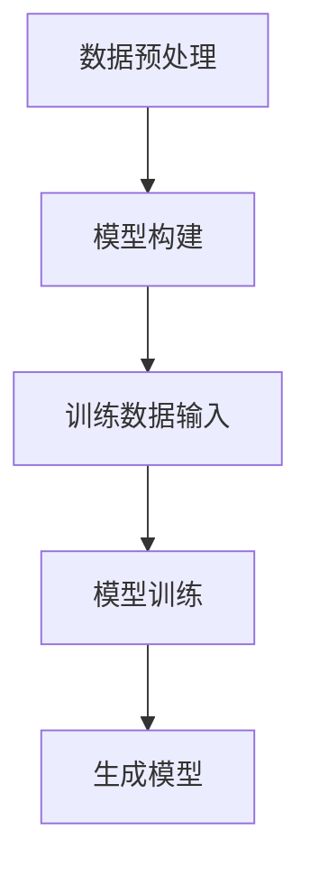
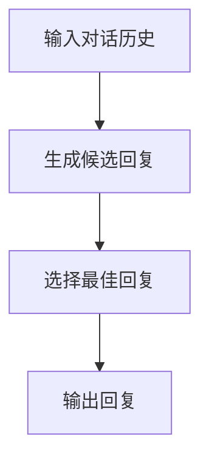
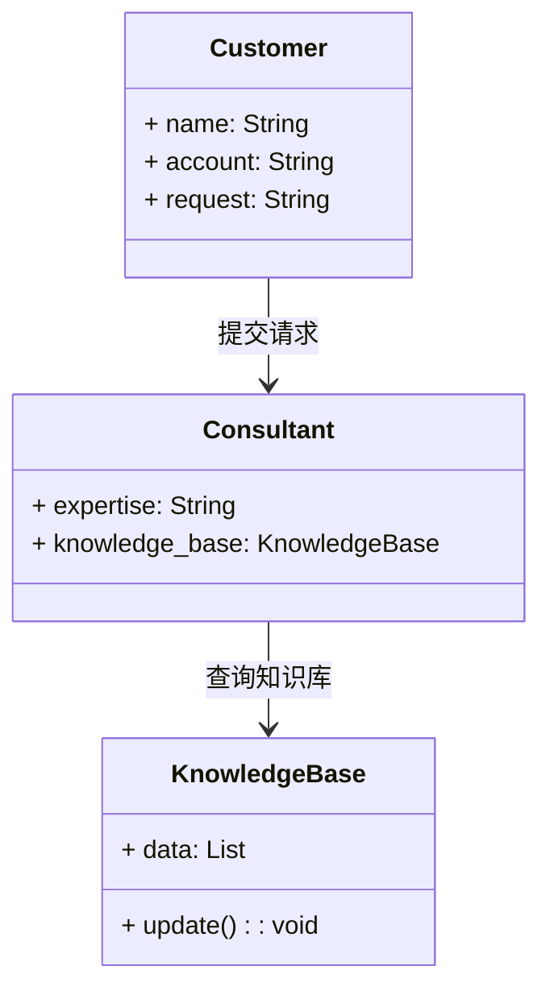
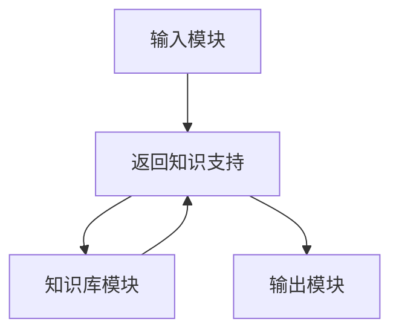
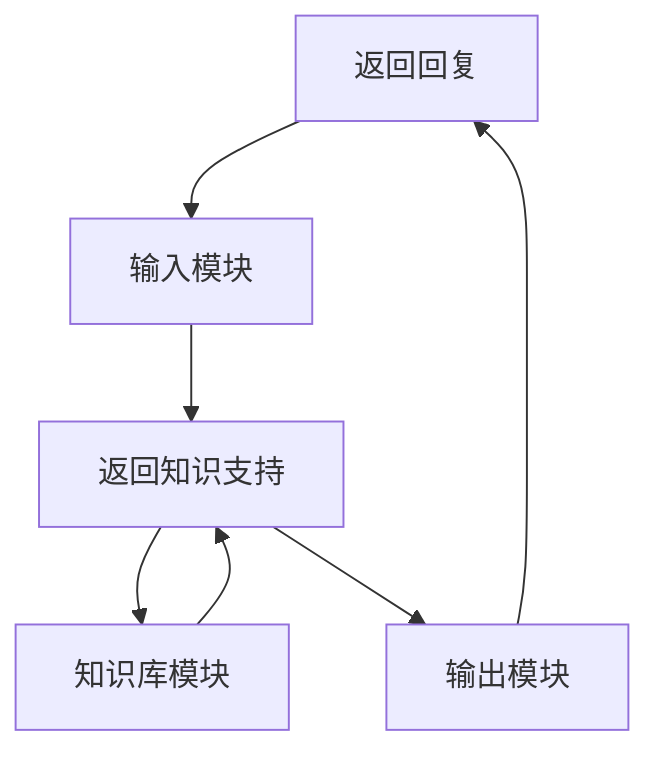

                 


# 情景对话生成技术在金融咨询中的应用实践

## 关键词：情景对话生成，自然语言处理，金融咨询，对话系统，深度学习，生成模型

## 摘要：  
情景对话生成技术在金融咨询中的应用实践，探讨了如何利用自然语言处理和深度学习技术，构建智能化的对话系统，解决金融咨询中的复杂问题。通过分析对话生成的核心原理、系统架构设计及实际项目案例，展示了情景对话生成技术在提升用户体验、优化业务流程和提高咨询效率方面的巨大潜力。

---

# 第1章: 情景对话生成技术概述

## 1.1 问题背景与描述

### 1.1.1 金融咨询中的对话需求  
金融咨询是一个复杂且高度专业化的领域，客户通常需要与金融顾问进行深入的对话，以解决投资、理财、风险管理等复杂问题。传统的金融咨询依赖于人工服务，效率较低且成本较高。随着人工智能技术的快速发展，通过自动化对话系统为客户提供个性化的金融服务成为可能。

### 1.1.2 情景对话生成技术的定义  
情景对话生成技术是指利用自然语言处理（NLP）和深度学习技术，根据输入的上下文生成符合情境的对话回复。在金融咨询场景中，这意味着系统能够理解客户的问题，并生成专业、准确且个性化的回复。

### 1.1.3 技术与业务的结合点  
情景对话生成技术的核心在于将复杂的金融知识转化为自然流畅的对话，同时结合客户的具体需求和背景信息，提供个性化的解决方案。这种技术可以显著提升客户体验，降低人工成本，并扩大服务覆盖范围。

## 1.2 问题解决与边界

### 1.2.1 对话生成技术的核心问题  
在金融咨询场景中，对话生成技术需要解决以下关键问题：
- **上下文理解**：准确理解客户的问题和背景信息。
- **专业性**：生成符合金融领域的专业术语和知识的回复。
- **个性化**：根据客户的具体需求生成个性化的建议。

### 1.2.2 技术实现的边界与外延  
情景对话生成技术的边界在于对话内容的生成，而非对话的发起或后续的执行操作（如开户、转账等）。技术的外延则包括数据预处理、模型训练和部署等环节。

### 1.2.3 业务场景的适用范围  
情景对话生成技术适用于多种金融咨询场景，如投资建议、风险管理、财富规划等。然而，对于需要严格合规性审查的业务（如高风险投资建议），需要结合人工审核。

## 1.3 核心概念与结构

### 1.3.1 情景对话生成的构成要素  
情景对话生成系统通常包含以下关键要素：
- **输入数据**：客户的问题或对话历史。
- **对话模型**：基于深度学习的生成模型。
- **知识库**：金融领域的专业知识和数据。
- **输出**：生成的对话回复。

### 1.3.2 核心概念的属性对比表  
| 概念       | 属性               | 描述                                         |
|------------|--------------------|----------------------------------------------|
| 对话生成   | 生成方式           | 基于预训练模型的生成式对话                   |
|            | 响应时间           | 实时生成，响应速度快                         |
| 专业性      | 知识库支持         | 结合金融知识库，提供专业建议                 |
|            | 更新频率           | 知识库需定期更新以保持准确性                 |

### 1.3.3 ER实体关系图  
以下是情景对话生成技术的实体关系图：

```mermaid
er
  actor:客户
  consultant:金融顾问
  dialog_record:对话记录
  knowledge_base:知识库

  actor -|> dialog_record: 提交对话请求
  dialog_record -|> knowledge_base: 查询知识库
  dialog_record -|> consultant: 获取回复
  consultant -|> knowledge_base: 更新知识库
```

---

# 第2章: 对话生成技术的算法原理

## 2.1 基于生成模型的对话生成

### 2.1.1 基于GPT的生成模型  
GPT（Generative Pre-trained Transformer）是一种基于Transformer架构的生成模型，具有强大的上下文理解和生成能力。在金融咨询场景中，我们可以使用预训练的GPT模型，并通过微调（Fine-tuning）使其适应金融领域的对话生成任务。

### 2.1.2 模型训练流程  
以下是模型训练的流程图：



模型训练的关键步骤包括：
1. **数据预处理**：清洗数据、分词、标注对话角色（客户和顾问）。
2. **模型构建**：基于Transformer架构构建生成模型。
3. **训练数据输入**：使用金融领域的对话数据进行训练。
4. **模型训练**：通过反向传播优化模型参数，降低生成回复的损失。

### 2.1.3 对话生成的数学模型  

生成模型的核心是计算生成概率，目标是最小化生成回复的交叉熵损失：

$$ \mathcal{L} = -\sum_{t=1}^{T} \log p(y_t | y_{<t}, x) $$

其中，$y_t$ 是生成的第 $t$ 个词，$x$ 是输入数据。

---

## 2.2 对话生成的算法流程图

以下是对话生成的流程图：



---

## 2.3 对话生成的数学公式  

在生成过程中，模型通过注意力机制（Attention）计算每个词的生成概率：

$$ \alpha_i = \frac{\exp(e_i)}{\sum_{j=1}^{n} \exp(e_j)} $$

其中，$e_i$ 是第 $i$ 个词的编码向量，$\alpha_i$ 是注意力权重。

---

# 第3章: 金融咨询系统架构设计

## 3.1 系统功能设计

### 3.1.1 领域模型设计  

以下是领域模型设计的类图：



### 3.1.2 系统功能模块划分  
系统功能模块包括：
- **输入模块**：接收客户的问题或对话历史。
- **生成模块**：基于输入生成回复。
- **知识库模块**：提供金融领域的专业知识支持。
- **输出模块**：将生成的回复返回给客户。

### 3.1.3 功能模块的交互流程  
以下是功能模块的交互流程图：



## 3.2 系统架构设计

### 3.2.1 系统架构图  
以下是系统架构图：



### 3.2.2 模块间的接口设计  
模块间的接口设计如下：
- **输入接口**：接收客户的对话请求。
- **生成接口**：调用生成模块生成回复。
- **知识库接口**：提供金融领域的知识支持。

### 3.2.3 系统交互流程图  
以下是系统交互流程图：


---

# 第4章: 项目实战与案例分析

## 4.1 环境搭建与安装

### 4.1.1 开发环境配置  
建议使用Python 3.6及以上版本，安装必要的库，如TensorFlow、Keras、PyTorch等。

### 4.1.2 依赖库的安装  
运行以下命令安装依赖库：
```bash
pip install numpy tensorflow keras transformers
```

### 4.1.3 数据集准备  
需要准备金融领域的对话数据，包括客户的问题和对应的顾问回复。

## 4.2 核心代码实现

### 4.2.1 数据预处理代码  
以下是数据预处理代码示例：

```python
import pandas as pd
import numpy as np

# 读取数据
data = pd.read_csv('financial_dialog.csv')
data['dialog'] = data['dialog'].apply(lambda x: x.strip())

# 分割对话角色
customer = data[data['role'] == 'customer']
consultant = data[data['role'] == 'consultant']
```

### 4.2.2 模型训练代码  
以下是模型训练代码示例：

```python
import tensorflow as tf
from tensorflow.keras.layers import Dense, Input, Dropout, Layer
from tensorflow.keras.models import Model

# 定义模型
input_layer = Input(shape=(128,))
dense_layer = Dense(64, activation='relu')(input_layer)
dropout_layer = Dropout(0.5)(dense_layer)
output_layer = Dense(1, activation='sigmoid')(dropout_layer)

model = Model(inputs=input_layer, outputs=output_layer)
model.compile(optimizer='adam', loss='binary_crossentropy', metrics=['accuracy'])
```

### 4.2.3 对话生成代码  
以下是对话生成代码示例：

```python
import transformers

# 加载预训练模型
tokenizer = transformers.AutoTokenizer.from_pretrained('gpt2')
model = transformers.AutoModelForCausalLM.from_pretrained('gpt2')

# 生成回复
def generate_response(prompt):
    inputs = tokenizer.encode(prompt, return_tensors='np')
    outputs = model.generate(inputs, max_length=50)
    response = tokenizer.decode(outputs[0])
    return response

print(generate_response("如何进行风险管理？"))
```

## 4.3 代码解读与分析

### 4.3.1 数据预处理的实现细节  
数据预处理包括清洗数据、分词和标注对话角色。通过这些步骤，可以提高模型的训练效率和生成质量。

### 4.3.2 模型训练的优化策略  
在模型训练中，可以通过调整学习率、批量大小和训练轮数来优化模型性能。此外，还可以通过早停（Early Stopping）来防止过拟合。

### 4.3.3 对话生成的实现机制  
对话生成基于预训练的GPT模型，通过微调使其适应金融领域的对话生成任务。生成过程结合了注意力机制，确保回复的连贯性和相关性。

## 4.4 实际案例分析

### 4.4.1 案例背景介绍  
某金融机构希望通过情景对话生成技术为客户提供个性化的投资建议。

### 4.4.2 对话生成过程展示  
以下是生成的对话示例：

**客户**：我应该如何进行风险管理？  
**系统**：风险管理的关键在于分散投资和设置止损点。建议您将资产分散投资于不同类型的资产，并定期评估投资组合的表现。

### 4.4.3 实际应用效果分析  
通过情景对话生成技术，金融机构能够显著提升客户体验，降低人工成本，并扩大服务覆盖范围。

---

# 第5章: 最佳实践与总结

## 5.1 实践中的注意事项

### 5.1.1 数据质量的重要性  
数据质量直接影响生成回复的效果，需要确保数据的多样性和准确性。

### 5.1.2 模型调优的技巧  
可以通过调整超参数、使用早停和交叉验证等方法来优化模型性能。

### 5.1.3 业务场景的适配性  
在实际应用中，需要根据具体业务场景调整对话生成的策略和知识库内容。

## 5.2 项目总结与展望

### 5.2.1 项目成果总结  
情景对话生成技术在金融咨询中的应用显著提升了客户体验和咨询效率。

### 5.2.2 技术发展的展望  
随着深度学习技术的不断发展，情景对话生成技术将更加智能化和个性化。

### 5.2.3 未来研究方向  
未来的研究方向包括多轮对话生成、跨领域知识整合和生成模型的实时性优化。

## 5.3 小结与拓展阅读  
情景对话生成技术在金融咨询中的应用前景广阔，但也需要在数据、模型和场景适配方面不断优化。建议读者进一步阅读相关文献，深入研究对话生成技术的最新进展。

---

# 作者：AI天才研究院 & 禅与计算机程序设计艺术

---

