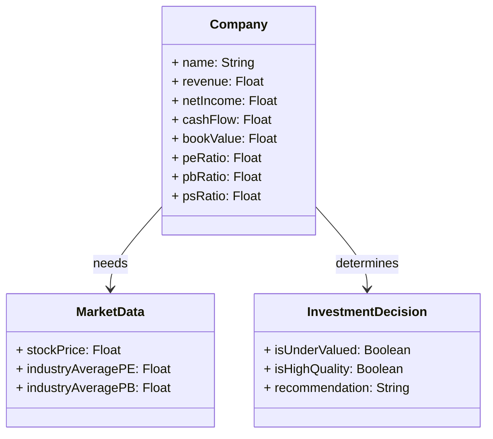
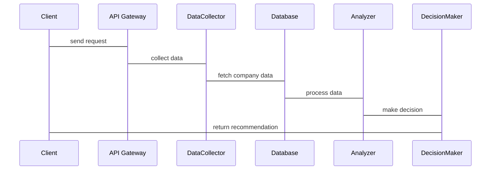

                 


# 托马斯·盖伊的高质量价值投资：寻找优质且低估的公司

## 关键词：价值投资、高质量公司、低估公司、托马斯·盖伊、DCF模型、基本面分析

## 摘要：
本文深入探讨了托马斯·盖伊的高质量价值投资方法，旨在帮助读者识别优质且低估的公司。文章从价值投资的背景出发，详细分析了高质量公司的核心要素和低估公司的识别标准。通过数学模型和算法的讲解，展示了如何评估公司价值。系统分析与架构设计部分介绍了投资决策系统的构建，项目实战部分通过具体案例展示了投资策略的实施。最后，总结了投资的关键点，提供了最佳实践的建议。

---

# 第一部分: 高质量价值投资的背景与核心概念

## 第1章: 价值投资的基本概念与历史发展

### 1.1 价值投资的起源与发展
#### 1.1.1 价值投资的定义与核心理念
价值投资是一种以公司基本面分析为基础的投资策略，旨在通过寻找市场价格低于其内在价值的公司来实现长期收益。其核心理念是买入被市场低估的资产，长期持有，等待其价值回归。

#### 1.1.2 价值投资的历史发展
价值投资起源于20世纪初，本杰明·格雷厄姆和菲利普·费雪是这一投资理念的奠基人。格雷厄姆提出“安全边际”概念，强调以低于内在价值的价格买入股票。费雪则强调公司的成长性，提出“内在成长性”理论。

#### 1.1.3 托马斯·盖伊的价值投资方法
托马斯·盖伊在继承传统价值投资理念的基础上，提出了一套寻找优质且低估公司的系统方法。他注重公司的财务健康、管理层质量以及行业地位，同时关注市场的估值水平，寻找那些被市场忽视的优质企业。

### 1.2 高质量公司的特征
#### 1.2.1 高质量公司的定义
高质量公司通常具有稳定的盈利能力、强大的财务健康状况、良好的管理层和行业领先地位。这些公司能够在市场波动中保持稳健，并具备持续增长的潜力。

#### 1.2.2 低估公司的识别标准
低估公司通常表现为低市盈率、低市净率或低市销率。这些公司可能因为市场情绪或行业周期而被市场忽视，但其内在价值往往高于市场价格。

#### 1.2.3 高质量与低估的平衡
寻找高质量且低估的公司是价值投资的核心。这种平衡要求投资者在选择标的时，既要考虑公司的质地，也要关注其估值水平，确保投资的安全边际。

### 1.3 价值投资与成长投资的对比
#### 1.3.1 成长投资的核心理念
成长投资注重公司的成长性，寻找那些收入和利润快速增长的公司。这种策略适合长期看好某个行业的投资者，但风险较高，因为成长型股票通常估值较高。

#### 1.3.2 价值投资与成长投资的优缺点对比
价值投资注重安全边际，风险较低，但可能在短期内收益有限。成长投资风险较高，但在长期可能带来超额收益。

#### 1.3.3 两种投资策略的适用场景
价值投资适合风险厌恶型投资者，成长投资适合风险偏好型投资者。在实际投资中，可以根据市场环境和个人风险偏好选择合适策略。

### 1.4 价值投资的哲学与心理因素
#### 1.4.1 投资者的心理认知
投资者的心理认知是影响投资决策的重要因素。情绪化决策可能导致错误判断，因此投资者需要克服贪婪和恐惧，保持理性。

#### 1.4.2 避免情绪化决策的方法
制定明确的投资计划，坚持纪律，避免随市场波动频繁交易。分散投资和长期持有是降低情绪影响的有效方法。

#### 1.4.3 长期投资与耐心的重要性
价值投资强调长期持有，耐心等待价值回归。短期波动不应影响长期投资策略，耐心是价值投资成功的关键。

### 1.5 本章小结
本章介绍了价值投资的背景、核心理念以及高质量公司的特征。通过对比价值投资和成长投资，强调了价值投资的安全性和长期性特点。心理因素和投资纪律也是成功投资的重要组成部分。

---

## 第2章: 高质量公司的核心要素分析

### 2.1 高质量公司的定义与特征
#### 2.1.1 高质量公司的核心要素
高质量公司具有稳定的盈利能力、健康的财务状况、优秀的管理层和行业领先地位。这些公司在经济周期波动中表现稳健，具备持续增长的潜力。

#### 2.1.2 高质量公司的财务特征
- 高质量的财务报表：收入稳定，利润增长，负债合理。
- 强大的现金流：健康的现金流是公司财务健康的重要指标。
- 股东权益回报率高：ROE是衡量公司盈利能力的重要指标。

#### 2.1.3 高质量公司的行业地位
行业龙头通常具有竞争优势，市场占有率高，品牌影响力强。这些公司在行业中具有定价权，能够持续获取超额利润。

### 2.2 低估公司的识别标准
#### 2.2.1 低估公司的定义
低估公司是指市场价格低于其内在价值的公司。这些公司可能因为市场忽视或行业周期而被低估。

#### 2.2.2 低估公司的估值指标
- 市盈率（P/E）：价格与收益的比率，低于行业平均水平可能表示低估。
- 市净率（P/B）：价格与净资产的比率，低于1可能表示低估。
- 市销率（P/S）：价格与销售收入的比率，低于行业平均水平可能表示低估。

#### 2.2.3 低估公司的市场表现
低估公司通常在市场低迷时表现不佳，但在市场回升时可能迅速反弹。长期来看，低估公司的表现优于市场平均水平。

### 2.3 高质量与低估公司的对比分析
#### 2.3.1 高质量公司的长期表现
高质量公司在长期具有稳定的增长潜力，能够在经济周期中保持稳健。虽然短期表现可能不如成长型公司，但长期回报更可持续。

#### 2.3.2 低估公司的短期机会
低估公司短期内可能因为市场低估而存在估值修复的机会。投资者可以利用这种机会，以较低的价格买入优质资产。

#### 2.3.3 高质量与低估公司的结合策略
寻找同时具备高质量和低估特征的公司，是价值投资的理想选择。这种公司既有稳定的盈利能力，又有较高的安全边际，适合长期持有。

### 2.4 本章小结
本章详细分析了高质量公司的核心要素和低估公司的识别标准，强调了两者结合的重要性。通过对比分析，展示了如何在市场中寻找优质且低估的公司。

---

## 第3章: 高质量价值投资的数学模型与算法

### 3.1 高质量价值投资的数学模型
#### 3.1.1 公司价值的评估公式
公司内在价值的评估通常使用现金流贴现模型（DCF）。以下是DCF模型的核心公式：

$$
\text{内在价值} = \sum_{t=1}^{n} \frac{\text{现金流}}{(1 + r)^t} + \frac{\text{终值}}{(1 + r)^n}
$$

其中，r是折现率，n是估计的现金流期限。

#### 3.1.2 股票估值的计算方法
股票估值可以通过DCF模型计算，也可以通过相对估值指标（如市盈率、市净率）进行比较。以下是DCF模型的简单实现步骤：

1. 预测未来现金流。
2. 确定合适的折现率。
3. 计算未来现金流的现值。
4. 加上终值，得出内在价值。

#### 3.1.3 市盈率与市净率的对比分析
市盈率（P/E）和市净率（P/B）是常用的估值指标。以下是它们的对比：

| 指标 | 定义 | 适用场景 |
|------|------|-----------|
| P/E | 市价/每股收益 | 盈利稳定的公司 |
| P/B | 市价/每股净资产 | 资产密集型行业 |

### 3.2 高质量价值投资的算法流程
#### 3.2.1 数据收集与处理
- 收集目标公司的财务报表数据。
- 获取行业平均市盈率、市净率等估值指标。

#### 3.2.2 公司价值评估
- 使用DCF模型计算公司内在价值。
- 对比市场价格与内在价值，判断是否低估。

#### 3.2.3 低估公司识别
- 计算相对估值指标，判断是否低于行业平均水平。
- 结合公司基本面分析，确认是否具备高质量特征。

#### 3.2.4 投资决策
- 如果市场价格低于内在价值且估值指标低于行业平均水平，考虑买入。
- 设置止损和止盈点，制定投资计划。

### 3.3 本章小结
本章通过数学模型和算法流程，展示了如何评估公司价值和识别低估公司。DCF模型和相对估值指标的结合，为投资者提供了科学的决策依据。

---

## 第4章: 系统分析与架构设计方案

### 4.1 问题场景介绍
投资者需要一个系统化的工具，帮助他们分析和评估公司价值。该系统应具备数据收集、分析、评估和决策功能。

### 4.2 项目介绍
本项目旨在构建一个价值投资决策支持系统，帮助投资者快速识别优质且低估的公司。

### 4.3 系统功能设计
#### 4.3.1 领域模型（Mermaid 类图）


#### 4.3.2 系统架构设计（Mermaid 架构图）


#### 4.3.3 系统接口设计
- 数据收集接口：从金融数据源获取市场数据。
- 分析接口：计算公司估值指标。
- 决策接口：判断公司是否为优质且低估。

#### 4.3.4 系统交互设计（Mermaid 序列图）


### 4.4 本章小结
本章通过系统分析与架构设计，展示了如何构建一个投资决策支持系统。该系统能够帮助投资者高效地识别优质且低估的公司。

---

## 第5章: 项目实战

### 5.1 环境安装
- 安装Python和相关库（如Pandas、NumPy、Matplotlib）。
- 使用Jupyter Notebook进行数据分析。

### 5.2 系统核心实现源代码
#### 5.2.1 数据收集
```python
import pandas as pd
import requests

def get_market_data(ticker):
    url = f"https://api.example.com/stock/{ticker}"
    response = requests.get(url)
    data = response.json()
    return pd.DataFrame(data)
```

#### 5.2.2 数据分析
```python
def calculate_valuationMetrics(df):
    df['pe_ratio'] = df['price'] / df['eps']
    df['pb_ratio'] = df['price'] / df['book_value']
    df['ps_ratio'] = df['price'] / df['revenue_per_share']
    return df
```

#### 5.2.3 投资决策
```python
def is_undervalued(pe, pb, ps, industry_avg_pe, industry_avg_pb, industry_avg_ps):
    if pe < industry_avg_pe and pb < industry_avg_pb and ps < industry_avg_ps:
        return True
    return False
```

### 5.3 代码应用解读与分析
通过上述代码，投资者可以自动化地收集数据、计算估值指标，并判断公司是否为优质且低估。这种方法提高了投资决策的效率和准确性。

### 5.4 实际案例分析
以某公司为例，假设其市盈率为10，市净率为1.5，市销率为0.8，行业平均市盈率为15，市净率为2，市销率为1。根据上述代码，该公司的估值指标均低于行业平均水平，因此可以判断为低估公司。

### 5.5 本章小结
本章通过实际案例分析，展示了如何利用代码实现投资决策。自动化工具能够提高投资效率，帮助投资者快速识别优质且低估的公司。

---

## 第6章: 总结与展望

### 6.1 投资的关键点
- 选择优质公司：具备稳定的盈利能力、健康的财务状况和良好的行业地位。
- 寻找低估公司：市场价格低于内在价值，估值指标低于行业平均水平。
- 长期持有：耐心等待价值回归。

### 6.2 风险管理
- 设置止损点：避免重大损失。
- 分散投资：降低风险。
- 定期复盘：评估投资组合的表现。

### 6.3 最佳实践 tips
- 持续学习：关注市场动态和公司基本面。
- 纪律性：坚持投资计划，避免情绪化决策。
- 长期视角：耐心持有，等待价值实现。

### 6.4 小结
价值投资是一种长期有效的投资策略，通过寻找优质且低估的公司，投资者可以在市场中获得稳定的回报。托马斯·盖伊的方法提供了系统的指导，帮助投资者在复杂市场中做出明智决策。

### 6.5 注意事项
- 投资有风险，需谨慎决策。
- 市场波动不可预测，投资需具备风险承受能力。
- 定期评估投资组合，根据市场变化调整策略。

### 6.6 拓展阅读
- 《投资最重要的少数事》——李录
- 《价值投资入门》——机械工业出版社

---

## 作者：AI天才研究院/AI Genius Institute & 禅与计算机程序设计艺术 /Zen And The Art of Computer Programming

