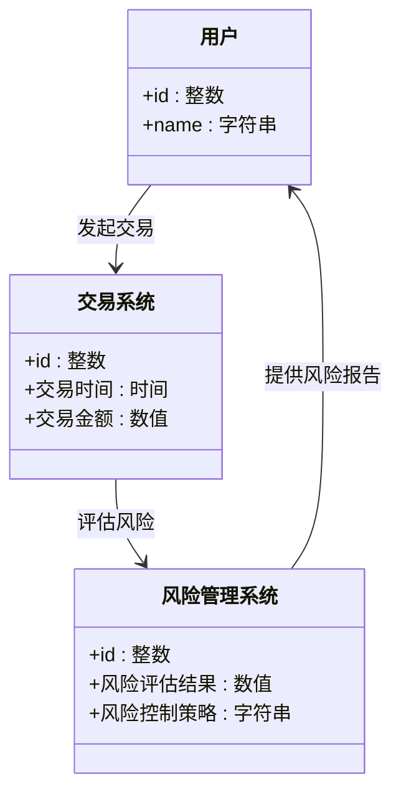
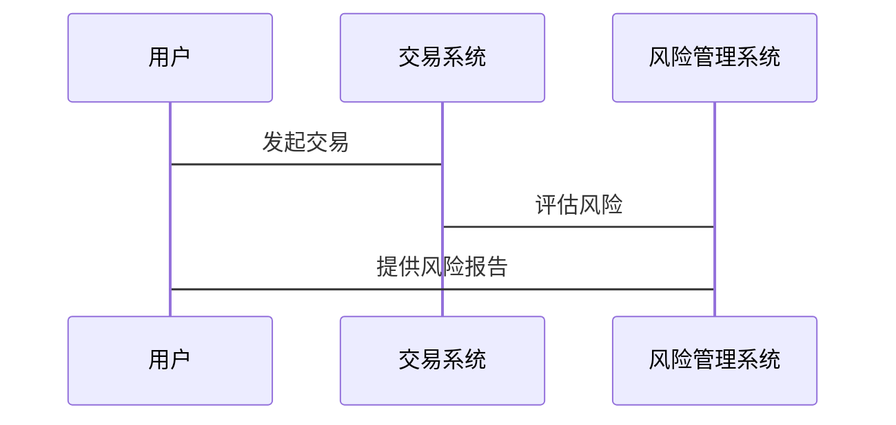

                 


# 智能外汇风险敞口管理优化系统

> 关键词：智能外汇、风险敞口管理、时间序列分析、机器学习算法、系统架构设计

> 摘要：本文详细探讨了智能外汇风险敞口管理优化系统的背景、核心概念、算法原理、系统架构设计及项目实战。通过分析外汇风险管理的核心问题，结合时间序列分析和机器学习算法，提出了优化的系统架构和实现方案，并提供了实际案例分析和最佳实践建议。

---

# 第一部分: 智能外汇风险敞口管理优化系统概述

# 第1章: 智能外汇风险敞口管理概述

## 1.1 外汇风险敞口管理的背景与意义

### 1.1.1 外汇风险的基本概念
外汇风险是指在外汇市场中，由于汇率波动导致的资产损失或收益变化的可能性。企业或投资者在进行跨国交易或外汇投资时，可能会面临汇率波动带来的风险。这种风险主要来源于货币兑换过程中的不确定性。

### 1.1.2 外汇风险敞口的定义与分类
外汇风险敞口是指企业在一定时期内，由于汇率波动可能带来的损失或收益的潜在变化。根据敞口的来源，可以将其分为交易敞口、经济敞口和会计敞口。交易敞口是指企业在实际交易中涉及的外汇买卖；经济敞口是指企业由于经营活动中产生的外汇收入或支出；会计敞口是指企业由于会计报表折算带来的外汇风险。

### 1.1.3 智能化管理的必要性与优势
传统的外汇风险敞口管理方法往往依赖于人工判断和经验，这种方式不仅效率低下，而且容易受到主观因素的影响。随着信息技术的快速发展，智能化管理成为必然趋势。通过引入人工智能和大数据技术，可以实现对外汇市场数据的实时监控、风险预测和自动化的风险管理，从而提高管理效率和准确性。

---

## 1.2 智能外汇风险敞口管理的核心问题

### 1.2.1 问题背景与目标
在当前的外汇市场中，汇率波动频繁且复杂，传统的管理方法难以应对这种动态变化。因此，智能外汇风险敞口管理的目标是通过技术手段，实现对外汇风险的实时监控、预测和优化管理，从而降低潜在的风险损失。

### 1.2.2 风险敞口的动态变化特征
外汇市场的汇率波动具有非线性和随机性，这使得风险敞口的管理变得复杂。此外，市场参与者的行为、宏观经济政策的变化以及突发事件都可能影响汇率走势，从而影响风险敞口的变化。

### 1.2.3 系统优化的关键点
智能外汇风险敞口管理系统的优化需要从数据采集、风险评估、决策支持等多个方面入手。首先，需要实时采集和处理大量的外汇市场数据；其次，需要建立高效的数学模型和算法，实现风险评估和预测；最后，还需要制定合理的风险控制策略，以应对不同的市场情况。

---

## 1.3 智能外汇风险敞口管理系统的边界与外延

### 1.3.1 系统的边界定义
智能外汇风险敞口管理系统的核心功能包括数据采集、风险评估、风险预测和风险控制。系统的边界包括前端用户界面、后端数据处理和外部数据源。

### 1.3.2 系统的外延与相关领域
系统不仅需要关注外汇市场的数据，还需要考虑宏观经济指标、政策变化、市场情绪等多种因素。此外，系统还可能与其他金融系统（如交易系统、会计系统）进行交互，实现数据共享和信息协同。

### 1.3.3 核心概念与核心要素分析
核心概念包括外汇风险敞口、汇率预测模型、风险评估指标等。核心要素包括数据采集模块、数据处理模块、模型构建模块和风险控制模块。

---

## 1.4 本章小结

本章从背景和意义入手，详细介绍了智能外汇风险敞口管理的核心问题和系统的边界与外延。通过分析外汇市场的动态变化特征，提出了智能化管理的必要性和优化方向。

---

# 第二部分: 智能外汇风险敞口管理系统的理论基础

# 第2章: 外汇风险管理的核心概念与联系

## 2.1 外汇风险管理的核心概念

### 2.1.1 外汇市场的基本原理
外汇市场是全球最大的金融市场，24小时运行，参与者包括银行、企业、个人和政府。汇率的波动受到宏观经济政策、市场供需、地缘政治等多种因素的影响。

### 2.1.2 风险敞口的数学模型
风险敞口的数学模型可以表示为：
$$
\text{风险敞口} = \sum_{i=1}^{n} (汇率_i \times 数量_i)
$$
其中，$i$ 表示不同的货币对，$n$ 表示货币对的总数。

### 2.1.3 智能化管理的理论基础
智能化管理基于大数据分析、机器学习和人工智能技术，通过建立数学模型和算法，实现对外汇市场的预测和风险控制。

---

## 2.2 核心概念的属性特征对比

### 2.2.1 风险敞口的属性特征
| 属性 | 特征 |
|------|------|
| 时间性 | 动态变化 |
| 数量性 | 可量化 |
| 关联性 | 与其他市场变量相关 |
| 不确定性 | 受多种因素影响 |

### 2.2.2 智能化管理的属性特征
| 属性 | 特征 |
|------|------|
| 数据驱动性 | 基于大量数据进行分析 |
| 实时性 | 实时监控和预测 |
| 自适应性 | 根据市场变化自动调整策略 |
| 可扩展性 | 支持大规模数据处理 |

### 2.2.3 对比分析与总结
通过对比风险敞口和智能化管理的属性特征，可以看出智能化管理在外汇风险管理中的优势。智能化管理能够实时捕捉市场变化，快速调整策略，从而有效降低风险敞口。

---

## 2.3 ER实体关系图与领域模型

### 2.3.1 ER实体关系图
```mermaid
erDiagram
    用户 {
        +id : 整数
        +name : 字符串
    }
    交易系统 {
        +id : 整数
        +交易时间 : 时间
        +交易金额 : 数值
    }
    风险管理系统 {
        +id : 整数
        +风险评估结果 : 数值
        +风险控制策略 : 字符串
    }
    用户 --> 交易系统 : 发起交易
    交易系统 --> 风险管理系统 : 评估风险
    风险管理系统 --> 用户 : 提供风险报告
```

### 2.4 本章小结

本章详细分析了外汇风险管理的核心概念和理论基础，通过对比分析和ER实体关系图，明确了智能外汇风险敞口管理系统的构建基础。

---

# 第三部分: 算法原理与数学模型

# 第3章: 外汇风险敞口管理的算法原理

## 3.1 时间序列分析与预测算法

### 3.1.1 时间序列分析的基本原理
时间序列分析是一种通过分析历史数据，预测未来趋势的方法。在外汇风险管理中，时间序列分析可以帮助预测汇率走势，从而制定相应的风险控制策略。

### 3.1.2 ARIMA模型的数学公式
ARIMA模型是一种常用的时间序列预测模型，其数学公式如下：
$$
ARIMA(p, d, q) = 0
$$
其中，$p$ 表示自回归阶数，$d$ 表示差分阶数，$q$ 表示移动平均阶数。

### 3.1.3 LSTM模型的应用
LSTM（长短期记忆网络）是一种基于深度学习的时间序列预测模型。其核心思想是通过记忆单元来捕捉长期依赖关系。LSTM的结构包括输入门、遗忘门和输出门。

---

## 3.2 基于机器学习的外汇风险预测算法

### 3.2.1 机器学习算法的选择
在机器学习算法中，支持向量回归（SVR）和随机森林（Random Forest）也是常用的时间序列预测方法。

### 3.2.2 算法实现步骤
1. 数据预处理：清洗数据，去除异常值，标准化数据。
2. 特征提取：提取影响汇率的关键特征。
3. 模型训练：选择合适的算法进行训练。
4. 模型评估：通过交叉验证评估模型的性能。
5. 模型优化：调整参数，优化模型。

### 3.2.3 算法实现的Python代码示例
```python
import numpy as np
import pandas as pd
from sklearn.preprocessing import StandardScaler
from sklearn.svm import SVR
from sklearn.metrics import mean_squared_error

# 数据预处理
data = pd.read_csv('forex_data.csv')
features = data[['open', 'high', 'low', 'close']]
target = data['next_day_close']

# 特征提取
features_scaled = StandardScaler().fit_transform(features)
X_train, X_test, y_train, y_test = train_test_split(features_scaled, target, test_size=0.2)

# 模型训练
model = SVR(kernel='rbf', C=1e3, gamma=0.1)
model.fit(X_train, y_train)

# 模型预测
y_pred = model.predict(X_test)
print(mean_squared_error(y_test, y_pred))
```

---

## 3.3 算法的比较与优化

### 3.3.1 不同算法的比较
通过对比ARIMA、LSTM和SVR等算法的性能，可以发现LSTM在处理复杂的时间序列数据时表现更为优异。

### 3.3.2 算法优化的策略
1. 参数调优：通过网格搜索优化模型参数。
2. 数据增强：增加数据样本，提高模型的泛化能力。
3. 模型集成：结合多种算法，提高预测的准确性。

---

## 3.4 本章小结

本章详细介绍了时间序列分析和机器学习算法在外汇风险管理中的应用，通过对比不同算法的性能，提出了优化策略。

---

# 第四部分: 系统分析与架构设计

# 第4章: 系统分析与架构设计

## 4.1 问题场景介绍

### 4.1.1 系统的目标
智能外汇风险敞口管理系统的目标是实现对外汇风险的实时监控、预测和优化管理。

### 4.1.2 系统的输入与输出
输入：外汇市场数据、宏观经济指标、市场情绪数据。
输出：风险评估报告、风险控制策略、预测结果。

---

## 4.2 系统功能设计

### 4.2.1 领域模型


---

## 4.3 系统架构设计

### 4.3.1 系统架构图
```mermaid
docker
    frontend
    backend
    database
    external_api
```

### 4.3.2 系统接口设计
1. 数据接口：与外汇交易系统、数据源对接。
2. 用户接口：提供风险评估报告和控制策略。
3. 管理接口：系统管理员进行参数配置和模型更新。

### 4.3.3 系统交互序列图


---

## 4.4 本章小结

本章从系统分析和架构设计的角度，详细介绍了智能外汇风险敞口管理系统的构建过程，包括系统功能设计、架构设计和交互设计。

---

# 第五部分: 项目实战

# 第5章: 项目实战

## 5.1 环境安装与配置

### 5.1.1 Python环境的安装
安装Python和必要的库：
```bash
pip install numpy pandas scikit-learn matplotlib
```

### 5.1.2 数据库的配置
配置MySQL或MongoDB数据库，用于存储外汇市场数据。

---

## 5.2 系统核心功能实现

### 5.2.1 数据采集模块
使用API接口从外汇市场获取实时数据。

```python
import requests

url = "https://api.exchangerate-api.com/v2/latest"
response = requests.get(url)
data = response.json()
```

### 5.2.2 风险评估模块
实现风险评估算法，如ARIMA或LSTM模型。

### 5.2.3 风险控制模块
根据评估结果，制定风险控制策略，如对冲、调整头寸等。

---

## 5.3 代码实现与解读

### 5.3.1 数据预处理代码
```python
import pandas as pd
import numpy as np

data = pd.read_csv('forex_data.csv')
data['date'] = pd.to_datetime(data['date'])
data.set_index('date', inplace=True)
data = data[~data.isin([np.nan, np.inf, -np.inf]).any()]
```

### 5.3.2 风险评估代码
```python
from sklearn.model_selection import train_test_split
from sklearn.metrics import mean_squared_error
import xgboost as xgb

model = xgb.XGBRegressor(n_estimators=100, learning_rate=0.05, max_depth=6)
model.fit(X_train, y_train)
y_pred = model.predict(X_test)
print(mean_squared_error(y_test, y_pred))
```

---

## 5.4 案例分析与详细讲解

### 5.4.1 案例背景
假设某企业有大量的欧元头寸，希望通过系统进行风险评估和管理。

### 5.4.2 案例分析
通过系统分析，企业发现欧元兑美元的汇率波动较大，系统预测未来一周内欧元可能贬值，建议企业进行对冲操作。

### 5.4.3 实施结果
企业实施对冲操作后，成功规避了汇率波动带来的损失。

---

## 5.5 本章小结

本章通过实际案例分析，详细讲解了智能外汇风险敞口管理系统的实现过程，包括环境配置、功能实现和案例分析。

---

# 第六部分: 最佳实践与总结

# 第6章: 最佳实践与总结

## 6.1 最佳实践

### 6.1.1 数据质量的重要性
确保数据的准确性和完整性，避免因数据问题导致预测错误。

### 6.1.2 模型优化的技巧
通过参数调优、数据增强和模型集成等方法，提高模型的预测精度。

### 6.1.3 系统维护与更新
定期更新模型，监控系统运行状态，及时修复问题。

---

## 6.2 小结

智能外汇风险敞口管理系统的建设是一个复杂而重要的任务，需要结合理论与实践，通过不断优化算法和系统架构，才能实现高效的外汇风险管理。

---

## 6.3 注意事项

1. 数据隐私和安全问题需要高度重视。
2. 模型的实时性和响应速度需要优化。
3. 系统的可扩展性和可维护性需要在设计阶段考虑。

---

## 6.4 拓展阅读

1. 《时间序列分析与应用预测方法》
2. 《机器学习实战》
3. 《系统设计的艺术》

---

# 作者

作者：AI天才研究院/AI Genius Institute & 禅与计算机程序设计艺术/Zen And The Art of Computer Programming

---

**全文完**

