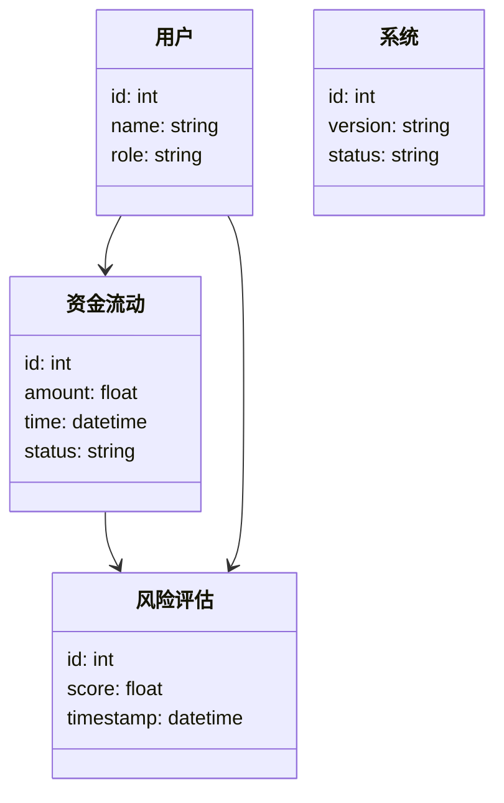
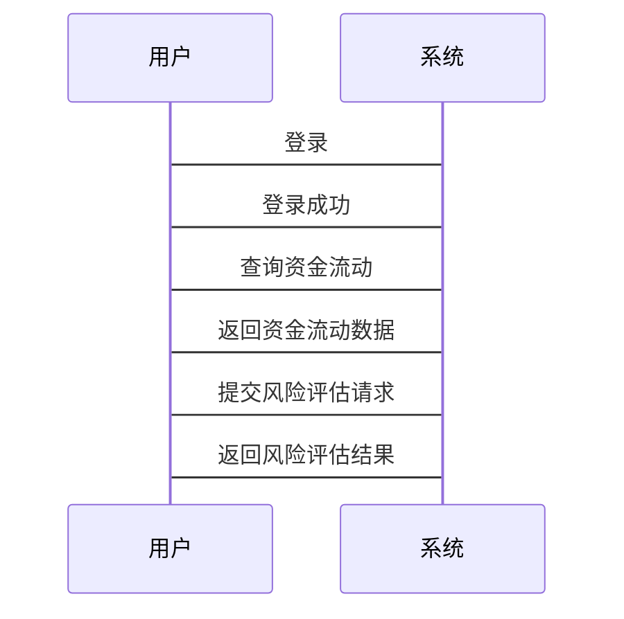

                 


# 构建智能化的企业资金流动性风险动态管理平台

## 关键词：资金流动性风险，风险管理，智能化平台，大数据，人工智能，机器学习

## 摘要：本文详细探讨了如何构建智能化的企业资金流动性风险动态管理平台，从背景、核心概念、技术基础、算法实现、系统架构到项目实战，系统地介绍了平台的构建过程和关键点。通过结合大数据、人工智能和机器学习技术，本文提出了一套高效的解决方案，帮助企业实时监控和预测资金流动性风险，从而有效降低风险，提升企业的财务稳定性。

---

## 第1章: 资金流动性风险动态管理平台背景与概述

### 1.1 资金流动性风险的定义与问题背景

#### 1.1.1 资金流动性风险的定义
资金流动性风险是指企业在一定时期内无法以合理成本获得足够的资金来满足其资产增长或偿债需求的风险。简单来说，就是企业在需要资金时，无法及时获得所需资金，从而影响企业正常运营的风险。

#### 1.1.2 企业资金流动性的关键影响因素
以下是影响企业资金流动性风险的关键因素：

| 影响因素 | 描述 | 示例 |
|----------|------|------|
| **市场环境** | 经济波动、行业周期等 | 金融危机导致企业融资困难 |
| **财务状况** | 企业的财务健康状况 | 负债过高导致流动性不足 |
| **融资能力** | 企业获得资金的能力 | 企业信用评级下降影响融资 |
| **管理策略** | 企业的资金管理策略 | 缺乏流动性管理导致资金链断裂 |

#### 1.1.3 资金流动性风险对企业的影响
- **直接影响**：可能导致企业无法偿还债务，影响正常的生产运营。
- **间接影响**：可能引发连锁反应，影响供应链合作伙伴，甚至导致企业声誉受损。

### 1.2 资金流动性风险动态管理的必要性

#### 1.2.1 动态管理的核心意义
资金流动性风险是动态变化的，企业的资金需求和市场环境随时可能变化。因此，需要动态调整资金管理策略，以应对变化。

#### 1.2.2 传统资金管理方式的局限性
传统的资金管理方式通常基于静态分析，无法及时捕捉市场变化和企业内部需求的变化，可能导致管理滞后。

#### 1.2.3 智能化管理的迫切需求
随着企业规模的扩大和市场环境的复杂化，传统的资金管理方式已经难以满足需求。智能化管理能够实时监控资金流动，预测潜在风险，并提出优化建议。

### 1.3 平台建设的目标与价值

#### 1.3.1 平台建设的主要目标
- 提供实时资金流动监控
- 提供风险预警和预测
- 提供优化建议和决策支持

#### 1.3.2 平台对企业管理的价值
- **提升效率**：通过自动化监控和预警，减少人工干预，提升管理效率。
- **降低风险**：通过实时监控和预测，提前发现潜在风险，降低损失。
- **数据驱动决策**：基于数据分析，提供科学的决策支持。

#### 1.3.3 平台的社会与经济效益
- **社会效益**：保障企业稳定运营，促进经济健康发展。
- **经济效益**：通过优化资金管理，降低融资成本，提升企业利润。

### 1.4 本章小结
本章介绍了资金流动性风险的定义、影响因素及其对企业的影响，阐述了动态管理的必要性，并提出了智能化管理平台的目标与价值。下一章将详细探讨资金流动性风险的核心概念与理论基础。

---

## 第2章: 资金流动性风险的核心概念与理论基础

### 2.1 资金流动性风险的核心要素

#### 2.1.1 资金流动性的构成要素
资金流动性风险的构成要素包括资金来源、资金使用、资金储备和资金监控。以下是构成要素的详细描述：

| 构成要素 | 描述 | 示例 |
|----------|------|------|
| **资金来源** | 资金的来源渠道 | 银行贷款、企业债券 |
| **资金使用** | 资金的用途 | 生产经营、偿还债务 |
| **资金储备** | 资金的储备情况 | 现金储备、备用流动性资产 |
| **资金监控** | 资金流动的监控机制 | 实时监控系统、定期审计 |

#### 2.1.2 风险来源与传播机制
资金流动性风险的来源包括内部因素和外部因素。内部因素如企业内部管理不善，外部因素如市场环境变化。风险的传播机制包括直接传播和间接传播，例如供应链中断可能引发连锁反应。

#### 2.1.3 风险度量的核心指标
以下是一些常用的风险度量指标：

| 指标名称 | 描述 | 示例 |
|----------|------|------|
| **流动比率** | 流动资产与流动负债的比值 | 流动资产为100万元，流动负债为50万元，流动比率为2 |
| **速动比率** | 速动资产与流动负债的比值 | 速动资产为80万元，流动负债为50万元，速动比率为1.6 |
| **现金比率** | 现金与流动负债的比值 | 现金为40万元，流动负债为50万元，现金比率为0.8 |

### 2.2 资金流动性风险管理的理论框架

#### 2.2.1 风险管理的基本原理
风险管理的基本原理包括风险识别、风险评估、风险控制和风险监控。这些步骤相互关联，形成一个闭环。

#### 2.2.2 动态风险管理的理论基础
动态风险管理强调实时监控和调整，基于实时数据和市场变化进行风险管理。其核心在于通过动态调整策略，降低风险敞口。

#### 2.2.3 系统性风险与个体风险的关联
系统性风险是指整个市场的风险，如经济衰退；个体风险是指单个企业的风险。两者相互关联，系统性风险会影响个体风险，个体风险也可能放大系统性风险。

### 2.3 资金流动性风险的数学模型

#### 2.3.1 风险评估的数学公式
风险评估的常用公式包括：

$$ \text{风险值} = \text{资产价值} \times \text{风险系数} $$

其中，风险系数根据资产类型和市场环境确定。

#### 2.3.2 时间序列分析模型
时间序列分析模型用于预测未来的资金流动情况。常用的模型包括ARIMA（自回归积分滑动平均模型）。

$$ ARIMA(p, d, q) $$
其中，p为自回归阶数，d为差分阶数，q为滑动平均阶数。

#### 2.3.3 风险传播的网络模型
风险传播的网络模型通过构建企业之间的关联网络，分析风险在企业间的传播路径。

### 2.4 本章小结
本章详细介绍了资金流动性风险的核心要素、理论基础和数学模型，为后续的技术实现提供了理论支撑。下一章将探讨智能化资金流动性风险管理的技术基础。

---

## 第3章: 智能化资金流动性风险管理的技术基础

### 3.1 大数据技术在资金管理中的应用

#### 3.1.1 数据采集与处理技术
大数据技术在资金管理中的应用包括数据采集、清洗、转换和存储。例如，使用ETL工具进行数据抽取、转换和加载。

#### 3.1.2 数据分析与挖掘技术
数据分析与挖掘技术包括数据可视化、统计分析和机器学习。例如，使用Python的Pandas库进行数据分析，使用Matplotlib进行数据可视化。

#### 3.1.3 数据可视化技术
数据可视化技术帮助用户直观理解数据。例如，使用Tableau绘制资金流动的趋势图。

### 3.2 人工智能与机器学习在风险管理中的应用

#### 3.2.1 机器学习算法简介
机器学习算法包括监督学习、无监督学习和强化学习。例如，使用线性回归进行风险预测。

#### 3.2.2 常见的机器学习模型
常用的机器学习模型包括支持向量机（SVM）、随机森林和神经网络。例如，使用随机森林进行分类任务。

#### 3.2.3 深度学习在风险预测中的应用
深度学习模型如LSTM（长短期记忆网络）用于时间序列预测。例如，使用LSTM预测未来的资金流动情况。

### 3.3 自然语言处理技术在资金管理中的应用

#### 3.3.1 文本数据的处理与分析
自然语言处理技术用于分析财务报告、新闻等文本数据。例如，使用NLP技术提取财务报告中的关键信息。

#### 3.3.2 基于NLP的风险预警系统
NLP技术可以用于构建风险预警系统，例如，通过分析市场新闻判断潜在风险。

#### 3.3.3 实例分析与应用前景
例如，使用NLP技术分析社交媒体上的评论，预测市场情绪对资金流动的影响。

### 3.4 本章小结
本章介绍了大数据、人工智能和自然语言处理技术在资金流动性风险管理中的应用，为后续的算法实现奠定了技术基础。

---

## 第4章: 资金流动性风险的算法与模型实现

### 4.1 基于机器学习的资金流动性风险预测模型

#### 4.1.1 算法原理
使用随机森林算法进行风险预测。随机森林是一种基于树的集成学习方法，具有较高的准确性和鲁棒性。

#### 4.1.2 算法实现步骤
1. 数据预处理：清洗数据，处理缺失值。
2. 特征选择：选择对风险预测影响较大的特征。
3. 模型训练：使用随机森林算法训练模型。
4. 模型评估：使用混淆矩阵、准确率、召回率等指标评估模型性能。

#### 4.1.3 Python实现代码
```python
from sklearn.ensemble import RandomForestClassifier
from sklearn.metrics import accuracy_score

# 数据预处理
X = df.drop('label', axis=1)
y = df['label']

# 特征选择
selected_features = X.columns
X = X[selected_features]

# 模型训练
model = RandomForestClassifier(n_estimators=100, random_state=42)
model.fit(X, y)

# 模型评估
y_pred = model.predict(X)
print("准确率:", accuracy_score(y, y_pred))
```

#### 4.1.4 模型优化
通过调整超参数（如n_estimators、max_depth）优化模型性能。

### 4.2 基于时间序列分析的风险预测模型

#### 4.2.1 ARIMA模型的应用
ARIMA模型用于预测未来的资金流动情况。以下是ARIMA模型的实现步骤：

1. 数据预处理：确保数据是平稳的。
2. 模型参数选择：确定p、d、q的值。
3. 模型训练：使用ARIMA模型拟合数据。
4. 模型预测：预测未来的资金流动情况。

#### 4.2.2 Python实现代码
```python
from statsmodels.tsa.arima.model import ARIMA

# 数据预处理
data = df['flow'].values

# 模型训练
model = ARIMA(data, order=(5,1,0))
model_fit = model.fit()

# 模型预测
forecast = model_fit.forecast(steps=5)
print(forecast)
```

### 4.3 算法与模型的比较与选择

#### 4.3.1 算法比较
随机森林适用于分类任务，ARIMA适用于时间序列预测。根据具体需求选择合适的算法。

#### 4.3.2 模型选择
根据模型的准确率、召回率和F1分数选择最优模型。

### 4.4 本章小结
本章详细介绍了基于机器学习和时间序列分析的资金流动性风险预测模型，并通过Python代码展示了实现过程。下一章将探讨系统设计与架构。

---

## 第5章: 资金流动性风险动态管理平台的系统设计与架构

### 5.1 系统功能设计

#### 5.1.1 领域模型设计
领域模型描述了系统的核心实体及其关系。以下是领域模型的类图：



#### 5.1.2 系统架构设计
以下是系统架构的分层架构图：


### 5.2 系统架构设计

#### 5.2.1 接口设计
系统需要提供以下接口：

1. 数据接口：用于数据的输入和输出。
2. 用户接口：用于用户的登录和操作。
3. 风险评估接口：用于调用风险评估模型。

#### 5.2.2 交互流程设计
以下是用户与系统交互的流程图：



### 5.3 本章小结
本章详细介绍了系统的功能设计和架构设计，为后续的系统实现提供了指导。

---

## 第6章: 资金流动性风险动态管理平台的项目实战

### 6.1 项目环境搭建

#### 6.1.1 开发环境
- 操作系统：Windows 10 或 macOS
- 开发工具：PyCharm
- 依赖管理工具：pip
- 版本控制工具：Git

#### 6.1.2 项目结构
```
project/
├── data/
├── models/
├── src/
│   ├── main.py
│   └── utils.py
└── requirements.txt
```

### 6.2 系统核心实现

#### 6.2.1 数据采集模块
```python
import pandas as pd

def load_data(file_path):
    return pd.read_csv(file_path)
```

#### 6.2.2 风险评估模块
```python
from sklearn.ensemble import RandomForestClassifier

def train_model(X, y):
    model = RandomForestClassifier()
    model.fit(X, y)
    return model
```

#### 6.2.3 风险预警模块
```python
def generate_warnings(model, X):
    predictions = model.predict(X)
    warnings = []
    for i in range(len(predictions)):
        if predictions[i] == 1:
            warnings.append(f"Warning: 风险存在")
    return warnings
```

### 6.3 代码实现与解读

#### 6.3.1 数据预处理代码
```python
import pandas as pd
import numpy as np

def preprocess_data(df):
    df = df.dropna()
    df = pd.get_dummies(df)
    return df
```

#### 6.3.2 风险评估代码
```python
from sklearn.ensemble import RandomForestClassifier
from sklearn.metrics import accuracy_score

def train_and_evaluate(X, y):
    model = RandomForestClassifier()
    model.fit(X, y)
    y_pred = model.predict(X)
    print("准确率:", accuracy_score(y, y_pred))
```

### 6.4 实际案例分析

#### 6.4.1 数据来源与预处理
假设我们有一个包含企业资金流动数据的CSV文件，使用Pandas进行数据清洗和转换。

#### 6.4.2 模型训练与评估
使用训练好的随机森林模型进行风险预测，并评估模型性能。

### 6.5 项目小结
本章通过实际案例展示了如何构建智能化的资金流动性风险动态管理平台，从环境搭建到代码实现，详细介绍了整个过程。

---

## 第7章: 总结与展望

### 7.1 本章总结
本文详细探讨了智能化的企业资金流动性风险动态管理平台的构建过程，从背景、核心概念、技术基础到系统设计和项目实战，全面介绍了平台的构建方法。

### 7.2 未来展望
随着人工智能和大数据技术的不断发展，智能化的资金流动性风险管理将更加精准和高效。未来的研究方向包括更复杂的模型优化、多源数据融合以及实时性提升。

### 7.3 最佳实践 tips
- 定期更新模型，保持模型的准确性。
- 加强数据质量管理，确保数据的准确性和完整性。
- 建立完善的监控机制，及时发现和处理风险。

### 7.4 本章小结
本文总结了平台的构建过程，并展望了未来的发展方向。读者可以通过本文系统地了解如何构建智能化的资金流动性风险动态管理平台。

---

## 作者：AI天才研究院/AI Genius Institute & 禅与计算机程序设计艺术 /Zen And The Art of Computer Programming

---

这篇文章详细探讨了智能化的企业资金流动性风险动态管理平台的构建过程，从背景、核心概念、技术基础到系统设计和项目实战，全面介绍了平台的构建方法。通过本文，读者可以系统地了解如何利用大数据、人工智能和机器学习技术来构建这样一个智能化平台，从而帮助企业实时监控和预测资金流动性风险，降低风险，提升企业的财务稳定性。

