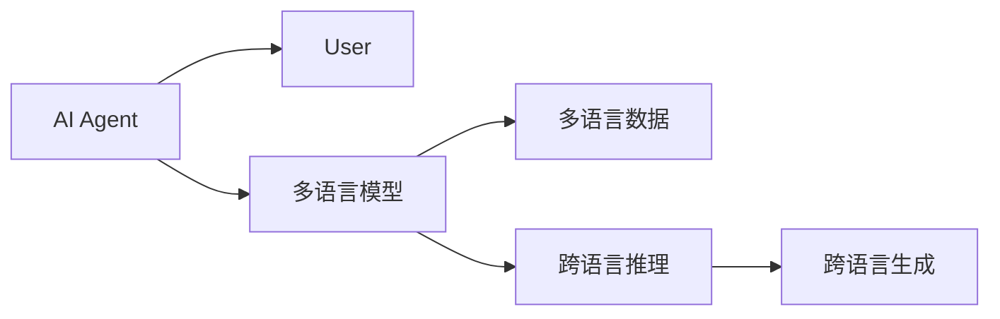
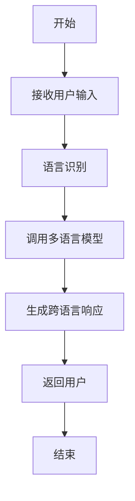
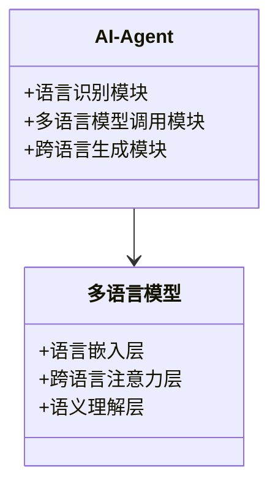
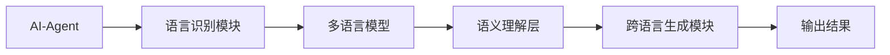

                 


# 跨语言AI Agent的开发挑战与解决方案

> 关键词：跨语言AI Agent，多语言模型，语义理解，对话系统，机器学习

> 摘要：跨语言AI Agent是一种能够理解并处理多种语言的智能体，其开发面临语言多样性、语义差异和文化差异等挑战。本文将从背景、核心概念、算法原理、系统设计、项目实战等多个方面详细探讨跨语言AI Agent的开发挑战，并提出相应的解决方案。

---

# 第一部分: 跨语言AI Agent的背景与挑战

## 第1章: 跨语言AI Agent的定义与背景

### 1.1 跨语言AI Agent的定义

#### 1.1.1 什么是AI Agent
AI Agent（人工智能代理）是指能够感知环境、自主决策并执行任务的智能实体。它可以是一个软件程序、机器人或其他智能系统，旨在通过与用户或环境交互来完成特定目标。

#### 1.1.2 跨语言AI Agent的核心概念
跨语言AI Agent是一种能够理解和处理多种语言的AI Agent。它不仅能够识别和生成多种语言的文本，还能在不同语言之间进行语义理解和推理，从而提供跨语言的交互服务。

#### 1.1.3 跨语言AI Agent的分类与特点
跨语言AI Agent可以分为以下几类：
1. **多语言对话系统**：支持多种语言的交互，但每种语言的处理相对独立。
2. **跨语言语义理解系统**：能够理解不同语言之间的语义联系，并提供跨语言的语义分析。
3. **跨语言推理与生成系统**：能够在不同语言之间进行推理，并生成符合目标语言的输出。

### 1.2 跨语言AI Agent的背景

#### 1.2.1 全球化背景下的语言多样性需求
随着全球化的发展，跨语言交流的需求日益增长。企业、政府和社会组织需要在多种语言环境下提供服务，跨语言AI Agent成为一种重要的技术手段。

#### 1.2.2 AI技术的跨语言应用趋势
人工智能技术的快速发展使得跨语言AI Agent的实现成为可能。深度学习、自然语言处理（NLP）和大语言模型（LLM）等技术的进步为跨语言AI Agent的开发提供了坚实的基础。

#### 1.2.3 跨语言AI Agent的市场需求与应用场景
跨语言AI Agent的应用场景广泛，包括：
- **多语言客户服务**：为企业提供多语言的客户支持服务。
- **全球新闻摘要**：自动将新闻内容从一种语言翻译并总结成另一种语言。
- **跨语言信息检索**：在多语言环境下快速检索和理解信息。
- **教育辅助工具**：帮助学习者学习多种语言。

### 1.3 跨语言AI Agent的挑战

#### 1.3.1 多语言模型的训练难度
跨语言AI Agent的核心是多语言模型，其训练需要大量的多语言数据和复杂的模型架构设计。不同语言之间的语义差异和文化差异增加了模型训练的难度。

#### 1.3.2 不同语言之间的语义差异
不同语言之间存在语义差异，例如中文和英文在语法结构、词汇含义和文化背景上的差异。这些差异使得跨语言语义理解变得复杂。

#### 1.3.3 跨语言推理与生成的复杂性
跨语言推理需要理解不同语言之间的逻辑关系，并生成符合目标语言的输出。这需要模型具备强大的跨语言推理能力。

#### 1.3.4 跨文化背景下的语境理解问题
不同文化背景下的语言使用方式和语境理解存在差异。跨语言AI Agent需要能够理解这些文化差异，以提供更准确的语境理解。

### 1.4 跨语言AI Agent的解决方案概述

#### 1.4.1 多语言模型的构建与优化
通过构建多语言模型，可以同时处理多种语言的数据，并通过模型优化技术提高跨语言语义理解的准确性。

#### 1.4.2 跨语言语义理解的技术突破
利用对比学习、跨语言迁移学习等技术，可以提高模型在不同语言之间的语义理解能力。

#### 1.4.3 跨语言对话系统的设计与实现
通过设计专门的跨语言对话系统架构，可以实现跨语言对话的流畅性和准确性。

---

## 第2章: 跨语言AI Agent的核心概念与联系

### 2.1 跨语言AI Agent的核心概念

#### 2.1.1 多语言模型的原理
多语言模型通过共享不同语言的语义信息，实现对多种语言的统一处理。其核心原理包括：
- **语言嵌入的共享**：将不同语言的词向量映射到共享的嵌入空间。
- **跨语言注意力机制**：在不同语言之间建立注意力关系，以提高跨语言理解能力。

#### 2.1.2 跨语言语义理解的实现机制
跨语言语义理解的核心机制包括：
- **跨语言对比学习**：通过对比不同语言的语义表示，提高模型的跨语言理解能力。
- **跨语言迁移学习**：利用一种语言的语义信息，辅助其他语言的语义理解。

#### 2.1.3 跨语言对话系统的架构
跨语言对话系统的架构通常包括以下模块：
- **语言识别模块**：识别输入语言。
- **多语言模型调用模块**：调用多语言模型进行语义理解。
- **跨语言生成模块**：生成目标语言的响应。

### 2.2 跨语言AI Agent的核心要素

#### 2.2.1 多语言数据的处理与整合
多语言数据的处理包括：
- **数据清洗**：去除噪声数据。
- **数据标注**：标注语言和语义信息。
- **数据增强**：通过数据增强技术提高数据质量。

#### 2.2.2 跨语言模型的训练与优化
跨语言模型的训练需要：
- **多语言数据集**：包括多种语言的文本数据。
- **跨语言损失函数**：用于衡量跨语言语义理解的准确性。
- **模型优化策略**：通过优化算法提高模型性能。

#### 2.2.3 跨语言对话的生成与评估
跨语言对话的生成需要：
- **跨语言生成模型**：能够生成目标语言的对话响应。
- **生成评估指标**：如BLEU、ROUGE等，用于评估生成文本的质量。

### 2.3 跨语言AI Agent的实体关系图



### 2.4 跨语言AI Agent的流程图



### 2.5 本章小结

---

## 第3章: 跨语言AI Agent的算法原理

### 3.1 跨语言AI Agent的核心算法

#### 3.1.1 多任务学习算法
多任务学习算法通过同时学习多个任务，共享模型参数，从而提高模型的泛化能力。其数学模型如下：

$$ L = \lambda_1 L_1 + \lambda_2 L_2 + ... + \lambda_n L_n $$

其中，$L$ 是总损失，$L_i$ 是第i个任务的损失，$\lambda_i$ 是任务权重。

#### 3.1.2 对比学习算法
对比学习算法通过对比同一内容在不同语言中的表示，提高模型的跨语言理解能力。其核心公式为：

$$ \text{loss} = -\log \frac{\exp(s(x_i, x_j))}{\sum_{k} \exp(s(x_j, x_k))} $$

其中，$s(x_i, x_j)$ 是对比相似度得分。

#### 3.1.3 跨语言迁移学习算法
跨语言迁移学习算法通过利用一种语言的特征，辅助其他语言的学习。其核心思想是通过共享特征空间，降低跨语言之间的语义差异。

---

### 3.2 跨语言AI Agent的数学模型

#### 3.2.1 跨语言语义表示模型
跨语言语义表示模型通过将不同语言的词向量映射到共享空间，实现跨语言语义理解。其数学表示如下：

$$ f(x_i) = W_i x_i + b $$

其中，$W_i$ 是第i个语言的词向量映射矩阵，$x_i$ 是输入词向量，$b$ 是偏置项。

#### 3.2.2 跨语言对比学习模型
跨语言对比学习模型通过对比不同语言的表示，优化模型的跨语言理解能力。其损失函数如下：

$$ L = -\log \frac{\exp(s(x_i, x_j))}{\sum_{k} \exp(s(x_j, x_k))} $$

其中，$s(x_i, x_j)$ 是对比相似度得分。

---

## 第4章: 跨语言AI Agent的系统分析与架构设计

### 4.1 系统功能设计

#### 4.1.1 功能模块划分
跨语言AI Agent的系统功能模块包括：
- **语言识别模块**：识别输入语言。
- **多语言模型调用模块**：调用多语言模型进行语义理解。
- **跨语言生成模块**：生成目标语言的响应。

#### 4.1.2 领域模型类图



### 4.2 系统架构设计

#### 4.2.1 系统架构图



#### 4.2.2 接口设计
跨语言AI Agent的接口设计包括：
- **输入接口**：接收多语言输入。
- **输出接口**：生成目标语言的输出。
- **模型调用接口**：调用多语言模型。

#### 4.2.3 交互序列图

```mermaid
graph TD
    User --> AI-Agent: 发送多语言输入
    AI-Agent --> 语言识别模块: 识别语言
    语言识别模块 --> 多语言模型: 调用模型
    多语言模型 --> 语义理解层: 进行语义分析
    语义理解层 --> 跨语言生成模块: 生成目标语言响应
    跨语言生成模块 --> User: 返回响应
```

---

## 第5章: 跨语言AI Agent的项目实战

### 5.1 环境安装

#### 5.1.1 安装Python环境
```bash
python --version
pip install --upgrade pip
```

#### 5.1.2 安装必要的库
```bash
pip install numpy
pip install transformers
pip install torch
```

### 5.2 核心代码实现

#### 5.2.1 多语言模型的定义
```python
class MultiLanguageModel(torch.nn.Module):
    def __init__(self, vocab_size, embedding_dim):
        super().__init__()
        self.embedding = torch.nn.Embedding(vocab_size, embedding_dim)
        self.attention = torch.nn.MultiheadAttention(embedding_dim, 8)
        self.fc = torch.nn.Linear(embedding_dim, 1)
    def forward(self, input_ids):
        embeds = self.embedding(input_ids)
        attn_output, _ = self.attention(embeds.permute(1, 0, 2), embeds.permute(1, 0, 2))
        output = self.fc(attn_output.permute(1, 0, 2).sum(dim=1))
        return output
```

#### 5.2.2 跨语言生成模块的实现
```python
def generate_response(model, input_lang, target_lang):
    with torch.no_grad():
        input_ids = tokenizer.encode(input_lang, add_special_tokens=True)
        input_ids = torch.tensor(input_ids, dtype=torch.long)
        outputs = model(input_ids)
        response = tokenizer.decode(outputs)
        return response
```

### 5.3 项目总结

---

## 第6章: 跨语言AI Agent的最佳实践与注意事项

### 6.1 最佳实践

#### 6.1.1 数据预处理
- 确保数据的多样性和平衡性。
- 对数据进行清洗和标注。

#### 6.1.2 模型优化
- 使用预训练模型进行迁移学习。
- 调整模型参数，优化跨语言理解能力。

#### 6.1.3 系统部署
- 采用微服务架构，提高系统的可扩展性。
- 使用容器化技术，简化部署流程。

### 6.2 注意事项

#### 6.2.1 跨文化语境的理解
- 需要特别注意不同文化背景下的语境差异。
- 通过文化语料库进行模型优化。

#### 6.2.2 跨语言模型的泛化能力
- 需要通过数据增强和模型优化提高模型的泛化能力。
- 定期更新模型，以适应语言的变化。

---

## 第7章: 总结与展望

### 7.1 总结
跨语言AI Agent的开发是一项复杂的任务，需要结合多语言模型、跨语言语义理解和系统架构设计等多方面的知识。通过不断的技术创新和实践积累，可以逐步克服跨语言AI Agent的开发挑战，实现更高效、更智能的跨语言交互。

### 7.2 展望
未来，随着人工智能技术的进一步发展，跨语言AI Agent将在更多领域得到应用。研究者们将致力于提高跨语言语义理解的准确性，优化跨语言对话系统的流畅性，并探索新的跨语言技术，如多模态跨语言交互等。

---

## 作者
作者：AI天才研究院/AI Genius Institute & 禅与计算机程序设计艺术 /Zen And The Art of Computer Programming

