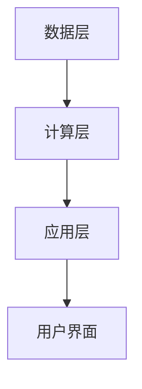

                 


# 选择合适的LLM模型：企业需求与模型能力的匹配

> 关键词：大语言模型，LLM，企业需求，模型能力，匹配策略，技术分析，AI应用

> 摘要：选择合适的LLM模型是企业实现高效AI应用的关键。本文从企业需求分析出发，结合模型能力评估，系统性地探讨如何匹配企业需求与模型能力。通过详细的技术分析和实际案例，本文为读者提供了一套完整的匹配策略，帮助企业在复杂的LLM模型选择中找到最优解。

---

# 第1章 选择合适的LLM模型概述

## 1.1 LLM模型的基本概念

### 1.1.1 什么是大语言模型（LLM）

大语言模型（Large Language Model, LLM）是指基于深度学习技术训练的大型神经网络模型，能够理解和生成人类语言。LLM的核心在于其巨大的参数规模和丰富的训练数据，使其具备强大的语义理解和生成能力。

**关键特点：**
- **参数规模大：** 通常包含数十亿甚至更多的参数。
- **通用性：** 能够处理多种语言任务，如文本生成、问答、翻译等。
- **自适应性：** 可以通过微调（Fine-tuning）适应特定领域的需求。

### 1.1.2 LLM模型的特点与优势

1. **强大的上下文理解能力：** LLM能够捕捉文本中的语义信息，理解上下文关系。
2. **多任务处理能力：** 一个模型可以同时处理多种语言任务。
3. **生成能力：** 能够生成自然流畅的文本。
4. **可微调性：** 通过在特定领域数据上的微调，模型可以适应企业的具体需求。

### 1.1.3 LLM模型在企业中的应用价值

LLM模型在企业中的应用广泛，包括：
- **智能客服：** 提供自动问答、客户支持。
- **内容生成：** 自动生成报告、营销文案。
- **数据分析：** 帮助分析和总结数据。
- **代码生成与优化：** 生成和优化代码片段。

## 1.2 企业需求与模型能力的匹配背景

### 1.2.1 企业需求分析的基本框架

企业的需求分析通常包括以下几个方面：
1. **业务场景：** 确定模型需要支持的具体业务场景。
2. **技术能力：** 评估企业的技术资源和能力。
3. **数据资源：** 分析企业的数据质量和数量。
4. **预期效果：** 明确模型需要达到的性能指标。

### 1.2.2 模型能力的核心要素

模型能力的核心要素包括：
1. **参数规模：** 模型的参数越多，通常能力越强。
2. **训练数据：** 数据的质量和多样性直接影响模型的性能。
3. **推理能力：** 模型在实际应用中的响应速度和准确性。
4. **可解释性：** 模型的决策过程是否透明。
5. **稳定性：** 模型在不同输入下的表现是否一致。

### 1.2.3 匹配背景与挑战

企业在选择LLM模型时面临的主要挑战包括：
1. **需求多样性：** 不同企业的需求差异较大。
2. **模型复杂性：** LLM模型通常非常复杂，难以直接评估。
3. **资源限制：** 企业可能在计算资源和数据资源上有限制。

## 1.3 本章小结

通过本章的介绍，我们了解了LLM模型的基本概念及其在企业中的应用价值，明确了企业需求与模型能力匹配的背景和挑战。接下来的章节将深入探讨企业需求分析和模型能力评估的具体方法。

---

# 第2章 企业需求的系统分析

## 2.1 企业业务场景的多样性

### 2.1.1 常见的企业应用场景

企业常见的应用场景包括：
- **客户服务：** 提供自动化的客户支持。
- **内容生成：** 自动生成营销文案、报告。
- **数据分析：** 分析销售数据、市场趋势。
- **内部管理：** 生成会议记录、任务分配。

### 2.1.2 不同场景对LLM模型的需求差异

不同场景对模型的需求差异体现在以下几个方面：
1. **文本长度：** 长文本处理需要模型具备长上下文窗口能力。
2. **领域专业性：** 特定领域（如医疗、法律）需要模型具备专业知识。
3. **响应速度：** 实时应用需要快速的推理能力。

## 2.2 企业技术能力的评估

### 2.2.1 技术团队的技能水平

技术团队的能力直接影响模型的部署和优化，包括：
- **开发能力：** 是否具备AI开发经验。
- **运维能力：** 是否能够维护和优化模型。

### 2.2.2 企业的计算资源能力

计算资源是模型运行的基础，包括：
- **算力：** CPU和GPU的计算能力。
- **存储：** 数据存储和模型参数存储的需求。

### 2.2.3 数据处理能力的评估

数据处理能力包括：
- **数据清洗：** 数据的预处理能力。
- **数据标注：** 数据标注的能力和效率。

## 2.3 企业数据特点的分析

### 2.3.1 数据的规模与质量

数据规模和质量直接影响模型的性能：
- **数据量：** 数据量越大，模型越容易收敛。
- **数据质量：** 数据的准确性、完整性。

### 2.3.2 数据的敏感性与隐私性

数据的安全性是企业需要考虑的重要因素：
- **数据隐私：** 数据是否包含敏感信息。
- **合规性：** 是否符合相关法律法规。

### 2.3.3 数据的领域专业性

领域专业性影响模型的适用性：
- **通用性：** 适用于多种领域。
- **专业性：** 适用于特定领域，如医疗、金融。

## 2.4 企业对LLM模型的预期效果

### 2.4.1 精准度与响应速度

精准度和响应速度是模型性能的关键指标：
- **精准度：** 模型的输出是否准确。
- **响应速度：** 模型的推理时间是否满足实时需求。

### 2.4.2 可解释性与可定制性

可解释性和可定制性是企业需求的重要方面：
- **可解释性：** 模型的决策过程是否透明。
- **可定制性：** 模型是否能够根据企业需求进行调整。

### 2.4.3 模型的可扩展性与稳定性

可扩展性和稳定性是模型长期使用的保障：
- **可扩展性：** 模型是否能够处理更大的数据规模。
- **稳定性：** 模型在不同输入下的表现是否一致。

## 2.5 本章小结

通过本章的分析，我们了解了企业需求的多样性和复杂性，明确了企业在选择LLM模型时需要考虑的关键因素。接下来的章节将重点探讨如何评估模型的能力，并制定匹配策略。

---

# 第3章 LLM模型能力的多维度评估

## 3.1 模型参数与架构的分析

### 3.1.1 模型参数规模对性能的影响

模型参数规模直接影响其能力：
- **参数越多，能力越强。**
- **参数过少，可能导致模型能力不足。**

### 3.1.2 模型架构的多样性

常见的模型架构包括：
- **Transformer架构：** 基于自注意力机制。
- **RNN架构：** 基于循环神经网络。

### 3.1.3 不同架构的适用场景

不同架构适用于不同的场景：
- **Transformer架构：** 适用于长文本处理。
- **RNN架构：** 适用于实时性要求高的场景。

## 3.2 模型训练数据的质量与多样性

### 3.2.1 数据来源的广度与深度

数据来源的广度和深度影响模型的泛化能力：
- **广度：** 数据涵盖的领域越广，模型的通用性越强。
- **深度：** 数据在特定领域的深度决定模型的专业性。

### 3.2.2 数据的代表性与平衡性

数据的代表性与平衡性是模型性能的关键：
- **代表性：** 数据是否能够覆盖所有可能的输入。
- **平衡性：** 数据分布是否均衡。

### 3.2.3 数据的时序性与更新频率

数据的时序性和更新频率影响模型的实时性：
- **时序性：** 数据的时间相关性。
- **更新频率：** 数据的更新速度。

## 3.3 模型推理能力的测试

### 3.3.1 常用的模型评估指标

常用的模型评估指标包括：
- **准确率（Accuracy）：** 预测正确的比例。
- **困惑度（Perplexity）：** 语言模型的预测能力。

### 3.3.2 多任务处理能力的评估

多任务处理能力是模型能力的重要指标：
- **多任务推理：** 模型是否能够同时处理多种任务。
- **任务切换能力：** 模型在不同任务之间的切换效率。

### 3.3.3 模型的响应速度

模型的响应速度是实时应用的重要指标：
- **推理时间：** 模型的处理时间。
- **吞吐量：** 单位时间内的处理能力。

## 3.4 本章小结

通过本章的分析，我们了解了LLM模型在参数、架构、数据和推理能力等方面的评估方法，为后续的匹配策略制定奠定了基础。

---

# 第4章 关键匹配方法

## 4.1 从企业需求到模型能力的映射

### 4.1.1 企业需求的层次化分解

企业需求需要进行层次化分解：
- **战略层：** 长期目标。
- **战术层：** 具体的业务需求。
- **执行层：** 技术实现。

### 4.1.2 模型能力的层次化评估

模型能力的层次化评估包括：
- **基础能力：** 模型的基本功能。
- **高级能力：** 模型的扩展功能。

### 4.1.3 需求与能力的映射关系

需求与能力的映射关系是匹配的核心：
- **需求优先级：** 根据需求的重要性进行排序。
- **能力匹配度：** 根据模型能力与需求的匹配程度进行排序。

## 4.2 基于需求的模型能力评估框架

### 4.2.1 模型能力评估的维度

模型能力评估的维度包括：
- **参数规模：** 模型的参数数量。
- **训练数据：** 数据的质量和多样性。
- **推理能力：** 模型的响应速度和准确性。

### 4.2.2 模型能力评估的指标体系

模型能力评估的指标体系包括：
- **性能指标：** 准确率、响应时间。
- **资源指标：** 算法复杂度、存储需求。
- **可扩展性指标：** 并行处理能力、可扩展性。

### 4.2.3 基于层次分析法的评估方法

层次分析法（AHP）是一种常用的评估方法：
1. **构建层次结构：** 将需求和能力进行层次化。
2. **确定权重：** 根据需求的重要性确定权重。
3. **计算得分：** 根据权重计算模型的综合得分。

## 4.3 基于模型能力的匹配策略

### 4.3.1 基于参数规模的匹配

参数规模的匹配需要考虑：
- **需求复杂度：** 需求的复杂程度。
- **计算资源：** 企业的计算能力。

### 4.3.2 基于数据需求的匹配

数据需求的匹配需要考虑：
- **数据规模：** 企业的数据量。
- **数据类型：** 数据的结构和格式。

### 4.3.3 基于推理能力的匹配

推理能力的匹配需要考虑：
- **响应速度：** 实时应用的需求。
- **处理能力：** 多任务处理的需求。

## 4.4 本章小结

通过本章的分析，我们掌握了企业需求与模型能力匹配的核心方法，包括需求分析、能力评估和匹配策略的制定。

---

# 第5章 系统架构与实现

## 5.1 系统设计与架构

### 5.1.1 系统设计原则

系统设计原则包括：
- **模块化：** 系统分为多个模块，便于管理和维护。
- **可扩展性：** 系统能够适应未来的扩展需求。
- **安全性：** 系统具备数据安全和访问控制能力。

### 5.1.2 系统架构设计

系统架构设计包括：
- **数据层：** 数据存储和管理。
- **计算层：** 模型推理和计算。
- **应用层：** 用户交互和功能实现。

### 5.1.3 系统架构图

以下是系统架构的Mermaid图：



## 5.2 系统实现与代码解读

### 5.2.1 系统核心实现

系统核心实现包括：
- **数据预处理：** 数据清洗和标注。
- **模型部署：** 模型的加载和初始化。
- **推理服务：** 模型的推理和结果返回。

### 5.2.2 代码实现

以下是模型部署的Python代码示例：

```python
import torch
from transformers import AutoTokenizer, AutoModelForCausalLM

# 加载模型和tokenizer
model_name = "gpt2"
tokenizer = AutoTokenizer.from_pretrained(model_name)
model = AutoModelForCausalLM.from_pretrained(model_name)

# 推理函数
def generate_response(prompt):
    inputs = tokenizer(prompt, return_tensors="pt")
    outputs = model.generate(inputs.input_ids, max_length=50, do_sample=True)
    return tokenizer.decode(outputs[0], skip_special_tokens=True)

# 使用示例
prompt = "请写一篇关于人工智能的短文。"
response = generate_response(prompt)
print(response)
```

## 5.3 本章小结

通过本章的分析，我们了解了系统的整体架构和实现方法，为后续的项目实战奠定了基础。

---

# 第6章 项目实战：企业需求与模型匹配案例

## 6.1 项目背景与需求分析

### 6.1.1 项目背景

某企业需要一个智能客服系统，提升客户服务质量。

### 6.1.2 项目需求

- **自动问答：** 提供客户常见问题的自动解答。
- **智能推荐：** 根据客户问题推荐相关解决方案。
- **多语言支持：** 支持多语言的客户咨询。

## 6.2 模型选择与实施

### 6.2.1 模型选择

根据需求选择适合的模型：
- **GPT-3：** 参数规模大，适合多任务处理。
- **BERT：** 适合文本理解和问答任务。

### 6.2.2 模型微调与优化

模型微调包括：
- **领域微调：** 在特定领域的数据上进行微调。
- **参数调整：** 根据需求调整模型的超参数。

### 6.2.3 模型部署与测试

模型部署包括：
- **服务部署：** 部署推理服务。
- **性能测试：** 测试模型的响应速度和准确性。

## 6.3 项目小结

通过本章的案例分析，我们了解了企业需求与模型匹配的具体实施过程，包括需求分析、模型选择、微调和部署。

---

# 第7章 最佳实践与未来趋势

## 7.1 最佳实践

### 7.1.1 需求分析阶段

- **深入了解业务：** 明确企业的具体需求。
- **数据质量优先：** 确保数据的准确性和完整性。

### 7.1.2 模型选择阶段

- **根据需求选择模型：** 选择适合特定任务的模型。
- **考虑资源限制：** 根据企业的计算资源选择模型。

### 7.1.3 模型部署阶段

- **确保系统的可扩展性：** 系统能够适应未来的扩展需求。
- **注重数据安全：** 确保数据的安全性和隐私性。

## 7.2 未来发展趋势

### 7.2.1 模型的多模态化

未来的LLM模型将更加注重多模态能力，能够处理图像、音频等多种数据类型。

### 7.2.2 模型的轻量化

随着计算资源的限制，轻量化模型将成为趋势，模型需要在性能和资源消耗之间找到平衡。

### 7.2.3 模型的可解释性

随着法规的日益严格，模型的可解释性将成为企业选择模型的重要因素。

## 7.3 本章小结

通过本章的总结，我们了解了选择合适的LLM模型的最佳实践和未来发展趋势，为企业在复杂的环境中选择合适的模型提供了指导。

---

# 作者：AI天才研究院/AI Genius Institute & 禅与计算机程序设计艺术/Zen And The Art of Computer Programming

---

以上是《选择合适的LLM模型：企业需求与模型能力的匹配》的完整目录大纲和文章内容。

