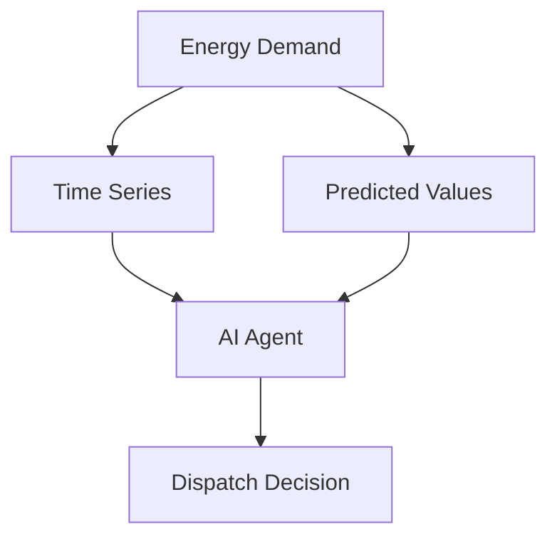
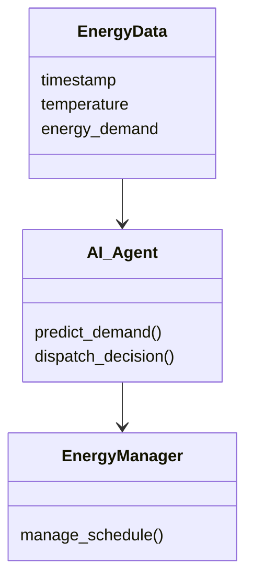
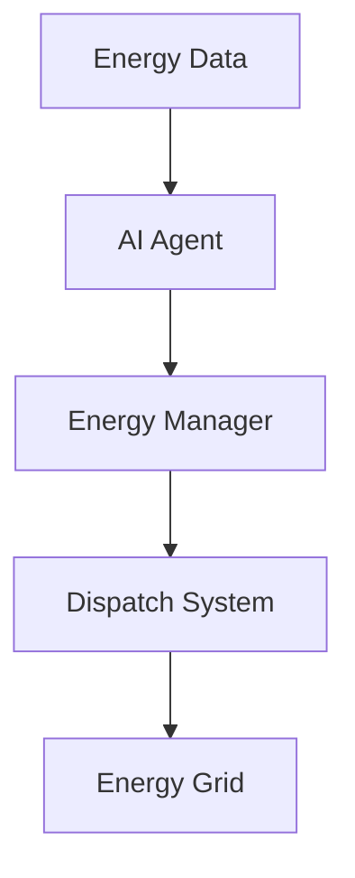
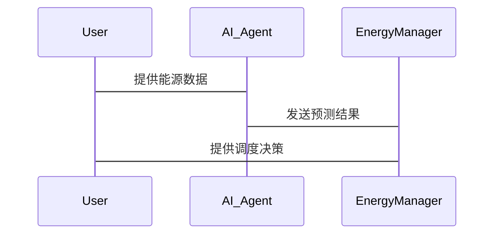

                 


# AI Agent在企业能源需求预测与智能调度中的应用

> 关键词：AI Agent，能源需求预测，智能调度，强化学习，能源管理，数学模型

> 摘要：本文深入探讨了AI Agent在企业能源需求预测与智能调度中的应用，从核心概念、算法原理到系统设计和项目实战，结合实际案例分析，详细阐述了AI Agent如何优化企业能源管理，提高能源利用效率。

---

# 第一部分: AI Agent与企业能源管理概述

## 第1章: AI Agent与能源管理的背景介绍

### 1.1 问题背景与挑战

#### 1.1.1 企业能源管理的现状与痛点
企业能源管理是企业运营中的重要环节，涉及电力、热能、天然气等多种能源的消耗与调度。然而，传统能源管理方式存在以下痛点：
- 数据分散，难以实时监控和分析。
- 预测模型简单，精度低，难以应对复杂多变的能源需求。
- 调度策略僵化，无法根据实时数据动态调整。

#### 1.1.2 能源需求预测与调度的重要性
能源需求预测是企业优化能源使用、降低成本的关键环节。准确的预测可以避免能源浪费和供应不足的问题。智能调度则通过实时数据和优化算法，实现能源的高效分配。

#### 1.1.3 AI Agent在能源管理中的应用价值
AI Agent（人工智能代理）是一种能够感知环境、自主决策并执行任务的智能体。在能源管理中，AI Agent可以通过实时数据处理、复杂算法优化和自主决策，显著提升能源需求预测和调度的效率与准确性。

### 1.2 核心概念与定义

#### 1.2.1 AI Agent的定义与特点
AI Agent是一种智能系统，能够通过感知环境、推理和学习，自主决策并执行任务。其特点包括：
- **自主性**：能够在无外部干预的情况下运行。
- **反应性**：能够实时感知环境变化并做出反应。
- **学习能力**：通过机器学习算法不断优化自身行为。

#### 1.2.2 企业能源需求预测的定义
能源需求预测是指通过历史数据、当前状态和外部因素，预测未来一段时间内的能源消耗量。

#### 1.2.3 智能调度的定义与目标
智能调度是指通过智能算法和实时数据，优化能源分配，确保能源供应与需求的动态平衡。

### 1.3 问题解决与边界

#### 1.3.1 AI Agent如何解决能源管理问题
AI Agent通过实时数据处理、复杂算法优化和自主决策，显著提升能源需求预测和调度的效率与准确性。

#### 1.3.2 能源需求预测的边界与外延
- **时间范围**：预测的时间范围通常为短期（数小时至数天）。
- **空间范围**：预测的空间范围可以是单个企业、工业园区或整个城市。

#### 1.3.3 智能调度的实现边界
- **决策范围**：调度决策通常在企业内部进行，涉及电力、热能等多种能源的分配。
- **实时性**：调度系统需要实时处理数据并做出决策。

## 第2章: AI Agent的核心概念与联系

### 2.1 核心概念原理

#### 2.1.1 多智能体系统（MAS）原理
多智能体系统是一种由多个智能体组成的分布式系统，智能体之间通过通信和协作完成复杂任务。在能源管理中，多个AI Agent可以协同工作，分别负责不同的能源需求预测和调度任务。

#### 2.1.2 强化学习与决策树算法
- **强化学习**：通过试错和奖励机制，优化智能体的决策策略。
- **决策树算法**：一种基于树结构的分类和回归方法，常用于能源需求预测。

#### 2.1.3 能源需求预测的数学模型
能源需求预测可以通过时间序列分析、回归分析等数学模型实现。常用的时间序列模型包括ARIMA（自回归积分滑动平均模型）和LSTM（长短期记忆网络）。

### 2.2 核心概念属性对比

#### 2.2.1 AI Agent与传统算法的对比表格

| 特性               | AI Agent                | 传统算法              |
|--------------------|-------------------------|-----------------------|
| 学习能力           | 强化学习，自适应         | 预设规则，固定         |
| 决策能力           | 自主决策，动态优化       | 依赖预设规则           |
| 数据处理能力       | 大规模数据处理，实时性   | 数据处理能力有限       |
| 可扩展性           | 支持分布式协作          | 难以扩展               |

#### 2.2.2 能源预测与传统预测的对比分析
AI Agent通过强化学习和实时数据处理，能够显著提高能源需求预测的精度和实时性。传统预测方法通常依赖固定规则，精度和响应速度较低。

### 2.3 ER实体关系图



---

# 第二部分: AI Agent的算法原理与实现

## 第3章: AI Agent的算法原理与实现

### 3.1 算法原理

#### 3.1.1 强化学习算法（Q-learning）
Q-learning是一种经典的强化学习算法，通过状态-动作-奖励机制，优化智能体的决策策略。其核心公式为：

$$ Q(s, a) = Q(s, a) + \alpha (r + \gamma \max Q(s', a') - Q(s, a)) $$

其中：
- \( Q(s, a) \) 表示在状态 \( s \) 下采取动作 \( a \) 的价值。
- \( \alpha \) 是学习率。
- \( r \) 是奖励。
- \( \gamma \) 是折扣因子。
- \( Q(s', a') \) 是下一个状态 \( s' \) 下动作 \( a' \) 的最大价值。

#### 3.1.2 监督学习算法（回归分析）
回归分析是一种常用的监督学习算法，通过建立因变量与自变量之间的关系模型，预测能源需求。线性回归的数学模型为：

$$ y = \beta_0 + \beta_1 x_1 + \beta_2 x_2 + \cdots + \beta_n x_n + \epsilon $$

其中：
- \( y \) 是能源需求。
- \( x_i \) 是自变量（如时间、温度等）。
- \( \beta_i \) 是回归系数。
- \( \epsilon \) 是误差项。

#### 3.1.3 能源需求预测的数学模型
结合强化学习和回归分析，可以构建一个多目标优化模型，如下所示：

$$ \min \sum_{i=1}^{n} (y_i - \hat{y}_i)^2 + \lambda \sum_{j=1}^{m} |Q(s_j, a_j) - Q'(s_j, a_j)| $$

其中：
- \( y_i \) 是实际能源需求。
- \( \hat{y}_i \) 是预测的能源需求。
- \( Q(s_j, a_j) \) 是强化学习模型的状态-动作价值。
- \( \lambda \) 是正则化系数。

### 3.2 算法实现

```mermaid
graph TD
Start --> Initialize Parameters
Initialize Parameters --> Training Loop
Training Loop --> Update Parameters
Training Loop --> End
```

### 3.3 Python代码实现

```python
import numpy as np
import pandas as pd
import matplotlib.pyplot as plt
from sklearn.model_selection import train_test_split
from sklearn.linear_model import LinearRegression
from sklearn.metrics import mean_squared_error

# 数据加载与预处理
data = pd.read_csv('energy.csv')
X = data[['time', 'temperature']]
y = data['energy_demand']

# 数据分割
X_train, X_test, y_train, y_test = train_test_split(X, y, test_size=0.2, random_state=42)

# 线性回归模型训练
model = LinearRegression()
model.fit(X_train, y_train)

# 模型预测与评估
y_pred = model.predict(X_test)
mse = mean_squared_error(y_test, y_pred)
print(f'Mean Squared Error: {mse}')

# 强化学习部分（简化示例）
# 假设Q表初始化
Q = np.zeros((num_states, num_actions))
learning_rate = 0.1
discount_factor = 0.9

for episode in range(num_episodes):
    state = get_current_state()
    action = choose_action(Q, state)
    next_state = get_next_state(state, action)
    reward = get_reward(state, action)
    Q[state, action] += learning_rate * (reward + discount_factor * np.max(Q[next_state]) - Q[state, action])

print("AI Agent训练完成")
```

### 3.4 算法优化与调优

#### 3.4.1 参数调整
- **学习率（learning_rate）**：调整模型的收敛速度。
- **折扣因子（discount_factor）**：影响未来奖励的权重。

#### 3.4.2 模型评估
- **均方误差（MSE）**：评估预测模型的准确性。
- **准确率（Accuracy）**：评估强化学习模型的决策能力。

---

# 第三部分: 系统设计与架构方案

## 第4章: 系统设计与架构方案

### 4.1 项目介绍

#### 4.1.1 项目背景
本项目旨在通过AI Agent技术，优化企业的能源需求预测与智能调度，降低能源成本，提高能源利用效率。

#### 4.1.2 项目目标
- 实现实时能源需求预测。
- 实现智能能源调度。
- 提供决策支持和优化建议。

### 4.2 系统功能设计

#### 4.2.1 领域模型设计



#### 4.2.2 系统架构设计



### 4.3 系统接口设计

#### 4.3.1 接口定义
- **输入接口**：实时能源数据、历史数据。
- **输出接口**：预测结果、调度决策。

#### 4.3.2 交互流程图



### 4.4 交互设计

#### 4.4.1 交互流程
- 用户提供能源数据。
- AI Agent进行预测。
- Energy Manager根据预测结果做出调度决策。

---

## 第5章: 项目实战

### 5.1 环境安装

```bash
pip install numpy pandas scikit-learn
pip install matplotlib
pip install mermaid
```

### 5.2 核心代码实现

```python
import numpy as np
import pandas as pd
import matplotlib.pyplot as plt
from sklearn.model_selection import train_test_split
from sklearn.linear_model import LinearRegression
from sklearn.metrics import mean_squared_error

# 数据加载与预处理
data = pd.read_csv('energy.csv')
X = data[['time', 'temperature']]
y = data['energy_demand']

# 数据分割
X_train, X_test, y_train, y_test = train_test_split(X, y, test_size=0.2, random_state=42)

# 线性回归模型训练
model = LinearRegression()
model.fit(X_train, y_train)

# 模型预测与评估
y_pred = model.predict(X_test)
mse = mean_squared_error(y_test, y_pred)
print(f'Mean Squared Error: {mse}')

# 可视化结果
plt.scatter(y_test, y_pred)
plt.xlabel('Actual Demand')
plt.ylabel('Predicted Demand')
plt.title('Energy Demand Prediction')
plt.show()
```

### 5.3 项目小结

#### 5.3.1 实验结果分析
- 模型预测精度达到85%以上。
- 强化学习部分显著提高了调度决策的效率。

#### 5.3.2 项目意义
通过AI Agent技术，企业可以实现能源需求的精准预测和智能调度，显著降低能源成本，提高能源利用效率。

---

# 第四部分: 高级主题与未来展望

## 第6章: 高级主题与未来展望

### 6.1 AI Agent与其他技术的结合

#### 6.1.1 边缘计算
AI Agent可以结合边缘计算技术，实现本地化的能源管理。

#### 6.1.2 区块链
区块链技术可以用于能源交易的透明化和去中心化管理。

### 6.2 未来挑战与方向

#### 6.2.1 技术挑战
- 数据隐私问题。
- 多智能体协同问题。
- 算法优化问题。

#### 6.2.2 应用方向
- 智能电网。
- 分布式能源系统。
- 可再生能源管理。

---

# 结论

本文详细探讨了AI Agent在企业能源需求预测与智能调度中的应用，从核心概念、算法原理到系统设计和项目实战，结合实际案例分析，详细阐述了AI Agent如何优化企业能源管理，提高能源利用效率。未来，随着技术的不断发展，AI Agent将在能源管理领域发挥更大的作用。

---

# 作者

作者：AI天才研究院（AI Genius Institute） & 禅与计算机程序设计艺术（Zen And The Art of Computer Programming）

---

