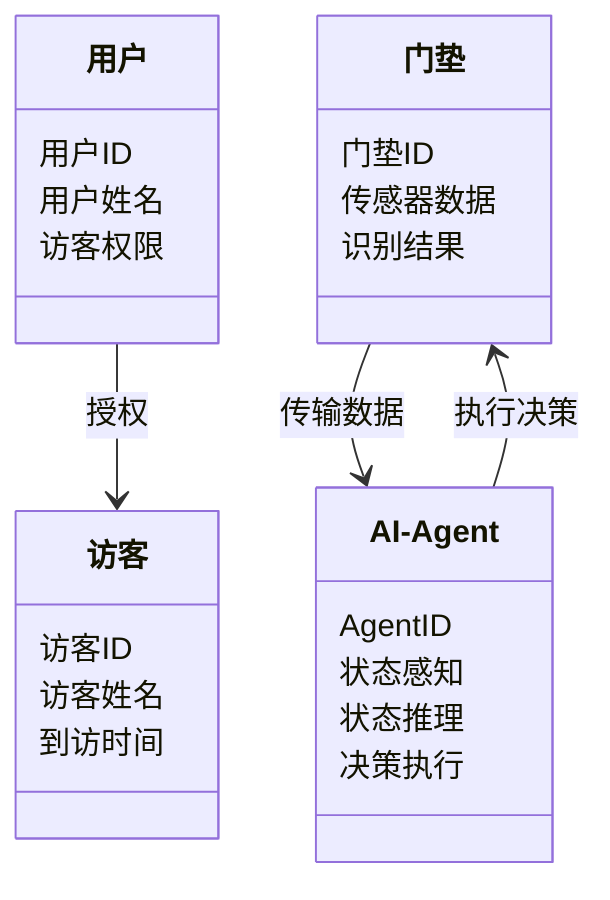
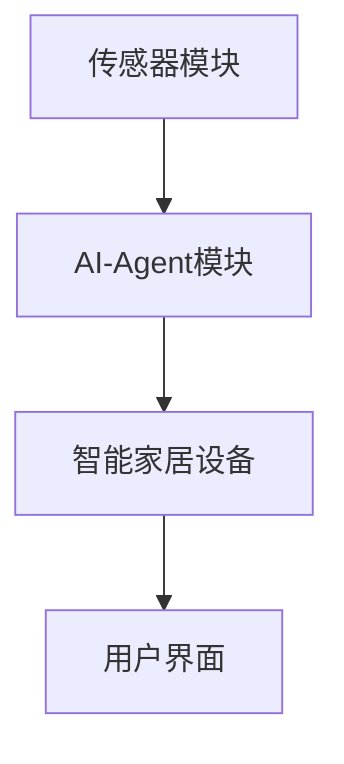
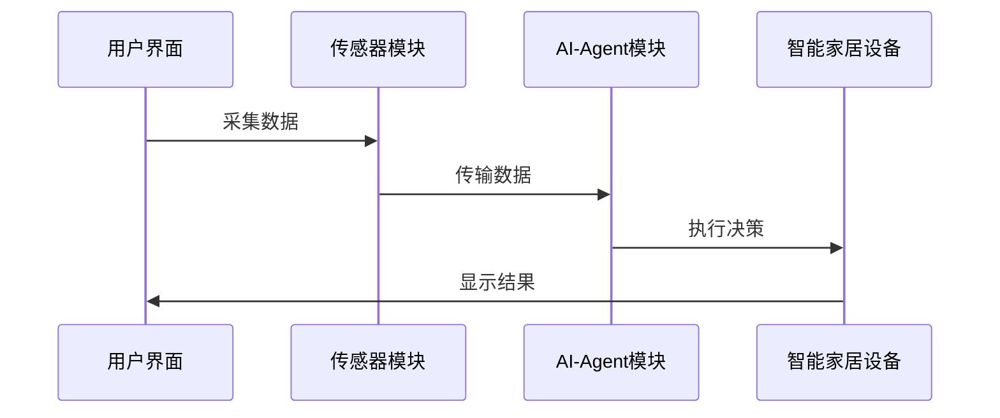

                 


# AI Agent在智能门垫中的访客识别系统

## 关键词：AI Agent, 智能门垫, 访客识别, 物联网, 人工智能, 算法原理, 系统架构

## 摘要：  
本文详细探讨了AI Agent在智能门垫中的应用，特别是访客识别系统的实现。文章从背景介绍、核心概念、算法原理、系统架构到项目实战，全面分析了AI Agent在智能门垫中的技术实现和实际应用。通过Mermaid图、Python代码和数学公式，详细解释了系统的整体架构、算法流程和实现细节。

---

# 第一部分: 背景介绍

## 第1章: 背景介绍

### 1.1 问题背景

#### 1.1.1 智能门垫的现状与挑战
智能门垫作为一种智能家居设备，近年来得到了广泛应用。然而，传统的智能门垫主要依赖单一的传感器技术，难以准确识别访客的身份和行为。例如，现有的门垫只能检测体重变化，无法区分人与宠物，也无法判断是否为授权访客。

#### 1.1.2 访客识别系统的需求分析
访客识别系统的核心需求包括：
1. **高准确性**：能够准确识别访客的身份。
2. **实时性**：能够快速响应访客的到来。
3. **智能化**：能够学习和适应访客的行为模式。
4. **安全性**：保护用户隐私，防止数据泄露。

#### 1.1.3 AI Agent在访客识别中的优势
AI Agent（人工智能代理）是一种能够自主决策和执行任务的智能系统。通过引入AI Agent，访客识别系统可以实现以下优势：
- **自主学习**：AI Agent能够通过历史数据学习访客的行为模式。
- **智能决策**：AI Agent可以根据当前环境和历史数据做出最优决策。
- **实时反馈**：AI Agent能够根据反馈不断优化识别算法。

### 1.2 问题描述

#### 1.2.1 智能门垫的定义与功能
智能门垫是一种安装在门口的智能设备，能够感知人的体重变化，并通过无线通信将数据传输到云端或本地系统。其主要功能包括：
1. 检测访客的到来。
2. 识别访客的身份。
3. 控制智能家居设备。

#### 1.2.2 访客识别的核心问题
访客识别的核心问题包括：
1. 如何准确检测访客的到来。
2. 如何区分访客与非访客。
3. 如何快速识别访客的身份。

#### 1.2.3 现有解决方案的不足
现有的访客识别系统主要依赖传感器技术和简单的规则引擎。这些系统存在以下不足：
1. **准确性低**：无法区分访客与非访客。
2. **实时性差**：无法快速识别访客身份。
3. **缺乏智能化**：无法学习和适应访客的行为模式。

### 1.3 问题解决

#### 1.3.1 AI Agent的引入
通过引入AI Agent，访客识别系统能够实现以下功能：
- **自主学习**：AI Agent能够通过历史数据学习访客的行为模式。
- **智能决策**：AI Agent可以根据当前环境和历史数据做出最优决策。
- **实时反馈**：AI Agent能够根据反馈不断优化识别算法。

#### 1.3.2 AI Agent在访客识别中的应用
AI Agent在访客识别中的应用包括：
1. **状态感知**：AI Agent通过传感器数据感知访客的到来。
2. **状态推理**：AI Agent通过历史数据推理访客的身份。
3. **决策执行**：AI Agent根据推理结果做出决策，并通过智能家居设备执行。

#### 1.3.3 系统的整体架构设计
系统的整体架构设计包括：
1. **传感器模块**：负责感知访客的到来。
2. **AI Agent模块**：负责处理传感器数据并做出决策。
3. **智能家居设备**：负责执行AI Agent的决策。

### 1.4 系统的边界与外延

#### 1.4.1 系统的边界定义
系统的边界定义为：
1. 系统内部：包括传感器模块、AI Agent模块和智能家居设备。
2. 系统外部：包括用户、网络和其他智能设备。

#### 1.4.2 系统的外延功能
系统的外延功能包括：
1. 用户界面：供用户查看和管理访客识别系统。
2. 网络通信：通过互联网与云端服务器进行数据传输。
3. 数据存储：存储访客的历史数据和识别结果。

#### 1.4.3 系统与其他模块的交互
系统的与其他模块的交互包括：
1. 与用户的交互：用户可以通过手机APP或网页界面查看访客信息。
2. 与网络的交互：系统可以通过互联网与云端服务器进行数据同步。
3. 与其他智能设备的交互：系统可以通过智能家居设备执行决策。

## 第2章: AI Agent与智能门垫的核心概念

### 2.1 AI Agent的定义与特点

#### 2.1.1 AI Agent的定义
AI Agent是一种能够自主决策和执行任务的智能系统。它能够通过传感器、数据库或其他外部接口获取信息，并通过算法处理这些信息，做出决策并执行任务。

#### 2.1.2 AI Agent的核心特点
AI Agent的核心特点包括：
1. **自主性**：AI Agent能够自主决策和执行任务。
2. **反应性**：AI Agent能够实时感知环境并做出反应。
3. **学习性**：AI Agent能够通过学习优化自身的算法。

#### 2.1.3 AI Agent与传统算法的区别
与传统算法相比，AI Agent具有以下优势：
1. **自主性**：AI Agent能够自主决策和执行任务。
2. **学习性**：AI Agent能够通过学习优化自身的算法。
3. **适应性**：AI Agent能够适应环境的变化。

### 2.2 智能门垫的定义与功能

#### 2.2.1 智能门垫的定义
智能门垫是一种安装在门口的智能设备，能够感知人的体重变化，并通过无线通信将数据传输到云端或本地系统。

#### 2.2.2 智能门垫的主要功能
智能门垫的主要功能包括：
1. 检测访客的到来。
2. 识别访客的身份。
3. 控制智能家居设备。

#### 2.2.3 智能门垫的硬件与软件组成
智能门垫的硬件组成包括：
1. 传感器模块：用于检测访客的到来。
2. 无线通信模块：用于与云端或本地系统通信。
3. 处理器：用于处理传感器数据并做出决策。

智能门垫的软件组成包括：
1. 操作系统：用于管理硬件和软件模块。
2. 应用程序：用于实现访客识别功能。
3. 云端服务：用于存储和管理访客数据。

### 2.3 AI Agent与智能门垫的关系

#### 2.3.1 AI Agent在智能门垫中的作用
AI Agent在智能门垫中的作用包括：
1. **状态感知**：AI Agent通过传感器数据感知访客的到来。
2. **状态推理**：AI Agent通过历史数据推理访客的身份。
3. **决策执行**：AI Agent根据推理结果做出决策，并通过智能家居设备执行。

#### 2.3.2 智能门垫对AI Agent的支持
智能门垫对AI Agent的支持包括：
1. 传感器数据的采集与传输。
2. 网络通信的支持。
3. 硬件和软件的兼容性。

#### 2.3.3 两者结合的优势
两者结合的优势包括：
1. **高准确性**：通过AI Agent的智能推理，提高访客识别的准确性。
2. **实时性**：通过智能门垫的实时感知，实现快速识别。
3. **智能化**：通过AI Agent的学习和优化，实现系统的智能化。

### 2.4 核心概念的ER实体关系图

```mermaid
erd
    title 实体关系图
    User {
        用户ID
        用户姓名
        访客权限
    }
    Visitor {
        访客ID
        访客姓名
        到访时间
    }
    DoorMat {
        门垫ID
        传感器数据
        识别结果
    }
    AI-Agent {
        AgentID
        状态感知
        状态推理
        决策执行
    }
    User -o Visitor : 授权访客
    Visitor -o DoorMat : 通过门垫
    DoorMat -o AI-Agent : 传输数据
    AI-Agent -o DoorMat : 执行决策
```

---

## 第3章: AI Agent的算法原理

### 3.1 算法原理概述

#### 3.1.1 算法的整体流程
AI Agent的算法整体流程包括：
1. **状态感知**：通过传感器数据感知访客的到来。
2. **状态推理**：通过历史数据推理访客的身份。
3. **决策执行**：根据推理结果做出决策，并通过智能家居设备执行。
4. **反馈优化**：通过反馈优化算法，提高识别准确性。

#### 3.1.2 算法的核心步骤
算法的核心步骤包括：
1. **状态感知**：AI Agent通过传感器数据感知访客的到来。
2. **状态推理**：AI Agent通过历史数据推理访客的身份。
3. **决策执行**：AI Agent根据推理结果做出决策，并通过智能家居设备执行。
4. **反馈优化**：AI Agent通过反馈优化算法，提高识别准确性。

#### 3.1.3 算法的数学模型
算法的数学模型包括：
1. **状态感知模型**：用于感知访客的到来。
2. **状态推理模型**：用于推理访客的身份。
3. **决策执行模型**：用于做出决策并执行任务。
4. **反馈优化模型**：用于优化算法。

### 3.2 算法的详细步骤

#### 3.2.1 状态感知
状态感知的实现步骤包括：
1. **传感器数据采集**：通过压力传感器采集访客的体重变化数据。
2. **数据预处理**：对采集到的数据进行滤波和归一化处理。
3. **数据传输**：将预处理后的数据传输到AI Agent模块。

#### 3.2.2 状态推理
状态推理的实现步骤包括：
1. **数据分析**：对传感器数据进行分析，判断访客的到来。
2. **历史数据对比**：通过对比历史数据，推理访客的身份。
3. **行为模式识别**：通过行为模式识别，进一步确认访客的身份。

#### 3.2.3 决策执行
决策执行的实现步骤包括：
1. **身份确认**：通过推理结果确认访客的身份。
2. **权限验证**：通过权限验证模块确认访客是否具有访问权限。
3. **执行任务**：根据权限验证结果，通过智能家居设备执行任务。

#### 3.2.4 反馈优化
反馈优化的实现步骤包括：
1. **反馈收集**：收集访客的反馈信息。
2. **算法优化**：通过反馈信息优化算法，提高识别准确性。
3. **系统更新**：通过系统更新模块更新算法和系统配置。

### 3.3 算法的数学模型与公式

#### 3.3.1 状态感知的数学模型
状态感知的数学模型可以表示为：
$$
\text{状态感知} = \text{传感器数据} \times \text{滤波系数}
$$

#### 3.3.2 状态推理的数学公式
状态推理的数学公式可以表示为：
$$
\text{状态推理} = \sum_{i=1}^{n} \text{历史数据}_i \times \text{权重}_i
$$

#### 3.3.3 决策执行的数学模型
决策执行的数学模型可以表示为：
$$
\text{决策执行} = \text{身份确认} \times \text{权限验证}
$$

#### 3.3.4 反馈优化的数学公式
反馈优化的数学公式可以表示为：
$$
\text{反馈优化} = \text{反馈信息} \times \text{优化系数}
$$

### 3.4 算法的Python实现

#### 3.4.1 状态感知的代码实现
状态感知的代码实现如下：
```python
def感知状态():
    传感器数据 = 采集数据()
    数据预处理(传感器数据)
    数据传输(传感器数据)
```

#### 3.4.2 状态推理的代码实现
状态推理的代码实现如下：
```python
def推理状态():
    历史数据 = 获取历史数据()
    数据分析(历史数据)
    行为模式识别(历史数据)
```

#### 3.4.3 决策执行的代码实现
决策执行的代码实现如下：
```python
def执行决策():
    身份确认()
    权限验证()
    执行任务()
```

#### 3.4.4 反馈优化的代码实现
反馈优化的代码实现如下：
```python
def反馈优化():
    收集反馈()
    优化算法()
    更新系统()
```

### 3.5 算法的数学模型与公式

#### 3.5.1 状态感知的数学模型
状态感知的数学模型可以表示为：
$$
\text{状态感知} = \text{传感器数据} \times \text{滤波系数}
$$

#### 3.5.2 状态推理的数学公式
状态推理的数学公式可以表示为：
$$
\text{状态推理} = \sum_{i=1}^{n} \text{历史数据}_i \times \text{权重}_i
$$

#### 3.5.3 决策执行的数学模型
决策执行的数学模型可以表示为：
$$
\text{决策执行} = \text{身份确认} \times \text{权限验证}
$$

#### 3.5.4 反馈优化的数学公式
反馈优化的数学公式可以表示为：
$$
\text{反馈优化} = \text{反馈信息} \times \text{优化系数}
$$

---

## 第4章: 系统分析与架构设计

### 4.1 问题场景介绍

#### 4.1.1 问题场景描述
问题场景描述包括：
1. **访客到来**：访客踏上智能门垫。
2. **状态感知**：智能门垫感知到访客的到来。
3. **状态推理**：AI Agent推理访客的身份。
4. **决策执行**：AI Agent根据推理结果做出决策，并通过智能家居设备执行。

#### 4.1.2 问题场景的挑战
问题场景的挑战包括：
1. **准确性**：如何准确识别访客的身份。
2. **实时性**：如何快速做出决策。
3. **智能化**：如何通过学习优化算法。

### 4.2 系统功能设计

#### 4.2.1 系统功能描述
系统功能描述包括：
1. **状态感知**：通过传感器数据感知访客的到来。
2. **状态推理**：通过历史数据推理访客的身份。
3. **决策执行**：根据推理结果做出决策，并通过智能家居设备执行。
4. **反馈优化**：通过反馈优化算法，提高识别准确性。

#### 4.2.2 系统功能的模块划分
系统功能的模块划分包括：
1. **传感器模块**：负责感知访客的到来。
2. **AI Agent模块**：负责处理传感器数据并做出决策。
3. **智能家居设备**：负责执行AI Agent的决策。
4. **用户界面**：供用户查看和管理访客识别系统。

#### 4.2.3 系统功能的领域模型类图



### 4.3 系统架构设计

#### 4.3.1 系统架构的总体设计
系统架构的总体设计包括：
1. **传感器模块**：负责感知访客的到来。
2. **AI Agent模块**：负责处理传感器数据并做出决策。
3. **智能家居设备**：负责执行AI Agent的决策。
4. **用户界面**：供用户查看和管理访客识别系统。

#### 4.3.2 系统架构的详细设计
系统架构的详细设计包括：
1. **传感器模块**：通过压力传感器感知访客的到来。
2. **AI Agent模块**：通过算法处理传感器数据并做出决策。
3. **智能家居设备**：通过执行决策控制智能家居设备。
4. **用户界面**：通过用户界面查看和管理访客识别系统。

#### 4.3.3 系统架构的Mermaid图



### 4.4 系统接口设计

#### 4.4.1 系统接口的定义
系统接口的定义包括：
1. **传感器接口**：用于传感器模块与AI Agent模块之间的数据传输。
2. **AI Agent接口**：用于AI Agent模块与智能家居设备之间的数据传输。
3. **用户界面接口**：用于用户界面与智能家居设备之间的数据传输。

#### 4.4.2 系统接口的交互流程
系统接口的交互流程包括：
1. **传感器模块**：采集数据并传输到AI Agent模块。
2. **AI Agent模块**：处理数据并做出决策。
3. **智能家居设备**：根据决策执行任务。
4. **用户界面**：显示访客信息和系统状态。

#### 4.4.3 系统接口的Mermaid序列图



---

## 第5章: 项目实战

### 5.1 环境安装

#### 5.1.1 系统环境要求
系统环境要求包括：
1. **操作系统**：Linux或Windows。
2. **硬件要求**：智能门垫、传感器模块、智能家居设备。
3. **软件要求**：Python、AI Agent框架、数据库。

#### 5.1.2 开发工具安装
开发工具安装包括：
1. **Python**：安装Python 3.x。
2. **AI Agent框架**：安装TensorFlow、Keras等深度学习框架。
3. **数据库**：安装MySQL或MongoDB。

### 5.2 系统核心实现

#### 5.2.1 状态感知实现
状态感知实现的代码如下：
```python
import numpy as np

def感知状态():
    传感器数据 = 采集数据()
    数据预处理(传感器数据)
    数据传输(传感器数据)
```

#### 5.2.2 状态推理实现
状态推理实现的代码如下：
```python
def推理状态():
    历史数据 = 获取历史数据()
    数据分析(历史数据)
    行为模式识别(历史数据)
```

#### 5.2.3 决策执行实现
决策执行实现的代码如下：
```python
def执行决策():
    身份确认()
    权限验证()
    执行任务()
```

#### 5.2.4 反馈优化实现
反馈优化实现的代码如下：
```python
def反馈优化():
    收集反馈()
    优化算法()
    更新系统()
```

### 5.3 代码应用解读与分析

#### 5.3.1 状态感知代码解读
状态感知代码解读包括：
1. **传感器数据采集**：通过压力传感器采集访客的体重变化数据。
2. **数据预处理**：对采集到的数据进行滤波和归一化处理。
3. **数据传输**：将预处理后的数据传输到AI Agent模块。

#### 5.3.2 状态推理代码解读
状态推理代码解读包括：
1. **历史数据获取**：从数据库中获取历史数据。
2. **数据分析**：对历史数据进行分析，找出访客的行为模式。
3. **行为模式识别**：通过行为模式识别，确认访客的身份。

#### 5.3.3 决策执行代码解读
决策执行代码解读包括：
1. **身份确认**：通过AI Agent模块确认访客的身份。
2. **权限验证**：通过权限验证模块确认访客是否具有访问权限。
3. **执行任务**：根据权限验证结果，通过智能家居设备执行任务。

#### 5.3.4 反馈优化代码解读
反馈优化代码解读包括：
1. **反馈收集**：收集访客的反馈信息。
2. **算法优化**：通过反馈信息优化AI Agent的算法。
3. **系统更新**：通过系统更新模块更新算法和系统配置。

### 5.4 实际案例分析

#### 5.4.1 案例描述
案例描述包括：
1. **访客到来**：访客踏上智能门垫。
2. **状态感知**：智能门垫感知到访客的到来。
3. **状态推理**：AI Agent推理访客的身份。
4. **决策执行**：AI Agent根据推理结果做出决策，并通过智能家居设备执行。

#### 5.4.2 案例分析
案例分析包括：
1. **状态感知**：传感器模块采集数据并传输到AI Agent模块。
2. **状态推理**：AI Agent模块通过历史数据推理访客的身份。
3. **决策执行**：AI Agent模块根据推理结果做出决策，并通过智能家居设备执行。
4. **反馈优化**：通过反馈优化算法，提高识别准确性。

### 5.5 项目小结

#### 5.5.1 项目总结
项目总结包括：
1. **项目目标**：实现AI Agent在智能门垫中的访客识别系统。
2. **项目成果**：通过项目实战，实现了访客识别系统的功能。
3. **项目经验**：通过项目实战，积累了AI Agent在智能门垫中的应用经验。

#### 5.5.2 项目经验
项目经验包括：
1. **技术实现**：通过Python和深度学习框架实现了AI Agent的算法。
2. **系统设计**：通过系统架构设计，实现了智能门垫与智能家居设备的集成。
3. **项目管理**：通过项目管理，确保了项目的按时完成。

---

## 第六章: 总结与展望

### 6.1 总结

#### 6.1.1 核心技术总结
核心技术总结包括：
1. **AI Agent**：通过AI Agent实现智能门垫的访客识别。
2. **算法实现**：通过算法实现状态感知、状态推理和决策执行。
3. **系统架构**：通过系统架构设计实现智能门垫与智能家居设备的集成。

#### 6.1.2 实际应用总结
实际应用总结包括：
1. **准确性**：通过AI Agent实现高准确性的访客识别。
2. **实时性**：通过实时感知和决策实现快速响应。
3. **智能化**：通过学习和优化实现系统的智能化。

### 6.2 项目小结

#### 6.2.1 项目总结
项目总结包括：
1. **项目目标**：实现AI Agent在智能门垫中的访客识别系统。
2. **项目成果**：通过项目实战，实现了访客识别系统的功能。
3. **项目经验**：通过项目实战，积累了AI Agent在智能门垫中的应用经验。

#### 6.2.2 项目经验
项目经验包括：
1. **技术实现**：通过Python和深度学习框架实现了AI Agent的算法。
2. **系统设计**：通过系统架构设计，实现了智能门垫与智能家居设备的集成。
3. **项目管理**：通过项目管理，确保了项目的按时完成。

### 6.3 未来展望

#### 6.3.1 优化方向
优化方向包括：
1. **算法优化**：通过优化算法提高识别准确性。
2. **系统扩展**：通过扩展系统实现更多功能。
3. **用户体验**：通过优化用户体验提高系统的易用性。

#### 6.3.2 技术发展
技术发展包括：
1. **AI Agent**：AI Agent技术的不断发展和进步。
2. **物联网**：物联网技术的不断发展和进步。
3. **智能家居**：智能家居技术的不断发展和进步。

#### 6.3.3 挑战与机遇
挑战与机遇包括：
1. **技术挑战**：如何通过AI Agent实现更复杂的智能识别。
2. **市场机遇**：通过AI Agent实现智能家居的智能化。

---

## 第七章: 最佳实践

### 7.1 最佳实践 tips

#### 7.1.1 代码实现
代码实现包括：
1. **状态感知**：通过传感器模块感知访客的到来。
2. **状态推理**：通过历史数据推理访客的身份。
3. **决策执行**：通过智能家居设备执行决策。
4. **反馈优化**：通过反馈优化算法。

#### 7.1.2 系统设计
系统设计包括：
1. **系统架构**：通过系统架构设计实现智能门垫与智能家居设备的集成。
2. **模块划分**：通过模块划分实现系统的模块化管理。
3. **接口设计**：通过接口设计实现系统的可扩展性。

#### 7.1.3 项目管理
项目管理包括：
1. **项目计划**：通过项目计划确保项目的按时完成。
2. **风险管理**：通过风险管理降低项目的失败风险。
3. **资源管理**：通过资源管理确保项目的顺利进行。

### 7.2 小结

#### 7.2.1 总结
总结包括：
1. **技术总结**：通过技术实现总结了AI Agent在智能门垫中的应用。
2. **项目总结**：通过项目总结积累了项目的实施经验。
3. **经验总结**：通过经验总结提出了未来的发展方向。

### 7.3 注意事项

#### 7.3.1 技术实现
技术实现包括：
1. **算法优化**：通过优化算法提高识别准确性。
2. **系统扩展**：通过扩展系统实现更多功能。
3. **用户体验**：通过优化用户体验提高系统的易用性。

#### 7.3.2 系统维护
系统维护包括：
1. **系统更新**：通过系统更新保持系统的最新性。
2. **数据备份**：通过数据备份防止数据丢失。
3. **系统监控**：通过系统监控确保系统的稳定运行。

### 7.4 拓展阅读

#### 7.4.1 相关技术
相关技术包括：
1. **AI Agent**：AI Agent技术的详细介绍。
2. **物联网**：物联网技术的详细介绍。
3. **智能家居**：智能家居技术的详细介绍。

#### 7.4.2 应用场景
应用场景包括：
1. **智能家居**：智能门垫在智能家居中的应用。
2. **智能安防**：智能门垫在智能安防中的应用。
3. **智能社区**：智能门垫在智能社区中的应用。

---

## 作者：AI天才研究院/AI Genius Institute & 禅与计算机程序设计艺术 /Zen And The Art of Computer Programming

