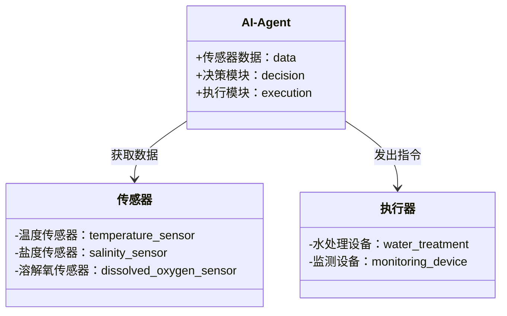
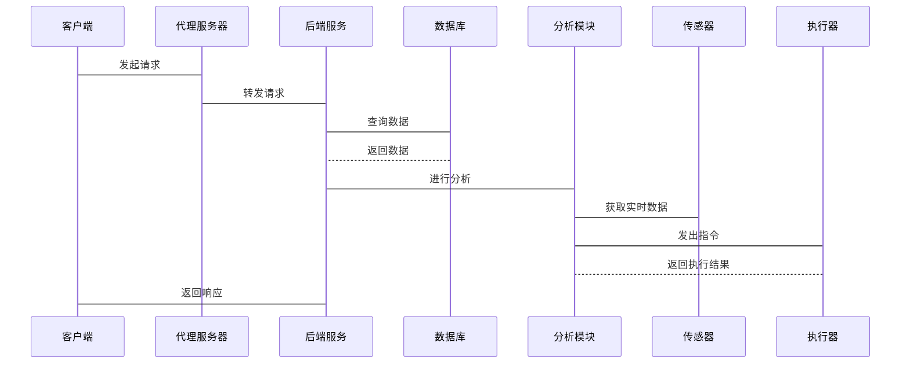

                 


```markdown
# AI Agent在海洋科学中的应用：海洋资源管理与保护

**关键词**：AI Agent、海洋科学、海洋资源管理、海洋保护、人工智能、资源监测

**摘要**：本文探讨AI Agent在海洋科学中的应用，特别是如何利用AI技术进行海洋资源管理与保护。文章从AI Agent的基本概念和原理出发，分析其在海洋环境监测、资源保护和可持续利用中的作用，详细讲解相关算法和系统架构，并通过实际案例展示其应用效果，最后总结AI Agent在海洋科学中的价值和未来发展方向。

---

# 第1章: AI Agent与海洋科学的背景介绍

## 1.1 AI Agent的基本概念

### 1.1.1 AI Agent的定义与特点

**AI Agent**（人工智能代理）是一种能够感知环境、自主决策并执行任务的智能实体。与传统算法相比，AI Agent具备以下特点：

- **自主性**：能够自主决策，无需外部干预。
- **反应性**：能实时感知环境变化并做出反应。
- **目标导向**：具备明确的目标，行动以实现目标为导向。
- **学习能力**：通过数据学习优化决策和执行策略。

### 1.1.2 AI Agent的核心原理

AI Agent的核心原理包括感知、决策和执行三个步骤：

1. **感知**：通过传感器或其他数据源获取环境信息。
2. **决策**：基于感知数据，结合预设算法做出决策。
3. **执行**：根据决策结果，执行相应操作。

### 1.1.3 AI Agent与传统算法的对比

| 特性         | AI Agent                     | 传统算法                     |
|--------------|----------------------------|------------------------------|
| 自主性       | 高                          | 低                          |
| 反应性       | 强                          | 弱                          |
| 学习能力     | 强，能通过数据优化策略       | 无或弱                      |
| 应用场景     | 复杂、动态环境                | 简单、静态环境                |

## 1.2 海洋科学中的AI Agent应用背景

### 1.2.1 海洋资源管理的挑战

海洋资源管理面临以下挑战：

- **环境复杂性**：海洋环境复杂多变，资源分布不均。
- **数据多样性**：需要处理多源异构数据，如水质、生物多样性等。
- **实时性要求**：需要实时监测和快速响应。

### 1.2.2 AI Agent在海洋保护中的作用

AI Agent在海洋保护中的作用包括：

- **实时监测**：实时感知海洋环境，及时发现异常。
- **智能决策**：基于数据优化资源管理策略。
- **动态调整**：根据环境变化动态调整保护措施。

### 1.2.3 当前技术的局限性与AI Agent的解决方案

当前技术在海洋管理中的局限性：

- **处理能力不足**：传统算法难以处理海量数据。
- **决策效率低下**：人工决策耗时且不够精确。

AI Agent的解决方案：

- **提高处理能力**：通过分布式计算和并行处理提升数据处理效率。
- **优化决策流程**：利用强化学习等算法实现高效决策。

## 1.3 本章小结

本章介绍了AI Agent的基本概念和核心原理，分析了其在海洋科学中的应用背景，并指出了传统技术的局限性和AI Agent的解决方案。

---

# 第2章: AI Agent的核心原理与技术

## 2.1 AI Agent的感知机制

### 2.1.1 数据采集与处理

AI Agent通过多种传感器采集数据，包括温度、盐度、溶解氧等参数。数据预处理步骤如下：

1. **数据清洗**：去除噪声和异常值。
2. **特征提取**：提取关键特征，如时间序列特征。
3. **数据融合**：将多源数据融合，提升准确性。

### 2.1.2 感知模型的构建

感知模型基于机器学习算法构建，常用模型包括：

- **支持向量机（SVM）**：用于分类任务。
- **随机森林（Random Forest）**：用于回归和分类任务。

### 2.1.3 感知数据的分析与处理

感知数据的分析包括：

- **异常检测**：识别异常数据点。
- **趋势分析**：分析数据变化趋势。
- **预测模型**：建立预测模型，预测未来环境状态。

## 2.2 AI Agent的决策机制

### 2.2.1 决策模型的构建

决策模型基于强化学习构建，常用算法包括：

- **Q-Learning**：通过奖励机制优化决策策略。
- **Deep Q-Network（DQN）**：使用深度神经网络近似Q值函数。

### 2.2.2 多目标优化算法

多目标优化算法用于在多个目标之间寻找平衡点，常用算法包括：

- **非支配排序遗传算法（NSGA）**：用于多目标优化。
- **帕累托前沿方法**：寻找最优解集合。

### 2.2.3 决策结果的评估与优化

决策结果通过以下步骤进行评估：

1. **结果验证**：验证决策的可行性。
2. **效果评估**：评估决策效果。
3. **优化调整**：根据评估结果优化决策策略。

## 2.3 AI Agent的执行机制

### 2.3.1 执行策略的制定

执行策略基于决策结果制定，包括：

- **具体行动方案**：如启动某个设备或执行某项任务。
- **优先级排序**：根据紧急程度排序执行任务。

### 2.3.2 执行过程的监控

执行过程监控包括：

- **实时跟踪**：实时跟踪任务执行情况。
- **状态反馈**：将执行状态反馈给决策模块。

### 2.3.3 执行结果的反馈与调整

执行结果反馈包括：

1. **结果分析**：分析执行结果是否符合预期。
2. **策略调整**：根据结果调整执行策略。

## 2.4 本章小结

本章详细讲解了AI Agent的核心原理与技术，包括感知、决策和执行机制，分析了相关算法和模型。

---

# 第3章: AI Agent在海洋资源管理中的应用

## 3.1 海洋环境监测

### 3.1.1 海洋水质监测

AI Agent通过传感器实时监测水质参数，如温度、盐度、溶解氧等。水质监测模型如下：

$$
\text{水质指数} = a \times \text{温度} + b \times \text{盐度} + c \times \text{溶解氧}
$$

其中，\(a\)、\(b\)、\(c\)为权重系数。

### 3.1.2 海洋生态系统的监测

AI Agent监测海洋生态系统的健康状况，包括生物多样性和生态平衡。生物多样性指数计算公式：

$$
\text{生物多样性指数} = \sum_{i=1}^{n} p_i \times \ln(p_i)
$$

其中，\(p_i\)为物种i的相对丰度。

### 3.1.3 海洋污染的实时监测与预警

AI Agent通过实时数据分析，识别污染源并发出预警。预警模型基于聚类算法实现。

## 3.2 海洋资源保护

### 3.2.1 海洋生物多样性保护

AI Agent通过优化保护区划，保护濒危物种。保护区划模型基于空间分析和优化算法。

### 3.2.2 海洋保护区的动态管理

AI Agent根据环境变化动态调整保护区划，确保保护效果最大化。动态调整算法基于强化学习。

### 3.2.3 海洋资源的可持续利用

AI Agent优化资源利用策略，实现资源的可持续利用。资源分配模型基于线性规划。

## 3.3 本章小结

本章详细讲解了AI Agent在海洋环境监测和资源保护中的应用，分析了具体应用场景和算法实现。

---

# 第4章: AI Agent的算法原理与实现

## 4.1 多智能体协作算法

### 4.1.1 多智能体协作的基本原理

多智能体协作通过分布式计算实现，各智能体之间通过消息传递协同工作。协作流程如下：

1. **任务分配**：根据各智能体的能力分配任务。
2. **协同执行**：各智能体协同执行任务。
3. **结果汇总**：汇总各智能体的执行结果。

### 4.1.2 多智能体协作的实现方法

实现方法包括：

- **基于规则的协作**：预定义协作规则。
- **基于拍卖的协作**：通过拍卖机制分配任务。
- **基于市场的协作**：模拟市场机制实现协作。

### 4.1.3 多智能体协作在海洋科学中的应用

多智能体协作应用于海洋环境监测，各智能体协同完成数据采集和分析。

## 4.2 强化学习算法

### 4.2.1 强化学习的基本原理

强化学习通过智能体与环境的交互，学习最优策略。基本流程如下：

1. **状态感知**：感知环境状态。
2. **动作选择**：基于当前状态选择动作。
3. **奖励机制**：根据动作结果获得奖励或惩罚。
4. **策略更新**：根据奖励更新策略。

### 4.2.2 强化学习在AI Agent中的应用

强化学习应用于海洋资源管理，优化资源分配策略。常用算法包括Q-Learning和Deep Q-Network。

### 4.2.3 强化学习的优化方法

优化方法包括：

- **经验回放**：通过回放历史经验优化策略。
- **目标网络**：使用目标网络稳定学习过程。

## 4.3 聚类与分类算法

### 4.3.1 聚类算法的基本原理

聚类算法通过将数据分成若干簇，识别数据分布规律。常用算法包括K-means和DBSCAN。

### 4.3.2 分类算法的基本原理

分类算法通过训练模型，对新数据进行分类。常用算法包括SVM和随机森林。

### 4.3.3 聚类与分类在海洋资源管理中的应用

聚类算法用于识别海洋环境的相似区域，分类算法用于识别不同类型的资源分布。

## 4.4 本章小结

本章详细讲解了AI Agent中的多智能体协作、强化学习和聚类分类算法，分析了其在海洋资源管理中的应用。

---

# 第5章: 系统分析与架构设计方案

## 5.1 问题场景介绍

海洋资源管理面临环境复杂、数据多样、实时性要求高等挑战。AI Agent系统通过智能化管理，解决这些问题。

## 5.2 系统功能设计

### 5.2.1 领域模型（Mermaid类图）



### 5.2.2 系统架构设计（Mermaid架构图）


### 5.2.3 系统接口设计

系统接口包括：

- **数据采集接口**：与传感器连接，获取环境数据。
- **决策接口**：接收决策模块的指令，执行相应操作。
- **监控接口**：实时监控系统运行状态。

### 5.2.4 系统交互（Mermaid序列图）



## 5.3 本章小结

本章分析了AI Agent系统的架构设计，包括系统功能、接口设计和交互流程。

---

# 第6章: 项目实战

## 6.1 环境安装

### 6.1.1 安装Python环境

使用Anaconda安装Python 3.8及以上版本。

### 6.1.2 安装依赖库

安装以下依赖库：

```bash
pip install numpy pandas scikit-learn tensorflow
```

## 6.2 系统核心实现源代码

### 6.2.1 感知模块代码

```python
import numpy as np
from sklearn.svm import SVC

# 感知模块
class PerceptionModule:
    def __init__(self):
        self.model = SVC()

    def train(self, X, y):
        self.model.fit(X, y)

    def predict(self, X):
        return self.model.predict(X)
```

### 6.2.2 决策模块代码

```python
import numpy as np
from tensorflow.keras import models, layers

# 决策模块
class DecisionModule:
    def __init__(self):
        self.model = models.Sequential()
        self.model.add(layers.Dense(64, activation='relu', input_dim=3))
        self.model.add(layers.Dense(1, activation='sigmoid'))
        self.model.compile(optimizer='adam', loss='binary_crossentropy')

    def train(self, X, y):
        self.model.fit(X, y, epochs=10, batch_size=32)

    def predict(self, X):
        return self.model.predict(X)
```

### 6.2.3 执行模块代码

```python
# 执行模块
class ExecutionModule:
    def execute(self, action):
        print(f"执行操作：{action}")
```

## 6.3 代码应用解读与分析

### 6.3.1 感知模块解读

感知模块使用支持向量机（SVM）进行分类，训练数据后，能够对新数据进行分类预测。

### 6.3.2 决策模块解读

决策模块使用深度神经网络进行预测，输入环境数据，输出决策结果。

## 6.4 实际案例分析

### 6.4.1 案例背景

假设我们需要监测某海域的水质，部署AI Agent系统进行实时监测。

### 6.4.2 数据收集与预处理

收集温度、盐度、溶解氧等数据，进行数据清洗和特征提取。

### 6.4.3 模型训练与部署

训练感知和决策模块，部署到实际环境中进行实时监测。

### 6.4.4 系统运行与结果分析

系统实时监测水质，当检测到异常时，触发警报并执行相应措施。

## 6.5 本章小结

本章通过实际案例展示了AI Agent系统的实现过程，包括环境搭建、代码实现和系统运行。

---

# 第7章: 总结与展望

## 7.1 总结

本文详细探讨了AI Agent在海洋科学中的应用，分析了其在海洋资源管理中的作用，详细讲解了相关算法和系统架构，并通过实际案例展示了其应用效果。

## 7.2 未来展望

未来，AI Agent在海洋科学中的应用将更加广泛，技术也将更加成熟。以下是未来发展方向：

- **更复杂的多智能体协作**：通过分布式计算提升协作效率。
- **更强大的学习算法**：如深度强化学习，进一步提高决策能力。
- **更广泛的应用场景**：扩展到更多领域，如海洋能源管理等。

## 7.3 最佳实践 Tips

- **数据质量**：确保数据的准确性和完整性。
- **模型优化**：定期更新模型，保持其有效性。
- **系统维护**：定期检查系统，确保其稳定运行。

## 7.4 本章小结

本章总结了全文内容，展望了未来发展方向，并提供了最佳实践建议。

---

# 作者

**作者**：AI天才研究院/AI Genius Institute & 禅与计算机程序设计艺术 /Zen And The Art of Computer Programming
```

