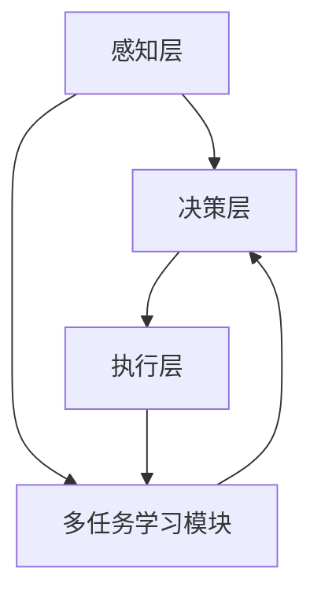
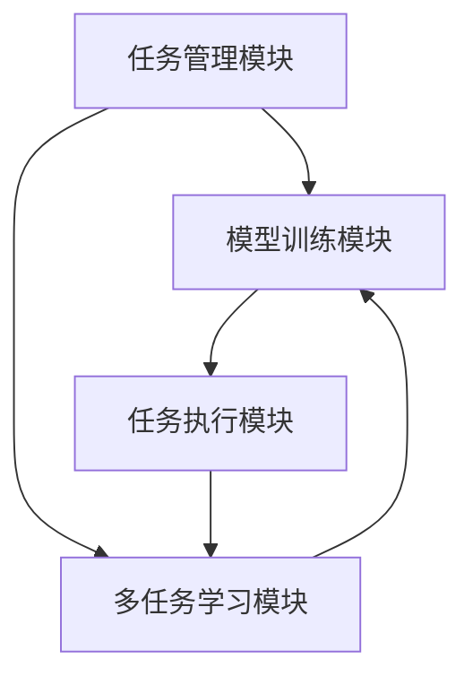

                 


# AI Agent的多任务学习架构实现

> 关键词：AI Agent, 多任务学习, 系统架构设计, 算法实现, 项目实战

> 摘要：本文详细探讨了AI Agent的多任务学习架构实现，从AI Agent的基本概念、多任务学习的核心原理，到具体的算法实现和系统设计，再到项目实战，全面解析了如何在AI Agent中实现高效的多任务学习架构。文章内容涵盖背景介绍、核心概念与联系、算法原理、系统分析与架构设计、项目实战以及最佳实践等多个方面。

---

## 第1章: AI Agent与多任务学习概述

### 1.1 AI Agent的基本概念
#### 1.1.1 AI Agent的定义
AI Agent（人工智能代理）是指在计算机系统中，能够感知环境、自主决策并执行任务的智能实体。它通常具有以下核心特征：自主性、反应性、目标导向性和社会性。

#### 1.1.2 AI Agent的核心特征
- **自主性**：AI Agent能够独立决策，无需外部干预。
- **反应性**：能够实时感知环境并做出响应。
- **目标导向性**：具有明确的目标，并通过行动实现目标。
- **社会性**：能够与其他AI Agent或人类进行交互和协作。

#### 1.1.3 AI Agent的应用场景
AI Agent广泛应用于自动驾驶、智能助手、机器人控制、推荐系统等领域。

---

### 1.2 多任务学习的背景与意义
#### 1.2.1 多任务学习的定义
多任务学习（Multi-Task Learning, MTL）是指在一个模型中同时学习多个相关任务，通过共享模型参数来提高模型的泛化能力和性能。

#### 1.2.2 多任务学习的优势
- **减少数据需求**：通过共享任务之间的特征，减少每个任务所需的数据量。
- **提高模型泛化能力**：任务之间的关联性有助于模型更好地泛化到新任务。
- **提高效率**：通过一次训练同时优化多个任务，节省时间和计算资源。

#### 1.2.3 多任务学习在AI Agent中的应用
AI Agent需要在复杂环境中完成多种任务（如感知、决策、规划等），多任务学习能够帮助AI Agent更高效地完成这些任务。

---

### 1.3 AI Agent与多任务学习的结合
#### 1.3.1 AI Agent中的多任务学习问题
AI Agent需要同时处理多个相关任务，如目标识别、路径规划、行为决策等，这些任务之间存在复杂的关联性。

#### 1.3.2 多任务学习对AI Agent性能的提升
通过多任务学习，AI Agent能够更好地理解任务之间的关系，从而在复杂环境中做出更优决策。

#### 1.3.3 多任务学习在AI Agent中的挑战
- **任务间冲突**：不同任务之间的目标可能存在冲突，需要进行权衡。
- **任务异构性**：任务之间的数据和目标可能差异较大，增加模型设计的难度。

---

## 第2章: 多任务学习的核心概念与原理

### 2.1 多任务学习的原理
#### 2.1.1 多任务学习的基本原理
多任务学习通过共享模型参数，同时优化多个任务的目标函数，从而实现多个任务的联合优化。

#### 2.1.2 多任务学习的数学模型
$$ \text{损失函数} = \sum_{i=1}^{n} \lambda_i L_i $$
其中，$\lambda_i$是任务$i$的权重，$L_i$是任务$i$的损失函数。

#### 2.1.3 多任务学习的优化目标
在多任务学习中，优化目标是通过调整模型参数，使得所有任务的损失函数之和最小化。

---

### 2.2 多任务学习的算法框架
#### 2.2.1 基于任务权重的多任务学习
通过为每个任务分配不同的权重，实现任务之间的平衡。

#### 2.2.2 基于任务分解的多任务学习
将复杂任务分解为多个子任务，分别优化后再进行组合。

#### 2.2.3 基于任务关联的多任务学习
利用任务之间的关联性，共享模型参数，实现联合优化。

---

### 2.3 多任务学习的核心概念对比
#### 2.3.1 任务独立性与相关性对比
| 特征 | 独立性任务 | 相关性任务 |
|------|------------|------------|
| 数据 | 无关联     | 有高度关联 |
| 模型 | 分别建模    | 共享参数   |

#### 2.3.2 任务权重分配策略对比
| 策略 | 优点 | 缺点 |
|------|------|------|
| 均等权重 | 简单 | 无法平衡任务重要性 |
| 动态权重 | 灵活 | 需要额外优化 |

#### 2.3.3 任务间数据分布对比
任务之间的数据分布可能高度异构，需要通过数据增强或样本重采样等方法进行平衡。

---

## 第3章: AI Agent的多任务学习架构设计

### 3.1 AI Agent的系统架构
#### 3.1.1 AI Agent的基本架构
AI Agent的架构通常包括感知层、决策层和执行层。

#### 3.1.2 多任务学习在AI Agent中的架构位置
多任务学习模块嵌入在AI Agent的感知层和决策层中，用于处理多个相关任务。

#### 3.1.3 多任务学习与AI Agent功能模块的结合
通过多任务学习模块，AI Agent能够同时处理目标识别、路径规划、行为决策等多个任务。

---

### 3.2 多任务学习的系统设计
#### 3.2.1 系统功能模块划分
AI Agent的多任务学习系统包括任务管理模块、模型训练模块和任务执行模块。

#### 3.2.2 系统功能模块的交互流程
1. 任务管理模块接收任务请求。
2. 模型训练模块根据任务需求调整权重。
3. 任务执行模块根据优化后的模型参数执行任务。

#### 3.2.3 系统功能模块的实现方式
- **任务管理模块**：负责任务的分配和协调。
- **模型训练模块**：负责多任务学习模型的训练和优化。
- **任务执行模块**：负责具体任务的执行和反馈。

---

### 3.3 多任务学习的系统架构图


---

## 第4章: 多任务学习的算法实现

### 4.1 多任务学习算法的实现步骤
#### 4.1.1 算法输入与输出
- **输入**：多个任务的数据集，任务权重。
- **输出**：优化后的模型参数。

#### 4.1.2 算法实现流程
1. 初始化模型参数。
2. 训练模型，计算多个任务的损失函数。
3. 优化模型参数，调整任务权重。
4. 重复训练和优化，直到收敛。

#### 4.1.3 算法实现的代码框架
```python
import torch
import torch.nn as nn

# 定义多任务学习模型
class MultiTaskModel(nn.Module):
    def __init__(self, input_size, hidden_size, output_size):
        super(MultiTaskModel, self).__init__()
        self.input_layer = nn.Linear(input_size, hidden_size)
        self.task1_layer = nn.Linear(hidden_size, output_size)
        self.task2_layer = nn.Linear(hidden_size, output_size)
    
    def forward(self, x):
        x = self.input_layer(x)
        output1 = self.task1_layer(x)
        output2 = self.task2_layer(x)
        return output1, output2

# 定义损失函数和优化器
criterion = nn.MSELoss()
optimizer = torch.optim.Adam(model.parameters(), lr=0.001)

# 训练过程
for epoch in range(num_epochs):
    for task1_data, task1_labels, task2_data, task2_labels in dataloader:
        optimizer.zero_grad()
        output1, output2 = model(task1_data)
        loss1 = criterion(output1, task1_labels)
        loss2 = criterion(output2, task2_labels)
        total_loss = loss1 + loss2
        total_loss.backward()
        optimizer.step()
```

---

### 4.2 多任务学习算法的数学模型
多任务学习的损失函数可以表示为：
$$ \mathcal{L} = \lambda_1 \mathcal{L}_1 + \lambda_2 \mathcal{L}_2 $$
其中，$\lambda_1$和$\lambda_2$是任务权重，$\mathcal{L}_1$和$\mathcal{L}_2$是任务1和任务2的损失函数。

---

### 4.3 多任务学习算法的代码实现
#### 4.3.1 环境安装与配置
```bash
pip install torch
pip install numpy
```

#### 4.3.2 代码实现与解读
```python
import torch
import torch.nn as nn
import torch.optim as optim
import numpy as np

# 定义数据生成函数
def generate_data(num_samples, input_size, output_size):
    X = np.random.randn(num_samples, input_size)
    y1 = np.random.randn(num_samples, output_size)
    y2 = np.random.randn(num_samples, output_size)
    return X, y1, y2

# 定义多任务学习模型
class MultiTaskNN(nn.Module):
    def __init__(self, input_size, hidden_size, output_size):
        super(MultiTaskNN, self).__init__()
        self.shared = nn.Linear(input_size, hidden_size)
        self.task1 = nn.Linear(hidden_size, output_size)
        self.task2 = nn.Linear(hidden_size, output_size)
    
    def forward(self, x):
        x = self.shared(x)
        out1 = self.task1(x)
        out2 = self.task2(x)
        return out1, out2

# 初始化模型和优化器
input_size = 10
hidden_size = 20
output_size = 5
num_epochs = 100
learning_rate = 0.01

model = MultiTaskNN(input_size, hidden_size, output_size)
criterion = nn.MSELoss()
optimizer = optim.Adam(model.parameters(), lr=learning_rate)

# 生成数据
X, y1, y2 = generate_data(1000, input_size, output_size)

# 训练过程
for epoch in range(num_epochs):
    optimizer.zero_grad()
    outputs = model(torch.FloatTensor(X))
    loss1 = criterion(outputs[0], torch.FloatTensor(y1))
    loss2 = criterion(outputs[1], torch.FloatTensor(y2))
    total_loss = loss1 + loss2
    total_loss.backward()
    optimizer.step()

print("训练完成！")
```

---

## 第5章: 多任务学习的系统分析与设计

### 5.1 系统分析
#### 5.1.1 问题场景的描述
AI Agent需要在复杂环境中完成多个相关任务，任务之间存在高度关联性。

#### 5.1.2 系统功能的分析
系统需要实现多任务学习模块，能够同时优化多个任务。

#### 5.1.3 系统性能的评估
通过任务完成时间、准确率、资源消耗等指标评估系统性能。

---

### 5.2 系统设计
#### 5.2.1 系统功能模块的设计
- **任务管理模块**：负责任务的分配和协调。
- **模型训练模块**：负责多任务学习模型的训练和优化。
- **任务执行模块**：负责具体任务的执行和反馈。

#### 5.2.2 系统功能模块的交互设计
1. 任务管理模块接收任务请求。
2. 模型训练模块根据任务需求调整权重。
3. 任务执行模块根据优化后的模型参数执行任务。

#### 5.2.3 系统功能模块的实现方式
- **任务管理模块**：使用队列或优先级队列实现任务调度。
- **模型训练模块**：基于PyTorch实现多任务学习模型的训练。
- **任务执行模块**：通过调用API或发布消息实现任务执行。

---

### 5.3 系统架构设计


---

## 第6章: 项目实战

### 6.1 项目背景
本项目旨在实现一个基于多任务学习的AI Agent，能够在复杂环境中完成多个相关任务。

---

### 6.2 核心代码实现
#### 6.2.1 环境安装与配置
```bash
pip install torch
pip install numpy
```

#### 6.2.2 核心代码实现
```python
import torch
import torch.nn as nn
import torch.optim as optim
import numpy as np

# 定义数据生成函数
def generate_data(num_samples, input_size, output_size):
    X = np.random.randn(num_samples, input_size)
    y1 = np.random.randn(num_samples, output_size)
    y2 = np.random.randn(num_samples, output_size)
    return X, y1, y2

# 定义多任务学习模型
class MultiTaskNN(nn.Module):
    def __init__(self, input_size, hidden_size, output_size):
        super(MultiTaskNN, self).__init__()
        self.shared = nn.Linear(input_size, hidden_size)
        self.task1 = nn.Linear(hidden_size, output_size)
        self.task2 = nn.Linear(hidden_size, output_size)
    
    def forward(self, x):
        x = self.shared(x)
        out1 = self.task1(x)
        out2 = self.task2(x)
        return out1, out2

# 初始化模型和优化器
input_size = 10
hidden_size = 20
output_size = 5
num_epochs = 100
learning_rate = 0.01

model = MultiTaskNN(input_size, hidden_size, output_size)
criterion = nn.MSELoss()
optimizer = optim.Adam(model.parameters(), lr=learning_rate)

# 生成数据
X, y1, y2 = generate_data(1000, input_size, output_size)

# 训练过程
for epoch in range(num_epochs):
    optimizer.zero_grad()
    outputs = model(torch.FloatTensor(X))
    loss1 = criterion(outputs[0], torch.FloatTensor(y1))
    loss2 = criterion(outputs[1], torch.FloatTensor(y2))
    total_loss = loss1 + loss2
    total_loss.backward()
    optimizer.step()

print("训练完成！")
```

---

### 6.3 代码解读与分析
- **数据生成函数**：生成多个任务的数据集。
- **多任务学习模型**：通过共享中间层参数，实现多个任务的联合优化。
- **优化过程**：通过反向传播和优化器，调整模型参数，最小化多个任务的损失函数之和。

---

### 6.4 性能测试与优化
通过测试准确率、训练时间等指标，评估模型性能，并根据需求进行优化。

---

## 第7章: 小结与展望

### 7.1 小结
本文详细探讨了AI Agent的多任务学习架构实现，从理论到实践，全面解析了如何在AI Agent中实现高效的多任务学习架构。

### 7.2 展望
未来，随着AI技术的不断发展，多任务学习在AI Agent中的应用将更加广泛，模型的优化和任务的协同将更加智能化和高效化。

---

## 第8章: 最佳实践与注意事项

### 8.1 最佳实践
- **任务权重的动态调整**：根据任务的重要性动态调整权重。
- **任务数据的平衡处理**：通过数据增强或重采样，平衡任务之间的数据分布。
- **模型的可解释性**：确保模型的决策过程可解释，便于调试和优化。

### 8.2 注意事项
- **任务之间的冲突**：需要通过权重调整或任务分解等方法进行处理。
- **模型的泛化能力**：需要通过数据多样性和模型正则化等方法进行提升。
- **系统的扩展性**：设计时需要考虑系统的可扩展性，便于后续任务的添加和优化。

---

## 第9章: 拓展阅读

### 9.1 相关论文推荐
- "Multi-Task Learning Using Neural Networks" (ICML 1997)
- "A Survey on Multi-Task Learning" (2020)

### 9.2 工具与库推荐
- **PyTorch**：深度学习框架。
- **Keras**：用户友好的深度学习库。
- **Scikit-learn**：机器学习工具库。

---

## 作者：AI天才研究院/AI Genius Institute & 禅与计算机程序设计艺术 /Zen And The Art of Computer Programming

