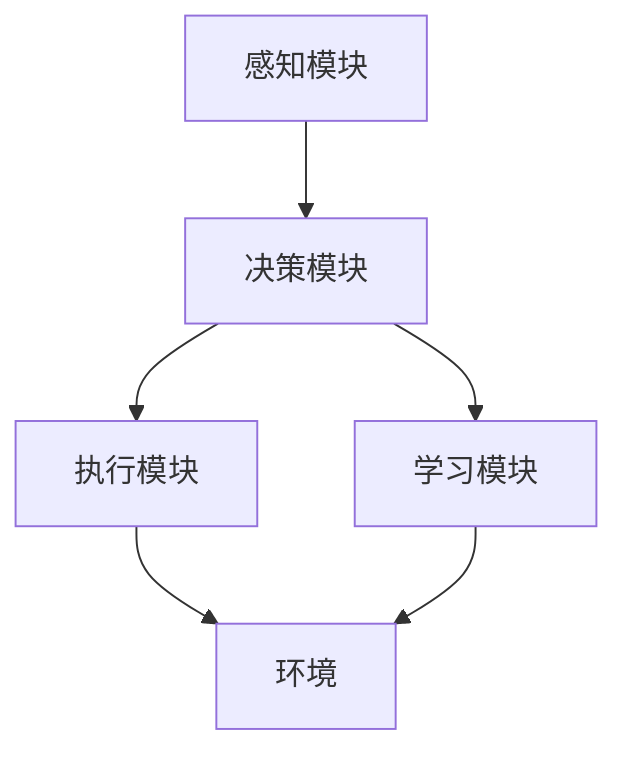
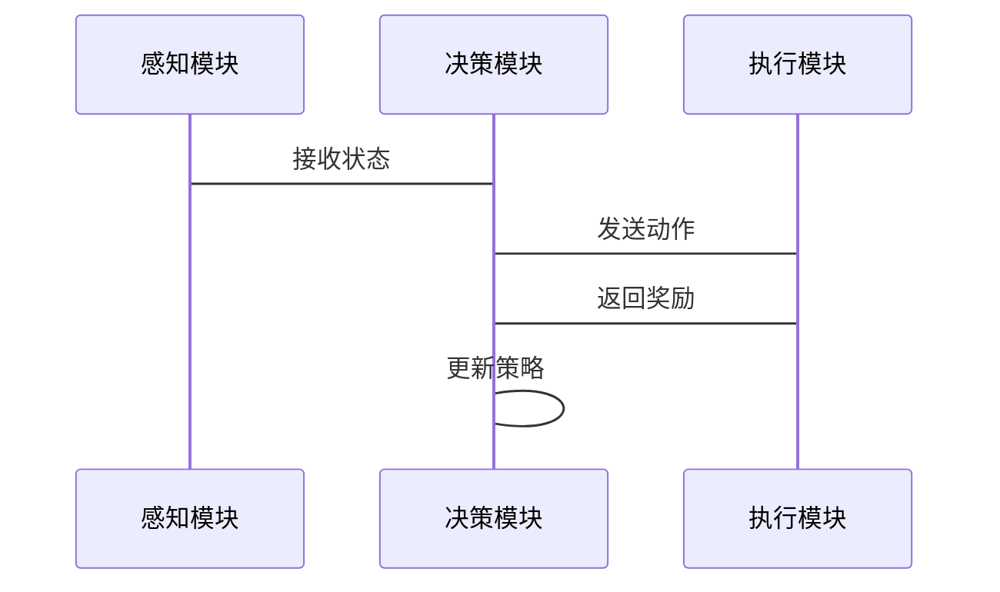
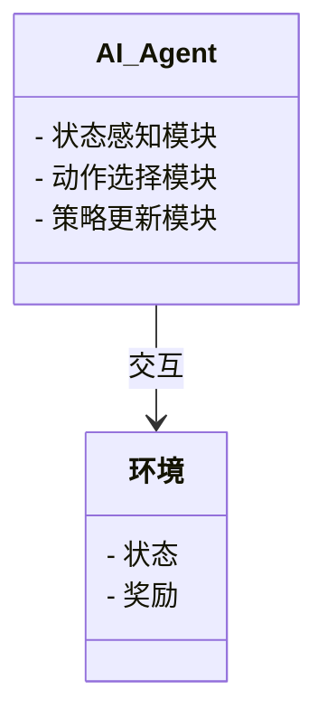
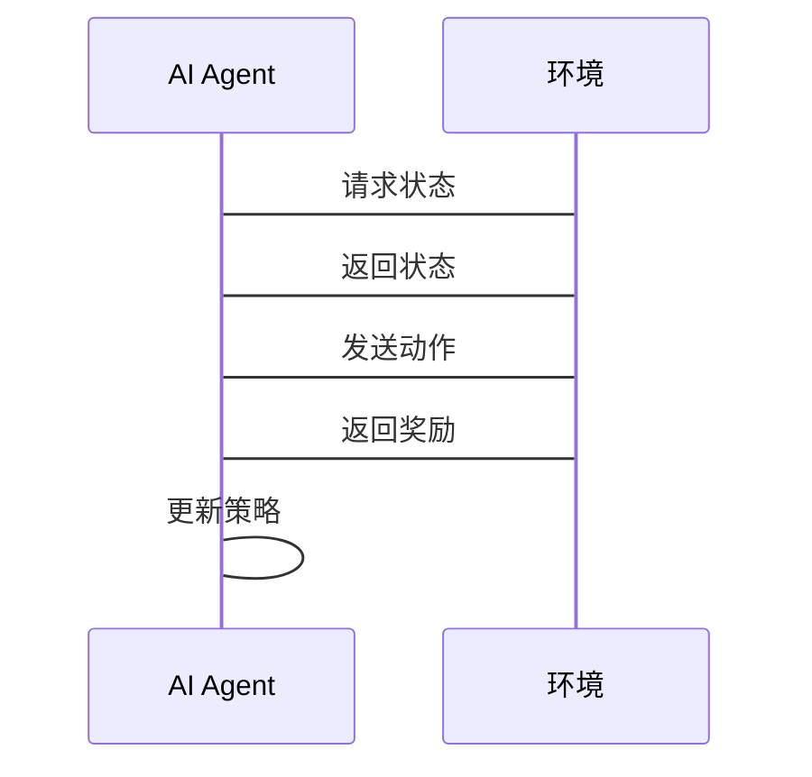

                 


# AI Agent的深度强化学习实现策略

> 关键词：AI Agent，深度强化学习，强化学习，Q-learning，Actor-Critic，策略梯度

> 摘要：本文系统地介绍AI Agent的深度强化学习实现策略，从基本概念到核心算法，再到系统架构和项目实战，全面解析如何利用深度强化学习技术实现高效智能的AI代理。

---

# 第1章: AI Agent的背景与概念

## 1.1 AI Agent的基本概念
### 1.1.1 AI Agent的定义与分类
- **定义**：AI Agent是一种能够感知环境、自主决策并执行任务的智能实体。
- **分类**：
  - **简单反射型**：基于规则的反应式代理。
  - **基于模型的反应式**：利用内部状态模型进行决策。
  - **目标驱动型**：基于目标和规划的代理。
  - **效用驱动型**：基于效用函数的优化代理。

### 1.1.2 AI Agent的核心特征
- **自主性**：无需外部干预，自主决策。
- **反应性**：实时感知环境并调整行为。
- **目标导向**：基于目标驱动的决策机制。
- **学习能力**：通过经验优化策略。

### 1.1.3 AI Agent的应用场景
- **游戏AI**：如AlphaGo、游戏NPC。
- **机器人控制**：智能机器人导航与交互。
- **推荐系统**：个性化内容推荐。
- **自动驾驶**：车辆路径规划与决策。

## 1.2 深度强化学习的背景与现状
### 1.2.1 强化学习的基本原理
- **定义**：通过试错学习，基于奖励信号优化策略。
- **三要素**：状态（State）、动作（Action）、奖励（Reward）。
- **马尔可夫决策过程（MDP）**：描述强化学习环境的核心模型。

### 1.2.2 深度强化学习的发展历程
- **早期阶段**：基于表格的Q-learning（如Atari游戏）。
- **深度学习的结合**：DQN（Deep Q-Network）的成功。
- **现代进展**：多智能体强化学习、连续动作空间。

### 1.2.3 深度强化学习的典型应用
- **游戏AI**：Dota 2、星际争霸。
- **机器人控制**：波士顿动力的机器人。
- **自动驾驶**：特斯拉等公司的应用。

## 1.3 AI Agent与深度强化学习的结合
### 1.3.1 AI Agent的决策机制
- **基于状态的决策**：AI Agent根据当前状态选择最优动作。
- **策略优化**：通过强化学习优化决策策略。

### 1.3.2 深度强化学习在AI Agent中的作用
- **复杂环境的处理**：深度强化学习能够处理高维、复杂的环境状态。
- **自主学习能力**：通过强化学习，AI Agent可以自主学习策略，适应新环境。

### 1.3.3 两者的结合优势与挑战
- **优势**：
  - **自主性**：AI Agent的自主决策能力与强化学习的试错学习结合。
  - **高效性**：深度强化学习的强大能力提升AI Agent的效率。
- **挑战**：
  - **复杂性**：深度强化学习算法的复杂性增加系统实现难度。
  - **安全性**：AI Agent的决策可能带来不可控风险。

## 1.4 本章小结
本章介绍了AI Agent的基本概念和深度强化学习的背景，重点分析了两者结合的优势与挑战。

---

# 第2章: AI Agent的数学模型与核心算法

## 2.1 Q-learning算法
### 2.1.1 Q-learning的基本原理
- **定义**：一种基于值函数的强化学习算法。
- **更新规则**：
  $$ Q(s, a) = Q(s, a) + \alpha (r + \gamma \max Q(s', a') - Q(s, a)) $$
  其中，$\alpha$是学习率，$\gamma$是折扣因子。

### 2.1.2 Q-learning的数学模型
- **状态转移**：$s' = P(s,a)$。
- **奖励函数**：$r = R(s,a,s')$。

### 2.1.3 Q-learning的优缺点
- **优点**：
  - 简单易实现。
  - 离线学习。
- **缺点**：
  - 适用于有限动作空间。
  - 无法处理连续状态空间。

## 2.2 策略梯度算法
### 2.2.1 策略梯度的基本原理
- **策略表示**：$\pi(a|s) = \sigma(w \cdot \phi(s,a))$，其中$\sigma$是sigmoid函数。
- **目标函数**：
  $$ J(\theta) = \mathbb{E}[ \log \pi(a|s) Q(s,a) ] $$
  通过梯度上升优化目标函数。

### 2.2.2 策略梯度的数学模型
- **策略网络**：$\theta$参数化策略函数。
- **梯度更新**：
  $$ \nabla \theta J(\theta) = \mathbb{E}[ \nabla \log \pi(a|s) Q(s,a) ] $$

### 2.2.3 策略梯度的实现方法
- **策略评估**：同时学习策略和值函数。
- **Actor-Critic架构**：结合策略梯度和值函数的优势。

## 2.3 Actor-Critic算法
### 2.3.1 Actor-Critic的基本原理
- **Actor**：负责选择动作，参数化策略函数。
- **Critic**：评估当前策略的优劣，参数化值函数。

### 2.3.2 Actor-Critic的数学模型
- **策略更新**：基于Critic的反馈，更新Actor的参数。
- **值函数更新**：基于当前策略的行为，更新值函数。

### 2.3.3 Actor-Critic的实现方法
- **异步更新**：Actor和Critic可以分别更新。
- **同步更新**：Actor和Critic同时更新，保证一致性。

## 2.4 深度强化学习的数学模型
### 2.4.1 神经网络在强化学习中的应用
- **输入层**：环境状态。
- **隐藏层**：非线性变换。
- **输出层**：Q值或概率分布。

### 2.4.2 深度Q网络的数学模型
- **网络结构**：输入状态，输出Q值。
- **目标网络**：用于稳定训练。

### 2.4.3 策略网络的数学模型
- **网络结构**：输入状态，输出动作概率。
- **策略优化**：最大化期望Q值。

## 2.5 本章小结
本章详细介绍了Q-learning、策略梯度和Actor-Critic算法，重点分析了它们的数学模型和实现方法。

---

# 第3章: 深度强化学习的核心概念与原理

## 3.1 强化学习的基本要素
### 3.1.1 状态空间
- **离散状态空间**：有限个状态。
- **连续状态空间**：无限个状态。

### 3.1.2 行动空间
- **离散动作**：有限个动作。
- **连续动作**：无限个动作。

### 3.1.3 奖励函数
- **即时奖励**：每一步的动作奖励。
- **累积奖励**：总奖励。

## 3.2 深度强化学习的网络结构
### 3.2.1 状态编码网络
- **输入处理**：将状态编码为神经网络的输入。
- **特征提取**：提取状态的特征。

### 3.2.2 行动策略网络
- **策略输出**：输出动作的概率分布。
- **策略优化**：最大化期望奖励。

### 3.2.3 值函数网络
- **值函数计算**：计算状态的Q值。
- **目标网络**：用于稳定训练。

## 3.3 深度强化学习的训练流程
### 3.3.1 环境与代理的交互
- **环境反馈**：状态、奖励、终止信号。
- **代理决策**：根据当前状态选择动作。

### 3.3.2 神经网络的更新
- **经验回放**：存储历史经验，随机采样训练。
- **梯度下降**：优化网络参数。

### 3.3.3 奖励信号的传递
- **正向传播**：计算预测Q值。
- **反向传播**：更新网络权重。

## 3.4 深度强化学习的优化方法
### 3.4.1 梯度下降优化
- **Adam优化器**：结合动量和自适应学习率。
- **RMSProp优化器**：基于梯度方差的自适应优化。

### 3.4.2 策略优化方法
- **策略梯度法**：直接优化策略。
- **值函数优化法**：通过优化值函数间接优化策略。

### 3.4.3 值函数优化方法
- **Q-learning**：基于值函数的优化。
- **Actor-Critic**：结合策略和值函数的优化。

## 3.5 本章小结
本章重点分析了深度强化学习的核心概念和训练流程，探讨了优化方法的选择与应用。

---

# 第4章: AI Agent的系统架构与设计

## 4.1 AI Agent的系统架构
### 4.1.1 系统模块划分
- **感知模块**：负责接收环境状态。
- **决策模块**：基于状态选择动作。
- **执行模块**：将动作转化为具体操作。
- **学习模块**：更新策略和参数。

### 4.1.2 系统架构图


### 4.1.3 接口设计
- **输入接口**：接收环境状态。
- **输出接口**：发送动作指令。
- **学习接口**：更新策略和参数。

### 4.1.4 交互流程


## 4.2 系统设计的详细分析
### 4.2.1 系统功能设计
- **状态感知**：实时接收环境反馈。
- **动作选择**：基于当前状态选择最优动作。
- **策略更新**：根据奖励信号优化策略。

### 4.2.2 系统架构图


### 4.2.3 系统接口设计
- **输入接口**：接收状态。
- **输出接口**：发送动作。
- **学习接口**：更新策略。

### 4.2.4 交互流程


## 4.3 本章小结
本章详细分析了AI Agent的系统架构，重点设计了模块划分、接口设计和交互流程。

---

# 第5章: 项目实战——基于深度强化学习的智能客服系统

## 5.1 项目背景
### 5.1.1 智能客服的需求
- **高效响应**：快速解决用户问题。
- **智能决策**：基于用户需求推荐解决方案。
- **学习能力**：通过经验优化服务流程。

### 5.1.2 项目目标
- 实现一个能够自主决策的智能客服系统。
- 基于深度强化学习优化客服流程。

## 5.2 环境安装与配置
### 5.2.1 环境需求
- **Python 3.8+**
- **TensorFlow/PyTorch**
- **OpenAI Gym**
- **NumPy**

### 5.2.2 安装步骤
```bash
pip install gym numpy tensorflow
```

## 5.3 核心实现
### 5.3.1 状态表示
- **用户问题**：文本形式。
- **历史记录**：对话历史。

### 5.3.2 动作空间
- **回复问题**：生成回答。
- **转接人工**：将用户转接给人工客服。

### 5.3.3 奖励函数
- **及时解决**：用户问题快速解决，奖励+1。
- **用户满意**：用户反馈满意，奖励+2。
- **处理失败**：无法解决问题，奖励-1。

### 5.3.4 深度强化学习实现
#### 5.3.4.1 网络结构
- **输入层**：用户问题和历史记录。
- **隐藏层**：非线性变换。
- **输出层**：动作概率分布。

#### 5.3.4.2 算法实现
```python
import numpy as np
import gym
import tensorflow as tf

class AI_Agent:
    def __init__(self, state_space, action_space):
        self.state_space = state_space
        self.action_space = action_space
        self.model = self.build_model()

    def build_model(self):
        model = tf.keras.Sequential([
            tf.keras.layers.Dense(64, activation='relu'),
            tf.keras.layers.Dense(self.action_space, activation='softmax')
        ])
        return model

    def act(self, state):
        state = tf.convert_to_tensor([state], dtype=tf.float32)
        logits = self.model(state)
        action = tf.argmax(logits, axis=-1).numpy()[0]
        return action

    def update(self, state, action, reward, next_state):
        state = tf.convert_to_tensor([state], dtype=tf.float32)
        next_state = tf.convert_to_tensor([next_state], dtype=tf.float32)
        target = reward + 0.99 * tf.reduce_max(self.model(next_state))
        with tf.GradientTape() as tape:
            logits = self.model(state)
            loss = tf.keras.losses.sparse_categorical_crossentropy(tf.convert_to_tensor([action], dtype=tf.int32), logits)
        grads = tape.gradient(loss, self.model.trainable_weights)
        self.optimizer.apply_gradients(zip(grads, self.model.trainable_weights))
```

## 5.4 项目实现
### 5.4.1 环境定义
```python
class CustomerServiceEnv(gym.Env):
    def __init__(self):
        self.state = "waiting"
        self.reward = 0
        self.done = False
        self.action_space = gym.spaces.Discrete(2)  # 回复或转接
        self.observation_space = gym.spaces.Box(low=0, high=1, shape=(1,), dtype=np.float32)

    def reset(self):
        self.state = "waiting"
        self.reward = 0
        self.done = False
        return self.state

    def step(self, action):
        if action == 0:
            self.state = "resolved"
            self.reward = 1
        else:
            self.state = "transfer"
            self.reward = -1
        self.done = True
        return self.state, self.reward, self.done, {}

    def render(self):
        pass
```

### 5.4.2 训练过程
```python
env = CustomerServiceEnv()
agent = AI_Agent(env.observation_space.shape[0], env.action_space.n)
optimizer = tf.keras.optimizers.Adam(learning_rate=0.001)

for episode in range(1000):
    state = env.reset()
    total_reward = 0
    while not done:
        action = agent.act(state)
        next_state, reward, done, _ = env.step(action)
        agent.update(state, action, reward, next_state)
        total_reward += reward
    print(f"Episode {episode}: Total Reward = {total_reward}")
```

### 5.4.3 测试与优化
- **测试环境**：模拟用户请求。
- **性能评估**：统计解决率和用户满意度。
- **参数调整**：优化学习率、折扣因子等超参数。

## 5.5 项目小结
本章通过一个智能客服系统的实际案例，展示了如何基于深度强化学习实现AI Agent的策略优化，详细讲解了项目的实现过程和关键点。

---

# 第6章: 最佳实践与总结

## 6.1 最佳实践
### 6.1.1 算法选择
- **任务类型决定算法**：离散动作空间选择Q-learning，连续动作空间选择策略梯度。
- **环境复杂度决定模型**：复杂环境选择深度强化学习，简单环境选择基础算法。

### 6.1.2 系统设计
- **模块化设计**：便于维护和扩展。
- **高效交互设计**：优化系统响应速度。

### 6.1.3 参数调优
- **学习率**：通常选择0.001到0.1之间。
- **折扣因子**：0.9到0.99之间。
- **网络结构**：根据任务需求设计层数和节点数。

## 6.2 总结
本文系统地介绍了AI Agent的深度强化学习实现策略，从基本概念到核心算法，再到系统架构和项目实战，全面解析了如何利用深度强化学习技术实现高效智能的AI代理。通过实际案例，展示了如何将理论应用于实践，并总结了最佳实践经验和注意事项。

---

# 作者：AI天才研究院 & 禅与计算机程序设计艺术

---

**注**：本文部分代码示例和图表未展开详细描述，实际撰写时需要根据具体需求补充完整。

