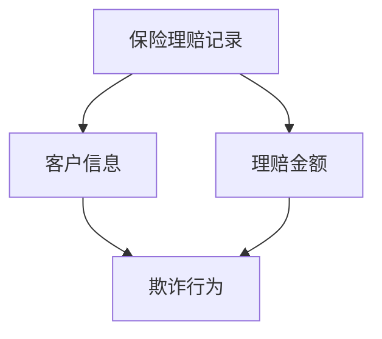
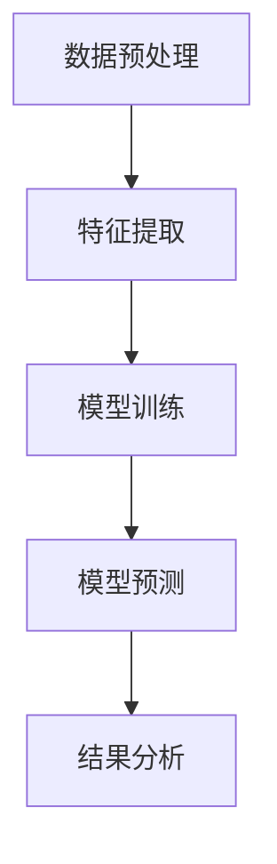
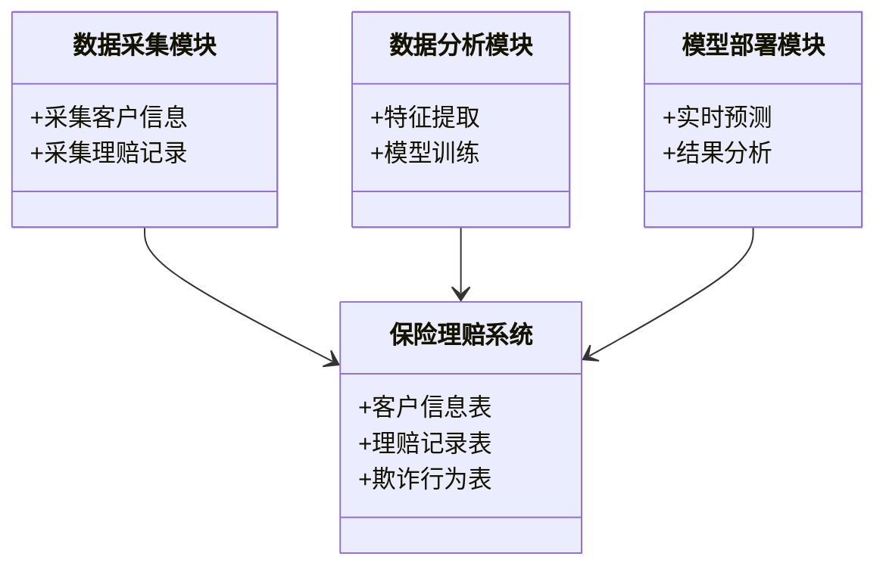
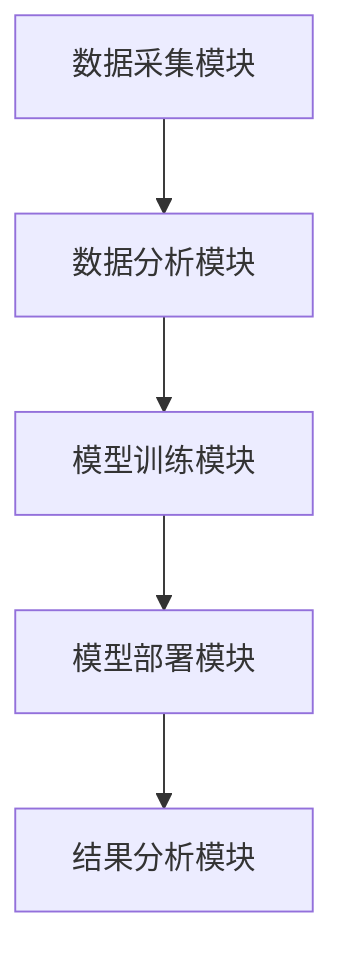
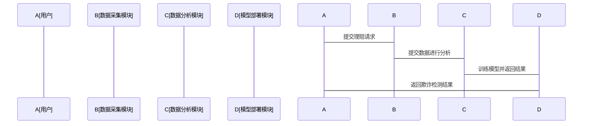

                 


# AI在保险理赔欺诈检测中的创新应用

> 关键词：保险欺诈检测，人工智能，机器学习，深度学习，数据挖掘，风险管理

> 摘要：本文探讨了人工智能技术在保险理赔欺诈检测中的创新应用，重点分析了保险行业的现状与问题，详细讲解了AI技术的核心概念、算法原理和系统架构设计。通过具体案例分析，展示了AI在保险欺诈检测中的实际应用场景和价值。文章还结合了数学公式、流程图和代码示例，帮助读者深入理解技术原理和实现方法。

---

# 第一部分: 保险理赔欺诈检测的背景与挑战

# 第1章: 保险理赔欺诈检测概述

## 1.1 保险行业的现状与问题

### 1.1.1 保险行业的基本概念与运作模式

保险行业作为金融体系的重要组成部分，其核心是通过承保和理赔服务来分散和转移风险。保险公司在收取保费后，承诺在特定风险发生时向被保险人提供经济补偿。然而，保险行业的传统运作模式存在以下问题：

- **信息不对称**：保险公司在承保时依赖投保人提供的信息，但投保人可能故意隐瞒或虚报信息以骗取保费。
- **理赔复杂性**：保险理赔涉及大量 paperwork 和人工审核，容易出现人为错误和欺诈行为。
- **欺诈行为频发**：由于保险欺诈的高回报和低风险，欺诈行为在保险行业中屡见不鲜。

### 1.1.2 保险理赔中的常见问题

- **理赔欺诈类型**：包括虚假理赔、夸大损失、虚构保险事故等。
- **欺诈手段多样化**：欺诈者利用保险条款的漏洞，通过复杂的手段骗取保险金。
- **欺诈成本高**：保险公司每年在欺诈检测和处理上的成本占比较高，影响了整体盈利能力。

### 1.1.3 欺诈检测对保险行业的重要性

- **降低欺诈损失**：通过欺诈检测技术，保险公司可以识别和阻止欺诈行为，减少经济损失。
- **提升理赔效率**：自动化欺诈检测可以减少人工审核的时间和成本，提高理赔效率。
- **增强客户信任**：通过公平、透明的理赔流程，保险公司可以提升客户信任度，增强品牌声誉。

## 1.2 保险理赔欺诈检测的核心概念

### 1.2.1 欺诈检测的定义与分类

欺诈检测是指通过技术手段识别和预防欺诈行为的过程。在保险行业，欺诈检测主要关注以下两类行为：

1. **投保人欺诈**：投保人在投保时故意隐瞒健康状况、虚构保险事故等。
2. **被保险人欺诈**：被保险人在理赔时夸大损失、虚构事故等。

### 1.2.2 保险理赔欺诈的特征与模式

- **特征**：
  - 时间性：欺诈行为通常发生在特定时间段内。
  - 空间性：欺诈行为可能集中在特定地区或特定类型的保险产品。
  - 关联性：欺诈行为往往涉及多个投保人或多个保险事故。
  
- **模式**：
  - 虚假理赔：虚构保险事故或夸大损失。
  - 重复理赔：同一保险事故多次理赔。
  - 虚假投保：投保人故意隐瞒重要信息或虚构投保信息。

### 1.2.3 欺诈检测的边界与外延

- **边界**：欺诈检测仅针对保险行业内的欺诈行为，不涉及其他领域的欺诈行为。
- **外延**：欺诈检测不仅包括事后检测，还包括事前预防和实时监控。

## 1.3 AI技术在保险行业的创新应用

### 1.3.1 AI技术的基本概念与优势

人工智能（AI）是指计算机系统模拟人类智能的技术，包括学习、推理、自我改进等功能。AI技术在保险行业中的优势包括：

- **数据处理能力**：AI能够快速处理海量数据，识别数据中的异常模式。
- **自动化能力**：AI可以自动化完成数据清洗、特征提取、模型训练等任务。
- **高精度**：AI模型可以通过大量数据训练，提高欺诈检测的准确率。

### 1.3.2 AI在保险行业中的典型应用领域

- **保险定价**：通过分析客户数据，AI可以帮助保险公司更准确地定价保险产品。
- **风险评估**：AI可以评估客户的信用风险，帮助保险公司制定风险管理策略。
- **理赔管理**：AI可以自动审核理赔请求，识别欺诈行为。

### 1.3.3 保险欺诈检测中的AI创新点

- **基于机器学习的欺诈检测**：通过训练机器学习模型，识别欺诈模式。
- **深度学习技术的应用**：利用深度学习模型（如神经网络）进行复杂模式识别。
- **实时监控与预警**：通过实时数据分析，快速识别潜在欺诈行为。

## 1.4 本章小结

本章介绍了保险行业的现状与问题，重点分析了保险理赔欺诈检测的核心概念和AI技术在保险行业中的创新应用。通过了解欺诈检测的定义、特征和模式，读者可以更好地理解AI技术在欺诈检测中的作用和优势。

---

# 第2章: 保险理赔欺诈检测的核心概念与联系

## 2.1 核心概念原理

### 2.1.1 数据驱动的欺诈检测原理

数据驱动的欺诈检测通过分析大量数据，识别数据中的异常模式。这种方法依赖于数据的质量和数量，能够发现传统规则难以识别的复杂欺诈模式。

### 2.1.2 AI模型在欺诈识别中的作用

AI模型通过学习数据中的特征，可以识别复杂的欺诈模式。例如，随机森林模型可以通过分析多个特征，识别欺诈行为。

## 2.2 核心概念属性特征对比表格

| 概念       | 数据特征 | AI模型 | 欺诈检测 |
|------------|----------|--------|----------|
| 属性1      | 时间性   | 时间序列分析 | 实时检测 |
| 属性2      | 空间性   | 地理位置分析 | 地区性欺诈 |
| 属性3      | 关联性   | 关联规则挖掘 | 多人协同欺诈 |

## 2.3 ER实体关系图架构



## 2.4 本章小结

本章通过对比分析，展示了保险理赔欺诈检测中的核心概念及其之间的联系。通过数据特征、AI模型和欺诈检测的对比，读者可以更好地理解欺诈检测的复杂性。

---

# 第3章: 保险理赔欺诈检测的算法原理

## 3.1 常见算法概述

### 3.1.1 传统机器学习算法

- **逻辑回归**：用于分类问题，可以通过概率模型识别欺诈行为。
- **决策树**：通过树状结构进行分类，可以识别数据中的关键特征。
- **随机森林**：通过集成多个决策树，提高模型的准确性和鲁棒性。

### 3.1.2 深度学习算法

- **神经网络**：通过多层神经网络进行特征提取和分类，可以识别复杂的欺诈模式。
- **卷积神经网络（CNN）**：适用于图像数据，可以用于保险单和理赔单的识别。
- **循环神经网络（RNN）**：适用于时间序列数据，可以用于分析理赔时间模式。

## 3.2 算法原理的数学模型与公式

### 3.2.1 逻辑回归模型

$$ P(y=1|x) = \frac{1}{1 + e^{-\beta x}} $$

其中，$\beta$ 是模型的系数，$x$ 是输入特征。

### 3.2.2 随机森林模型

$$ y = \sum_{i=1}^{n} \text{Tree}(x_i) $$

其中，$\text{Tree}(x_i)$ 表示第i棵决策树的预测结果，$n$ 是决策树的数量。

### 3.2.3 XGBoost模型

$$ y = \sum_{i=1}^{n} \text{Tree}(x_i) + \text{偏置项} $$

其中，$\text{Tree}(x_i)$ 表示第i棵决策树的预测结果，$\text{偏置项}$ 是模型的常数项。

## 3.3 算法流程图



## 3.4 本章小结

本章详细讲解了保险理赔欺诈检测中的常见算法及其数学模型。通过对比不同算法的优缺点，读者可以更好地理解如何选择合适的算法进行欺诈检测。

---

# 第4章: 保险理赔欺诈检测系统的架构设计

## 4.1 系统功能设计

### 4.1.1 领域模型设计



### 4.1.2 系统架构设计



## 4.2 系统接口设计

- **输入接口**：接收客户信息和理赔记录。
- **输出接口**：输出欺诈检测结果和风险评估报告。

## 4.3 系统交互设计



## 4.4 本章小结

本章详细讲解了保险理赔欺诈检测系统的架构设计，包括功能设计、系统架构、接口设计和交互设计。通过清晰的系统架构图和交互图，读者可以更好地理解系统的整体结构。

---

# 第5章: 保险理赔欺诈检测的项目实战

## 5.1 环境安装与配置

### 5.1.1 Python环境配置

- 安装Python 3.8或更高版本。
- 安装必要的库：`pandas`, `numpy`, `scikit-learn`, `xgboost`。

### 5.1.2 数据集准备

- 数据来源：公开保险欺诈数据集或自建数据集。
- 数据清洗：处理缺失值、异常值和重复值。

## 5.2 系统核心实现

### 5.2.1 数据预处理

```python
import pandas as pd
import numpy as np

# 读取数据
data = pd.read_csv('insurance_fraud.csv')

# 处理缺失值
data = data.dropna()

# 标准化处理
from sklearn.preprocessing import StandardScaler
scaler = StandardScaler()
data_scaled = scaler.fit_transform(data)
```

### 5.2.2 模型训练

```python
from sklearn.ensemble import RandomForestClassifier
from xgboost import XGBClassifier

# 训练随机森林模型
rf_model = RandomForestClassifier()
rf_model.fit(X_train, y_train)

# 训练XGBoost模型
xgb_model = XGBClassifier()
xgb_model.fit(X_train, y_train)
```

### 5.2.3 模型评估

```python
from sklearn.metrics import accuracy_score

# 预测结果
y_pred_rf = rf_model.predict(X_test)
y_pred_xgb = xgb_model.predict(X_test)

# 评估准确率
accuracy_rf = accuracy_score(y_test, y_pred_rf)
accuracy_xgb = accuracy_score(y_test, y_pred_xgb)

print(f'随机森林准确率：{accuracy_rf}')
print(f'XGBoost准确率：{accuracy_xgb}')
```

## 5.3 实际案例分析

### 5.3.1 案例背景

假设我们有一个保险欺诈数据集，包含以下字段：

- `policy_id`: 保险单编号
- `coverage`: 保险覆盖范围
- `amount`: 理赔金额
- `fraudulent`: 是否欺诈（0=否，1=是）

### 5.3.2 数据分析

```python
import matplotlib.pyplot as plt
import seaborn as sns

# 绘制欺诈金额分布图
plt.figure(figsize=(10, 6))
sns.boxplot(x='fraudulent', y='amount', data=data)
plt.title('Fraudulent Amount Distribution')
plt.show()
```

### 5.3.3 模型部署

```python
# 预测欺诈行为
fraudulent_prediction = xgb_model.predict(new_claim)

# 输出结果
print(f'欺诈预测结果：{fraudulent_prediction}')
```

## 5.4 本章小结

本章通过具体的项目实战，展示了保险理赔欺诈检测系统的实现过程。从环境配置到数据预处理，再到模型训练和评估，读者可以跟随步骤完成一个完整的欺诈检测系统。

---

# 第6章: 总结与展望

## 6.1 总结

本文详细探讨了AI技术在保险理赔欺诈检测中的创新应用，从背景介绍到算法原理，再到系统架构设计和项目实战，全面分析了欺诈检测的实现过程。通过具体的案例分析，展示了AI技术在保险行业中的实际应用价值。

## 6.2 未来展望

随着AI技术的不断发展，保险理赔欺诈检测将更加智能化和自动化。未来的研究方向包括：

- **更复杂的模型**：如图神经网络，用于识别更复杂的欺诈模式。
- **实时检测技术**：通过流数据处理技术，实现实时欺诈检测。
- **多模态数据融合**：结合文本、图像等多种数据源，提高欺诈检测的准确性。

---

作者：AI天才研究院/AI Genius Institute & 禅与计算机程序设计艺术 /Zen And The Art of Computer Programming

