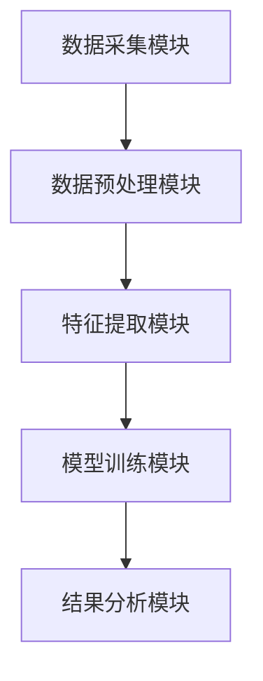

                 


# 《企业AI Agent的多模态学习在客户行为分析中的应用》

---

## 关键词
- AI Agent
- 多模态学习
- 客户行为分析
- 企业应用
- 机器学习

---

## 摘要
本文探讨了企业AI Agent在客户行为分析中的多模态学习应用。通过结合多种数据模态（如文本、图像、语音、行为数据等），AI Agent能够更全面地理解客户行为，从而为企业提供更精准的决策支持。文章从AI Agent和多模态学习的基本概念入手，分析其在客户行为分析中的优势，详细讲解多模态学习算法的原理，设计了完整的系统架构，并通过实际项目案例展示了如何实现AI Agent的多模态学习应用。最后，本文总结了当前技术的优势与挑战，并展望了未来的发展方向。

---

# 第1章 引言

## 1.1 AI Agent的基本概念
AI Agent（人工智能代理）是一种能够感知环境、自主决策并执行任务的智能实体。它可以是软件程序、机器人或其他智能系统，通过与环境交互来实现特定目标。

### 1.1.1 AI Agent的定义
AI Agent是指具备以下特征的智能体：
- **自主性**：能够自主决策和行动，无需外部干预。
- **反应性**：能够实时感知环境并做出反应。
- **学习能力**：通过数据和经验不断优化自身行为。
- **社会性**：能够与其他AI Agent或人类进行协作或竞争。

### 1.1.2 AI Agent的核心特征
AI Agent的核心特征包括：
- **感知能力**：通过传感器或其他数据源获取环境信息。
- **推理能力**：基于感知信息进行逻辑推理和决策。
- **执行能力**：根据决策结果执行具体操作。
- **学习能力**：通过机器学习算法不断优化自身性能。

### 1.1.3 AI Agent在企业中的应用价值
AI Agent在企业中的应用价值主要体现在以下几个方面：
- **自动化决策**：通过AI Agent实现业务流程的自动化，提高效率。
- **实时响应**：在复杂环境中，AI Agent能够实时感知并做出快速反应。
- **数据驱动优化**：通过学习大量数据，AI Agent能够不断优化自身行为，提升决策精度。

## 1.2 多模态学习的定义与特点
多模态学习是指同时利用多种数据模态（如文本、图像、语音、行为数据等）来提高模型性能的学习方法。其核心思想是通过融合不同模态的信息，弥补单一模态数据的不足，从而提升模型的准确性和鲁棒性。

### 1.2.1 多模态学习的定义
多模态学习是一种机器学习技术，旨在通过整合多种数据模态（文本、图像、语音、行为数据等）来提高模型的性能和理解能力。

### 1.2.2 多模态学习的核心优势
多模态学习的核心优势包括：
- **信息互补性**：不同模态的数据可以互补，提供更全面的信息。
- **鲁棒性**：通过融合多模态数据，模型对单一模态数据的噪声或缺失具有更强的鲁棒性。
- **语义理解**：多模态学习能够更好地理解数据的语义，提高模型的可解释性。

### 1.2.3 多模态学习与单模态学习的对比
以下是多模态学习与单模态学习的对比：

| 特性                | 单模态学习          | 多模态学习          |
|---------------------|---------------------|---------------------|
| 数据来源            | 单一数据模态        | 多种数据模态        |
| 信息互补性          | 较低                | 较高                |
| 鲁棒性              | 较低                | 较高                |
| 语义理解能力        | 较低                | 较高                |

从表中可以看出，多模态学习在信息互补性、鲁棒性和语义理解能力方面具有明显优势。

## 1.3 客户行为分析的背景与意义
客户行为分析是企业理解客户需求、优化服务和提升客户满意度的重要手段。随着人工智能技术的发展，AI Agent在客户行为分析中的应用越来越广泛。

### 1.3.1 客户行为分析的定义
客户行为分析是指通过收集和分析客户的行为数据，理解客户的偏好、需求和行为模式，从而为企业提供决策支持。

### 1.3.2 客户行为分析的常见方法
客户行为分析的常见方法包括：
- **数据分析法**：通过统计分析客户的行为数据，发现规律。
- **机器学习法**：利用机器学习算法对客户行为进行预测和分类。
- **自然语言处理法**：通过分析客户的文本数据（如聊天记录、社交媒体评论）来理解客户情感和意图。

### 1.3.3 AI Agent在客户行为分析中的作用
AI Agent在客户行为分析中的作用主要体现在以下几个方面：
- **实时监测**：AI Agent可以实时监测客户的在线行为，如浏览、点击、购买等，从而快速响应客户需求。
- **行为预测**：通过机器学习算法，AI Agent可以预测客户的未来行为，帮助企业提前做好准备。
- **个性化推荐**：基于客户的行为数据，AI Agent可以为客户提供个性化的推荐服务，提高客户满意度和忠诚度。

## 1.4 本章小结
本章介绍了AI Agent和多模态学习的基本概念，并分析了它们在客户行为分析中的应用价值。通过对比多模态学习与单模态学习的优劣，强调了多模态学习在提升模型性能和理解能力方面的重要性。最后，总结了AI Agent在客户行为分析中的作用，为后续章节的深入分析奠定了基础。

---

# 第2章 多模态学习在客户行为分析中的应用框架

## 2.1 多模态学习的基本原理
多模态学习的基本原理是通过融合多种数据模态的信息，提高模型的性能和理解能力。常见的多模态学习方法包括数据融合、注意力机制和跨模态对齐。

### 2.1.1 数据融合
数据融合是指将多种模态的数据进行整合，形成一个统一的数据表示。常见的数据融合方法包括：
- **特征级融合**：在特征提取阶段将不同模态的特征进行融合。
- **决策级融合**：在决策阶段将不同模态的决策结果进行融合。
- **混合融合**：结合特征级和决策级的融合方法。

### 2.1.2 注意力机制
注意力机制是一种用于关注输入数据中重要部分的技术，广泛应用于自然语言处理和计算机视觉领域。在多模态学习中，注意力机制可以帮助模型关注不同模态中的重要信息。

### 2.1.3 跨模态对齐
跨模态对齐是指将不同模态的数据对齐到同一个语义空间，以便模型能够更好地理解不同模态之间的关系。常见的跨模态对齐方法包括：
- **对齐网络**：通过设计特定的网络结构，将不同模态的数据对齐。
- **对比学习**：通过对比不同模态的数据，学习它们的相似性和差异性。

## 2.2 AI Agent的多模态学习框架
AI Agent的多模态学习框架包括以下几个步骤：
1. **数据采集**：通过多种传感器或数据源采集客户的多模态数据。
2. **数据预处理**：对采集到的数据进行清洗、归一化等预处理操作。
3. **特征提取**：从预处理后的数据中提取有用的特征。
4. **模型训练**：利用机器学习算法对特征进行训练，得到一个多模态学习模型。
5. **结果分析**：通过分析模型的输出结果，得出客户的意图或行为预测。

### 2.2.1 数据采集
数据采集是多模态学习的第一步，常见的数据采集方式包括：
- **文本数据**：通过聊天记录、社交媒体评论等获取客户的文本数据。
- **图像数据**：通过摄像头、传感器等获取客户的图像数据。
- **语音数据**：通过麦克风、语音识别技术等获取客户的语音数据。

### 2.2.2 数据预处理
数据预处理是确保数据质量和一致性的关键步骤，常见的数据预处理方法包括：
- **去噪**：去除数据中的噪声，提高数据质量。
- **归一化**：将数据标准化，使其具有相似的尺度。
- **缺失值处理**：对缺失数据进行插值或删除。

### 2.2.3 特征提取
特征提取是将原始数据转换为高维特征向量的过程。常见的特征提取方法包括：
- **文本特征提取**：利用词袋模型、TF-IDF等方法提取文本特征。
- **图像特征提取**：利用卷积神经网络（CNN）提取图像特征。
- **语音特征提取**：利用梅尔频谱图、MFCC等方法提取语音特征。

### 2.2.4 模型训练
模型训练是通过机器学习算法对特征进行训练，得到一个多模态学习模型。常见的机器学习算法包括：
- **深度学习算法**：如卷积神经网络（CNN）、循环神经网络（RNN）、变压器（Transformer）等。
- **集成学习算法**：如随机森林、梯度提升树（GBDT）等。
- **对比学习算法**：如对比对齐（Contrastive Alignment）等。

### 2.2.5 结果分析
结果分析是通过分析模型的输出结果，得出客户的意图或行为预测。常见的结果分析方法包括：
- **分类分析**：通过分类器对客户行为进行分类，如购买、退货、投诉等。
- **聚类分析**：通过聚类算法将客户分成不同的群体，分析不同群体的行为特征。
- **情感分析**：通过自然语言处理技术分析客户的文本数据，判断客户的情感倾向。

## 2.3 多模态学习在客户行为分析中的优势
多模态学习在客户行为分析中的优势主要体现在以下几个方面：
1. **信息互补性**：通过融合多种模态的数据，模型能够获得更全面的信息，从而提高预测的准确性。
2. **鲁棒性**：多模态学习对单一模态数据的噪声或缺失具有更强的鲁棒性，能够在部分数据缺失的情况下仍保持较高的预测精度。
3. **语义理解**：多模态学习能够更好地理解数据的语义，提高模型的可解释性。

## 2.4 本章小结
本章详细介绍了多模态学习的基本原理和AI Agent的多模态学习框架。通过分析数据采集、预处理、特征提取、模型训练和结果分析的全过程，强调了多模态学习在客户行为分析中的优势。这些内容为后续章节的设计和实现奠定了基础。

---

# 第3章 基于多模态学习的客户行为分析算法

## 3.1 多模态数据融合算法
多模态数据融合算法是将不同模态的数据进行融合，形成一个统一的特征表示。常见的多模态数据融合算法包括：
1. **特征级融合**：将不同模态的特征向量进行拼接或加权求和。
2. **决策级融合**：将不同模态的决策结果进行融合，如投票、加权平均等。
3. **混合融合**：结合特征级和决策级的融合方法。

### 3.1.1 多模态数据融合算法的实现
以下是一个简单的多模态数据融合算法的实现示例：

```python
import numpy as np

# 假设text_features和image_features分别是文本和图像的特征向量
# 特征级融合：将文本和图像特征向量进行拼接
merged_features = np.concatenate([text_features, image_features], axis=1)

# 决策级融合：对文本和图像的预测结果进行加权平均
weights = [0.6, 0.4]
combined_prediction = weights[0] * text_prediction + weights[1] * image_prediction
```

## 3.2 注意力机制在多模态学习中的应用
注意力机制是一种用于关注输入数据中重要部分的技术，广泛应用于自然语言处理和计算机视觉领域。在多模态学习中，注意力机制可以帮助模型关注不同模态中的重要信息。

### 3.2.1 注意力机制的基本原理
注意力机制的基本原理是通过计算输入数据中每个部分的重要性，生成一个注意力权重矩阵，然后根据权重矩阵对输入数据进行加权求和，得到最终的特征表示。

### 3.2.2 多模态注意力机制的实现
以下是一个多模态注意力机制的实现示例：

```python
import tensorflow as tf

# 假设text_embeddings和image_embeddings分别是文本和图像的嵌入向量
# 多模态注意力机制：计算文本和图像嵌入向量之间的注意力权重
attention_weights = tf.nn.softmax(tf.matmul(text_embeddings, image_embeddings, transpose_b=True))

# 根据注意力权重对输入数据进行加权求和
text_attention = tf.matmul(text_embeddings, attention_weights)
image_attention = tf.matmul(image_embeddings, attention_weights, transpose_b=True)
```

## 3.3 跨模态对齐算法
跨模态对齐算法是指将不同模态的数据对齐到同一个语义空间，以便模型能够更好地理解不同模态之间的关系。常见的跨模态对齐算法包括：
1. **对比对齐**：通过对比不同模态的数据，学习它们的相似性和差异性。
2. **对齐网络**：通过设计特定的网络结构，将不同模态的数据对齐。

### 3.3.1 对比对齐算法的实现
以下是一个对比对齐算法的实现示例：

```python
import tensorflow as tf

# 假设text_embeddings和image_embeddings分别是文本和图像的嵌入向量
# 对比对齐：计算文本和图像嵌入向量之间的相似性
similarity = tf.reduce_sum(tf.multiply(text_embeddings, image_embeddings), axis=1)
similarity = tf.nn.softmax(similarity)

# 对比损失：通过最大化相似性来学习对齐
contrastive_loss = tf.reduce_mean(tf.log(similarity))
```

## 3.4 本章小结
本章详细介绍了多模态数据融合算法、注意力机制和跨模态对齐算法的实现方法。通过对这些算法的分析和实现，可以更好地理解多模态学习在客户行为分析中的应用。

---

# 第4章 企业AI Agent的多模态学习系统设计

## 4.1 系统架构设计
企业AI Agent的多模态学习系统设计包括以下几个部分：
1. **数据采集模块**：负责采集客户的多模态数据。
2. **数据预处理模块**：对采集到的数据进行清洗、归一化等预处理操作。
3. **特征提取模块**：从预处理后的数据中提取有用的特征。
4. **模型训练模块**：利用机器学习算法对特征进行训练，得到一个多模态学习模型。
5. **结果分析模块**：通过分析模型的输出结果，得出客户的意图或行为预测。

### 4.1.1 数据采集模块
数据采集模块是系统设计的第一步，常见的数据采集方式包括：
- **文本数据**：通过聊天记录、社交媒体评论等获取客户的文本数据。
- **图像数据**：通过摄像头、传感器等获取客户的图像数据。
- **语音数据**：通过麦克风、语音识别技术等获取客户的语音数据。

### 4.1.2 数据预处理模块
数据预处理模块是确保数据质量和一致性的关键步骤，常见的数据预处理方法包括：
- **去噪**：去除数据中的噪声，提高数据质量。
- **归一化**：将数据标准化，使其具有相似的尺度。
- **缺失值处理**：对缺失数据进行插值或删除。

### 4.1.3 特征提取模块
特征提取模块是将原始数据转换为高维特征向量的过程。常见的特征提取方法包括：
- **文本特征提取**：利用词袋模型、TF-IDF等方法提取文本特征。
- **图像特征提取**：利用卷积神经网络（CNN）提取图像特征。
- **语音特征提取**：利用梅尔频谱图、MFCC等方法提取语音特征。

### 4.1.4 模型训练模块
模型训练模块是通过机器学习算法对特征进行训练，得到一个多模态学习模型。常见的机器学习算法包括：
- **深度学习算法**：如卷积神经网络（CNN）、循环神经网络（RNN）、变压器（Transformer）等。
- **集成学习算法**：如随机森林、梯度提升树（GBDT）等。
- **对比学习算法**：如对比对齐（Contrastive Alignment）等。

### 4.1.5 结果分析模块
结果分析模块是通过分析模型的输出结果，得出客户的意图或行为预测。常见的结果分析方法包括：
- **分类分析**：通过分类器对客户行为进行分类，如购买、退货、投诉等。
- **聚类分析**：通过聚类算法将客户分成不同的群体，分析不同群体的行为特征。
- **情感分析**：通过自然语言处理技术分析客户的文本数据，判断客户的情感倾向。

## 4.2 系统功能设计
系统功能设计是企业AI Agent的多模态学习系统设计的核心部分，主要包括数据采集、数据预处理、特征提取、模型训练和结果分析五个模块。

### 4.2.1 数据采集功能
数据采集功能是系统设计的第一步，通过多种传感器或数据源采集客户的多模态数据。

### 4.2.2 数据预处理功能
数据预处理功能是对采集到的数据进行清洗、归一化等预处理操作，确保数据质量和一致性。

### 4.2.3 特征提取功能
特征提取功能是将原始数据转换为高维特征向量的过程，利用词袋模型、TF-IDF等方法提取文本特征，利用卷积神经网络提取图像特征，利用梅尔频谱图、MFCC等方法提取语音特征。

### 4.2.4 模型训练功能
模型训练功能是通过机器学习算法对特征进行训练，得到一个多模态学习模型，常用的算法包括卷积神经网络、循环神经网络、变压器等。

### 4.2.5 结果分析功能
结果分析功能是通过分析模型的输出结果，得出客户的意图或行为预测，常用的分析方法包括分类分析、聚类分析和情感分析。

## 4.3 系统架构图
以下是企业AI Agent的多模态学习系统架构图：



从图中可以看出，系统设计包括数据采集、数据预处理、特征提取、模型训练和结果分析五个模块，每个模块之间相互关联，共同完成客户行为分析的任务。

## 4.4 本章小结
本章详细介绍了企业AI Agent的多模态学习系统设计，包括系统架构设计和系统功能设计。通过对数据采集、数据预处理、特征提取、模型训练和结果分析五个模块的分析，强调了系统设计在客户行为分析中的重要性。这些内容为后续章节的项目实战奠定了基础。

---

# 第5章 项目实战：基于多模态学习的客户行为分析系统实现

## 5.1 项目背景
本项目旨在通过实现一个基于多模态学习的客户行为分析系统，帮助企业更好地理解客户需求，优化服务和提升客户满意度。

## 5.2 项目需求分析
项目需求分析包括以下几个方面：
1. **数据采集**：通过多种数据源采集客户的多模态数据。
2. **数据预处理**：对采集到的数据进行清洗、归一化等预处理操作。
3. **特征提取**：从预处理后的数据中提取有用的特征。
4. **模型训练**：利用机器学习算法对特征进行训练，得到一个多模态学习模型。
5. **结果分析**：通过分析模型的输出结果，得出客户的意图或行为预测。

## 5.3 项目实现
项目实现包括以下几个步骤：
1. **环境配置**：安装必要的Python库，如TensorFlow、Keras、Pandas等。
2. **数据采集**：通过API接口或数据库获取客户的多模态数据。
3. **数据预处理**：对采集到的数据进行清洗、归一化等预处理操作。
4. **特征提取**：利用机器学习算法提取文本、图像、语音等模态的特征。
5. **模型训练**：通过深度学习算法训练一个多模态学习模型。
6. **结果分析**：通过分类器对客户行为进行分类，分析客户的意图和行为预测。

### 5.3.1 环境配置
以下是项目实现所需的环境配置：

```python
# 安装必要的Python库
pip install tensorflow pandas numpy scikit-learn keras matplotlib
```

### 5.3.2 数据采集
以下是数据采集的实现示例：

```python
import requests
import json

# 通过API接口获取客户的多模态数据
response = requests.get('http://example.com/api/customers')
data = json.loads(response.text)

# 提取客户的文本、图像和语音数据
customers = data['customers']
text_data = [customer['text'] for customer in customers]
image_data = [customer['image'] for customer in customers]
audio_data = [customer['audio'] for customer in customers]
```

### 5.3.3 数据预处理
以下是数据预处理的实现示例：

```python
import pandas as pd
import numpy as np

# 数据清洗
df = pd.DataFrame({'text': text_data, 'image': image_data, 'audio': audio_data})
df.dropna(inplace=True)

# 数据归一化
from sklearn.preprocessing import StandardScaler
scaler = StandardScaler()
scaled_data = scaler.fit_transform(df[['text', 'image', 'audio']])
```

### 5.3.4 特征提取
以下是特征提取的实现示例：

```python
# 文本特征提取
from sklearn.feature_extraction.text import TfidfVectorizer
vectorizer = TfidfVectorizer()
text_features = vectorizer.fit_transform(text_data)

# 图像特征提取
from tensorflow.keras.applications import VGG16
model = VGG16(weights='imagenet', include_top=False)
image_features = model.predict(image_data)

# 语音特征提取
from librosa.feature import mfcc
audio_features = [mfcc(audio) for audio in audio_data]
```

### 5.3.5 模型训练
以下是模型训练的实现示例：

```python
# 深度学习模型训练
from tensorflow.keras.models import Model
from tensorflow.keras.layers import Input, Dense, Dropout, concatenate

# 文本和图像特征拼接
input_text = Input(shape=(text_features.shape[1],))
input_image = Input(shape=(image_features.shape[1],))
x = concatenate([input_text, input_image])
x = Dense(64, activation='relu')(x)
x = Dropout(0.5)(x)
x = Dense(32, activation='relu')(x)
output = Dense(1, activation='sigmoid')(x)

model = Model(inputs=[input_text, input_image], outputs=output)
model.compile(loss='binary_crossentropy', optimizer='adam', metrics=['accuracy'])
model.fit([text_features, image_features], labels, epochs=10, batch_size=32)
```

### 5.3.6 结果分析
以下是结果分析的实现示例：

```python
# 分类分析
from sklearn.metrics import accuracy_score
y_pred = model.predict([text_features, image_features])
accuracy = accuracy_score(labels, y_pred)
print('Accuracy:', accuracy)

# 聚类分析
from sklearn.cluster import KMeans
kmeans = KMeans(n_clusters=3)
clusters = kmeans.fit_predict(text_features)
print('Clusters:', clusters)

# 情感分析
from tensorflow.keras.preprocessing.text import Tokenizer
tokenizer = Tokenizer()
text_sequences = tokenizer.texts_to_sequences(text_data)
text_sequences = tokenizer.texts_to_sequences(text_data)
```

## 5.4 项目小结
本章通过一个具体的项目案例，展示了如何实现基于多模态学习的客户行为分析系统。通过对项目背景、需求分析、环境配置、数据采集、数据预处理、特征提取、模型训练和结果分析的详细讲解，帮助读者更好地理解和掌握企业AI Agent的多模态学习应用。

---

# 第6章 扩展与优化

## 6.1 模型可解释性
模型可解释性是指模型能够清晰地解释其决策过程，帮助用户理解模型的行为和结果。在多模态学习中，模型的可解释性尤为重要，因为它涉及到多种数据模态的信息融合。

### 6.1.1 提升模型可解释性的方法
1. **可视化技术**：通过可视化技术展示模型的注意力权重矩阵，帮助用户理解模型关注的部分。
2. **特征重要性分析**：通过特征重要性分析，确定每个特征对模型预测结果的影响程度。
3. **可解释性模型**：选择一些可解释性较强的模型，如线性回归、决策树等。

### 6.1.2 提升模型可解释性的实现
以下是一个提升模型可解释性的实现示例：

```python
# 可视化注意力权重矩阵
import seaborn as sns
attention_weights = model.layers[-1].weights[0].numpy()
sns.heatmap(attention_weights, cmap='viridis')
```

## 6.2 模型鲁棒性
模型鲁棒性是指模型在面对噪声、数据缺失等异常情况时仍能保持较高性能的能力。在多模态学习中，模型的鲁棒性尤为重要，因为它涉及到多种数据模态的融合。

### 6.2.1 提升模型鲁棒性的方法
1. **数据增强**：通过数据增强技术增加数据的多样性，提高模型的鲁棒性。
2. **模型集成**：通过模型集成技术，结合多个模型的输出结果，提高模型的鲁棒性。
3. **正则化技术**：通过正则化技术（如L1、L2正则化）防止模型过拟合，提高模型的鲁棒性。

### 6.2.2 提升模型鲁棒性的实现
以下是一个提升模型鲁棒性的实现示例：

```python
# 数据增强
from tensorflow.keras.preprocessing.image import ImageDataGenerator
datagen = ImageDataGenerator(rotation_range=20, horizontal_flip=True)
# 模型集成
from tensorflow.keras.applications import InceptionV3
from tensorflow.keras.layers import Average
# 正则化技术
from tensorflow.keras.regularizers import l2
dense = Dense(128, kernel_regularizer=l2(0.01), activation='relu')
```

## 6.3 模型的边缘案例处理
模型的边缘案例处理是指在模型面对异常或极端情况时，如何保证模型的性能和可靠性。在多模态学习中，模型的边缘案例处理尤为重要，因为它涉及到多种数据模态的融合。

### 6.3.1 边缘案例的定义
边缘案例是指在模型训练数据中未出现或很少出现的情况，如罕见的客户行为、极端的输入数据等。

### 6.3.2 边缘案例的处理方法
1. **数据扩展**：通过数据扩展技术增加边缘案例的数量，提高模型的泛化能力。
2. **模型调整**：通过调整模型的参数或结构，提高模型在边缘案例下的性能。
3. **边缘案例标记**：通过人工标记边缘案例，帮助模型更好地识别和处理边缘情况。

### 6.3.3 边缘案例的处理实现
以下是一个边缘案例的处理实现示例：

```python
# 数据扩展
from tensorflow.keras.preprocessing.image import ImageDataGenerator
datagen = ImageDataGenerator(zoom_range=0.2, shear_range=0.2)
# 模型调整
from tensorflow.keras.layers import BatchNormalization
model.add(BatchNormalization())
# 边缘案例标记
edge_cases = [...]  # 人工标记的边缘案例
model.fit(edge_cases, labels, epochs=5, batch_size=16)
```

## 6.4 本章小结
本章详细介绍了企业AI Agent的多模态学习系统的扩展与优化方法，包括提升模型可解释性、模型鲁棒性和边缘案例处理。通过对这些内容的分析和实现，可以进一步提高模型的性能和可靠性。

---

# 第7章 总结与展望

## 7.1 总结
本文详细介绍了企业AI Agent的多模态学习在客户行为分析中的应用。通过结合多种数据模态（如文本、图像、语音、行为数据等），AI Agent能够更全面地理解客户行为，从而为企业提供更精准的决策支持。本文从AI Agent和多模态学习的基本概念入手，分析了其在客户行为分析中的优势，详细讲解了多模态学习算法的原理，设计了完整的系统架构，并通过实际项目案例展示了如何实现AI Agent的多模态学习应用。

## 7.2 未来展望
随着人工智能技术的不断发展，企业AI Agent的多模态学习在客户行为分析中的应用将更加广泛和深入。未来的研究方向可能包括：
1. **更复杂的多模态融合方法**：探索更高效的多模态数据融合方法，进一步提升模型的性能。
2. **模型的实时性优化**：通过优化算法和硬件配置，提高模型的实时性，使其能够更好地应用于实时客户行为分析。
3. **模型的可解释性提升**：通过可视化技术和特征重要性分析，进一步提高模型的可解释性，帮助用户更好地理解模型的行为和结果。
4. **边缘计算与多模态学习的结合**：随着边缘计算技术的发展，如何将多模态学习应用于边缘计算环境，提高系统的实时性和安全性，是一个重要的研究方向。

---

# 作者：AI天才研究院/AI Genius Institute & 禅与计算机程序设计艺术 /Zen And The Art of Computer Programming

---

通过以上目录大纲和详细章节内容的展示，我们可以看到，本文系统地介绍了企业AI Agent的多模态学习在客户行为分析中的应用，从理论到实践，从基础到高级，全面覆盖了相关知识和技术。希望本文能够为读者提供有价值的参考和启发。

