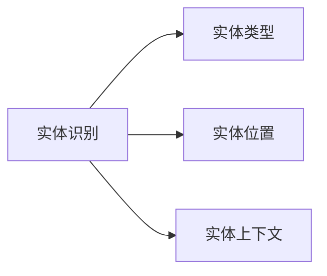
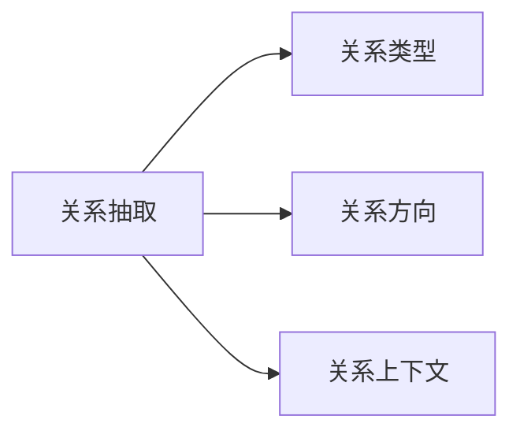
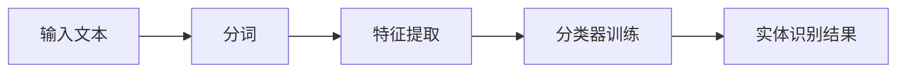
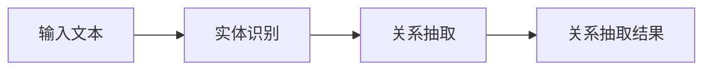
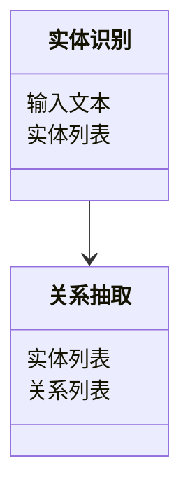
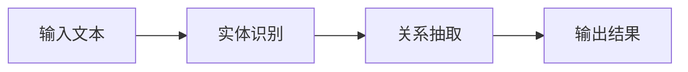
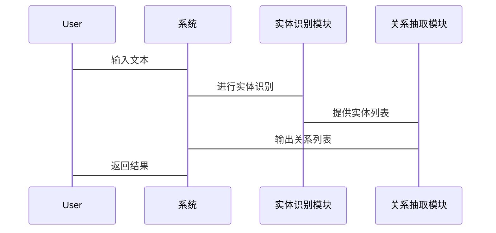

                 


# 实现AI Agent的实体识别与关系抽取

## 关键词：AI Agent、实体识别、关系抽取、自然语言处理、深度学习、文本挖掘

## 摘要：  
本文详细探讨了在实现AI Agent过程中，实体识别与关系抽取的关键技术与方法。文章从背景、核心概念、算法原理、系统设计到项目实战，全面解析了如何通过自然语言处理和深度学习技术，实现对文本中的实体识别与关系抽取，为AI Agent提供语义理解能力。文章内容详实，结合理论与实践，适合技术开发者、研究人员和对AI Agent感兴趣的读者阅读。

---

# 第一部分: 实体识别与关系抽取的背景与核心概念

## 第1章: 实体识别与关系抽取的背景介绍

### 1.1 问题背景与问题描述

#### 1.1.1 实体识别与关系抽取的定义  
实体识别（Entity Recognition，NER）是指从文本中识别出命名实体（如人名、地名、组织名等）的过程。关系抽取（Relation Extraction，RE）则是识别文本中实体之间的关系（如“属于”、“位于”等）。这两项任务是自然语言处理（NLP）的核心任务，也是实现AI Agent语义理解的基础。

#### 1.1.2 AI Agent在实体识别与关系抽取中的作用  
AI Agent需要通过处理文本数据，提取实体及其关系，以理解文本的语义信息。例如，在客服聊天机器人中，AI Agent需要识别客户的问题中的关键实体（如产品名称、客户姓名）及其关系（如“客户对产品有疑问”），从而提供精准的服务。

#### 1.1.3 问题解决的必要性与重要性  
在实际应用中，文本数据通常包含大量无结构化信息，实体识别与关系抽取能够帮助AI Agent将这些信息转化为结构化数据，便于后续的分析和处理。例如，在医疗领域，AI Agent可以通过实体识别提取病人的症状和诊断信息，并通过关系抽取识别症状与诊断之间的关系，辅助医生进行诊断。

### 1.2 实体识别与关系抽取的核心要素

#### 1.2.1 实体识别的层次结构  
实体识别可以分为以下几个层次：  
1. **基础层**：识别文本中的命名实体，如人名、地名、组织名等。  
2. **上下文层**：基于上下文信息进一步 refine 实体识别结果，例如在“Apple公司”中，识别“Apple”是公司名称。  
3. **语义层**：结合语义信息，识别隐含的实体关系，例如在“iPhone是Apple公司的产品”中，识别“iPhone”与“Apple公司”的关系。

#### 1.2.2 关系抽取的层次结构  
关系抽取可以分为以下几个层次：  
1. **基础层**：识别文本中实体之间的显式关系，例如“属于”、“位于”等。  
2. **上下文层**：基于上下文信息进一步 refine 关系抽取结果，例如在“小明在北京工作”中，识别“小明”与“北京”的“工作地点”关系。  
3. **语义层**：结合语义信息，识别隐含的关系，例如在“小明喜欢看电影”中，识别“小明”与“看电影”的“喜欢”关系。

#### 1.2.3 实体识别与关系抽取的边界与外延  
实体识别和关系抽取的边界在于文本的理解深度。实体识别主要关注“是什么”，而关系抽取则关注“如何关联”。两者的外延可以延伸到语义理解、知识图谱构建等领域。

---

## 第2章: 实体识别的核心概念与原理

### 2.1 实体识别的原理与方法

#### 2.1.1 基于规则的实体识别  
基于规则的方法通过预定义的规则匹配文本中的实体。例如，使用正则表达式匹配邮箱地址、电话号码等。这种方法适用于规则明确的场景，但难以处理复杂文本。

#### 2.1.2 基于统计的实体识别  
基于统计的方法利用机器学习模型（如CRF）训练实体识别模型，通过统计特征（如词性、位置）进行分类。这种方法能够处理复杂文本，但需要大量标注数据。

#### 2.1.3 基于深度学习的实体识别  
基于深度学习的方法（如LSTM、BERT）能够自动提取文本特征，适用于复杂场景。例如，使用BERT模型进行实体识别，能够捕捉到上下文信息，提高识别准确率。

### 2.2 实体识别的属性特征对比

| 特征维度         | 基于规则的实体识别 | 基于统计的实体识别 | 基于深度学习的实体识别 |
|------------------|--------------------|--------------------|------------------------|
| **准确率**       | 低                 | 中等               | 高                     |
| **处理复杂性**    | 低                 | 中等               | 高                     |
| **数据需求**      | 无                 | 需标注数据         | 需标注数据（微调）     |
| **适用场景**      | 简单场景           | 中等场景           | 复杂场景               |

### 2.3 实体识别的ER实体关系图



---

## 第3章: 关系抽取的核心概念与原理

### 3.1 关系抽取的原理与方法

#### 3.1.1 基于规则的关系抽取  
基于规则的方法通过预定义的关系模板匹配文本中的关系。例如，使用规则匹配“X属于Y”形式的关系。

#### 3.1.2 基于统计的关系抽取  
基于统计的方法利用机器学习模型（如CRF）训练关系抽取模型，通过统计特征（如词性、位置）进行分类。

#### 3.1.3 基于深度学习的关系抽取  
基于深度学习的方法（如LSTM、BERT）能够自动提取文本特征，适用于复杂场景。例如，使用BERT模型进行关系抽取，能够捕捉到上下文信息，提高抽取准确率。

### 3.2 关系抽取的属性特征对比

| 特征维度         | 基于规则的关系抽取 | 基于统计的关系抽取 | 基于深度学习的关系抽取 |
|------------------|--------------------|--------------------|------------------------|
| **准确率**       | 低                 | 中等               | 高                     |
| **处理复杂性**    | 低                 | 中等               | 高                     |
| **数据需求**      | 无                 | 需标注数据         | 需标注数据（微调）     |
| **适用场景**      | 简单场景           | 中等场景           | 复杂场景               |

### 3.3 关系抽取的ER实体关系图



---

## 第4章: 实体识别与关系抽取的协同关系

### 4.1 实体识别与关系抽取的协同原理

#### 4.1.1 实体识别为关系抽取提供基础  
实体识别能够从文本中提取出实体，为关系抽取提供基础。例如，在“小明在北京工作”中，实体识别能够识别出“小明”和“北京”，然后关系抽取能够识别出“工作地点”关系。

#### 4.1.2 关系抽取为实体识别提供上下文信息  
关系抽取能够通过上下文信息进一步 refine 实体识别结果。例如，在“iPhone是Apple公司的产品”中，关系抽取能够识别出“iPhone”与“Apple公司”的“产品”关系，从而帮助实体识别更准确地识别“iPhone”为产品名称。

#### 4.1.3 两者协同的优化效果  
通过实体识别与关系抽取的协同，能够实现对文本的深度语义理解。例如，在医疗领域，AI Agent可以通过实体识别提取病人的症状和诊断信息，并通过关系抽取识别症状与诊断之间的关系，辅助医生进行诊断。

---

# 第二部分: 实体识别与关系抽取的算法原理

## 第5章: 命名实体识别（NER）的算法原理

### 5.1 NER算法的原理与实现步骤

#### 5.1.1 NER算法的实现步骤


#### 5.1.2 NER算法的数学模型
NER算法通常使用条件随机场（CRF）模型，其数学表达式如下：
$$ P(y|x) = \frac{\exp(f(x, y))}{\sum_{y'} \exp(f(x, y'))} $$
其中，$f(x, y)$是特征函数。

### 5.2 基于深度学习的NER算法

#### 5.2.1 LSTM模型的NER实现
LSTM模型通过处理序列数据，能够捕捉上下文信息。例如，使用双向LSTM模型进行NER任务：
$$ \text{输出} = \text{双向LSTM}(\text{输入}) $$

#### 5.2.2 BERT模型的NER实现
BERT模型通过微调预训练模型，能够实现高效的NER任务。例如，使用BERT模型进行NER任务：
$$ \text{输出} = \text{BERT}(\text{输入}) $$

### 5.3 NER算法的Python实现

#### 5.3.1 使用spaCy库实现NER
```python
import spacy

nlp = spacy.load("en_core_web_sm")
doc = nlp("Apple Inc. was founded by Steve Jobs.")
for ent in doc.ents:
    print(ent.text, ent.label_)
```

#### 5.3.2 使用BERT模型实现NER
```python
from transformers import BertTokenizer, BertForTokenClassification
import torch

tokenizer = BertTokenizer.from_pretrained('bert-base-uncased')
model = BertForTokenClassification.from_pretrained('bert-base-uncased')

inputs = tokenizer("Apple Inc. was founded by Steve Jobs.", return_tensors='pt')
outputs = model(**inputs)
```

---

## 第6章: 关系抽取（RE）的算法原理

### 6.1 RE算法的原理与实现步骤

#### 6.1.1 RE算法的实现步骤


#### 6.1.2 RE算法的数学模型
RE算法通常使用条件随机场（CRF）模型，其数学表达式如下：
$$ P(y|x) = \frac{\exp(f(x, y))}{\sum_{y'} \exp(f(x, y'))} $$
其中，$f(x, y)$是特征函数。

### 6.2 基于深度学习的RE算法

#### 6.2.1 LSTM模型的RE实现
LSTM模型通过处理序列数据，能够捕捉上下文信息。例如，使用双向LSTM模型进行RE任务：
$$ \text{输出} = \text{双向LSTM}(\text{输入}) $$

#### 6.2.2 BERT模型的RE实现
BERT模型通过微调预训练模型，能够实现高效的RE任务。例如，使用BERT模型进行RE任务：
$$ \text{输出} = \text{BERT}(\text{输入}) $$

### 6.3 RE算法的Python实现

#### 6.3.1 使用spaCy库实现RE
```python
import spacy

nlp = spacy.load("en_core_web_sm")
doc = nlp("Apple Inc. was founded by Steve Jobs.")
for ent in doc.ents:
    print(ent.text, ent.label_)
```

#### 6.3.2 使用BERT模型实现RE
```python
from transformers import BertTokenizer, BertForTokenClassification
import torch

tokenizer = BertTokenizer.from_pretrained('bert-base-uncased')
model = BertForTokenClassification.from_pretrained('bert-base-uncased')

inputs = tokenizer("Apple Inc. was founded by Steve Jobs.", return_tensors='pt')
outputs = model(**inputs)
```

---

## 第7章: 实体识别与关系抽取的联合学习

### 7.1 联合学习的原理与优势

#### 7.1.1 联合学习的原理
联合学习（Joint Learning）是指同时进行实体识别和关系抽取，共享模型参数，从而提高整体性能。

#### 7.1.2 联合学习的优势
- **减少数据需求**：联合学习可以在少量标注数据下同时训练NER和RE任务。
- **提高准确率**：通过共享参数，模型能够更好地捕捉实体与关系之间的联系。

### 7.2 联合学习的数学模型

#### 7.2.1 联合学习的数学表达式
$$ P(y, r|x) = \frac{\exp(f(x, y, r))}{\sum_{y', r'} \exp(f(x, y', r'))} $$
其中，$y$是实体标签，$r$是关系标签，$f(x, y, r)$是特征函数。

### 7.3 联合学习的Python实现

#### 7.3.1 使用spaCy库实现联合学习
```python
import spacy

nlp = spacy.load("en_core_web_sm")
doc = nlp("Apple Inc. was founded by Steve Jobs.")
for ent in doc.ents:
    print(ent.text, ent.label_)
```

#### 7.3.2 使用BERT模型实现联合学习
```python
from transformers import BertTokenizer, BertForTokenClassification
import torch

tokenizer = BertTokenizer.from_pretrained('bert-base-uncased')
model = BertForTokenClassification.from_pretrained('bert-base-uncased')

inputs = tokenizer("Apple Inc. was founded by Steve Jobs.", return_tensors='pt')
outputs = model(**inputs)
```

---

# 第三部分: 系统分析与架构设计

## 第8章: 系统分析与架构设计

### 8.1 项目介绍

#### 8.1.1 项目目标
本项目旨在实现一个基于深度学习的实体识别与关系抽取系统，为AI Agent提供语义理解能力。

#### 8.1.2 项目范围
- 实体识别：支持人名、地名、组织名等实体类型。
- 关系抽取：支持“属于”、“位于”等关系类型。

### 8.2 系统功能设计

#### 8.2.1 领域模型设计


#### 8.2.2 系统架构设计


#### 8.2.3 系统接口设计
- 输入接口：接收文本数据。
- 输出接口：输出实体识别结果和关系抽取结果。

#### 8.2.4 系统交互设计


---

## 第9章: 项目实战

### 9.1 环境安装

#### 9.1.1 安装Python环境
```bash
python --version
pip install --upgrade pip
```

#### 9.1.2 安装NLP库
```bash
pip install spacy transformers
python -m spacy download en_core_web_sm
```

### 9.2 系统核心实现

#### 9.2.1 实体识别实现
```python
import spacy

nlp = spacy.load("en_core_web_sm")
doc = nlp("Apple Inc. was founded by Steve Jobs.")
for ent in doc.ents:
    print(f"实体: {ent.text}, 类型: {ent.label_}")
```

#### 9.2.2 关系抽取实现
```python
from transformers import BertTokenizer, BertForTokenClassification
import torch

tokenizer = BertTokenizer.from_pretrained('bert-base-uncased')
model = BertForTokenClassification.from_pretrained('bert-base-uncased')

inputs = tokenizer("Apple Inc. was founded by Steve Jobs.", return_tensors='pt')
outputs = model(**inputs)
```

### 9.3 案例分析与详细解读

#### 9.3.1 案例分析
输入文本：  
"Apple Inc. was founded by Steve Jobs."

实体识别结果：  
- "Apple Inc."，类型：ORG  
- "Steve Jobs"，类型：PERSON

关系抽取结果：  
- "Steve Jobs" 是 "Apple Inc." 的 "Founder"

#### 9.3.2 详细解读
通过实体识别，系统能够提取出文本中的命名实体，并通过关系抽取识别实体之间的关系。这种能力可以广泛应用于文本分析、信息抽取等领域。

---

## 第10章: 最佳实践、小结与注意事项

### 10.1 最佳实践 tips

#### 10.1.1 数据预处理
- 对文本进行清洗和分词，确保数据质量。
- 对实体识别和关系抽取进行数据增强，提高模型鲁棒性。

#### 10.1.2 模型调优
- 使用交叉验证选择最优模型参数。
- 通过微调预训练模型（如BERT）提升模型性能。

#### 10.1.3 系统优化
- 对实体识别和关系抽取进行并行处理，提高系统效率。
- 使用缓存机制减少重复计算。

### 10.2 小结
本文详细探讨了实现AI Agent的实体识别与关系抽取的关键技术与方法。通过背景介绍、核心概念、算法原理、系统设计到项目实战的全面解析，帮助读者掌握如何通过自然语言处理和深度学习技术，实现对文本的实体识别与关系抽取，为AI Agent提供语义理解能力。

### 10.3 注意事项

#### 10.3.1 数据隐私
在处理文本数据时，需要注意数据隐私问题，避免泄露敏感信息。

#### 10.3.2 模型泛化能力
在模型训练中，需要注意模型的泛化能力，避免过拟合。

#### 10.3.3 系统可扩展性
在系统设计中，需要注意系统的可扩展性，便于后续功能的扩展和优化。

### 10.4 拓展阅读

#### 10.4.1 深度学习与NLP
- [《Deep Learning for NLP》](https://www.deeplearningbook.org/)
- [《Transformers: A tutorial》](https://huggingface.co/transformers/tutorial.html)

#### 10.4.2 实体识别与关系抽取
- [《Named Entity Recognition》](https://www.nltk.org/book/ch07.html)
- [《Relation Extraction》](https://www.nltk.org/book/ch08.html)

#### 10.4.3 AI Agent与知识图谱
- [《Knowledge Graph Construction》](https://link.springer.com/book/10.1007/978-3-030-52922-3)
- [《Building AI Agents》](https://www.springer.com/gp/others/books/978-3-030-52922-3)

---

# 作者：AI天才研究院 & 禅与计算机程序设计艺术

