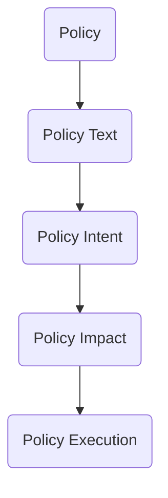
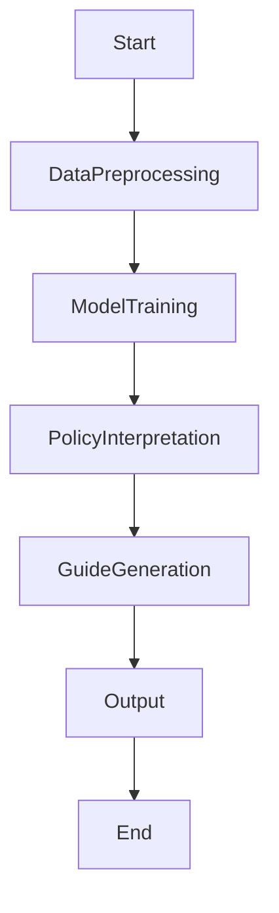
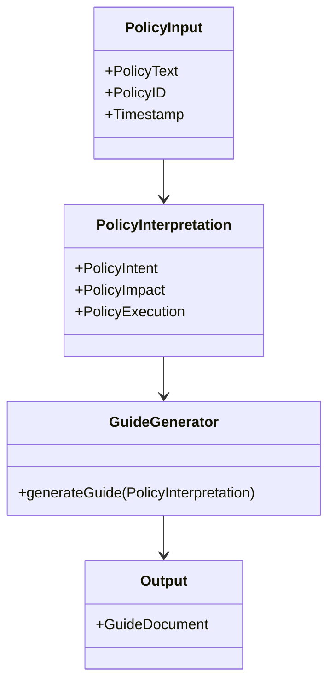
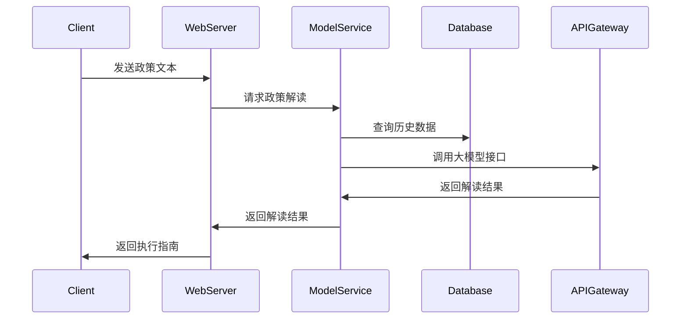

                 


# 开发基于大模型的金融政策解读与执行指南生成器

## 关键词：大模型、金融政策、自然语言处理、政策解读、执行指南生成器

## 摘要：  
本文详细探讨了基于大模型开发金融政策解读与执行指南生成器的全过程，涵盖背景分析、核心概念解析、算法原理、系统架构设计及项目实战。通过结合自然语言处理和大模型技术，提出了一种创新的解决方案，能够高效准确地解读金融政策并生成执行指南。本文还提供了丰富的案例分析和代码实现，为读者提供了从理论到实践的完整指导。

---

# 第一部分: 背景介绍

## 第1章: 开发基于大模型的金融政策解读与执行指南生成器概述

### 1.1 问题背景与挑战
#### 1.1.1 金融政策解读的复杂性  
金融政策解读是一项复杂且耗时的任务，涉及多领域知识和大量文本数据。政策制定者和执行者需要快速理解政策内容、意图和潜在影响。传统的政策解读方法依赖人工分析，效率低且容易出错。

#### 1.1.2 传统政策解读的局限性  
传统政策解读主要依赖人工阅读和分析，存在以下问题：  
1. **效率低下**：面对海量政策文件，人工解读耗时耗力。  
2. **主观性**：不同解读者可能得出不同结论。  
3. **知识限制**：解读者需要具备专业知识，否则难以准确理解政策内容。  

#### 1.1.3 基于大模型的解决方案  
大模型（如GPT-3、GPT-4）具备强大的自然语言处理能力，能够快速理解和生成文本。通过结合大模型和金融领域的专业知识，可以开发出高效的金融政策解读与执行指南生成器。

### 1.2 问题描述与目标
#### 1.2.1 金融政策解读的核心问题  
金融政策解读的核心问题包括：  
- 理解政策文本的语义和意图。  
- 识别政策的适用范围和影响对象。  
- 分析政策的执行条件和操作步骤。  

#### 1.2.2 执行指南生成的关键目标  
执行指南生成的关键目标包括：  
- 提供清晰的政策执行步骤。  
- 生成符合法规的执行模板。  
- 预测政策执行中的潜在问题并提供建议。  

#### 1.2.3 系统的边界与外延  
系统的边界包括：  
- 输入：金融政策文本。  
- 输出：政策解读结果和执行指南。  
- 外延：不涉及政策制定过程，仅专注于解读和执行指导。  

### 1.3 核心概念与组成要素
#### 1.3.1 金融政策解读的定义与特征  
金融政策解读是指通过分析政策文本，提取政策的核心内容、意图和影响。其特征包括：  
- **语义理解**：准确理解政策文本的含义。  
- **知识关联**：结合金融领域的专业知识。  
- **动态更新**：适应政策的变化和更新。  

#### 1.3.2 执行指南生成的流程与要求  
执行指南生成的流程包括：  
1. 理解政策内容。  
2. 分析政策的适用范围和执行条件。  
3. 生成具体的执行步骤和模板。  

#### 1.3.3 系统的核心组成要素  
系统的核心组成要素包括：  
- **输入模块**：接收政策文本输入。  
- **解读模块**：分析政策文本，提取关键信息。  
- **生成模块**：根据解读结果生成执行指南。  
- **输出模块**：将生成的指南输出为结构化文档。  

---

# 第二部分: 核心概念与联系

## 第2章: 金融政策解读与大模型的关系

### 2.1 金融政策解读的核心要素
#### 2.1.1 政策文本的结构化分析  
政策文本通常包括标题、正文和附则等部分。结构化分析有助于提取关键信息。  
- **标题**：概括政策的核心内容。  
- **正文**：详细描述政策的具体内容和执行要求。  
- **附则**：规定政策的生效日期和适用范围。  

#### 2.1.2 政策意图的识别  
政策意图是政策制定者希望通过政策实现的目标。例如：  
- 提高金融监管效率。  
- 促进金融市场的稳定发展。  

#### 2.1.3 政策影响的评估  
政策影响的评估包括：  
- 对金融市场的影响。  
- 对企业和个人的影响。  
- 对监管机构的影响。  

### 2.2 大模型在金融政策解读中的能力
#### 2.2.1 大模型的自然语言处理能力  
大模型具备以下自然语言处理能力：  
- **语义理解**：理解复杂文本的含义。  
- **上下文推理**：根据上下文推断未明说的信息。  
- **多语言支持**：处理多种语言的文本。  

#### 2.2.2 大模型的知识推理能力  
大模型能够通过知识图谱进行推理，帮助理解政策的背景和相关知识。例如：  
- 理解金融术语的定义和关系。  
- 推理政策的潜在影响和执行步骤。  

#### 2.2.3 大模型的上下文理解能力  
大模型能够结合上下文，准确理解政策文本中的隐含信息。例如：  
- 理解政策中的专业术语。  
- 推断政策的适用范围。  

### 2.3 金融政策解读与大模型的联系
#### 2.3.1 大模型如何辅助政策解读  
大模型可以通过以下方式辅助政策解读：  
1. **自动提取关键信息**：从政策文本中提取核心内容。  
2. **生成政策解读报告**：根据政策文本生成结构化的解读报告。  
3. **提供执行建议**：基于政策内容生成执行指南。  

#### 2.3.2 大模型在政策执行中的应用  
大模型可以应用于政策执行的以下方面：  
1. **生成执行模板**：提供具体的执行步骤和操作指南。  
2. **预测执行风险**：分析政策执行可能遇到的问题并提供建议。  
3. **监控执行过程**：实时跟踪政策执行的进展。  

#### 2.3.3 大模型与金融领域的结合  
大模型与金融领域的结合主要体现在：  
- 利用大模型处理金融领域的复杂文本。  
- 结合金融专业知识，提高政策解读的准确性。  

### 2.4 核心概念对比表
以下表格对比了金融政策解读与传统解读的关键特征：  

| 特性                | 金融政策解读                  | 传统政策解读                  |
|---------------------|-----------------------------|-----------------------------|
| **输入数据**        | 结构化政策文本                | 非结构化政策文本              |
| **输出结果**        | 结构化解读报告和执行指南      | 文本摘要和初步理解              |
| **效率**            | 高效，基于大模型自动化处理    | 低效，依赖人工分析              |
| **准确性**          | 高，基于专业知识和大数据训练    | 中等，受主观因素影响较大        |

### 2.5 ER实体关系图
以下是金融政策解读的实体关系图：  


---

# 第三部分: 算法原理讲解

## 第3章: 基于大模型的金融政策解读算法

### 3.1 算法概述
#### 3.1.1 算法的整体流程  
1. **数据预处理**：清洗和标注政策文本数据。  
2. **模型训练**：基于大模型进行微调，使其适应金融政策解读任务。  
3. **政策解读**：通过模型生成政策解读结果。  
4. **执行指南生成**：根据解读结果生成执行指南。  

#### 3.1.2 算法的核心思想  
通过结合大模型的自然语言处理能力和金融领域的专业知识，实现金融政策的自动解读和执行指南生成。  

#### 3.1.3 算法的输入输出  
- **输入**：金融政策文本。  
- **输出**：政策解读结果和执行指南。  

### 3.2 算法实现细节
#### 3.2.1 数据预处理
数据预处理是模型训练的基础，主要包括：  
1. **文本清洗**：去除无关信息，保留政策文本的核心内容。  
2. **分词和标注**：将政策文本分词，并标注关键词和关键句。  
3. **数据增强**：通过数据增强技术，增加训练数据的多样性。  

#### 3.2.2 模型训练
模型训练是基于大模型的微调过程，具体步骤如下：  
1. **加载大模型**：选择适合的预训练大模型（如GPT-3）。  
2. **微调模型**：在金融政策文本数据上进行微调，使其适应政策解读任务。  
3. **评估与优化**：通过评估指标（如准确率、召回率）优化模型性能。  

#### 3.2.3 算法流程图
以下是算法的整体流程图：  


### 3.3 算法的数学模型与公式
#### 3.3.1 概率计算公式
大模型的自然语言处理基于概率计算，公式如下：  
$$ P(\text{输出} | \text{输入}) = \prod_{i=1}^{n} P(y_i | y_{i-1}, x) $$  
其中，$y_i$ 是输出序列中的第$i$个词，$x$ 是输入序列。  

#### 3.3.2 损失函数
模型的损失函数通常采用交叉熵损失：  
$$ \mathcal{L} = -\sum_{i=1}^{n} \log P(y_i | y_{i-1}, x) $$  

---

# 第四部分: 系统分析与架构设计

## 第4章: 系统分析与架构设计

### 4.1 系统功能设计
#### 4.1.1 领域模型设计
以下是系统功能的领域模型：  


### 4.2 系统架构设计
以下是系统的整体架构图：  


### 4.3 系统接口设计
系统主要接口包括：  
1. **输入接口**：接收政策文本输入。  
2. **输出接口**：返回政策解读结果和执行指南。  
3. **API接口**：提供RESTful API供其他系统调用。  

### 4.4 系统交互设计
以下是系统交互的序列图：  


---

# 第五部分: 项目实战

## 第5章: 项目实战

### 5.1 环境安装
#### 5.1.1 安装Python
安装Python 3.8或更高版本。  

#### 5.1.2 安装依赖库
安装以下依赖库：  
- `transformers`  
- `numpy`  
- `scikit-learn`  

### 5.2 核心代码实现
#### 5.2.1 数据预处理代码
```python
import pandas as pd
from transformers import AutoTokenizer, AutoModelForCausalLM

# 加载预训练模型
tokenizer = AutoTokenizer.from_pretrained('gpt2')
model = AutoModelForCausalLM.from_pretrained('gpt2')

# 数据预处理
def preprocess_policy_text(text):
    # 分词
    tokens = tokenizer.encode(text)
    return tokens

# 示例
text = "加强金融监管，规范金融市场秩序。"
preprocessed = preprocess_policy_text(text)
print(preprocessed)
```

#### 5.2.2 模型训练代码
```python
import torch
from torch import nn
from torch.utils.data import Dataset, DataLoader

# 自定义数据集
class PolicyDataset(Dataset):
    def __init__(self, texts, labels):
        self.texts = texts
        self.labels = labels
    
    def __len__(self):
        return len(self.texts)
    
    def __getitem__(self, idx):
        return self.texts[idx], self.labels[idx]

# 训练函数
def train_model(model, tokenizer, train_loader, optimizer, criterion, epochs=3):
    for epoch in range(epochs):
        for inputs, labels in train_loader:
            outputs = model(inputs)
            loss = criterion(outputs, labels)
            loss.backward()
            optimizer.step()
            optimizer.zero_grad()
    return model

# 示例训练
texts = ["加强金融监管，规范金融市场秩序。", "促进资本市场健康发展。"]
labels = [1, 2]
dataset = PolicyDataset(texts, labels)
dataloader = DataLoader(dataset, batch_size=2, shuffle=True)

model = AutoModelForCausalLM.from_pretrained('gpt2')
optimizer = torch.optim.Adam(model.parameters(), lr=0.001)
criterion = nn.CrossEntropyLoss()

trained_model = train_model(model, tokenizer, dataloader, optimizer, criterion)
```

#### 5.2.3 政策解读与执行指南生成
```python
def generate_policy_guide(policy_text, model, tokenizer):
    tokens = tokenizer.encode(policy_text)
    input_ids = torch.tensor([tokens], dtype=torch.long)
    outputs = model.generate(input_ids, max_length=100)
    guide = tokenizer.decode(outputs[0], skip_special_tokens=True)
    return guide

# 示例
policy_text = "优化企业融资环境，支持实体经济发展。"
guide = generate_policy_guide(policy_text, trained_model, tokenizer)
print(guide)
```

### 5.3 代码解读与分析
1. **数据预处理**：将政策文本转换为模型可接受的输入格式。  
2. **模型训练**：基于预训练模型进行微调，使其适应金融政策解读任务。  
3. **政策解读与执行指南生成**：通过模型生成政策解读结果和执行指南。  

### 5.4 案例分析
假设政策文本为“优化企业融资环境，支持实体经济发展。”，生成的执行指南可能包括：  
1. **政策解读**：该政策旨在通过优化融资环境，支持实体经济发展。  
2. **执行步骤**：  
   - 制定具体的融资支持措施。  
   - 确定支持的实体企业范围。  
   - 监测政策执行效果并进行调整。  

### 5.5 项目小结
通过实战项目，我们验证了基于大模型的金融政策解读与执行指南生成器的有效性。模型能够准确理解政策文本，并生成符合要求的执行指南。

---

# 第六部分: 最佳实践与小结

## 第6章: 最佳实践与小结

### 6.1 开发注意事项
1. **数据质量**：确保训练数据的多样性和准确性。  
2. **模型调优**：通过超参数调优和模型微调，提高模型性能。  
3. **用户反馈**：根据用户反馈不断优化系统。  

### 6.2 小结
本文详细探讨了基于大模型开发金融政策解读与执行指南生成器的全过程，从理论到实践，为读者提供了全面的指导。通过结合自然语言处理技术和金融专业知识，可以高效准确地解读金融政策并生成执行指南。

### 6.3 拓展阅读
1. 《Transformers: Pre-trained Models for NLP》  
2. 《金融政策解读与执行指南》  
3. 《大模型在金融领域的应用》  

---

# 作者

作者：AI天才研究院/AI Genius Institute & 禅与计算机程序设计艺术 /Zen And The Art of Computer Programming

