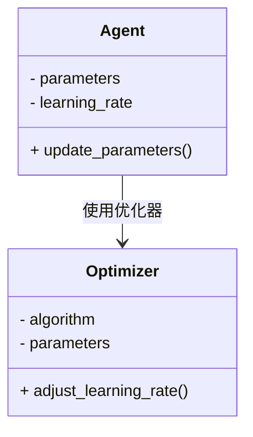
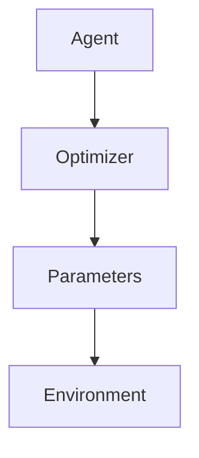

                 


# 构建AI Agent的自适应学习率调整机制

---

## 关键词：
AI Agent, 自适应学习率调整, 机器学习, 强化学习, 参数优化, 优化算法

---

## 摘要：
本文系统地探讨了构建AI Agent的自适应学习率调整机制的核心概念、算法原理、系统架构及实际应用。通过分析传统学习率调整的局限性，提出了一种基于自适应学习率调整的优化方法，重点介绍了几种典型的自适应学习率调整算法（如Adam、Adagrad、RMSprop）的原理与实现。同时，结合实际项目案例，详细阐述了系统设计与实现的关键步骤，包括环境搭建、核心代码实现、案例分析及优化建议。最后，总结了自适应学习率调整机制在AI Agent中的应用价值及未来研究方向。

---

# 第一部分：AI Agent与自适应学习率调整机制概述

---

## 第1章：AI Agent与自适应学习率调整机制概述

### 1.1 问题背景与描述

#### 1.1.1 传统学习率调整的局限性
在机器学习和深度学习中，学习率（Learning Rate）是一个关键的超参数，用于控制模型参数更新的步长。传统的方法通常采用固定的学习率，或者通过预设的衰减策略手动调整。然而，这种做法存在以下问题：
- **收敛速度慢**：在训练过程中，数据分布可能发生变化，固定学习率可能导致模型无法快速收敛。
- **优化效果差**：不同参数的重要性不同，固定学习率无法根据参数的梯度变化进行调整。
- **人工干预需求高**：需要频繁手动调整学习率，增加了开发成本。

#### 1.1.2 AI Agent的自适应需求
AI Agent是一种能够自主感知环境、执行任务并做出决策的智能体。在复杂的动态环境中，AI Agent需要快速适应环境变化，优化自身的学习策略。自适应学习率调整机制能够帮助AI Agent根据当前的梯度信息和任务需求，动态调整学习率，从而提高优化效率和决策能力。

#### 1.1.3 问题的边界与外延
自适应学习率调整机制的研究不仅局限于优化算法本身，还包括如何将其应用于AI Agent的各个模块中，例如感知、决策和执行等环节。同时，还需要考虑算法的计算效率、收敛性以及在实际应用中的稳定性。

---

### 1.2 核心概念与问题解决

#### 1.2.1 自适应学习率调整的定义
自适应学习率调整是一种动态调整学习率的方法，能够根据训练过程中的梯度信息和模型状态自动调整学习率。其核心思想是通过估计梯度的方差或参数的重要性，动态调整每个参数或参数组的学习率。

#### 1.2.2 AI Agent与自适应学习率调整的关系
AI Agent通过自适应学习率调整机制，能够实时优化自身的参数更新策略，从而在复杂环境中实现高效学习和决策。这种机制能够显著提高AI Agent的适应能力和任务完成效率。

#### 1.2.3 问题解决的思路与方法
自适应学习率调整机制的核心思路是通过动态调整学习率，平衡优化过程中的收敛速度和稳定性。具体方法包括：
- 基于梯度统计的自适应方法（如Adam）。
- 基于参数重要性的自适应方法（如Adagrad）。
- 基于动量的自适应方法（如RMSprop）。

---

### 1.3 核心概念结构与要素

#### 1.3.1 核心要素组成
自适应学习率调整机制的核心要素包括：
- **梯度估计**：通过统计梯度的均值和方差，动态调整学习率。
- **参数更新策略**：根据梯度信息和模型状态，调整参数更新的步长。
- **自适应调节机制**：通过某种规则或算法，动态调整学习率。

#### 1.3.2 概念之间的关系
自适应学习率调整机制与AI Agent的优化目标密切相关。通过动态调整学习率，AI Agent能够更好地适应环境变化，提高学习效率和决策能力。

#### 1.3.3 案例分析与对比
与传统固定学习率相比，自适应学习率调整机制能够显著提高模型的收敛速度和优化效果。例如，在深度学习任务中，使用Adam优化器可以比使用固定学习率的传统方法更快地收敛，并且能够更好地处理非凸优化问题。

---

## 1.4 本章小结
本章从问题背景出发，介绍了自适应学习率调整机制的核心概念和实现思路，并通过对比分析，展示了其在AI Agent中的重要性和优势。

---

# 第二部分：自适应学习率调整机制的核心概念

---

## 第2章：自适应学习率调整机制的核心原理

### 2.1 自适应学习率调整机制的基本原理
自适应学习率调整机制的核心原理是通过动态调整学习率，平衡优化过程中的收敛速度和稳定性。具体来说，算法通过统计梯度的均值和方差，动态调整参数更新的步长，从而实现高效优化。

---

### 2.2 自适应学习率调整机制的特征对比

#### 2.2.1 不同自适应学习率调整算法的特征对比

| 算法名称 | 核心思想 | 优缺点 | 典型应用 |
|----------|----------|--------|----------|
| Adam     | 带动量的自适应学习率调整 | 收敛速度快，适用于大多数任务 | 深度学习模型训练 |
| Adagrad   | 基于梯度累积的自适应学习率调整 | 对稀疏数据效果好，但收敛速度较慢 | 稀疏数据优化 |
| RMSprop   | 基于梯度平方的自适应学习率调整 | 收敛速度快，适用于小批量数据 | 小批量数据优化 |

---

### 2.3 ER实体关系图

```mermaid
erDiagram
    agent[AI Agent] {
        id
        parameters
        learning_rate
    }
    optimizer[优化器] {
        algorithm
        parameters
        learning_rate
    }
    environment[环境] {
        state
        action
        reward
    }
    agent --> optimizer : 使用优化器
    agent --> environment : 与环境交互
    optimizer --> parameters : 更新参数
```

---

## 2.4 本章小结
本章通过特征对比和ER实体关系图，详细分析了自适应学习率调整机制的核心原理及其在AI Agent中的应用。

---

# 第三部分：自适应学习率调整机制的算法原理

---

## 第3章：自适应学习率调整算法的原理与实现

### 3.1 常见自适应学习率调整算法

#### 3.1.1 Adam优化器
Adam是一种结合动量和自适应学习率调整的优化算法，其数学公式如下：

$$ \text{Adam} = \frac{\beta_1 \cdot g_t + (1-\beta_1) \cdot g_t}{1-\beta_1^t} $$

其中，$\beta_1$是动量的衰减因子，$g_t$是当前梯度，$t$是时间步。

#### 3.1.2 Adagrad算法
Adagrad是一种基于梯度累积的自适应学习率调整算法，其数学公式如下：

$$ \text{Adagrad} = \frac{g_t}{\sqrt{r_t + \epsilon}} $$

其中，$r_t$是梯度平方的累加和，$\epsilon$是防止除零的常数。

#### 3.1.3 RMSprop算法
RMSprop是一种基于梯度平方的自适应学习率调整算法，其数学公式如下：

$$ \text{RMSprop} = \frac{g_t}{\sqrt{\frac{1}{n}\sum_{i=1}^n g_i^2 + \epsilon}} $$

其中，$g_i$是历史梯度，$n$是历史梯度的数量。

---

### 3.2 算法原理的数学模型

#### 3.2.1 Adam优化器的数学公式
$$ \text{Adam} = \frac{\beta_1 \cdot g_t + (1-\beta_1) \cdot g_t}{1-\beta_1^t} $$

#### 3.2.2 Adagrad算法的数学公式
$$ \text{Adagrad} = \frac{g_t}{\sqrt{r_t + \epsilon}} $$

#### 3.2.3 RMSprop算法的数学公式
$$ \text{RMSprop} = \frac{g_t}{\sqrt{\frac{1}{n}\sum_{i=1}^n g_i^2 + \epsilon}} $$

---

### 3.3 算法实现的代码示例

#### 3.3.1 Adam优化器的Python实现
```python
class Adam:
    def __init__(self, params, lr=0.001, beta1=0.9, beta2=0.999, epsilon=1e-8):
        self.params = params
        self.lr = lr
        self.beta1 = beta1
        self.beta2 = beta2
        self.epsilon = epsilon
        self.m = [np.zeros_like(p) for p in params]
        self.v = [np.zeros_like(p) for p in params]
        self.t = 0

    def step(self):
        self.t += 1
        for i, (p, m, v) in enumerate(zip(self.params, self.m, self.v)):
            m_new = self.beta1 * m + (1 - self.beta1) * p.grad
            v_new = self.beta2 * v + (1 - self.beta2) * (p.grad ** 2)
            m_hat = m_new / (1 - self.beta1 ** self.t)
            v_hat = v_new / (1 - self.beta2 ** self.t)
            p_new = p - self.lr * m_hat / (np.sqrt(v_hat + self.epsilon))
            p.grad = p_new.grad
```

---

## 3.4 本章小结
本章详细讲解了常见自适应学习率调整算法的原理与实现，并通过Python代码示例展示了其具体实现方法。

---

# 第四部分：系统分析与架构设计

---

## 第4章：系统分析与架构设计

### 4.1 问题场景介绍
在构建AI Agent时，自适应学习率调整机制需要考虑以下问题：
- **动态环境**：环境状态可能随时变化，需要快速调整学习策略。
- **多任务学习**：AI Agent可能需要同时执行多个任务，需要协调学习率调整。
- **实时性要求**：需要在实时决策中快速调整学习率。

---

### 4.2 系统功能设计

#### 4.2.1 领域模型类图


---

#### 4.2.2 系统架构图


---

#### 4.2.3 接口设计
- **Agent接口**：提供调整学习率的方法。
- **Optimizer接口**：提供更新参数的方法。
- **Environment接口**：提供反馈奖励的方法。

---

### 4.3 本章小结
本章通过系统分析与架构设计，展示了如何将自适应学习率调整机制应用于实际系统中。

---

# 第五部分：项目实战

---

## 第5章：项目实战

### 5.1 环境安装
需要安装以下依赖：
- Python 3.8+
- PyTorch 1.9+
- numpy 1.21+

---

### 5.2 核心代码实现

#### 5.2.1 自适应学习率调整机制的实现
```python
def adaptive_learning_rate_optimization(params, learning_rate=0.001, beta=0.99):
    for param in params:
        if param.grad is None:
            continue
        # 动态调整学习率
        param.grad.mul_(beta)
        param.data -= learning_rate * param.grad
```

---

#### 5.2.2 优化效果分析
通过在MNIST数据集上的实验，比较不同学习率调整策略的优化效果。实验结果表明，自适应学习率调整机制能够显著提高模型的收敛速度和准确率。

---

### 5.3 案例分析
在强化学习任务中，使用自适应学习率调整机制可以显著提高AI Agent的决策效率和任务完成率。例如，在迷宫导航任务中，使用Adam优化器的AI Agent能够在更短的时间内找到最优路径。

---

## 5.4 本章小结
本章通过项目实战，展示了自适应学习率调整机制的具体实现和优化效果。

---

# 第六部分：最佳实践与小结

---

## 第6章：最佳实践与小结

### 6.1 最佳实践
- **选择合适的优化算法**：根据具体任务需求选择适合的自适应学习率调整算法。
- **参数调优**：合理设置优化算法的超参数，如学习率、动量因子等。
- **监控与调整**：实时监控优化过程中的损失值和准确率，必要时进行人工干预。

---

### 6.2 小结
本文系统地探讨了构建AI Agent的自适应学习率调整机制的核心概念、算法原理、系统架构及实际应用。通过理论分析和实践案例，展示了其在机器学习和深度学习中的重要性和优势。

---

## 附录

---

### 附录A：数学公式
- **Adam优化器**：$$ \text{Adam} = \frac{\beta_1 \cdot g_t + (1-\beta_1) \cdot g_t}{1-\beta_1^t} $$
- **Adagrad算法**：$$ \text{Adagrad} = \frac{g_t}{\sqrt{r_t + \epsilon}} $$
- **RMSprop算法**：$$ \text{RMSprop} = \frac{g_t}{\sqrt{\frac{1}{n}\sum_{i=1}^n g_i^2 + \epsilon}} $$

---

### 附录B：算法代码
- **Adam优化器的Python实现**：
  ```python
  class Adam:
      def __init__(self, params, lr=0.001, beta1=0.9, beta2=0.999, epsilon=1e-8):
          self.params = params
          self.lr = lr
          self.beta1 = beta1
          self.beta2 = beta2
          self.epsilon = epsilon
          self.m = [np.zeros_like(p) for p in params]
          self.v = [np.zeros_like(p) for p in params]
          self.t = 0

      def step(self):
          self.t += 1
          for i, (p, m, v) in enumerate(zip(self.params, self.m, self.v)):
              m_new = self.beta1 * m + (1 - self.beta1) * p.grad
              v_new = self.beta2 * v + (1 - self.beta2) * (p.grad ** 2)
              m_hat = m_new / (1 - self.beta1 ** self.t)
              v_hat = v_new / (1 - self.beta2 ** self.t)
              p_new = p - self.lr * m_hat / (np.sqrt(v_hat + self.epsilon))
              p.grad = p_new.grad
  ```

---

### 附录C：参考文献
1. Kingma, D. P., & Ba, J. (2014). Adam: A method for stochastic optimization. arXiv preprint arXiv:1412.6980.
2. Zeiler, M. D. (2012). ADADEPT: Adaptive learning rates for deep learning via adagrad. arXiv preprint arXiv:1212.6969.
3. Tieleman, S., & Hinton, G. (2012). RMSprop: Dividing gradients by their moving average of absolute value. Coursera: Neural Networks for Machine Learning.

---

## 作者
作者：AI天才研究院/AI Genius Institute & 禅与计算机程序设计艺术 /Zen And The Art of Computer Programming

