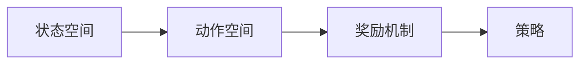
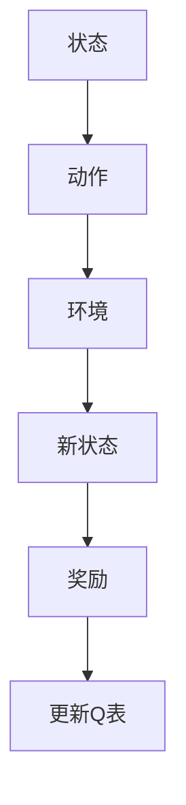
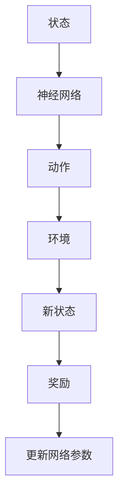
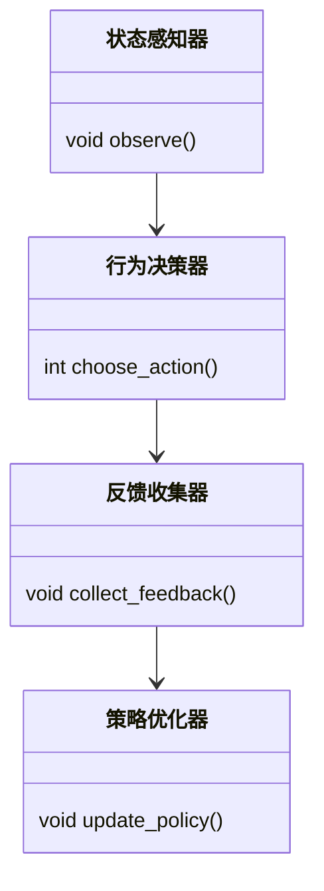
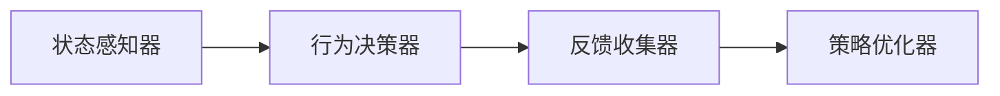

                 


# 构建具有自适应学习能力的AI Agent

> 关键词：自适应学习，AI Agent，强化学习，深度强化学习，Q-learning，DQN

> 摘要：本文将深入探讨如何构建一个具有自适应学习能力的AI Agent。通过分析自适应学习的核心概念、算法原理、系统架构以及实际项目案例，我们将逐步揭示如何实现一个能够根据环境反馈动态优化行为的智能体。文章内容涵盖从基础理论到实际应用的全过程，旨在为读者提供一个全面的技术指南。

---

## 第一部分：自适应学习AI Agent的背景与概念

### 第1章：自适应学习AI Agent概述

#### 1.1 问题背景与目标

##### 1.1.1 传统AI Agent的局限性
传统AI Agent通常基于规则或静态模型进行决策，无法有效应对动态变化的环境。例如，在复杂的游戏或实时策略优化场景中，固定的规则可能迅速失效，导致性能下降。

##### 1.1.2 自适应学习的需求与目标
为了应对动态环境中的挑战，自适应学习AI Agent的需求日益迫切。其目标是通过实时学习和优化，动态调整策略以应对环境变化。

##### 1.1.3 自适应学习AI Agent的核心价值
自适应学习AI Agent的核心价值在于其能够通过与环境的交互，不断优化自身行为，从而在复杂场景中实现更高效的决策和执行。

#### 1.2 问题描述与解决方案

##### 1.2.1 自适应学习的核心问题
自适应学习的核心问题是：如何在动态环境中，通过有限的交互和反馈，构建一个能够持续优化的智能体。

##### 1.2.2 解决方案的技术路径
解决方案主要依赖于强化学习（Reinforcement Learning）和深度学习（Deep Learning）技术。通过设计适当的奖励机制和优化算法，使智能体能够从经验中学习。

##### 1.2.3 自适应学习的实现框架
自适应学习的实现框架通常包括以下几个步骤：
1. 状态感知：智能体感知当前环境状态。
2. 行为决策：基于当前状态和历史经验，选择最优行为。
3. 反馈收集：智能体执行行为后，收集环境反馈。
4. 策略优化：根据反馈调整策略，更新知识库。

#### 1.3 边界与外延

##### 1.3.1 自适应学习的边界条件
自适应学习的边界条件包括：
- 环境的动态性：环境是否可预测且可学习。
- 反馈的及时性：反馈是否能够及时传递。
- 行为的复杂性：行为空间的大小和复杂度。

##### 1.3.2 相关概念的对比与区分
| 概念       | 描述                                                                 |
|------------|--------------------------------------------------------------------|
| 监督学习    | 基于标记数据，学习函数的输入输出关系。                              |
| 无监督学习  | 基于未标记数据，发现数据中的结构和模式。                            |
| 强化学习    | 基于奖励机制，通过试错优化策略。                                    |
| 自适应学习  | 基于环境反馈，动态调整行为以优化目标函数。                          |

##### 1.3.3 自适应学习的外延领域
自适应学习的外延领域包括：
- 连续控制：在物理系统中进行实时控制。
- 多智能体协作：多个智能体协同工作，共同完成复杂任务。
- 人机交互：优化人与智能体之间的互动体验。

#### 1.4 核心要素与概念结构

##### 1.4.1 自适应学习的核心要素
- **状态空间**：智能体所处的环境状态。
- **动作空间**：智能体可执行的行为。
- **奖励机制**：智能体行为的反馈。
- **策略**：智能体选择动作的规则。

##### 1.4.2 概念之间的关系
- 状态空间和动作空间共同定义了智能体的决策空间。
- 奖励机制是连接智能体行为与目标的桥梁。
- 策略是智能体的核心决策机制。

##### 1.4.3 概念结构的可视化


---

## 第二部分：自适应学习的核心概念与联系

### 第2章：自适应学习的核心概念与联系

#### 2.1 核心概念原理

##### 2.1.1 自适应学习的基本原理
自适应学习的基本原理是通过试错和奖励机制，逐步优化智能体的策略。智能体会根据当前状态选择动作，执行后获得奖励，从而调整策略以最大化累积奖励。

##### 2.1.2 自适应学习的关键技术
- **强化学习**：通过奖励机制优化策略。
- **深度学习**：用于复杂状态的表示和学习。
- **在线学习**：实时更新模型参数。

##### 2.1.3 自适应学习的数学模型
自适应学习的数学模型通常基于马尔可夫决策过程（MDP），定义如下：
- 状态空间：\( S \)
- 动作空间：\( A \)
- 奖励函数：\( R(s, a) \)
- 转移概率：\( P(s' | s, a) \)
- 策略：\( \pi(a | s) \)

目标是通过优化策略 \( \pi \)，最大化累积奖励：
$$ V_{\pi}(s) = \mathbb{E}[R | s, \pi] $$

#### 2.2 概念属性特征对比

| 概念       | 监督学习         | 无监督学习       | 强化学习         |
|------------|-----------------|-----------------|-----------------|
| 数据类型    | 标记数据         | 未标记数据       | 环境反馈         |
| 学习目标    | 函数预测         | 数据聚类/降维     | 策略优化         |
| 行为机制    | 确定性           | 探索性           | 探索+利用        |
| 应用场景    | 分类/回归        | 聚类             | 游戏控制/机器人控制 |

#### 2.3 ER实体关系图

```mermaid
er
actor: 智能体
agent: AI Agent
environment: 交互环境
goal: 学习目标
feedback: 学习反馈
action: 智能体动作
```

---

## 第三部分：自适应学习的算法原理

### 第3章：自适应学习的算法原理

#### 3.1 强化学习算法

##### 3.1.1 Q-learning算法



Q-learning算法的伪代码如下：

```python
初始化Q表为零
while True:
    状态s = 环境观察
    动作a = 选择动作（探索或利用）
    新状态s' = 执行动作后的状态
    奖励r = 环境反馈
    Q(s, a) = Q(s, a) + α*(r + γ*max(Q(s', a')) - Q(s, a))
    环境更新
```

##### 3.1.2 Deep Q-Network (DQN)算法



DQN算法的核心思想是使用深度神经网络近似Q值函数，并通过经验回放和目标网络来稳定学习过程。

#### 3.2 算法实现代码

##### 3.2.1 Q-learning算法实现

```python
import numpy as np

class QLearning:
    def __init__(self, state_space, action_space, learning_rate=0.1, gamma=0.9):
        self.Q = np.zeros((state_space, action_space))
        self.lr = learning_rate
        self.gamma = gamma

    def choose_action(self, state, epsilon=0.1):
        if np.random.random() < epsilon:
            return np.random.randint(0, action_space)
        else:
            return np.argmax(self.Q[state])

    def update_Q(self, state, action, reward, next_state):
        self.Q[state, action] = self.Q[state, action] + self.lr * (reward + self.gamma * np.max(self.Q[next_state]) - self.Q[state, action])

# 示例使用
state_space = 5
action_space = 3
ql = QLearning(state_space, action_space)
epsilon = 0.1
for _ in range(100):
    state = np.random.randint(0, state_space)
    action = ql.choose_action(state, epsilon)
    reward = np.random.randint(0, 10)
    next_state = np.random.randint(0, state_space)
    ql.update_Q(state, action, reward, next_state)
```

##### 3.2.2 DQN算法实现

```python
import torch
import torch.nn as nn

class DQN(nn.Module):
    def __init__(self, input_dim, output_dim):
        super(DQN, self).__init__()
        self.fc = nn.Linear(input_dim, 64)
        self.fc2 = nn.Linear(64, output_dim)

    def forward(self, x):
        x = torch.relu(self.fc(x))
        x = self.fc2(x)
        return x

# 示例使用
input_dim = 4
output_dim = 2
dqn = DQN(input_dim, output_dim)
optimizer = torch.optim.Adam(dqn.parameters(), lr=0.001)
criterion = nn.MSELoss()

for _ in range(100):
    state = torch.randn(1, input_dim)
    action_probs = dqn(state)
    action = torch.argmax(action_probs).item()
    reward = torch.randn(1, 1)
    next_state = torch.randn(1, input_dim)
    target = torch.zeros_like(action_probs)
    target[0, action] = reward
    loss = criterion(action_probs, target)
    optimizer.zero_grad()
    loss.backward()
    optimizer.step()
```

---

## 第四部分：系统架构与设计

### 第4章：系统架构与设计

#### 4.1 问题场景介绍

##### 4.1.1 系统介绍
我们设计一个自适应学习AI Agent，用于在动态环境中优化策略。

##### 4.1.2 系统功能需求
- 状态感知
- 行为决策
- 反馈收集
- 策略优化

#### 4.2 系统功能设计

##### 4.2.1 领域模型类图



#### 4.3 系统架构设计

##### 4.3.1 分层架构



##### 4.3.2 接口设计
- 输入接口：接收环境状态。
- 输出接口：执行动作，发送反馈。

#### 4.4 系统交互流程图

```mermaid
sequenceDiagram
    智能体 -> 环境: 观察状态
    环境 --> 智能体: 提供状态
    智能体 -> 行为决策器: 选择动作
    行为决策器 --> 动作
    智能体 -> 环境: 执行动作
    环境 --> 智能体: 返回反馈
    智能体 -> 策略优化器: 更新策略
```

---

## 第五部分：项目实战

### 第5章：项目实战

#### 5.1 环境安装

##### 5.1.1 安装Python与库
```bash
pip install numpy torch matplotlib
```

#### 5.2 核心代码实现

##### 5.2.1 状态空间与动作空间定义

```python
state_space = 5
action_space = 3
```

##### 5.2.2 策略网络实现

```python
class PolicyNetwork(nn.Module):
    def __init__(self, input_dim, output_dim):
        super(PolicyNetwork, self).__init__()
        self.fc1 = nn.Linear(input_dim, 64)
        self.fc2 = nn.Linear(64, output_dim)
    
    def forward(self, x):
        x = torch.relu(self.fc1(x))
        x = torch.sigmoid(self.fc2(x))
        return x
```

##### 5.2.3 训练循环

```python
optimizer = torch.optim.Adam(policy_network.parameters(), lr=0.001)
criterion = nn.MSELoss()

for epoch in range(100):
    state = torch.randn(1, input_dim)
    with torch.no_grad():
        action_probs = policy_network(state)
    action = torch.argmax(action_probs).item()
    next_state = torch.randn(1, input_dim)
    reward = torch.randn(1, 1)
    
    target = torch.zeros_like(action_probs)
    target[0, action] = reward
    loss = criterion(action_probs, target)
    optimizer.zero_grad()
    loss.backward()
    optimizer.step()
```

#### 5.3 实际案例分析

##### 5.3.1 游戏AI案例
假设我们设计一个简单的游戏AI，使其在迷宫中寻找出口。AI Agent通过不断尝试路径，根据奖励（到达出口的奖励为1，其他为-1）优化策略。

##### 5.3.2 训练过程
AI Agent通过多次尝试，逐渐掌握最优路径。训练过程中，策略网络的参数不断优化，使AI能够更快找到出口。

#### 5.4 项目小结

##### 5.4.1 项目总结
通过本项目，我们实现了一个基于深度强化学习的自适应学习AI Agent。

##### 5.4.2 核心代码解读
- 策略网络：使用两层神经网络，输出归一化概率分布。
- 训练循环：基于策略梯度方法，通过梯度下降优化策略。

---

## 第六部分：最佳实践

### 第6章：最佳实践

#### 6.1 小结

##### 6.1.1 核心观点总结
自适应学习AI Agent的核心在于通过强化学习和深度学习技术，实现动态环境中的策略优化。

##### 6.1.2 关键技术总结
- 状态表示与动作选择
- 奖励机制设计
- 策略优化算法

#### 6.2 注意事项

##### 6.2.1 实际应用中的注意事项
- 环境的动态性可能导致策略漂移。
- 奖励设计需谨慎，避免误导性奖励。
- 策略优化需考虑收敛性和稳定性。

##### 6.2.2 常见问题与解决方案
- **策略震荡**：增加经验回放，稳定学习过程。
- **奖励稀疏性**：设计中间奖励，引导学习方向。
- **计算资源限制**：使用分布式训练，提高训练效率。

#### 6.3 拓展阅读

##### 6.3.1 推荐书籍
- 《深度学习》（Deep Learning）- Ian Goodfellow
- 《强化学习》（Reinforcement Learning: Theory and Algorithms）- Richard S. Sutton

##### 6.3.2 推荐论文
- "Deep Q-Networks: Experiments on Four Different Games"（DQN论文）
- "Actor-Critic Methods"（Actor-Critic方法）

---

## 结语

构建具有自适应学习能力的AI Agent是一项具有挑战性的任务，但通过强化学习和深度学习技术，我们可以实现高效的自适应决策系统。希望本文能够为读者提供清晰的思路和技术指导，帮助他们在实际项目中成功应用这些原理。

---

## 作者

**作者：AI天才研究院/AI Genius Institute & 禅与计算机程序设计艺术 /Zen And The Art of Computer Programming**

---

本文内容遵循 MIT 许可证，版权所有者保留所有权利。

