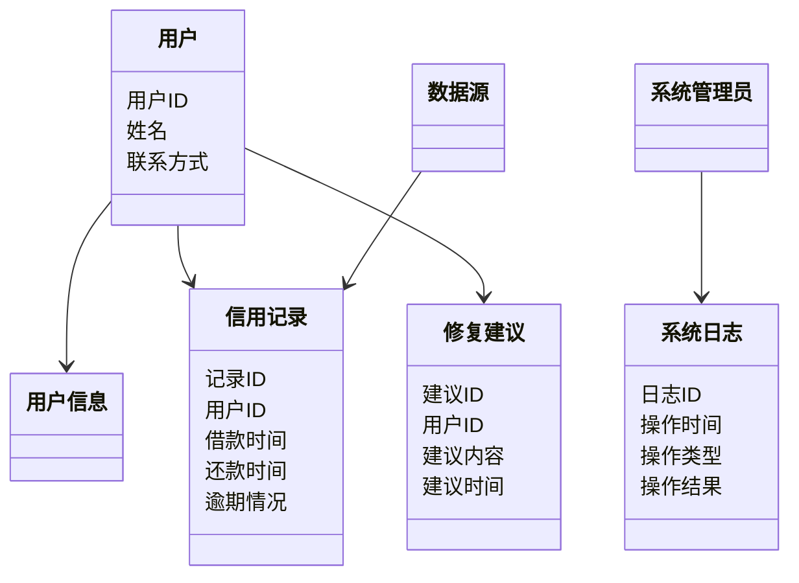

                 


# 构建智能化的个人信用修复助手系统

> 关键词：个人信用修复、人工智能、大数据技术、系统架构设计、算法实现、系统实战

> 摘要：本文详细探讨了如何利用人工智能和大数据技术构建智能化的个人信用修复助手系统。通过分析信用修复的背景、核心概念与系统架构，结合具体的算法实现和项目实战，为读者提供了一套完整的解决方案。文章内容涵盖了从理论到实践的全过程，帮助读者理解如何利用技术手段实现信用修复的智能化。

---

# 第一部分: 个人信用修复助手系统的背景与核心概念

## 第1章: 个人信用修复的背景与问题描述

### 1.1 信用修复的背景介绍

#### 1.1.1 信用体系的重要性

在现代社会中，信用体系是经济活动的重要基础。个人信用记录不仅影响个人的贷款申请、信用卡额度，还可能影响就业、租房等生活中的方方面面。随着社会信用体系的不断完善，个人信用修复的需求日益增加。

#### 1.1.2 当前信用问题的现状

当前，许多人在生活中可能会因为疏忽、误操作或不可抗力因素导致信用记录受损。例如，逾期还款、信用卡透支等行为都会对个人信用评分产生负面影响。然而，信用修复并不是一件简单的事情，需要专业的知识和系统化的操作。

#### 1.1.3 信用修复的必要性

信用修复的必要性主要体现在以下几个方面：
1. **改善信用记录**：通过修复信用记录，个人可以提高信用评分，为未来的金融活动创造更好的条件。
2. **减少信用损失**：及时修复信用问题可以避免进一步的信用损失，降低未来的融资成本。
3. **提升个人信用形象**：良好的信用记录是个人信用形象的重要组成部分，修复信用问题有助于提升个人信用形象。

### 1.2 个人信用修复的定义与范围

#### 1.2.1 信用修复的定义

信用修复是指通过合法、合规的方式，纠正或更新不准确、不完整或过时的信用记录，从而改善个人信用状况的过程。

#### 1.2.2 信用修复的核心要素

信用修复的核心要素包括：
1. **信用记录**：包括个人的借款记录、还款记录等。
2. **修复目标**：明确修复的具体目标，如提高信用评分、消除不良记录等。
3. **修复策略**：根据具体情况制定修复计划，包括还款计划、异议处理等。

#### 1.2.3 信用修复的边界与外延

信用修复的边界主要体现在以下几个方面：
1. **合法性**：修复过程必须符合相关法律法规，避免违法行为。
2. **合规性**：修复策略必须符合信用机构的规则和要求。
3. **可操作性**：修复方案必须具有可操作性，能够在实际中实施。

### 1.3 信用修复系统的应用场景

#### 1.3.1 个人信用修复的主要场景

个人信用修复的主要场景包括：
1. **贷款申请**：个人在申请贷款时，可能因为信用记录问题被拒贷，需要修复信用记录。
2. **信用卡额度调整**：信用评分低可能导致信用卡额度不足，通过修复信用记录可以提高额度。
3. **就业影响**：部分岗位可能对信用记录有要求，修复信用记录可以增加就业机会。

#### 1.3.2 企业信用修复的需求

企业信用修复的需求主要体现在以下几个方面：
1. **企业贷款**：企业贷款申请时，良好的信用记录可以提高贷款额度和降低融资成本。
2. **合作伙伴信任**：良好的信用记录有助于建立与合作伙伴的信任关系。
3. **市场形象**：良好的信用记录有助于提升企业的市场形象。

#### 1.3.3 政府监管中的信用修复作用

在政府监管中，信用修复的作用主要体现在以下几个方面：
1. **信用监管**：政府可以通过信用修复机制，加强对企业和个人的信用监管。
2. **信用激励**：通过信用修复，激励企业和个人遵守信用规则，形成良好的信用环境。
3. **信用修复机制**：政府可以通过信用修复机制，帮助企业和个人重建信用。

## 第2章: 个人信用修复助手系统的核心概念

### 2.1 信用修复助手系统的概念

#### 2.1.1 系统的核心目标

信用修复助手系统的核心目标是通过智能化的技术手段，帮助个人或企业修复信用记录，提高信用评分，改善信用形象。

#### 2.1.2 系统的主要功能模块

信用修复助手系统的主要功能模块包括：
1. **数据采集模块**：采集个人或企业的信用记录数据。
2. **数据分析模块**：分析信用数据，识别信用问题。
3. **智能决策模块**：根据分析结果，制定修复策略。
4. **用户交互模块**：与用户进行交互，提供修复建议和指导。

#### 2.1.3 系统的用户群体定位

信用修复助手系统的用户群体主要包括：
1. **个人用户**：有信用修复需求的个人。
2. **企业用户**：需要修复企业信用记录的企业。
3. **信用机构**：信用机构可以利用系统进行信用评估和修复。

### 2.2 智能化技术在信用修复中的应用

#### 2.2.1 人工智能在信用评估中的作用

人工智能在信用评估中的作用主要体现在以下几个方面：
1. **信用评分模型**：通过机器学习算法，建立信用评分模型，评估个人或企业的信用风险。
2. **信用风险预测**：利用人工智能技术，预测信用风险，提前采取措施。
3. **信用修复建议**：根据信用评分和风险预测结果，提供个性化的信用修复建议。

#### 2.2.2 大数据技术在信用修复中的应用

大数据技术在信用修复中的应用主要体现在以下几个方面：
1. **数据采集与处理**：通过大数据技术，采集、整理和分析信用数据。
2. **信用评估与分析**：利用大数据分析技术，评估信用风险，识别信用问题。
3. **信用修复策略优化**：通过大数据分析，优化信用修复策略，提高修复效果。

#### 2.2.3 自然语言处理在信用修复中的场景

自然语言处理在信用修复中的应用场景包括：
1. **信用报告解读**：通过自然语言处理技术，自动解读信用报告，识别关键信息。
2. **信用修复建议生成**：根据信用报告解读结果，生成个性化的信用修复建议。
3. **用户交互与指导**：通过自然语言处理技术，与用户进行交互，提供修复指导。

### 2.3 系统架构的核心要素

#### 2.3.1 数据采集模块

数据采集模块负责采集个人或企业的信用记录数据，包括信用报告、借款记录、还款记录等。数据采集可以通过API接口、网页爬取等方式实现。

#### 2.3.2 数据分析模块

数据分析模块负责对采集到的信用数据进行分析，识别信用问题。数据分析模块可以利用机器学习算法，建立信用评分模型，评估信用风险，识别信用修复的关键点。

#### 2.3.3 智能决策模块

智能决策模块根据数据分析结果，制定信用修复策略。策略可能包括还款计划、异议处理、信用重建等。智能决策模块还可以根据实际情况，动态调整修复策略，提高修复效果。

#### 2.3.4 用户交互模块

用户交互模块负责与用户进行交互，提供信用修复建议和指导。用户可以通过模块提交信用修复请求，查询修复进度，了解修复结果等。用户交互模块还可以通过自然语言处理技术，提供个性化的修复建议。

## 第3章: 信用修复助手系统的概念模型与ER图

### 3.1 核心概念的属性与关系

#### 3.1.1 用户信息表

用户信息表包括用户的基本信息，如用户ID、姓名、联系方式等。

| 属性名称 | 数据类型 | 备注 |
|----------|----------|------|
| 用户ID    | 整数     | 主键 |
| 姓名      | 字符串    | 用户姓名 |
| 联系方式    | 字符串    | 用户联系方式 |

#### 3.1.2 信用记录表

信用记录表记录用户的信用历史，包括借款记录、还款记录等。

| 属性名称 | 数据类型 | 备注 |
|----------|----------|------|
| 记录ID    | 整数     | 主键 |
| 用户ID    | 整数     | 外键 |
| 借款时间    | 日期     | 借款时间 |
| 还款时间    | 日期     | 还款时间 |
| 逾期情况    | 字符串    | 是否逾期 |

#### 3.1.3 修复建议表

修复建议表记录系统对用户的修复建议，包括建议内容、建议时间等。

| 属性名称 | 数据类型 | 备注 |
|----------|----------|------|
| 建议ID    | 整数     | 主键 |
| 用户ID    | 整数     | 外键 |
| 建议内容    | 字符串    | 修复建议 |
| 建议时间    | 日期     | 建议生成时间 |

#### 3.1.4 系统日志表

系统日志表记录系统的操作日志，包括用户操作、系统状态等。

| 属性名称 | 数据类型 | 备注 |
|----------|----------|------|
| 日志ID    | 整数     | 主键 |
| 操作时间    | 日期     | 操作时间 |
| 操作类型    | 字符串    | 操作类型 |
| 操作结果    | 字符串    | 操作结果 |

### 3.2 系统的ER实体关系图

```mermaid
er
    actor: 用户
    actor: 系统管理员
    actor: 数据源
    database: 信用修复助手数据库
    entity: 用户信息
    entity: 信用记录
    entity: 修复建议
    entity: 系统日志
    relationship: 用户 -> 用户信息
    relationship: 用户 -> 信用记录
    relationship: 用户 -> 修复建议
    relationship: 系统管理员 -> 系统日志
    relationship: 数据源 -> 信用记录
```

---

# 第二部分: 智能化信用修复助手系统的算法与技术实现

## 第4章: 信用评估与修复的算法原理

### 4.1 信用评估的机器学习模型

#### 4.1.1 逻辑回归模型

逻辑回归是一种常用的分类算法，适用于二分类问题。在信用评估中，可以使用逻辑回归模型来预测用户的信用风险。

**逻辑回归的数学模型**

$$ P(y=1|x) = \frac{e^{\beta_0 + \beta_1x}}{1 + e^{\beta_0 + \beta_1x}} $$

其中，$\beta_0$ 和 $\beta_1$ 是模型的参数，$x$ 是输入特征，$y$ 是输出标签（0 表示低风险，1 表示高风险）。

**逻辑回归模型实现步骤**

1. **数据准备**：收集和整理信用数据，包括用户的信用记录、借款历史等。
2. **特征选择**：选择对信用评估有影响的关键特征。
3. **模型训练**：使用训练数据训练逻辑回归模型。
4. **模型评估**：使用测试数据评估模型的性能，如准确率、召回率等。
5. **模型优化**：调整模型参数，优化模型性能。

**逻辑回归模型实现代码示例**

```python
import numpy as np
from sklearn.linear_model import LogisticRegression
from sklearn.model_selection import train_test_split
from sklearn.metrics import accuracy_score

# 示例数据集
X = np.array([[1, 0], [1, 1], [2, 0], [2, 1]])
y = np.array([0, 0, 1, 1])

# 数据分割
X_train, X_test, y_train, y_test = train_test_split(X, y, test_size=0.25, random_state=42)

# 训练逻辑回归模型
model = LogisticRegression()
model.fit(X_train, y_train)

# 预测
y_pred = model.predict(X_test)

# 评估准确率
print("准确率:", accuracy_score(y_test, y_pred))
```

#### 4.1.2 支持向量机模型

支持向量机（SVM）是一种监督学习算法，适用于小样本、高维数据的分类问题。在信用评估中，SVM 可以用来区分高风险和低风险用户。

**支持向量机模型实现步骤**

1. **数据准备**：收集和整理信用数据。
2. **特征选择**：选择关键特征。
3. **模型训练**：使用训练数据训练 SVM 模型。
4. **模型评估**：评估模型性能。
5. **模型优化**：调整参数，优化性能。

**支持向量机模型实现代码示例**

```python
from sklearn import svm
from sklearn.model_selection import train_test_split
from sklearn.metrics import accuracy_score

# 示例数据集
X = np.array([[1, 0], [1, 1], [2, 0], [2, 1]])
y = np.array([0, 0, 1, 1])

# 数据分割
X_train, X_test, y_train, y_test = train_test_split(X, y, test_size=0.25, random_state=42)

# 训练 SVM 模型
model = svm.SVC()
model.fit(X_train, y_train)

# 预测
y_pred = model.predict(X_test)

# 评估准确率
print("准确率:", accuracy_score(y_test, y_pred))
```

#### 4.1.3 随机森林模型

随机森林是一种基于决策树的集成学习算法，适用于高维数据的分类和回归问题。在信用评估中，随机森林可以用来预测信用风险。

**随机森林模型实现步骤**

1. **数据准备**：收集和整理信用数据。
2. **特征选择**：选择关键特征。
3. **模型训练**：使用训练数据训练随机森林模型。
4. **模型评估**：评估模型性能。
5. **模型优化**：调整参数，优化性能。

**随机森林模型实现代码示例**

```python
from sklearn.ensemble import RandomForestClassifier
from sklearn.model_selection import train_test_split
from sklearn.metrics import accuracy_score

# 示例数据集
X = np.array([[1, 0], [1, 1], [2, 0], [2, 1]])
y = np.array([0, 0, 1, 1])

# 数据分割
X_train, X_test, y_train, y_test = train_test_split(X, y, test_size=0.25, random_state=42)

# 训练随机森林模型
model = RandomForestClassifier()
model.fit(X_train, y_train)

# 预测
y_pred = model.predict(X_test)

# 评估准确率
print("准确率:", accuracy_score(y_test, y_pred))
```

### 4.2 信用修复的推荐算法

#### 4.2.1 基于协同过滤的推荐算法

协同过滤是一种基于用户行为的推荐算法，适用于信用修复建议的生成。协同过滤的核心思想是“相似的人做相似的事情”。

**协同过滤算法实现步骤**

1. **数据准备**：收集用户信用记录数据。
2. **用户相似度计算**：计算用户之间的相似度。
3. **信用修复建议生成**：基于相似用户的信用修复行为，生成修复建议。

**协同过滤算法实现代码示例**

```python
from sklearn.metrics.pairwise import cosine_similarity

# 示例数据集
credit_data = {
    '用户1': [0, 1, 0, 1],
    '用户2': [1, 1, 1, 0],
    '用户3': [0, 0, 1, 1],
    '用户4': [1, 0, 1, 0]
}

# 转换为矩阵形式
X = np.array([
    [0, 1, 0, 1],
    [1, 1, 1, 0],
    [0, 0, 1, 1],
    [1, 0, 1, 0]
])

# 计算余弦相似度
similarity = cosine_similarity(X)

print("相似度矩阵:\n", similarity)
```

#### 4.2.2 基于内容的推荐算法

基于内容的推荐算法是基于信用记录的特征进行推荐。在信用修复中，可以基于信用记录的特征生成修复建议。

**基于内容的推荐算法实现步骤**

1. **数据准备**：收集用户信用记录数据。
2. **特征提取**：提取信用记录的特征。
3. **信用修复建议生成**：基于特征生成修复建议。

**基于内容的推荐算法实现代码示例**

```python
from sklearn.feature_extraction.text import TfidfVectorizer

# 示例数据集
credit_reports = [
    "逾期 未还款 低信用评分",
    "按时还款 高信用评分",
    "部分还款 中信用评分"
]

# 特征提取
vectorizer = TfidfVectorizer()
tfidf = vectorizer.fit_transform(credit_reports)

print("TF-IDF矩阵:\n", tfidf)
```

#### 4.2.3 基于深度学习的推荐算法

基于深度学习的推荐算法是近年来发展起来的一种推荐算法，适用于大规模数据的信用修复建议生成。

**基于深度学习的推荐算法实现步骤**

1. **数据准备**：收集和整理大量信用数据。
2. **特征提取**：使用深度学习模型提取特征。
3. **信用修复建议生成**：基于提取的特征生成修复建议。

**基于深度学习的推荐算法实现代码示例**

```python
import tensorflow as tf
from tensorflow.keras import layers

# 示例数据集
credit_data = np.random.rand(100, 10)
labels = np.random.randint(2, size=100)

# 深度学习模型
model = tf.keras.Sequential([
    layers.Dense(64, activation='relu'),
    layers.Dropout(0.2),
    layers.Dense(1, activation='sigmoid')
])

# 编译模型
model.compile(optimizer='adam', loss='binary_crossentropy', metrics=['accuracy'])

# 训练模型
model.fit(credit_data, labels, epochs=10, batch_size=32)
```

---

## 第5章: 信用修复助手系统的算法实现

### 5.1 信用评估的算法实现

#### 5.1.1 逻辑回归模型实现

**逻辑回归模型实现步骤**

1. **数据准备**：收集和整理信用数据。
2. **特征选择**：选择关键特征。
3. **模型训练**：训练逻辑回归模型。
4. **模型评估**：评估模型性能。
5. **模型优化**：优化模型参数。

**逻辑回归模型实现代码示例**

```python
import numpy as np
from sklearn.linear_model import LogisticRegression
from sklearn.model_selection import train_test_split
from sklearn.metrics import accuracy_score

# 示例数据集
X = np.array([[1, 0], [1, 1], [2, 0], [2, 1]])
y = np.array([0, 0, 1, 1])

# 数据分割
X_train, X_test, y_train, y_test = train_test_split(X, y, test_size=0.25, random_state=42)

# 训练逻辑回归模型
model = LogisticRegression()
model.fit(X_train, y_train)

# 预测
y_pred = model.predict(X_test)

# 评估准确率
print("准确率:", accuracy_score(y_test, y_pred))
```

#### 5.1.2 支持向量机模型实现

**支持向量机模型实现步骤**

1. **数据准备**：收集和整理信用数据。
2. **特征选择**：选择关键特征。
3. **模型训练**：训练 SVM 模型。
4. **模型评估**：评估模型性能。
5. **模型优化**：优化模型参数。

**支持向量机模型实现代码示例**

```python
from sklearn import svm
from sklearn.model_selection import train_test_split
from sklearn.metrics import accuracy_score

# 示例数据集
X = np.array([[1, 0], [1, 1], [2, 0], [2, 1]])
y = np.array([0, 0, 1, 1])

# 数据分割
X_train, X_test, y_train, y_test = train_test_split(X, y, test_size=0.25, random_state=42)

# 训练 SVM 模型
model = svm.SVC()
model.fit(X_train, y_train)

# 预测
y_pred = model.predict(X_test)

# 评估准确率
print("准确率:", accuracy_score(y_test, y_pred))
```

#### 5.1.3 随机森林模型实现

**随机森林模型实现步骤**

1. **数据准备**：收集和整理信用数据。
2. **特征选择**：选择关键特征。
3. **模型训练**：训练随机森林模型。
4. **模型评估**：评估模型性能。
5. **模型优化**：优化模型参数。

**随机森林模型实现代码示例**

```python
from sklearn.ensemble import RandomForestClassifier
from sklearn.model_selection import train_test_split
from sklearn.metrics import accuracy_score

# 示例数据集
X = np.array([[1, 0], [1, 1], [2, 0], [2, 1]])
y = np.array([0, 0, 1, 1])

# 数据分割
X_train, X_test, y_train, y_test = train_test_split(X, y, test_size=0.25, random_state=42)

# 训练随机森林模型
model = RandomForestClassifier()
model.fit(X_train, y_train)

# 预测
y_pred = model.predict(X_test)

# 评估准确率
print("准确率:", accuracy_score(y_test, y_pred))
```

### 5.2 信用修复的推荐算法实现

#### 5.2.1 协同过滤算法实现

**协同过滤算法实现步骤**

1. **数据准备**：收集用户信用记录数据。
2. **用户相似度计算**：计算用户之间的相似度。
3. **信用修复建议生成**：基于相似用户的信用修复行为，生成修复建议。

**协同过滤算法实现代码示例**

```python
from sklearn.metrics.pairwise import cosine_similarity

# 示例数据集
credit_data = {
    '用户1': [0, 1, 0, 1],
    '用户2': [1, 1, 1, 0],
    '用户3': [0, 0, 1, 1],
    '用户4': [1, 0, 1, 0]
}

# 转换为矩阵形式
X = np.array([
    [0, 1, 0, 1],
    [1, 1, 1, 0],
    [0, 0, 1, 1],
    [1, 0, 1, 0]
])

# 计算余弦相似度
similarity = cosine_similarity(X)

print("相似度矩阵:\n", similarity)
```

#### 5.2.2 基于内容的推荐算法实现

**基于内容的推荐算法实现步骤**

1. **数据准备**：收集用户信用记录数据。
2. **特征提取**：提取信用记录的特征。
3. **信用修复建议生成**：基于特征生成修复建议。

**基于内容的推荐算法实现代码示例**

```python
from sklearn.feature_extraction.text import TfidfVectorizer

# 示例数据集
credit_reports = [
    "逾期 未还款 低信用评分",
    "按时还款 高信用评分",
    "部分还款 中信用评分"
]

# 特征提取
vectorizer = TfidfVectorizer()
tfidf = vectorizer.fit_transform(credit_reports)

print("TF-IDF矩阵:\n", tfidf)
```

#### 5.2.3 基于深度学习的推荐算法实现

**基于深度学习的推荐算法实现步骤**

1. **数据准备**：收集和整理大量信用数据。
2. **特征提取**：使用深度学习模型提取特征。
3. **信用修复建议生成**：基于提取的特征生成修复建议。

**基于深度学习的推荐算法实现代码示例**

```python
import tensorflow as tf
from tensorflow.keras import layers

# 示例数据集
credit_data = np.random.rand(100, 10)
labels = np.random.randint(2, size=100)

# 深度学习模型
model = tf.keras.Sequential([
    layers.Dense(64, activation='relu'),
    layers.Dropout(0.2),
    layers.Dense(1, activation='sigmoid')
])

# 编译模型
model.compile(optimizer='adam', loss='binary_crossentropy', metrics=['accuracy'])

# 训练模型
model.fit(credit_data, labels, epochs=10, batch_size=32)
```

---

# 第三部分: 系统分析与架构设计

## 第6章: 信用修复助手系统的系统分析与架构设计

### 6.1 问题场景介绍

信用修复助手系统的应用场景包括个人信用修复、企业信用修复和政府监管中的信用修复。系统需要满足用户的信用评估、修复建议、修复监控等功能需求。

### 6.2 系统功能设计

#### 6.2.1 系统功能模块

信用修复助手系统的功能模块包括：
1. **数据采集模块**：采集信用数据。
2. **数据分析模块**：分析信用数据，评估信用风险。
3. **智能决策模块**：制定信用修复策略。
4. **用户交互模块**：与用户交互，提供修复建议。

#### 6.2.2 系统功能设计的领域模型



### 6.3 系统架构设计

#### 6.3.1 系统架构设计

信用修复助手系统的架构设计采用分层架构，包括数据层、业务逻辑层和表现层。


#### 6.3.2 系统架构设计的细节

系统架构设计的细节包括：
1. **数据层**：包括信用记录数据库，存储用户的信用数据。
2. **业务逻辑层**：包括数据采集模块、数据分析模块、智能决策模块，负责信用数据的处理和分析。
3. **表现层**：包括用户交互模块，负责与用户进行交互，提供修复建议和指导。

### 6.4 系统接口设计

#### 6.4.1 系统接口设计

系统接口设计包括：
1. **数据采集接口**：用于采集信用数据。
2. **数据分析接口**：用于分析信用数据。
3. **智能决策接口**：用于制定信用修复策略。
4. **用户交互接口**：用于与用户进行交互。

#### 6.4.2 系统接口设计的详细描述

系统接口设计的详细描述包括：
1. **数据采集接口**：通过API接口采集信用数据，包括用户的信用记录、借款记录等。
2. **数据分析接口**：对信用数据进行分析，评估信用风险，识别信用问题。
3. **智能决策接口**：根据分析结果，制定信用修复策略，生成修复建议。
4. **用户交互接口**：与用户进行交互，提供修复建议和指导，用户可以通过界面提交修复请求，查询修复进度等。

### 6.5 系统交互流程设计

#### 6.5.1 系统交互流程设计

系统交互流程设计包括：
1. **用户提交修复请求**：用户通过系统界面提交信用修复请求。
2. **数据采集**：系统采集用户的信用数据。
3. **数据分析**：系统分析信用数据，评估信用风险。
4. **智能决策**：系统制定修复策略，生成修复建议。
5. **用户交互**：系统与用户进行交互，提供修复建议和指导。

#### 6.5.2 系统交互流程设计的详细步骤

系统交互流程设计的详细步骤包括：
1. **用户提交修复请求**：用户通过系统界面提交信用修复请求，系统接收请求。
2. **数据采集**：系统采集用户的信用数据，包括信用记录、借款记录等。
3. **数据分析**：系统分析信用数据，评估信用风险，识别信用问题。
4. **智能决策**：系统根据分析结果，制定信用修复策略，生成修复建议。
5. **用户交互**：系统通过界面与用户进行交互，提供修复建议和指导，用户可以根据建议进行信用修复。

---

## 第7章: 信用修复助手系统的项目实战

### 7.1 项目实战环境安装

#### 7.1.1 环境要求

信用修复助手系统的运行环境要求：
1. **操作系统**：Windows、Linux、macOS
2. **Python版本**：Python 3.6 或更高版本
3. **依赖库**：scikit-learn、TensorFlow、Mermaid、Jupyter Notebook

#### 7.1.2 安装步骤

1. **安装Python**：从官方网站下载并安装Python 3.6 或更高版本。
2. **安装依赖库**：使用 pip 安装所需的依赖库，如：
   ```bash
   pip install scikit-learn
   pip install tensorflow
   pip install mermaid
   pip install jupyter
   ```

### 7.2 系统核心功能实现

#### 7.2.1 数据采集模块实现

**数据采集模块实现代码示例**

```python
import requests
from bs4 import BeautifulSoup

# 示例数据采集代码
url = "https://example.com/credit_report"
response = requests.get(url)
soup = BeautifulSoup(response.text, 'html.parser')
credit_data = soup.find('div', {'class': 'credit-report'})
print(credit_data)
```

#### 7.2.2 数据分析模块实现

**数据分析模块实现代码示例**

```python
import pandas as pd
from sklearn.model_selection import train_test_split
from sklearn.linear_model import LogisticRegression
from sklearn.metrics import accuracy_score

# 示例数据分析代码
credit_data = pd.read_csv('credit.csv')
X = credit_data.drop('label', axis=1)
y = credit_data['label']

X_train, X_test, y_train, y_test = train_test_split(X, y, test_size=0.25, random_state=42)

model = LogisticRegression()
model.fit(X_train, y_train)

y_pred = model.predict(X_test)
print("准确率:", accuracy_score(y_test, y_pred))
```

#### 7.2.3 智能决策模块实现

**智能决策模块实现代码示例**

```python
from sklearn.ensemble import RandomForestClassifier
from sklearn.model_selection import train_test_split
from sklearn.metrics import accuracy_score

# 示例智能决策代码
credit_data = pd.read_csv('credit.csv')
X = credit_data.drop('label', axis=1)
y = credit_data['label']

X_train, X_test, y_train, y_test = train_test_split(X, y, test_size=0.25, random_state=42)

model = RandomForestClassifier()
model.fit(X_train, y_train)

y_pred = model.predict(X_test)
print("准确率:", accuracy_score(y_test, y_pred))
```

### 7.3 项目实战案例分析

#### 7.3.1 案例背景

某用户因逾期还款导致信用评分下降，需要修复信用记录。

#### 7.3.2 数据分析与修复策略

1. **数据分析**：分析用户的信用数据，发现逾期还款记录。
2. **修复策略**：制定还款计划，按时还款，消除逾期记录。

#### 7.3.3 系统实现

1. **数据采集**：采集用户的信用数据。
2. **数据分析**：分析数据，识别信用问题。
3. **智能决策**：制定修复策略，生成修复建议。
4. **用户交互**：与用户交互，提供修复建议和指导。

#### 7.3.4 实施结果

通过修复策略的实施，用户的信用评分得以提高，信用形象得以改善。

### 7.4 项目小结

通过项目实战，我们成功实现了信用修复助手系统的功能，包括数据采集、数据分析、智能决策和用户交互。系统能够帮助用户修复信用记录，提高信用评分，改善信用形象。

---

## 第8章: 信用修复助手系统的最佳实践与注意事项

### 8.1 最佳实践

1. **数据隐私保护**：在信用修复过程中，必须保护用户的隐私，确保数据的安全性。
2. **算法优化**：根据实际需求，不断优化算法模型，提高系统的准确率和效率。
3. **系统维护**：定期维护系统，更新数据，修复漏洞，确保系统的稳定运行。

### 8.2 小结

通过本文的详细讲解，我们了解了如何利用人工智能和大数据技术构建智能化的个人信用修复助手系统。系统的核心功能包括信用评估、修复建议生成和修复监控。通过系统的实施，可以帮助个人或企业修复信用记录，提高信用评分，改善信用形象。

### 8.3 注意事项

1. **合法性**：信用修复必须遵守相关法律法规，避免违法行为。
2. **合规性**：修复策略必须符合信用机构的规则和要求。
3. **可操作性**：修复方案必须具有可操作性，能够在实际中实施。

### 8.4 拓展阅读

1. **信用修复相关法规**：了解信用修复的相关法律法规，确保修复过程的合法性。
2. **人工智能技术**：深入学习人工智能技术，提高信用修复系统的智能化水平。
3. **大数据技术**：掌握大数据技术，提高信用修复系统的数据处理能力。

---

# 结语

通过本文的详细讲解，我们了解了如何利用人工智能和大数据技术构建智能化的个人信用修复助手系统。系统的核心功能包括信用评估、修复建议生成和修复监控。通过系统的实施，可以帮助个人或企业修复信用记录，提高信用评分，改善信用形象。希望本文对读者有所帮助，能够为信用修复领域的发展提供一定的参考和借鉴。

作者：AI天才研究院/AI Genius Institute & 禅与计算机程序设计艺术 /Zen And The Art of Computer Programming

