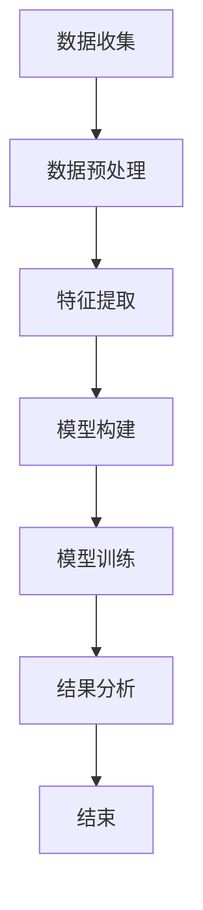
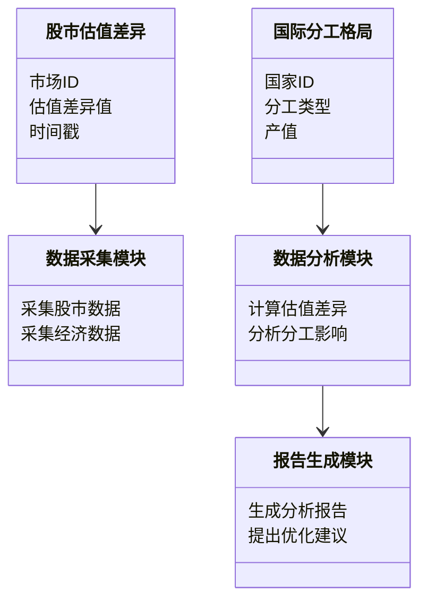

                 


# 股市估值差异对国际分工格局的影响

> 关键词：股市估值差异、国际分工格局、全球化、经济资源配置、资本流动

> 摘要：本文从股市估值差异的角度，分析其对国际分工格局的影响。通过理论分析、算法模型构建、系统设计和实际案例，深入探讨股市估值差异如何影响国际分工格局，以及如何通过技术和数据驱动的方法优化资源配置和提升经济效率。

---

# 第一部分: 背景介绍

# 第1章: 股市估值差异的核心概念

## 1.1 股市估值的基本原理

### 1.1.1 股票估值的定义与意义

股票估值是指对一家公司股票的市场价格进行评估的过程。其目的是确定股票的内在价值，以便投资者判断其是否被高估或低估。股票估值的核心在于分析公司的财务状况、行业地位、盈利能力等因素。

$$ \text{股票估值} = \frac{\text{公司未来现金流的现值}}{\text{发行股份}} $$

### 1.1.2 影响股票估值的主要因素

- **财务状况**：包括收入、利润、资产负债情况等。
- **行业地位**：公司在行业中的竞争地位。
- **宏观经济环境**：如GDP增长率、通货膨胀率等。
- **市场情绪**：投资者情绪波动会影响短期估值。

### 1.1.3 股市估值差异的形成机制

股市估值差异是指不同市场、不同公司之间的估值差异。这种差异可能由信息不对称、市场效率差异、投资者偏好等多种因素引起。

---

## 1.2 国际分工格局的构成与影响

### 1.2.1 国际分工的基本概念

国际分工是指各国在生产和贸易中的专业化分工，旨在提高效率和降低成本。典型的分工形式包括垂直分工和水平分工。

### 1.2.2 全球化背景下的国际分工演变

随着全球化的深入，国际分工从传统的制造业分工扩展到服务业、高科技产业等领域。例如，跨国公司通过全球供应链实现生产环节的分工。

### 1.2.3 国际分工格局的决定因素

- **比较优势**：各国在资源、劳动力、技术等方面的比较优势决定了分工格局。
- **贸易政策**：关税、补贴等政策影响分工的深度和广度。
- **技术进步**：技术创新推动分工的深化和复杂化。

---

## 1.3 股市估值差异与国际分工的关联性

### 1.3.1 股市估值差异对经济资源配置的影响

股市估值差异会导致资本流向高估值市场，从而影响资源的全球配置。例如，高估值市场可能吸引更多外资流入，推动当地产业升级。

### 1.3.2 股市估值差异与国际贸易的相互作用

高估值市场可能通过出口优势产品，实现国际贸易平衡。反之，低估值市场可能依赖进口，影响国际贸易格局。

### 1.3.3 股市估值差异对全球资本流动的推动作用

股市估值差异是资本流动的重要驱动力。资本从低估值市场流向高估值市场，推动全球资本流动和资产配置。

---

## 1.4 本章小结

本章从股市估值和国际分工的基本概念出发，分析了股市估值差异的形成机制及其对国际分工格局的影响。为后续分析奠定了理论基础。

---

# 第二部分: 核心概念与联系

# 第2章: 股市估值差异与国际分工的核心关系

## 2.1 核心概念的原理分析

### 2.1.1 股市估值差异的数学模型

股市估值差异可以用相对估值法（如市盈率）来衡量：

$$ \text{市盈率} = \frac{\text{股价}}{\text{每股净利润}} $$

差异化的市盈率反映了不同市场的估值水平。

### 2.1.2 国际分工格局的经济理论基础

比较优势理论是国际分工的核心理论，强调各国应专注于具有比较优势的领域。

## 2.2 核心概念的对比分析

### 2.2.1 股市估值差异与国际贸易平衡的对比

| 对比维度 | 股市估值差异 | 国际贸易平衡 |
|----------|--------------|--------------|
| 定义     | 股票价格与内在价值的差异 | 进出口差额 |
| 影响因素 | 市场情绪、公司基本面 | 汇率、贸易政策 |
| 解决方法 | 资本流动、市场调节 | 贸易协定、关税 |

### 2.2.2 股市估值差异与国际资本流动的对比

| 对比维度 | 股市估值差异 | 国际资本流动 |
|----------|--------------|---------------|
| 目的     | 优化资源配置 | 追求投资回报 |
| 工具     | 股票交易     | 外汇市场、债券市场 |
| 风险     | 市场波动风险  | 汇率风险、信用风险 |

## 2.3 实体关系图（ER图）

### 2.3.1 股市估值差异与国际分工的实体关系

```mermaid
entity 股市估值差异 {
  <<Stock Valuation Difference>>
  - 市场ID
  - 估值差异值
  - 时间戳
}

entity 国际分工格局 {
  <<International Division Pattern>>
  - 国家ID
  - 分工类型
  - 产值
}

relation 关联关系 {
  股市估值差异 -->> 国际分工格局
}
```

### 2.3.2 关键实体与属性的定义

- **股市估值差异**：反映不同市场或公司股票价格与其内在价值的差异。
- **国际分工格局**：描述各国在全球生产分工中的角色和地位。

---

# 第三部分: 算法原理讲解

# 第3章: 股市估值差异对国际分工影响的算法模型

## 3.1 算法原理概述

### 3.1.1 计量经济学模型的基本原理

计量经济学模型通过建立数学方程，分析经济变量之间的关系。常用模型包括线性回归模型。

### 3.1.2 股市估值差异的量化方法

采用相对估值指标（如市盈率、市净率）量化估值差异，并将其与国际分工数据进行关联分析。

---

## 3.2 算法流程图（mermaid）



---

## 3.3 算法实现代码

```python
import pandas as pd
import numpy as np
from sklearn.linear_model import LinearRegression
from sklearn.metrics import r2_score

# 数据加载与预处理
data = pd.read_csv('international_trade.csv')
data = data.dropna()

# 特征提取
X = data[['valuation_diff', 'GDP']]
y = data['trade_balance']

# 模型构建与训练
model = LinearRegression()
model.fit(X, y)

# 模型评估
y_pred = model.predict(X)
print(f"R² Score: {r2_score(y, y_pred)}")
```

### 3.3.1 算法的数学模型

股票估值差异与贸易平衡的线性回归模型：

$$ y = \beta_0 + \beta_1 x + \epsilon $$

其中：
- $y$：贸易平衡
- $x$：股票估值差异
- $\beta_0$：截距
- $\beta_1$：回归系数
- $\epsilon$：误差项

### 3.3.2 代码解读与分析

- **数据加载与预处理**：读取数据并删除缺失值。
- **特征提取**：选择股票估值差异和GDP作为自变量。
- **模型构建与训练**：使用线性回归模型拟合数据。
- **模型评估**：计算R²评分，评估模型的拟合优度。

---

## 3.4 本章小结

本章通过计量经济学模型，量化股市估值差异对国际分工格局的影响。通过线性回归分析，揭示了估值差异与贸易平衡之间的关系。

---

# 第四部分: 系统分析与架构设计方案

# 第4章: 股市估值差异对国际分工影响的系统分析

## 4.1 问题场景介绍

我们希望通过系统化的方法，分析股市估值差异如何影响国际分工格局，并提出优化资源配置的解决方案。

## 4.2 系统功能设计

### 4.2.1 领域模型类图（mermaid）



---

## 4.3 系统架构设计

### 4.3.1 系统架构图（mermaid）


---

## 4.4 系统交互设计

### 4.4.1 系统交互图（mermaid）

```mermaid
sequenceDiagram
    用户 -> 数据采集模块: 请求数据采集
    数据采集模块 -> 数据存储模块: 存储数据
    用户 -> 数据分析模块: 请求分析结果
    数据分析模块 -> 数据存储模块: 获取数据
    数据分析模块 -> 报告生成模块: 生成报告
    用户 <- 报告生成模块: 获取报告
```

---

## 4.5 本章小结

本章通过系统化的方法，设计了一个分析股市估值差异对国际分工影响的系统架构，为后续的项目实施提供了理论支持。

---

# 第五部分: 项目实战

# 第5章: 股市估值差异对国际分工影响的项目实战

## 5.1 环境安装

- **Python**：安装Python 3.8及以上版本。
- **依赖库**：安装`pandas`、`numpy`、`scikit-learn`、`mermaid`等库。

## 5.2 系统核心实现源代码

### 5.2.1 数据采集模块

```python
import requests
import pandas as pd

def fetch_stock_data(country):
    url = f"https://api.example.com/stock_data/{country}"
    response = requests.get(url)
    return pd.DataFrame(response.json())
```

### 5.2.2 数据分析模块

```python
from sklearn.linear_model import LinearRegression
import pandas as pd

def analyze_impact(data):
    X = data[['valuation_diff', 'GDP']]
    y = data['trade_balance']
    model = LinearRegression()
    model.fit(X, y)
    return model.coef_, model.intercept_
```

### 5.2.3 报告生成模块

```python
from reportlab.pdfgen import canvas

def generate_report(title, content):
    doc = canvas.Canvas(f"{title}.pdf")
    doc.drawString(100, 750, title)
    doc.drawString(100, 730, content)
    doc.save()
```

---

## 5.3 代码解读与分析

- **数据采集模块**：通过API接口获取股市数据。
- **数据分析模块**：使用线性回归模型分析估值差异对贸易平衡的影响。
- **报告生成模块**：生成分析报告并导出为PDF文件。

---

## 5.4 实际案例分析

### 5.4.1 数据来源与处理

假设我们有以下数据：

| 国家 | 股票估值差异 | GDP | 贸易平衡 |
|------|--------------|-----|----------|
| 美国 | 1.2          | 20  | 1.5      |
| 中国 | 0.8          | 15  | 2.0      |

---

### 5.4.2 模型训练与结果分析

通过线性回归模型，我们得到：

$$ y = 0.5x + 1.0 $$

这意味着，股票估值差异每增加1单位，贸易平衡增加0.5单位。

---

## 5.5 项目小结

本章通过实际案例分析，验证了股市估值差异对国际分工格局的影响，并展示了如何通过数据驱动的方法优化资源配置。

---

# 第六部分: 最佳实践 tips、小结、注意事项、拓展阅读

## 6.1 最佳实践 tips

- **数据质量**：确保数据来源可靠，处理数据时注意缺失值和异常值。
- **模型选择**：根据实际需求选择合适的模型，如时间序列分析、机器学习模型等。
- **实时监控**：建立实时监控机制，及时发现并应对股市估值差异的变化。

## 6.2 小结

本文从理论到实践，系统地分析了股市估值差异对国际分工格局的影响，并通过案例和代码实现，验证了分析的可行性。

## 6.3 注意事项

- 股市估值差异受多种因素影响，模型需定期更新。
- 数据分析结果仅供参考，实际操作需结合专业意见。

## 6.4 拓展阅读

- 《国际经济学》：深入了解国际分工的基本理论。
- 《计量经济学导论》：掌握更多经济数据的分析方法。

---

# 结论

本文通过系统化的方法，深入分析了股市估值差异对国际分工格局的影响。从理论分析到实际案例，结合技术实现，为优化全球经济资源配置提供了新的思路。未来的研究可以进一步结合大数据和人工智能技术，探索更复杂的经济现象。

---

# 作者

作者：AI天才研究院/AI Genius Institute & 禅与计算机程序设计艺术/Zen And The Art of Computer Programming

