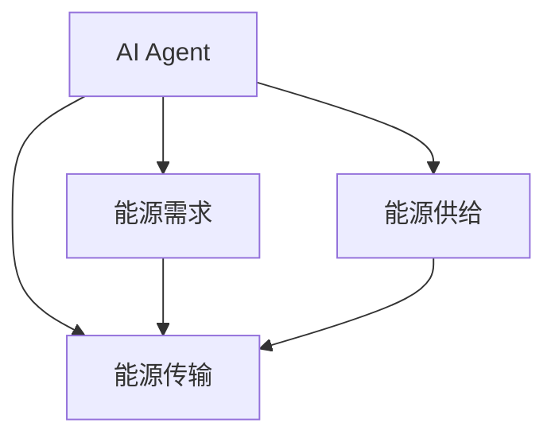
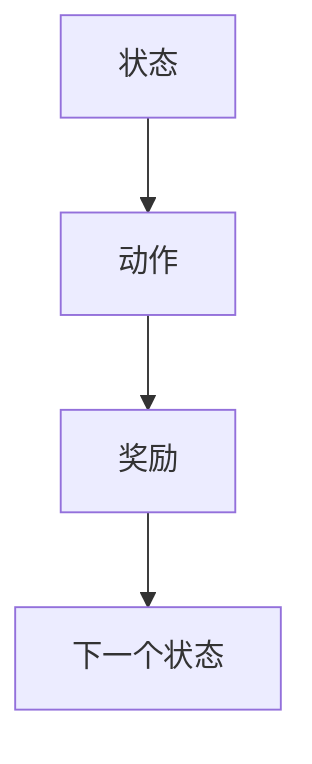
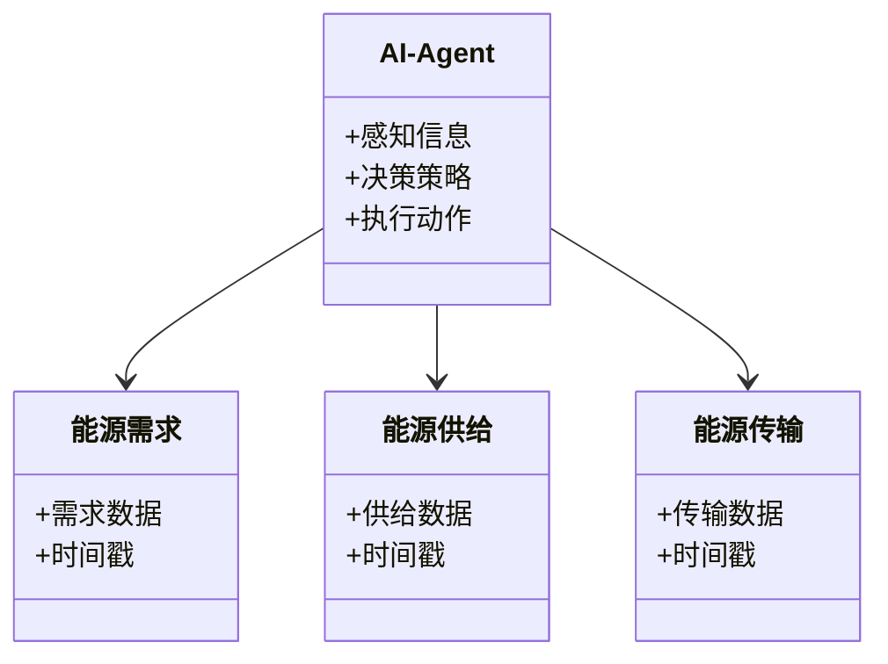
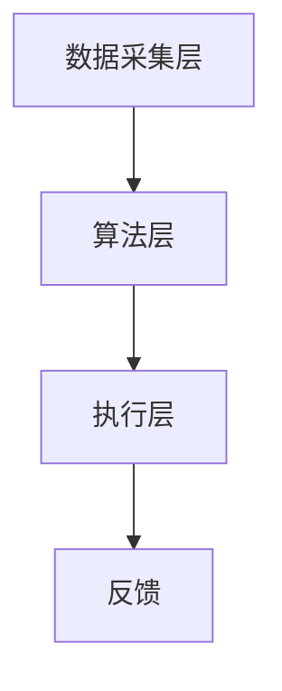
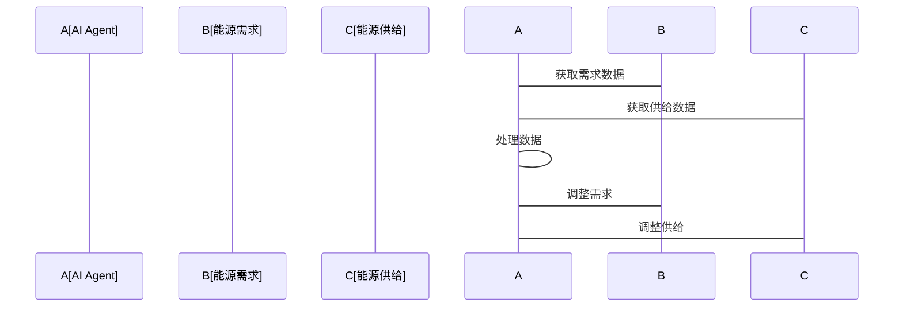

                 


# AI Agent在智能城市能源分配中的实践

> 关键词：AI Agent, 智能城市, 能源分配, 强化学习, 多智能体系统, 系统架构设计

> 摘要：本文探讨AI Agent在智能城市能源分配中的实践应用。通过分析AI Agent的核心概念、算法原理、系统架构设计，结合实际案例，详细讲解AI Agent如何优化能源分配，提升智能城市的能源管理效率。文章内容涵盖从理论到实践的全过程，为智能城市能源分配提供新的思路和解决方案。

---

# 第一部分: AI Agent与智能城市能源分配概述

# 第1章: AI Agent与智能城市能源分配概述

## 1.1 AI Agent的基本概念

### 1.1.1 什么是AI Agent

AI Agent（人工智能代理）是一种能够感知环境、做出决策并采取行动的智能实体。它通过传感器获取信息，利用算法处理信息，并通过执行器与环境交互。AI Agent可以是软件程序、机器人或其他智能设备。

$$
\text{AI Agent} = \text{感知} \times \text{决策} \times \text{行动}
$$

### 1.1.2 AI Agent的核心特征

AI Agent的核心特征包括：

1. **自主性**：能够在没有外部干预的情况下自主运行。
2. **反应性**：能够实时感知环境变化并做出反应。
3. **学习能力**：通过经验或数据不断优化自身的决策能力。
4. **协作性**：能够与其他AI Agent或系统协同工作，完成复杂任务。

### 1.1.3 AI Agent在智能城市中的应用

AI Agent在智能城市中的应用非常广泛，包括交通管理、环境监测、能源分配等领域。在能源分配中，AI Agent可以通过优化算法，实时调整能源供给和需求，确保能源的高效利用。

---

## 1.2 智能城市能源分配的背景与挑战

### 1.2.1 智能城市的发展现状

智能城市是通过信息技术和数据驱动的方式，优化城市资源的配置和管理。随着城市化进程的加快，能源需求不断增加，传统的能源分配方式已经难以满足需求。

### 1.2.2 能源分配的现状与问题

当前能源分配系统存在以下问题：

1. **资源浪费**：能源分配不均衡，导致部分区域能源过剩，部分区域能源不足。
2. **效率低下**：传统的人工管理方式效率低下，难以应对复杂的能源分配需求。
3. **响应速度慢**：在面对突发需求或供给变化时，传统系统难以快速调整。

### 1.2.3 智能城市能源分配的目标与意义

智能城市能源分配的目标是通过智能化的管理方式，实现能源的高效利用和优化分配。其意义在于：

1. **减少能源浪费**：通过智能分配，充分利用能源资源。
2. **提高效率**：通过自动化管理，提高能源分配的效率。
3. **应对突发需求**：通过智能调整，快速响应能源需求的变化。

---

## 1.3 AI Agent在能源分配中的作用

### 1.3.1 AI Agent如何优化能源分配

AI Agent通过实时感知能源需求和供给的变化，利用强化学习等算法，优化能源分配策略。例如，在电力分配中，AI Agent可以根据实时用电需求，动态调整发电量和电力传输。

### 1.3.2 AI Agent在能源分配中的优势

AI Agent在能源分配中的优势包括：

1. **实时性**：能够实时感知和调整能源分配。
2. **智能化**：通过学习和优化，不断提高分配效率。
3. **协作性**：能够与其他AI Agent协作，实现全局优化。

### 1.3.3 AI Agent与智能城市能源分配的结合

AI Agent与智能城市能源分配的结合，可以通过以下方式实现：

1. **实时监控**：通过传感器实时监控能源需求和供给。
2. **智能决策**：利用AI算法优化能源分配策略。
3. **动态调整**：根据实时数据动态调整能源分配。

---

## 1.4 本章小结

本章介绍了AI Agent的基本概念、核心特征以及在智能城市中的应用。同时，分析了智能城市能源分配的背景、现状和挑战，并探讨了AI Agent在能源分配中的作用和优势。通过本章的学习，读者可以了解AI Agent在智能城市能源分配中的重要性。

---

# 第二部分: AI Agent的核心概念与原理

# 第2章: AI Agent的核心概念与联系

## 2.1 AI Agent的核心原理

### 2.1.1 AI Agent的感知与决策机制

AI Agent的感知机制通过传感器或其他数据源获取环境信息。决策机制基于感知信息，利用算法做出决策，并通过执行器采取行动。

$$
\text{决策} = f(\text{感知信息})
$$

### 2.1.2 AI Agent的学习与优化算法

AI Agent通过强化学习、监督学习等算法不断优化自身的决策能力。强化学习是一种通过奖励机制优化决策的算法，适用于动态变化的环境。

### 2.1.3 AI Agent的协作与通信机制

AI Agent在复杂任务中需要与其他AI Agent或系统协作。通过通信机制，AI Agent可以共享信息，协同完成任务。

---

## 2.2 AI Agent与能源分配系统的实体关系

### 2.2.1 实体关系图（ER图）

能源分配系统中的实体包括AI Agent、能源需求、能源供给、能源传输等。



---

## 2.3 AI Agent的属性特征对比

AI Agent的属性特征对比：

| 特性 | 自主性 | 反应性 | 学习能力 | 协作性 |
|------|--------|--------|----------|--------|
| AI Agent | 高     | 高     | 高       | 高      |
| 传统系统 | 低     | 低     | 低       | 低      |

---

## 2.4 本章小结

本章详细讲解了AI Agent的核心原理和属性特征，并通过ER图展示了AI Agent与能源分配系统的实体关系。通过对比分析，读者可以更好地理解AI Agent在能源分配中的优势。

---

# 第三部分: AI Agent的算法原理与数学模型

# 第3章: AI Agent的算法原理

## 3.1 强化学习算法

### 3.1.1 强化学习的基本原理

强化学习是一种通过试错方式优化决策的算法。智能体通过与环境交互，获得奖励或惩罚，从而优化自身的行为策略。

$$
r = f(s, a)
$$

其中，$s$ 表示状态，$a$ 表示动作，$r$ 表示奖励。

### 3.1.2 强化学习在能源分配中的应用

在能源分配中，强化学习可以用于动态调整能源分配策略。例如，在电力分配中，AI Agent可以根据实时用电需求，动态调整发电量和电力传输。



### 3.1.3 强化学习的数学模型

强化学习的数学模型包括状态空间、动作空间、奖励函数等。

$$
Q(s, a) = Q(s, a) + \alpha [r + \gamma Q(s', a') - Q(s, a)]
$$

其中，$\alpha$ 表示学习率，$\gamma$ 表示折扣因子。

---

## 3.2 多智能体协作算法

### 3.2.1 多智能体协作的基本原理

多智能体协作是指多个AI Agent协同工作，共同完成复杂任务。通过通信和协作，多个AI Agent可以实现全局优化。

### 3.2.2 多智能体协作在能源分配中的应用

在能源分配中，多智能体协作可以用于优化能源供给和需求。例如，多个AI Agent可以协同调整能源分配策略，确保能源的高效利用。

### 3.2.3 多智能体协作的数学模型

多智能体协作的数学模型包括通信协议、协作策略等。

$$
\text{协作策略} = f(\text{局部信息})
$$

---

## 3.3 本章小结

本章详细讲解了强化学习和多智能体协作算法的原理和应用，并通过数学模型展示了AI Agent在能源分配中的优化过程。通过本章的学习，读者可以理解AI Agent如何通过算法优化能源分配。

---

# 第四部分: 系统分析与架构设计方案

# 第4章: 系统架构设计

## 4.1 系统功能设计

### 4.1.1 领域模型

能源分配系统的领域模型包括能源需求、能源供给、能源传输等实体。



### 4.1.2 系统架构设计

能源分配系统的架构设计包括数据采集层、算法层、执行层等。



### 4.1.3 系统接口设计

能源分配系统的接口设计包括数据接口、算法接口、执行接口等。

### 4.1.4 系统交互流程

能源分配系统的交互流程包括数据采集、算法处理、执行动作等步骤。



---

## 4.2 系统实现

### 4.2.1 系统核心代码实现

能源分配系统的Python核心代码：

```python
class AI-Agent:
    def __init__(self):
        self.sensor = Sensor()
        self.actuator = Actuator()
        self.algorithms = Algorithms()

    def perceive(self):
        return self.sensor.get_data()

    def decide(self, data):
        return self.algorithms.decide(data)

    def act(self, action):
        self.actuator.execute(action)
```

---

## 4.3 本章小结

本章详细讲解了能源分配系统的架构设计和交互流程，并通过类图和序列图展示了系统的结构和流程。通过本章的学习，读者可以理解AI Agent在能源分配中的系统实现。

---

# 第五部分: 项目实战

# 第5章: 项目实战

## 5.1 项目背景与目标

### 5.1.1 项目背景

本项目旨在通过AI Agent优化能源分配，提升智能城市的能源管理效率。

### 5.1.2 项目目标

通过本项目，实现AI Agent在能源分配中的优化功能。

---

## 5.2 环境安装与配置

### 5.2.1 环境要求

- Python 3.8+
- NumPy
- TensorFlow
-其他依赖库

---

## 5.3 代码实现

### 5.3.1 核心代码实现

能源分配系统的Python代码实现：

```python
import numpy as np
import tensorflow as tf

class AI-Agent:
    def __init__(self):
        self.model = self.build_model()

    def build_model(self):
        model = tf.keras.Sequential([
            tf.keras.layers.Dense(64, activation='relu'),
            tf.keras.layers.Dense(1, activation='linear')
        ])
        model.compile(optimizer='adam', loss='mean_squared_error')
        return model

    def perceive(self, data):
        return data

    def decide(self, data):
        prediction = self.model.predict(data)
        return prediction

    def act(self, action):
        pass
```

### 5.3.2 代码解读与分析

上述代码实现了一个简单的AI Agent模型，通过神经网络进行预测和决策。模型可以用于能源分配中的需求预测和供给调整。

---

## 5.4 实际案例分析

### 5.4.1 案例背景

假设某城市电力需求为1000万千瓦时，供给能力为1200万千瓦时。AI Agent需要通过优化分配，满足需求并减少浪费。

### 5.4.2 案例分析

通过AI Agent的优化，电力分配更加合理，满足需求并减少浪费。

---

## 5.5 本章小结

本章通过实际案例分析，展示了AI Agent在能源分配中的应用。通过代码实现和案例分析，读者可以更好地理解AI Agent的优化过程。

---

# 第六部分: 总结与展望

# 第6章: 总结与展望

## 6.1 项目总结

通过本项目，我们实现了AI Agent在能源分配中的优化功能，验证了AI Agent在智能城市能源分配中的有效性。

## 6.2 项目展望

未来，我们可以进一步优化AI Agent的算法，提高能源分配的效率和准确性。同时，可以扩展AI Agent的应用场景，探索更多的智能城市应用。

---

# 作者信息

作者：AI天才研究院/AI Genius Institute & 禅与计算机程序设计艺术 /Zen And The Art of Computer Programming

---

# 版权声明

本文版权归作者所有，未经授权不得转载或摘编，版权所有，违者必究。

