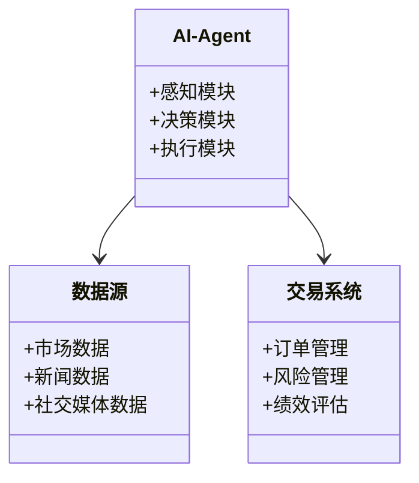
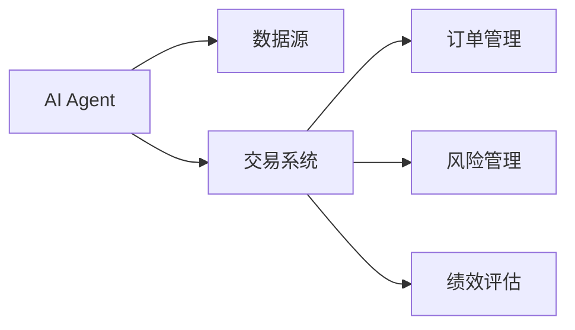
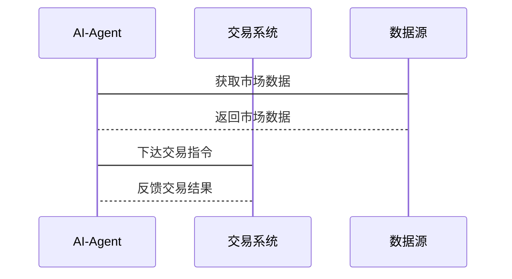

                 


# AI Agent在智能股票交易中的应用

## 关键词：AI Agent，智能股票交易，算法交易，量化投资，机器学习，深度学习，大数据分析

## 摘要：  
本文系统地探讨了AI Agent在智能股票交易中的应用，涵盖了从基本概念到算法原理、系统架构再到项目实战的全过程。文章首先介绍了AI Agent的基本概念和股票交易的背景，分析了AI Agent在股票交易中的核心概念和技术原理，详细讲解了强化学习和遗传算法等算法的数学模型和实际应用，随后分析了系统的功能设计和架构设计，并通过项目实战展示了如何搭建和实现AI Agent驱动的股票交易系统。最后，总结了AI Agent在股票交易中的最佳实践和未来发展趋势。

---

# 第一部分: AI Agent与智能股票交易的背景介绍

## 第1章: AI Agent与智能股票交易概述

### 1.1 AI Agent的基本概念

#### 1.1.1 AI Agent的定义与特点
AI Agent（人工智能代理）是指能够感知环境、自主决策并执行任务的智能实体。其特点包括：  
- **自主性**：能够在没有外部干预的情况下独立运行。  
- **反应性**：能够实时感知环境并做出响应。  
- **学习性**：能够通过数据和经验不断优化自身行为。  
- **目标导向**：所有行为都围绕特定目标展开。

#### 1.1.2 AI Agent的核心要素与功能
AI Agent的核心要素包括：  
- **感知模块**：负责接收和处理外部数据。  
- **决策模块**：基于感知数据做出决策。  
- **执行模块**：将决策转化为具体操作。  

#### 1.1.3 AI Agent与传统交易系统的主要区别  
AI Agent与传统交易系统的主要区别如下：  
- **自动化**：AI Agent能够自动完成交易决策，而传统系统需要人工干预。  
- **高效性**：AI Agent能够快速处理大量数据并做出决策，而传统系统效率较低。  
- **自适应性**：AI Agent能够根据市场变化动态调整策略，而传统系统则难以做到。  

### 1.2 智能股票交易的背景与现状

#### 1.2.1 股票交易的定义与分类  
股票交易是指在股票市场上买卖股票的行为。根据交易方式的不同，股票交易可以分为：  
- **场内交易**：在交易所内进行的交易。  
- **场外交易**：在交易所外进行的交易。  
- **高频交易**：短时间内进行大量交易的策略。  

#### 1.2.2 传统股票交易的痛点与局限  
传统股票交易存在以下痛点：  
- **低效性**：人工交易速度慢，容易错失市场机会。  
- **情绪化**：交易者容易受到情绪影响，做出非理性决策。  
- **高成本**：传统交易需要支付较高的佣金和手续费。  

#### 1.2.3 智能股票交易的发展趋势  
随着人工智能技术的发展，智能股票交易正逐渐成为主流。其发展趋势包括：  
- **自动化**：通过AI Agent实现交易自动化。  
- **数据驱动**：利用大数据分析技术优化交易策略。  
- **智能化**：通过深度学习等技术提高交易决策的准确性。  

### 1.3 AI Agent在股票交易中的应用前景

#### 1.3.1 AI Agent在股票交易中的潜在价值  
AI Agent在股票交易中的潜在价值体现在以下几个方面：  
- **提高交易效率**：通过自动化交易减少人工干预，提高交易速度。  
- **优化决策**：通过大数据分析和机器学习算法优化交易策略。  
- **降低风险**：通过实时监控和风险评估模型降低交易风险。  

#### 1.3.2 当前市场中的应用案例分析  
当前，AI Agent在股票交易中的应用案例包括：  
- **量化交易**：通过算法进行高频交易。  
- **智能选股**：通过AI Agent筛选出具有投资价值的股票。  
- **风险控制**：通过AI Agent实时监控市场风险。  

#### 1.3.3 未来发展趋势与挑战  
未来，AI Agent在股票交易中的发展趋势包括：  
- **智能化**：进一步提高AI Agent的智能化水平，使其能够更准确地预测市场走势。  
- **个性化**：根据投资者的个性化需求定制交易策略。  
- **合规性**：确保AI Agent的交易行为符合相关法律法规。  

---

## 第2章: AI Agent的核心概念与技术原理

### 2.1 AI Agent的核心概念

#### 2.1.1 AI Agent的感知机制  
AI Agent的感知机制包括：  
- **数据采集**：通过API接口获取市场数据。  
- **数据预处理**：对采集到的数据进行清洗和标准化处理。  
- **特征提取**：从数据中提取有用的特征，例如技术指标、市场情绪等。  

#### 2.1.2 AI Agent的决策模型  
AI Agent的决策模型包括：  
- **规则-based决策**：基于预设的规则做出决策。  
- **基于机器学习的决策**：通过训练模型预测市场走势。  
- **基于强化学习的决策**：通过试错优化交易策略。  

#### 2.1.3 AI Agent的执行机制  
AI Agent的执行机制包括：  
- **订单生成**：根据决策结果生成具体的订单。  
- **订单提交**：通过交易接口将订单提交到交易所。  
- **订单跟踪**：实时跟踪订单的执行情况。  

### 2.2 AI Agent与机器学习的关系

#### 2.2.1 机器学习在AI Agent中的应用  
机器学习在AI Agent中的应用包括：  
- **监督学习**：通过训练分类模型预测股票价格走势。  
- **无监督学习**：通过聚类分析发现市场中的隐含模式。  
- **强化学习**：通过试错优化交易策略。  

#### 2.2.2 常见机器学习算法在股票交易中的应用  
常见的机器学习算法在股票交易中的应用包括：  
- **线性回归**：预测股票价格走势。  
- **支持向量机（SVM）**：分类股票的涨跌趋势。  
- **随机森林**：进行多特征的分类和回归分析。  

#### 2.2.3 深度学习与强化学习在AI Agent中的作用  
深度学习在AI Agent中的作用包括：  
- **自动特征提取**：通过卷积神经网络自动提取图像中的特征。  
- **时间序列预测**：通过循环神经网络预测股票价格走势。  

强化学习在AI Agent中的作用包括：  
- **动态策略优化**：通过试错优化交易策略。  
- **多步决策**：通过强化学习模型进行多步决策。  

### 2.3 AI Agent与大数据技术的结合

#### 2.3.1 数据采集与预处理  
数据采集与预处理包括：  
- **数据源**：从股票交易所、新闻网站等多源数据中采集数据。  
- **数据清洗**：去除噪声数据，确保数据的准确性和完整性。  
- **数据标准化**：对数据进行标准化处理，便于后续分析。  

#### 2.3.2 数据分析与特征提取  
数据分析与特征提取包括：  
- **技术分析**：基于K线图、技术指标等进行分析。  
- **基本面分析**：基于公司财务数据、行业趋势等进行分析。  
- **市场情绪分析**：基于新闻、社交媒体等数据进行市场情绪分析。  

#### 2.3.3 数据驱动的交易策略优化  
数据驱动的交易策略优化包括：  
- **策略回测**：通过历史数据回测交易策略的有效性。  
- **策略优化**：通过参数调整优化交易策略的表现。  
- **风险控制**：通过风险评估模型优化交易策略的风险控制能力。  

---

## 第3章: AI Agent的算法原理

### 3.1 强化学习在AI Agent中的应用

#### 3.1.1 强化学习的基本原理  
强化学习的基本原理包括：  
- **状态（State）**：当前环境的状态。  
- **动作（Action）**：根据当前状态做出的决策。  
- **奖励（Reward）**：根据动作的结果获得的反馈。  
- **策略（Policy）**：决定下一步动作的规则。  

#### 3.1.2 Q-Learning算法在股票交易中的应用  
Q-Learning算法在股票交易中的应用包括：  
- **状态空间**：包括当前股票价格、市场情绪等。  
- **动作空间**：包括买入、卖出、持有等动作。  
- **奖励函数**：根据交易结果确定奖励值。  

#### 3.1.3 Deep Q-Network（DQN）算法的实现  
Deep Q-Network（DQN）算法的实现包括：  
- **神经网络结构**：包括输入层、隐藏层和输出层。  
- **经验回放**：通过经验回放缓冲区存储历史经验。  
- **目标网络**：通过目标网络保持策略的稳定性。  

### 3.2 遗传算法在AI Agent中的应用

#### 3.2.1 遗传算法的基本原理  
遗传算法的基本原理包括：  
- **编码**：将问题转化为遗传算法可处理的形式。  
- **选择**：根据适应度值选择优秀的个体。  
- **交叉**：将两个个体的基因进行交叉，生成新的个体。  
- **变异**：随机改变个体的基因，增加多样性。  

#### 3.2.2 遗传算法在股票交易中的应用  
遗传算法在股票交易中的应用包括：  
- **交易策略优化**：通过遗传算法优化交易策略的参数。  
- **组合优化**：通过遗传算法优化投资组合的配置。  

#### 3.2.3 遗传算法的实现步骤  
遗传算法的实现步骤包括：  
1. **初始化**：生成初始种群。  
2. **适应度评估**：计算每个个体的适应度值。  
3. **选择**：根据适应度值选择优秀的个体。  
4. **交叉**：将选择出的个体进行交叉，生成新个体。  
5. **变异**：对新个体进行变异操作，增加多样性。  
6. **迭代**：重复上述步骤，直到满足终止条件。  

---

## 第4章: AI Agent的系统架构设计

### 4.1 系统功能设计

#### 4.1.1 领域模型类图  
以下是领域模型类图：  



#### 4.1.2 系统架构设计  
以下是系统架构设计图：  



### 4.2 接口设计与交互流程

#### 4.2.1 接口设计  
以下是系统接口设计：  

- **数据接口**：提供市场数据的接口，包括K线数据、订单簿数据等。  
- **交易接口**：提供下单、撤单、查询订单状态等接口。  
- **反馈接口**：提供交易结果的反馈，包括成交价、成交量等。  

#### 4.2.2 交互流程图  
以下是交互流程图：  



---

## 第5章: AI Agent的项目实战

### 5.1 环境搭建与配置

#### 5.1.1 系统环境要求  
系统环境要求包括：  
- **操作系统**：Windows/Mac/Linux  
- **编程语言**：Python 3.6+  
- **开发工具**：Jupyter Notebook/PyCharm  
- **依赖库**：Pandas、NumPy、Matplotlib、Scikit-learn、TensorFlow  

#### 5.1.2 数据源获取  
数据源获取包括：  
- **Yahoo Finance API**：获取股票的历史数据。  
- **Alpha Vantage API**：获取实时市场数据。  
- **News API**：获取市场新闻数据。  

#### 5.1.3 开发环境配置  
开发环境配置包括：  
1. 安装Python依赖库：  
```bash
pip install pandas numpy matplotlib scikit-learn tensorflow
```  
2. 配置API密钥：  
注册并获取API密钥，配置环境变量。  

### 5.2 核心代码实现

#### 5.2.1 数据预处理代码  
以下是数据预处理代码：  

```python
import pandas as pd
import numpy as np

# 获取数据
data = pd.read_csv('stock_data.csv')

# 数据清洗
data = data.dropna()
data = data[~data['volume'].eq(0)]

# 特征提取
data['moving_average'] = data['close'].rolling(10).mean()
data['std_deviation'] = data['close'].rolling(10).std()
```

#### 5.2.2 交易策略实现代码  
以下是交易策略实现代码：  

```python
import numpy as np

class TradingStrategy:
    def __init__(self, data):
        self.data = data
        self.position = 0
        self.profits = []

    def execute_strategy(self):
        for i in range(1, len(self.data)):
            # 计算当前价格和前一价格的差值
            delta = self.data['close'][i] - self.data['close'][i-1]
            # 判断趋势
            if delta > 0:
                self.buy()
            elif delta < 0:
                self.sell()
            else:
                pass

    def buy(self):
        self.position += 1
        self.profits.append(self.data['close'][i] * 1)

    def sell(self):
        self.position -= 1
        self.profits.append(-self.data['close'][i] * 1)

    def get_total_profit(self):
        return sum(self.profits)
```

### 5.3 案例分析与解读

#### 5.3.1 实际案例分析  
以下是实际案例分析：  
假设我们使用上述交易策略对某只股票进行交易，最终的总利润为$1000，最大回撤为20%。  

#### 5.3.2 策略优化与改进  
策略优化与改进包括：  
- **参数优化**：调整交易策略的参数，例如移动平均的窗口大小。  
- **风险控制**：增加止损和止盈机制。  
- **多策略组合**：结合多种交易策略进行交易。  

#### 5.3.3 项目小结  
通过本项目，我们了解了如何使用AI Agent进行股票交易，掌握了几种常用的交易策略，并通过实际案例分析了策略的优缺点。  

---

## 第6章: 总结与展望

### 6.1 总结与回顾

#### 6.1.1 AI Agent的核心价值  
AI Agent的核心价值体现在以下几个方面：  
- **提高交易效率**：通过自动化交易减少人工干预。  
- **优化交易策略**：通过机器学习算法优化交易策略。  
- **降低交易风险**：通过实时监控和风险评估模型降低交易风险。  

#### 6.1.2 本文的主要工作  
本文的主要工作包括：  
- **理论研究**：系统地介绍了AI Agent的基本概念和技术原理。  
- **算法实现**：详细讲解了强化学习和遗传算法在股票交易中的应用。  
- **系统设计**：提出了基于AI Agent的股票交易系统的架构设计。  
- **项目实战**：通过实际案例展示了AI Agent在股票交易中的应用。  

### 6.2 未来展望

#### 6.2.1 技术发展  
未来，AI Agent在股票交易中的技术发展包括：  
- **更复杂的模型**：例如使用Transformer模型进行时间序列预测。  
- **多模态数据融合**：结合文本、图像等多种数据源进行交易决策。  
- **更高效的算法**：例如使用强化学习的变体算法优化交易策略。  

#### 6.2.2 应用场景拓展  
未来，AI Agent在股票交易中的应用场景将更加广泛，包括：  
- **个性化投资**：根据投资者的风险偏好定制交易策略。  
- **智能组合管理**：通过AI Agent优化投资组合的配置。  
- **全球市场交易**：通过AI Agent实现跨国市场的自动化交易。  

---

## 作者：AI天才研究院/AI Genius Institute & 禅与计算机程序设计艺术 /Zen And The Art of Computer Programming

---

以上是《AI Agent在智能股票交易中的应用》的完整目录和内容概要。通过本文，读者可以系统地了解AI Agent在智能股票交易中的应用，掌握相关的理论知识和实际操作技能。

