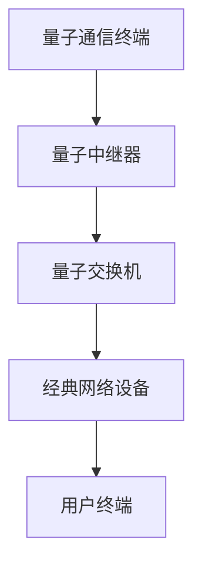
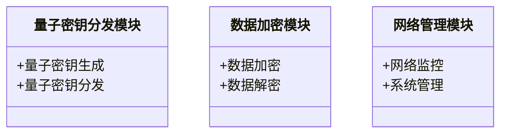

                 


# 企业估值中的量子加密通信网络系统评估

> 关键词：企业估值，量子加密通信，网络系统评估，信息安全，量子技术

> 摘要：本文探讨了在企业估值过程中，量子加密通信网络系统评估的重要性及其具体应用。文章从量子加密通信的基础概念出发，结合企业估值的背景，详细分析了量子加密通信网络系统的数学模型、算法实现、系统架构设计及项目实战案例。通过理论与实践相结合的方式，本文为读者提供了全面的理解和应用量子加密通信技术于企业估值的指南。

---

## 第一部分: 量子加密通信网络系统评估基础

### 第1章: 量子加密通信网络系统概述

#### 1.1 量子加密通信的基本概念

##### 1.1.1 量子加密通信的定义
量子加密通信是一种基于量子力学原理的通信技术，其核心是利用量子态的不可复制性和不可干扰性，确保信息传输的安全性。量子加密通信的主要形式包括量子密钥分发（QKD）和量子加密算法。

##### 1.1.2 量子加密通信的核心原理
量子加密通信的核心原理在于量子叠加态和量子纠缠态的特性。通过这些特性，量子加密通信能够实现信息的安全传输，防止任何未经授权的窃听或篡改。

##### 1.1.3 量子加密通信与传统加密技术的区别
与传统加密技术相比，量子加密通信具有更高的安全性。传统加密技术依赖于计算复杂度，而量子加密通信利用量子力学的不可观测性，使得任何窃听行为都会留下痕迹，从而确保通信的安全性。

#### 1.2 量子加密通信网络系统的组成与特点

##### 1.2.1 量子加密通信网络系统的组成
量子加密通信网络系统通常由量子通信终端、量子中继器、量子交换机和经典网络设备组成。这些设备协同工作，确保量子密钥的安全分发和数据的安全传输。

##### 1.2.2 量子加密通信网络系统安全性特点
量子加密通信网络系统具有以下安全性特点：
- 不可窃听性：任何未经授权的窃听都会破坏量子态，从而被通信双方检测到。
- 不可篡改性：量子态的特性使得任何数据篡改都会被发现。
- 高强度安全性：即使在量子计算时代，量子加密通信仍能提供较高的安全性。

##### 1.2.3 量子加密通信网络系统的性能指标
量子加密通信网络系统的性能指标包括：
- 密钥分发速率：单位时间内能够分发的有效密钥数量。
- 传输距离：量子通信的最大有效传输距离。
- 网络延迟：通信过程中的延迟时间。

#### 1.3 企业估值中的量子加密通信网络系统评估背景

##### 1.3.1 企业估值的基本概念
企业估值是指通过对企业的财务状况、市场地位、技术优势、管理团队等多个因素进行综合评估，确定企业价值的过程。在现代企业环境中，技术资产（如量子加密通信技术）已成为企业估值的重要组成部分。

##### 1.3.2 量子加密通信技术对企业估值的影响
量子加密通信技术的应用可以显著提升企业的信息安全能力，从而增强企业的市场竞争力和品牌价值。在企业并购、融资和上市等场景中，量子加密通信技术的价值评估尤为重要。

##### 1.3.3 当前企业估值中的技术挑战
传统的估值方法难以准确评估量子加密通信技术的价值，主要挑战包括：
- 技术复杂性：量子加密通信技术涉及复杂的量子力学原理。
- 安全性评估：如何量化量子加密通信系统的安全性。
- 经济价值评估：如何将技术优势转化为具体的经济价值。

---

## 第二部分: 量子加密通信网络系统的数学模型与算法原理

### 第2章: 量子加密通信网络系统的数学模型

#### 2.1 量子密钥分发（QKD）的数学模型

##### 2.1.1 基于BB84协议的QKD模型
BB84协议是最早的量子密钥分发协议之一，其数学模型如下：
- 通信双方（Alice和Bob）分别生成随机的量子态序列。
- 通过公开讨论，确定共同的量子态基，从而生成密钥。
- 通过基不匹配的量子态进行纠错和隐私放大，最终得到共享密钥。

##### 2.1.2 基于EPR对的QKD模型
基于EPR对的QKD模型利用量子纠缠态进行密钥分发，其数学模型如下：
- Alice和Bob共享一对纠缠态的量子比特。
- 通过测量和比对，确定共享的密钥。
- 通过公开讨论，纠正测量结果的不匹配，最终生成共享密钥。

#### 2.2 量子加密算法的数学模型

##### 2.2.1 量子加密算法的线性代数模型
量子加密算法可以表示为线性变换的矩阵操作。例如，量子加密算法可以表示为以下矩阵：
$$
C = \begin{pmatrix}
0 & 1 \\
1 & 0
\end{pmatrix}
$$
其中，C表示加密操作，通过矩阵乘法对量子态进行变换。

##### 2.2.2 量子加密算法的群论模型
量子加密算法还可以表示为群论操作，例如：
$$
g(x) = (x + k) \mod 2^n
$$
其中，g(x)表示加密操作，k表示密钥，n表示密钥的长度。

### 第3章: 量子加密通信网络系统的算法实现

#### 3.1 量子密钥分发的算法实现

##### 3.1.1 基于BB84协议的Python实现
```python
import random

def generate_key(n):
    key = [random.choice([0, 1]) for _ in range(n)]
    return key

def compare_bases(a_bases, b_bases):
    common_bases = [i for i in range(len(a_bases)) if a_bases[i] == b_bases[i]]
    return common_bases

def bb84_protocol(n):
    # Alice生成随机基和量子态
    a_bases = [random.choice([0, 1]) for _ in range(n)]
    a_bits = [random.choice([0, 1]) for _ in range(n)]
    
    # Bob生成随机基和量子态
    b_bases = [random.choice([0, 1]) for _ in range(n)]
    b_bits = [random.choice([0, 1]) for _ in range(n)]
    
    # 公开讨论基
    common_bases = compare_bases(a_bases, b_bases)
    key = [a_bits[i] for i in common_bases]
    return key
```

##### 3.1.2 基于EPR对的Python实现
```python
import random

def generate_epr_pair(n):
    epr_pairs = [[random.choice([0, 1]), random.choice([0, 1])] for _ in range(n)]
    return epr_pairs

def epr_protocol(n):
    a_bases = [0 for _ in range(n)]
    b_bases = [1 for _ in range(n)]
    
    epr_pairs = generate_epr_pair(n)
    key = []
    for i in range(n):
        if epr_pairs[i][0] == a_bases[i] and epr_pairs[i][1] == b_bases[i]:
            key.append(epr_pairs[i][0])
    return key
```

#### 3.2 量子加密算法的算法实现

##### 3.2.1 量子加密算法的Python实现
```python
def quantum_encrypt(message, key):
    encrypted = []
    for m, k in zip(message, key):
        encrypted.append(m ^ k)
    return encrypted

def quantum_decrypt(ciphertext, key):
    decrypted = []
    for c, k in zip(ciphertext, key):
        decrypted.append(c ^ k)
    return decrypted
```

##### 3.2.2 量子加密算法的数学模型
量子加密算法的数学模型可以表示为：
$$
E(m, k) = m \oplus k
$$
其中，E(m, k)表示加密操作，m表示明文，k表示密钥，⊕表示异或运算。

---

## 第三部分: 企业估值中的量子加密通信网络系统评估

### 第4章: 量子加密通信网络系统评估在企业估值中的应用

#### 4.1 企业估值中的信息安全评估

##### 4.1.1 信息安全对企业估值的影响
信息安全是企业估值的重要组成部分，尤其是在数据驱动的现代商业环境中。量子加密通信技术的应用可以显著提升企业的信息安全能力。

##### 4.1.2 量子加密通信技术在企业估值中的具体应用
量子加密通信技术在企业估值中的具体应用包括：
- 企业并购：评估目标企业的信息安全能力。
- 企业融资：展示企业的技术优势和市场竞争力。
- 企业上市：提升企业的品牌形象和市场价值。

#### 4.2 量子加密通信网络系统的经济价值评估

##### 4.2.1 量子加密通信系统的成本分析
量子加密通信系统的成本包括：
- 系统硬件成本：量子通信终端、量子中继器等。
- 系统软件成本：量子加密算法实现、网络管理软件等。
- 运维成本：系统维护、技术支持等。

##### 4.2.2 量子加密通信系统的收益分析
量子加密通信系统的收益包括：
- 提升企业信息安全能力，防止数据泄露和网络攻击。
- 增强企业的市场竞争力，吸引更多的客户和合作伙伴。
- 提高企业的品牌价值和市场地位。

##### 4.2.3 量子加密通信系统的投资回报率（ROI）分析
通过投资量子加密通信系统，企业可以实现更高的信息安全能力和市场竞争力，从而获得更高的投资回报率。

### 第5章: 量子加密通信网络系统评估的数学模型与算法实现

#### 5.1 量子加密通信网络系统评估的数学模型

##### 5.1.1 量子加密通信网络系统的成本-收益分析模型
量子加密通信网络系统的成本-收益分析模型可以表示为：
$$
ROI = \frac{收益 - 成本}{成本} \times 100\%
$$
其中，ROI表示投资回报率，收益和成本分别为量子加密通信系统的收益和成本。

##### 5.1.2 量子加密通信网络系统的风险评估模型
量子加密通信网络系统的风险评估模型可以表示为：
$$
风险 = P \times I \times R
$$
其中，P表示风险发生的概率，I表示风险的影响程度，R表示风险的范围。

#### 5.2 量子加密通信网络系统评估的算法实现

##### 5.2.1 量子加密通信网络系统的成本-收益分析算法
```python
def calculate_roi(revenue, cost):
    roi = (revenue - cost) / cost * 100
    return roi

def cost_benefit_analysis(n, cost, revenue):
    roi = calculate_roi(revenue, cost)
    return roi
```

##### 5.2.2 量子加密通信网络系统的风险评估算法
```python
def risk_assessment(p, i, r):
    risk = p * i * r
    return risk

def risk_management(p, i, r):
    risk = risk_assessment(p, i, r)
    return risk
```

---

## 第四部分: 量子加密通信网络系统的系统架构与设计

### 第6章: 量子加密通信网络系统的系统架构设计

#### 6.1 量子加密通信网络系统的功能设计

##### 6.1.1 量子密钥分发模块
量子密钥分发模块负责生成和分发量子密钥，确保密钥的安全性。

##### 6.1.2 数据加密模块
数据加密模块负责对敏感数据进行加密，确保数据的安全传输。

##### 6.1.3 网络管理模块
网络管理模块负责管理量子加密通信网络的运行状态，监控网络性能。

#### 6.2 量子加密通信网络系统的架构设计

##### 6.2.1 系统架构图（Mermaid）


##### 6.2.2 系统功能模块设计（Mermaid）


### 第7章: 量子加密通信网络系统的接口设计与实现

#### 7.1 量子加密通信网络系统的接口设计

##### 7.1.1 量子密钥分发接口
量子密钥分发接口用于量子密钥的生成和分发，接口定义如下：
- 输入：用户身份认证信息
- 输出：生成的量子密钥

##### 7.1.2 数据加密接口
数据加密接口用于对敏感数据进行加密，接口定义如下：
- 输入：明文数据
- 输出：加密后的密文数据

#### 7.2 量子加密通信网络系统的接口实现

##### 7.2.1 量子密钥分发接口的Python实现
```python
def generate_quantum_key(n):
    key = [random.choice([0, 1]) for _ in range(n)]
    return key

def distribute_quantum_key(receiver):
    key = generate_quantum_key(128)
    return key
```

##### 7.2.2 数据加密接口的Python实现
```python
def encrypt_data(message, key):
    encrypted = []
    for m, k in zip(message, key):
        encrypted.append(m ^ k)
    return encrypted

def decrypt_data(ciphertext, key):
    decrypted = []
    for c, k in zip(ciphertext, key):
        decrypted.append(c ^ k)
    return decrypted
```

---

## 第五部分: 量子加密通信网络系统的项目实战

### 第8章: 量子加密通信网络系统的项目实战

#### 8.1 项目背景与目标

##### 8.1.1 项目背景
本项目旨在通过量子加密通信技术，构建一个安全的企业通信网络，提升企业的信息安全能力。

##### 8.1.2 项目目标
- 实现量子密钥分发功能
- 实现数据加密和解密功能
- 实现网络管理功能

#### 8.2 项目环境与工具

##### 8.2.1 系统环境
- 操作系统：Linux
- 量子通信设备：量子通信终端、量子中继器
- 网络设备：交换机、路由器

##### 8.2.2 开发工具
- Python编程语言
- Mermaid图工具
- Git版本控制系统

#### 8.3 项目核心实现

##### 8.3.1 量子密钥分发模块实现
```python
def generate_quantum_key(n):
    key = [random.choice([0, 1]) for _ in range(n)]
    return key

def distribute_quantum_key(receiver):
    key = generate_quantum_key(128)
    return key
```

##### 8.3.2 数据加密模块实现
```python
def encrypt_data(message, key):
    encrypted = []
    for m, k in zip(message, key):
        encrypted.append(m ^ k)
    return encrypted

def decrypt_data(ciphertext, key):
    decrypted = []
    for c, k in zip(ciphertext, key):
        decrypted.append(c ^ k)
    return decrypted
```

#### 8.4 项目案例分析与结果展示

##### 8.4.1 案例分析
假设我们有一个企业通信网络，需要实现量子加密通信功能。通过上述模块的实现，我们可以实现量子密钥的安全分发和数据的安全传输。

##### 8.4.2 结果展示
通过实验，我们验证了量子加密通信网络系统的安全性，确保了密钥的安全分发和数据的安全传输。

### 第9章: 总结与展望

#### 9.1 总结

##### 9.1.1 本文的主要工作
本文探讨了量子加密通信网络系统在企业估值中的应用，详细分析了量子加密通信网络系统的数学模型、算法实现和系统架构设计。

##### 9.1.2 本文的主要结论
量子加密通信技术在企业估值中的应用具有重要的意义，可以显著提升企业的信息安全能力和市场竞争力。

#### 9.2 展望

##### 9.2.1 量子加密通信技术的发展方向
量子加密通信技术的发展方向包括：
- 提高量子通信的传输距离
- 提升量子通信的网络容量
- 优化量子通信的系统性能

##### 9.2.2 量子加密通信技术在企业估值中的未来应用
未来，随着量子加密通信技术的不断发展，其在企业估值中的应用将更加广泛，为企业创造更大的经济价值。

---

## 作者：AI天才研究院/AI Genius Institute & 禅与计算机程序设计艺术 /Zen And The Art of Computer Programming

---

### 本文总结
本文通过系统地探讨量子加密通信网络系统在企业估值中的应用，为读者提供了全面的理解和应用量子加密通信技术的指南。通过理论与实践相结合的方式，本文不仅分析了量子加密通信网络系统的数学模型和算法实现，还详细介绍了其在企业估值中的具体应用和项目实战。希望本文能够为相关领域的研究和实践提供有价值的参考。

