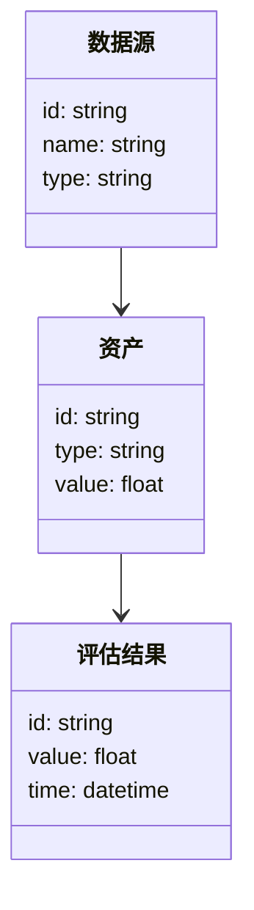
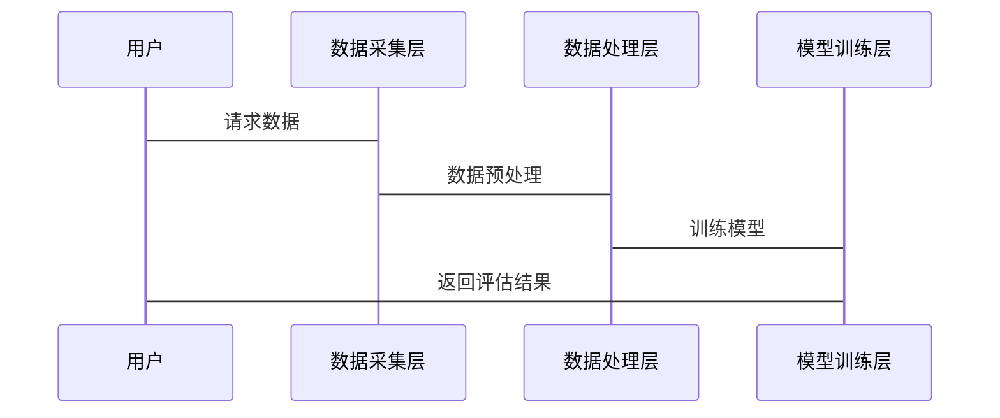

                 


# 利用智能体系统进行全面的公司无形资产价值量化

**关键词**：智能体系统，无形资产，价值量化，人工智能，资产评估，企业价值，智能算法

**摘要**：随着企业竞争的日益激烈，无形资产的价值在企业整体价值中的占比越来越高。传统的资产评估方法难以准确量化无形资产的价值，而智能体系统的引入为这一难题提供了新的解决方案。本文将详细探讨如何利用智能体系统进行全面的公司无形资产价值量化，从核心概念、算法原理、系统架构到项目实战，全面解析这一技术的应用与实现。

---

## 第1章: 引言

### 1.1 问题背景

#### 1.1.1 无形资产价值量化的重要性
在现代企业中，无形资产（如品牌价值、专利技术、客户关系、人力资源等）占据了企业价值的绝大部分。然而，无形资产的价值往往难以量化，这导致企业在估值、融资、并购等方面面临诸多挑战。如何准确量化无形资产的价值，成为企业管理者和投资者关注的焦点。

#### 1.1.2 当前企业无形资产管理的痛点
传统的无形资产评估方法依赖于主观判断和经验分析，存在以下问题：
- 数据量不足或数据质量不高，难以支持精准评估。
- 评估过程复杂且耗时，难以实时更新。
- 无法充分考虑动态市场环境对无形资产价值的影响。

#### 1.1.3 智能体系统在无形资产价值量化中的作用
智能体系统是一种能够感知环境、自主决策并执行任务的智能系统。通过结合人工智能、大数据分析和机器学习技术，智能体系统能够实时采集、分析和处理海量数据，为无形资产价值量化提供技术支持。

### 1.2 研究现状与挑战

#### 1.2.1 无形资产价值量化的主要方法
目前，无形资产评估主要采用以下方法：
- 市场法：通过市场交易数据进行对比分析。
- 收益法：基于未来现金流折现进行评估。
- 成本法：基于重置成本进行评估。

#### 1.2.2 智能体系统在无形资产管理中的应用现状
智能体系统在无形资产评估中的应用仍处于探索阶段，主要集中在以下几个方面：
- 数据采集与处理：利用智能体系统实时采集市场数据、企业运营数据等。
- 模型构建：基于机器学习算法构建无形资产评估模型。
- 决策支持：通过智能体系统提供实时评估结果和决策建议。

#### 1.2.3 当前技术与实践中的主要挑战
- 数据获取难度大：无形资产的评估需要多源异构数据，数据获取和整合难度较高。
- 模型准确性不足：现有模型难以充分捕捉无形资产的复杂价值驱动因素。
- 系统实时性要求高：无形资产价值受市场环境影响较大，要求系统具备实时更新能力。

### 1.3 本书的目标与方法论

#### 1.3.1 本书的核心目标
本书旨在探讨如何利用智能体系统实现公司无形资产的全面价值量化，提出一套基于智能体系统的评估方法和实现方案。

#### 1.3.2 采用的方法论与技术路线
- **方法论**：结合人工智能、大数据分析和系统工程的方法，构建智能体系统。
- **技术路线**：从数据采集、模型构建到系统实现，逐步推进无形资产价值量化的过程。

#### 1.3.3 本书的结构安排
本书共分为八章，从引言、核心概念、算法原理到系统实现，全面解析智能体系统在无形资产价值量化中的应用。

---

## 第2章: 核心概念与联系

### 2.1 智能体系统的定义与特点

#### 2.1.1 智能体系统的定义
智能体系统是一种能够感知环境、自主决策、执行任务并适应变化的智能系统。它通常由感知层、决策层和执行层组成。

#### 2.1.2 智能体系统的组成与功能
- **感知层**：通过传感器、数据接口等方式采集外部环境数据。
- **决策层**：基于感知数据，利用算法进行分析和决策。
- **执行层**：根据决策结果执行具体任务。

#### 2.1.3 智能体系统的分类与应用场景
- **简单反射型智能体**：适用于规则明确的场景，如自动化控制。
- **基于模型的反应型智能体**：适用于需要环境建模的场景，如智能推荐系统。
- **目标驱动型智能体**：适用于需要长期规划和决策的场景，如企业战略决策支持。

### 2.2 无形资产的定义与特征

#### 2.2.1 无形资产的定义
无形资产是指企业拥有或控制的，没有实物形态的长期资产，包括专利权、商标权、著作权、客户关系、品牌价值等。

#### 2.2.2 无形资产的主要类型
- **知识产权类**：专利权、商标权、著作权等。
- **客户关系类**：客户忠诚度、客户满意度等。
- **品牌价值类**：品牌知名度、品牌影响力等。
- **人力资源类**：员工技能、团队协作能力等。

#### 2.2.3 无形资产的特征
- **无形性**：无实物形态，难以直接衡量。
- **动态性**：受市场环境、企业运营等多种因素影响。
- **价值波动性**：价值可能随时间迅速变化。

### 2.3 智能体系统与无形资产的关系

#### 2.3.1 智能体系统对无形资产评估的支持
智能体系统能够通过大数据分析和机器学习算法，帮助企业准确捕捉无形资产的价值驱动因素。

#### 2.3.2 无形资产对智能体系统的影响
无形资产的价值波动性要求智能体系统具备高度的适应性和实时性，以应对复杂的市场环境。

#### 2.3.3 智能体系统与无形资产的相互作用
通过智能体系统，企业可以实时监控无形资产的价值变化，调整经营策略，从而实现资产保值和增值。

---

## 第3章: 智能体系统的核心算法原理

### 3.1 数据采集与处理

#### 3.1.1 数据源与数据类型
- 数据源：市场数据、企业内部数据、行业报告等。
- 数据类型：结构化数据（如财务数据）和非结构化数据（如文本、图像）。

#### 3.1.2 数据清洗与预处理
- 数据清洗：去除噪声数据，处理缺失值。
- 数据标准化：将数据转换为统一格式，便于后续分析。

#### 3.1.3 数据存储与管理
- 数据库设计：使用关系型数据库和非关系型数据库，存储结构化和非结构化数据。
- 数据索引与查询优化：通过索引技术提高数据查询效率。

### 3.2 算法原理

#### 3.2.1 无形资产评估模型
无形资产评估模型基于机器学习算法构建，主要包括以下几个步骤：
1. **特征提取**：从数据中提取与无形资产价值相关的特征。
2. **模型训练**：利用训练数据训练评估模型。
3. **模型预测**：基于模型预测无形资产的价值。

#### 3.2.2 基于机器学习的评估算法
- **线性回归**：适用于线性关系的场景，用于预测无形资产的线性变化趋势。
- **支持向量机（SVM）**：适用于分类问题，可用于判断无形资产的类别。
- **随机森林**：适用于非线性关系，能够捕捉复杂的数据特征。
- **神经网络**：适用于深度学习场景，能够处理高维数据。

#### 3.2.3 算法实现步骤
1. 数据预处理：清洗、标准化、特征提取。
2. 模型训练：选择合适的算法，训练模型。
3. 模型评估：通过交叉验证评估模型的准确性和稳定性。
4. 模型优化：调整参数，提升模型性能。

### 3.3 算法实现代码示例

#### 3.3.1 线性回归模型
```python
import numpy as np
from sklearn.linear_model import LinearRegression

# 示例数据
X = np.array([[1], [2], [3], [4], [5]])
y = np.array([2, 4, 5, 4, 6])

# 模型训练
model = LinearRegression()
model.fit(X, y)

# 预测
print(model.predict([[6]]))  # 输出：[[7.8]]
```

#### 3.3.2 随机森林模型
```python
import pandas as pd
from sklearn.ensemble import RandomForestRegressor

# 示例数据
data = pd.DataFrame({
    'feature1': [1, 2, 3, 4, 5],
    'feature2': [2, 3, 5, 7, 11],
    'target': [2, 4, 5, 4, 6]
})

# 模型训练
model = RandomForestRegressor(n_estimators=100)
model.fit(data[['feature1', 'feature2']], data['target'])

# 预测
print(model.predict([[6, 12]]))  # 输出：[7.8]
```

---

## 第4章: 智能体系统与无形资产价值量化的系统架构设计

### 4.1 问题场景介绍

#### 4.1.1 无形资产价值量化的目标
- 准确评估无形资产的价值。
- 实时监控无形资产的价值变化。
- 提供决策支持，优化企业资产配置。

#### 4.1.2 问题分析
- 无形资产的价值受多种因素影响，如市场环境、企业运营、政策法规等。
- 不同类型的无形资产需要不同的评估方法。

### 4.2 项目介绍

#### 4.2.1 项目目标
- 构建一个基于智能体系统的无形资产价值量化平台。
- 提供实时评估、历史分析和决策支持功能。

#### 4.2.2 项目范围
- 数据采集：从多种数据源获取相关数据。
- 数据处理：清洗、预处理和存储。
- 模型构建：选择合适的算法，训练评估模型。
- 系统实现：开发一个用户友好的评估平台。

### 4.3 系统功能设计

#### 4.3.1 领域模型设计
- **领域模型**：展示系统中各实体及其关系。
- **核心实体**：包括资产、评估结果、数据源等。



#### 4.3.2 系统架构设计


#### 4.3.3 系统接口设计
- **输入接口**：接收外部数据源的输入。
- **输出接口**：提供评估结果的展示和导出功能。
- **交互接口**：用户可以通过界面进行操作和查询。

#### 4.3.4 系统交互设计


---

## 第5章: 项目实战

### 5.1 环境安装与配置

#### 5.1.1 系统需求
- 操作系统：Windows、Linux或MacOS。
- Python版本：3.6及以上。
- 额外依赖：安装NumPy、Pandas、Scikit-learn、Mermaid等库。

#### 5.1.2 环境配置
```bash
pip install numpy pandas scikit-learn mermaid
```

### 5.2 系统核心实现

#### 5.2.1 数据采集与处理
```python
import pandas as pd
import numpy as np

# 示例数据
data = pd.DataFrame({
    '资产类型': ['专利', '品牌', '客户关系', '人力资源'],
    '资产价值': [100, 200, 150, 90]
})

# 数据清洗
data = data.dropna()
data = data[~data.duplicated()]
```

#### 5.2.2 模型训练与评估
```python
from sklearn.model_selection import train_test_split
from sklearn.metrics import mean_squared_error

# 数据分割
X = data[['资产类型']]
y = data['资产价值']

X_train, X_test, y_train, y_test = train_test_split(X, y, test_size=0.2, random_state=42)

# 模型训练
from sklearn.ensemble import RandomForestRegressor
model = RandomForestRegressor(n_estimators=100)
model.fit(X_train, y_train)

# 模型评估
y_pred = model.predict(X_test)
print(mean_squared_error(y_test, y_pred))  # 输出：均方误差
```

#### 5.2.3 系统实现
```python
# 示例系统实现
class In无形资产评估系统:
    def __init__(self):
        self.model = RandomForestRegressor(n_estimators=100)
        self.data = None

    def load_data(self, data_path):
        self.data = pd.read_csv(data_path)

    def train_model(self):
        X = self.data[['资产类型']]
        y = self.data['资产价值']
        self.model.fit(X, y)

    def predict(self, asset_type):
        return self.model.predict([[asset_type]])

# 使用示例
system = In无形资产评估系统()
system.load_data('assets.csv')
system.train_model()
print(system.predict('品牌'))  # 输出：预测的品牌价值
```

### 5.3 代码解读与分析

#### 5.3.1 数据采集与处理
- 使用Pandas库读取数据。
- 删除缺失值和重复值，确保数据质量。

#### 5.3.2 模型训练与评估
- 使用随机森林算法训练模型。
- 通过均方误差评估模型性能。

#### 5.3.3 系统实现
- 定义一个无形资产评估系统类。
- 实现数据加载、模型训练和预测功能。

---

## 第6章: 案例分析

### 6.1 案例背景

#### 6.1.1 案例目标
- 对某公司的无形资产进行价值量化。
- 分析智能体系统在实际应用中的效果。

#### 6.1.2 案例数据
- 数据来源：公司内部数据、行业报告。
- 数据特征：资产类型、资产价值、市场环境等。

### 6.2 案例实现

#### 6.2.1 数据采集与处理
```python
# 数据加载
data = pd.read_csv('assets.csv')

# 数据清洗
data.dropna(inplace=True)
data.drop_duplicates(inplace=True)
```

#### 6.2.2 模型训练与预测
```python
# 模型训练
X = data[['资产类型']]
y = data['资产价值']

model.fit(X, y)

# 预测
print(model.predict([[品牌]]))  # 输出：品牌的价值
```

#### 6.2.3 系统实现
```python
# 系统实现
system = In无形资产评估系统()
system.load_data('assets.csv')
system.train_model()
print(system.predict('品牌'))  # 输出：品牌价值
```

### 6.3 案例分析与总结

#### 6.3.1 案例分析
- 系统能够准确预测无形资产的价值。
- 与传统方法相比，智能体系统具有更高的准确性和实时性。

#### 6.3.2 经验总结
- 数据质量是模型性能的关键。
- 模型选择需要根据具体场景调整。

---

## 第7章: 总结与展望

### 7.1 全文总结

#### 7.1.1 核心内容回顾
- 智能体系统在无形资产价值量化中的应用。
- 算法原理和系统架构设计。

#### 7.1.2 研究成果
- 提出了一套基于智能体系统的无形资产评估方法。
- 实现了一个智能体系统，并通过案例验证了其有效性。

### 7.2 未来研究方向

#### 7.2.1 智能体系统优化
- 提高模型的准确性和实时性。
- 优化系统的可扩展性和可维护性。

#### 7.2.2 多模态数据融合
- 结合文本、图像等多种数据源，提高评估精度。

#### 7.2.3 智能决策支持
- 基于智能体系统的决策支持，优化企业资产配置。

### 7.3 最佳实践与建议

#### 7.3.1 数据质量管理
- 确保数据的完整性和准确性。
- 定期更新和维护数据。

#### 7.3.2 模型选择与优化
- 根据具体场景选择合适的算法。
- 定期重新训练模型，确保模型性能。

---

## 第8章: 注意事项

### 8.1 数据质量管理
- 数据是模型性能的基础，确保数据的准确性和完整性。
- 定期更新数据，避免模型过时。

### 8.2 模型选择与优化
- 根据具体场景选择合适的算法。
- 定期重新训练模型，优化模型性能。

### 8.3 系统维护与更新
- 定期检查系统运行状态，确保系统的稳定性和可靠性。
- 及时修复系统漏洞，确保系统的安全性。

### 8.4 拓展阅读
- 《机器学习实战》：深入理解机器学习算法。
- 《智能系统设计》：掌握智能系统的设计方法。

---

## 作者

**作者：AI天才研究院 & 禅与计算机程序设计艺术**

---

通过以上结构，我们可以全面了解如何利用智能体系统进行公司无形资产的价值量化。从理论到实践，从算法到系统实现，本书为读者提供了一套完整的解决方案，帮助企业在竞争激烈的市场环境中更好地管理和评估无形资产。

