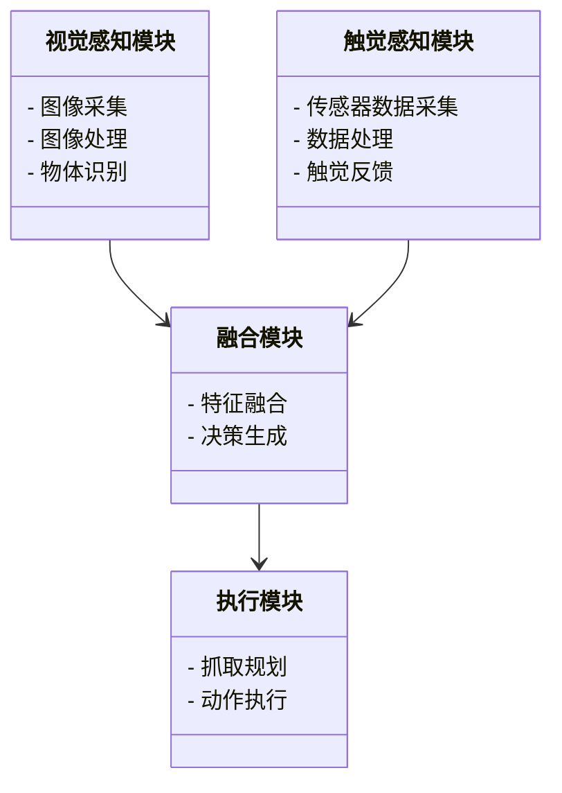
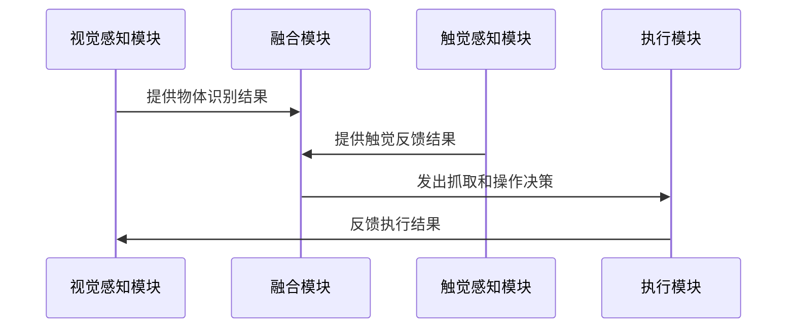

                 


# 开发具有视觉-触觉融合能力的AI Agent

> 关键词：视觉-触觉融合，AI Agent，多模态感知，深度学习，机器人技术

> 摘要：本文详细探讨了开发具有视觉-触觉融合能力的AI Agent的技术挑战与解决方案。通过分析视觉与触觉感知的核心概念、融合算法的设计与实现、系统架构的构建与优化，以及实际项目的实施，本文为读者提供了一套系统化的开发框架和实践指南。

---

# 第一部分: 视觉-触觉融合AI Agent的背景与核心概念

# 第1章: 视觉-触觉融合AI Agent的背景与问题定义

## 1.1 视觉与触觉感知的融合背景

### 1.1.1 多模态感知的定义与特点
多模态感知是指AI系统能够同时处理和理解多种类型的数据源（如视觉、触觉、听觉等）的能力。其核心特点包括：
- **互补性**：不同模态的信息可以相互补充，提升感知的准确性和全面性。
- **鲁棒性**：通过融合多模态信息，系统能够更好地应对单一模态信息不足或噪声的情况。
- **实时性**：多模态感知需要在实时环境中快速处理和响应。

### 1.1.2 视觉与触觉融合的必要性
视觉和触觉是人类感知世界的核心方式。通过将这两种感知方式融合，AI Agent能够更全面地理解环境，从而在复杂场景中做出更准确的决策。例如，在机器人抓取、医疗手术辅助、增强现实交互等领域，视觉-触觉融合技术能够显著提升系统的性能。

### 1.1.3 当前技术的局限性与挑战
尽管视觉和触觉感知技术已经取得了显著进展，但两者的融合仍面临诸多挑战：
- **数据异构性**：视觉和触觉数据的特征维度和表示方式差异较大，如何有效融合是一个难题。
- **实时性要求**：在实时应用场景中，如何快速处理和融合视觉与触觉数据是关键挑战。
- **模型复杂性**：融合视觉和触觉信息的模型需要同时处理大规模视觉数据和高维触觉数据，计算资源需求较高。

### 1.1.4 视觉-触觉融合的边界与外延
视觉-触觉融合的边界主要集中在感知层面，而其外延则涉及决策和执行层面。通过融合视觉和触觉信息，AI Agent可以在感知的基础上做出更精准的决策和更高效的执行。

### 1.1.5 视觉-触觉融合的核心要素组成
视觉-触觉融合的核心要素包括：
- **视觉数据**：如图像、深度信息等。
- **触觉数据**：如力反馈、温度等。
- **融合算法**：如注意力机制、生成对抗网络等。
- **决策模块**：基于融合信息做出决策。

## 1.2 AI Agent的定义与分类

### 1.2.1 AI Agent的基本概念
AI Agent是指能够感知环境、自主决策并执行任务的智能实体。它可以是一个软件程序，也可以是一个物理设备。

### 1.2.2 基于单一模态的AI Agent
基于单一模态的AI Agent仅依赖于一种感知方式，如仅依赖视觉信息或仅依赖触觉信息。这种方式在简单场景中表现良好，但在复杂场景中往往力不从心。

### 1.2.3 多模态AI Agent的优势
多模态AI Agent通过融合多种感知信息，能够更好地理解环境、提高决策的准确性和鲁棒性。例如，在工业机器人中，视觉信息用于识别物体，触觉信息用于调整抓取力度。

## 1.3 视觉-触觉融合的核心问题

### 1.3.1 视觉信息与触觉信息的异同
- **视觉信息**：基于二维图像，提供物体的形状、颜色等信息。
- **触觉信息**：基于物理接触，提供物体的质地、温度、压力等信息。

### 1.3.2 融合信息的难点与关键点
- **信息异构性**：视觉和触觉数据的特征维度和表示方式差异较大，如何有效融合是一个挑战。
- **实时性要求**：在实时应用场景中，如何快速处理和融合视觉与触觉数据是关键。

### 1.3.3 融合后的性能提升与应用潜力
通过视觉-触觉融合，AI Agent在以下方面表现出显著优势：
- **感知准确性**：通过融合信息，系统能够更准确地识别物体。
- **决策鲁棒性**：通过多模态信息的互补性，系统能够更好地应对复杂场景。
- **交互自然性**：在人机交互中，视觉-触觉融合能够提供更自然的用户体验。

## 1.4 本章小结
本章从背景、定义、核心问题等多个方面探讨了视觉-触觉融合AI Agent的必要性与挑战。接下来的章节将深入分析视觉与触觉感知的核心概念、融合算法的设计与实现，以及系统架构的构建与优化。

---

# 第二部分: 视觉-触觉融合的核心概念与联系

# 第2章: 视觉与触觉感知的核心概念

## 2.1 视觉感知的原理与实现

### 2.1.1 视觉感知的定义与基本原理
视觉感知是指通过视觉数据（如图像、深度信息）来理解环境的过程。深度学习在视觉感知中发挥了重要作用，如卷积神经网络（CNN）在图像分类、目标检测等任务中的应用。

### 2.1.2 基于深度学习的视觉感知模型
- **卷积神经网络（CNN）**：用于图像特征提取和分类。
- **图神经网络（GCN）**：用于处理图像中的图结构信息。

### 2.1.3 视觉感知的关键技术与挑战
- **目标检测**：通过CNN等技术实现物体的定位与识别。
- **语义分割**：通过U-Net等模型实现像素级的语义分割。
- **实时性优化**：通过模型压缩、轻量化设计提升实时性。

## 2.2 触觉感知的原理与实现

### 2.2.1 触觉感知的定义与基本原理
触觉感知是指通过触觉传感器（如力传感器、压力传感器）获取环境中的触觉信息，并通过算法进行分析和理解。

### 2.2.2 基于传感器的触觉感知模型
- **力反馈传感器**：用于测量物体与传感器接触时的力和压力分布。
- **温度传感器**：用于测量物体表面的温度。

### 2.2.3 触觉感知的关键技术与挑战
- **传感器融合**：通过多种传感器的协同工作，提升感知的准确性和鲁棒性。
- **实时性优化**：通过硬件加速和算法优化，提升触觉感知的实时性。

## 2.3 视觉与触觉信息的融合方式

### 2.3.1 基于特征融合的多模态感知
- **特征对齐**：将视觉和触觉特征对齐到相同的维度空间。
- **融合策略**：通过加权融合、注意力机制等方式实现特征的融合。

### 2.3.2 基于注意力机制的多模态融合
- **注意力机制的基本原理**：通过计算不同模态信息的重要性权重，实现信息的自适应融合。
- **视觉-触觉注意力网络**：设计一个双模态注意力网络，分别计算视觉和触觉信息的注意力权重，并进行融合。

### 2.3.3 基于生成模型的多模态融合
- **生成对抗网络（GAN）**：通过生成器和判别器的对抗训练，实现视觉和触觉信息的联合生成。
- **变分自编码器（VAE）**：通过编码和解码的过程，实现视觉和触觉信息的联合表示。

## 2.4 视觉与触觉信息的融合优势

### 2.4.1 提高感知的准确性和鲁棒性
通过视觉和触觉信息的互补性，系统能够更准确地识别物体，尤其是在复杂光照和遮挡条件下。

### 2.4.2 增强AI Agent的环境理解能力
视觉-触觉融合能够帮助AI Agent更好地理解环境的物理特性，如物体的形状、质地、重量等。

### 2.4.3 优化AI Agent的决策与执行能力
通过融合视觉和触觉信息，AI Agent能够做出更精准的决策，如在机器人抓取中，结合视觉信息进行物体定位，结合触觉信息调整抓取力度。

## 2.5 本章小结
本章详细探讨了视觉与触觉感知的核心概念与融合方式。通过分析视觉和触觉感知的基本原理、关键技术以及融合策略，为后续的算法设计和系统实现奠定了基础。

---

# 第三部分: 视觉-触觉融合的算法原理

# 第3章: 视觉-触觉融合的算法原理

## 3.1 基于深度学习的视觉-触觉融合模型

### 3.1.1 模型的整体架构设计
- **输入模块**：接收视觉图像和触觉传感器数据。
- **视觉分支**：通过CNN提取视觉特征。
- **触觉分支**：通过多层感知机（MLP）提取触觉特征。
- **融合模块**：通过注意力机制或门控机制融合视觉和触觉特征。
- **输出模块**：生成最终的融合特征或决策结果。

### 3.1.2 视觉分支与触觉分支的实现
- **视觉分支**：使用ResNet、EfficientNet等预训练模型提取视觉特征。
- **触觉分支**：通过MLP对触觉数据进行降维和特征提取。

### 3.1.3 融合模块的设计与实现
- **注意力机制**：通过计算视觉和触觉特征的重要性权重，实现自适应融合。
- **门控机制**：通过门控网络动态调整融合的比例。

### 3.1.4 模型训练与优化
- **损失函数设计**：结合分类、回归等任务设计损失函数。
- **优化算法选择**：使用Adam、SGD等优化算法训练模型。
- **数据增强**：通过数据增强技术提升模型的泛化能力。

## 3.2 基于注意力机制的融合算法

### 3.2.1 注意力机制的基本原理
注意力机制通过计算输入数据中不同部分的重要性权重，实现对关键信息的聚焦。

### 3.2.2 视觉与触觉信息的注意力分配
- **多模态注意力网络**：设计一个双模态注意力网络，分别计算视觉和触觉信息的注意力权重，并进行融合。

### 3.2.3 注意力权重的融合策略
- **加权融合**：根据注意力权重对视觉和触觉特征进行加权融合。
- **门控融合**：通过门控网络动态调整融合的比例。

## 3.3 基于生成对抗网络的融合算法

### 3.3.1 生成对抗网络的基本原理
生成对抗网络（GAN）由生成器和判别器组成，通过对抗训练生成高质量的数据。

### 3.3.2 视觉与触觉信息的联合生成
- **联合生成器**：设计一个联合生成器，同时处理视觉和触觉数据。
- **联合判别器**：设计一个联合判别器，同时判别生成的视觉和触觉数据的真实性。

### 3.3.3 融合生成的优化策略
- **对抗训练**：通过最大化生成器的生成能力，提升视觉和触觉数据的联合生成效果。
- **特征匹配**：通过匹配生成数据与真实数据的特征，进一步优化生成效果。

## 3.4 基于

---

# 第四部分: 视觉-触觉融合的系统分析与架构设计

# 第4章: 视觉-触觉融合的系统分析与架构设计

## 4.1 问题场景介绍

### 4.1.1 项目背景
本项目旨在开发一个具有视觉-触觉融合能力的AI Agent，用于工业机器人抓取与操作任务。

### 4.1.2 项目目标
通过融合视觉和触觉信息，提升机器人在复杂场景中的抓取准确性和操作灵活性。

## 4.2 系统功能设计

### 4.2.1 系统功能模块划分
- **视觉感知模块**：负责物体的视觉识别和定位。
- **触觉感知模块**：负责物体的触觉感知和反馈。
- **融合模块**：负责视觉和触觉信息的融合与决策。
- **执行模块**：负责根据融合信息执行抓取和操作任务。

### 4.2.2 领域模型（Mermaid类图）


### 4.2.3 系统架构设计（Mermaid架构图）


## 4.3 系统接口设计

### 4.3.1 视觉与触觉模块的接口设计
- **视觉模块接口**：
  - 输入：图像数据
  - 输出：物体识别结果
- **触觉模块接口**：
  - 输入：传感器数据
  - 输出：触觉反馈结果

### 4.3.2 融合模块与执行模块的接口设计
- **融合模块接口**：
  - 输入：视觉和触觉融合结果
  - 输出：抓取和操作决策
- **执行模块接口**：
  - 输入：抓取和操作决策
  - 输出：动作执行结果

## 4.4 系统交互设计（Mermaid序列图）


## 4.5 本章小结
本章详细分析了视觉-触觉融合系统的功能模块、架构设计和接口交互，为后续的实现提供了理论基础。

---

# 第五部分: 视觉-触觉融合的项目实战

# 第5章: 视觉-触觉融合的项目实战

## 5.1 环境安装与配置

### 5.1.1 开发环境选择
- **操作系统**：Ubuntu 20.04
- **编程语言**：Python 3.8
- **深度学习框架**：TensorFlow 2.5、PyTorch 1.9
- **触觉传感器**：力反馈传感器、温度传感器
- **视觉传感器**：RGB-D相机（如Intel RealSense）

### 5.1.2 依赖库安装
```bash
pip install tensorflow==2.5
pip install pytorch==1.9
pip install numpy==1.21
pip install open3d==1.7
```

## 5.2 系统核心实现

### 5.2.1 视觉感知模块实现

#### 5.2.1.1 图像采集与处理
```python
import cv2
import numpy as np

# 图像采集
cap = cv2.VideoCapture(0)
ret, frame = cap.read()

# 图像处理
gray = cv2.cvtColor(frame, cv2.COLOR_BGR2GRAY)
edges = cv2.Canny(gray, 50, 150)
```

#### 5.2.1.2 物体识别与定位
```python
import tensorflow as tf
from tensorflow.keras.models import load_model

model = load_model('object_detection.h5')
predictions = model.predict(frame)
```

### 5.2.2 触觉感知模块实现

#### 5.2.2.1 传感器数据采集
```python
import serial

ser = serial.Serial('COM3', 9600)
force_data = ser.readline().decode().strip()
```

#### 5.2.2.2 数据处理与特征提取
```python
from sklearn.preprocessing import StandardScaler

scaler = StandardScaler()
scaled_force = scaler.fit_transform(np.array(force_data).reshape(-1, 1))
```

### 5.2.3 融合模块实现

#### 5.2.3.1 特征融合
```python
import numpy as np

visual_features = model_visual.predict(frame)
force_features = model_force.predict(force_data)
merged_features = np.concatenate([visual_features, force_features], axis=-1)
```

#### 5.2.3.2 决策生成
```python
from attention_network import AttentionModel

attention = AttentionModel()
attention_weights = attention.call(merged_features)
final_decision = attention_weights * merged_features
```

### 5.2.4 执行模块实现

#### 5.2.4.1 抓取规划
```python
from robotic_arm import RoboticArm

robot = RoboticArm()
robot.move_to_target(position)
```

#### 5.2.4.2 动作执行
```python
robot.grab_object()
robot.move_to_goal()
```

### 5.2.5 系统交互实现

#### 5.2.5.1 视觉与触觉数据的实时传输
```python
import threading

def receive_visual_data():
    global visual_data
    while True:
        visual_data = receive_from_visual_module()

def receive_force_data():
    global force_data
    while True:
        force_data = receive_from_force_module()

threading.Thread(target=receive_visual_data).start()
threading.Thread(target=receive_force_data).start()
```

#### 5.2.5.2 融合结果的实时反馈
```python
import time

while True:
    merged_result = fusion_module.call(visual_data, force_data)
    execute_module.call(merged_result)
    time.sleep(0.1)
```

## 5.3 实际案例分析与详细解读

### 5.3.1 项目应用场景
本项目应用于工业机器人抓取与操作任务，目标是通过视觉-触觉融合技术提升抓取的准确性和操作的灵活性。

### 5.3.2 案例分析
- **场景描述**：机器人需要抓取一个形状不规则的物体，视觉信息用于定位物体，触觉信息用于调整抓取力度。
- **系统实现**：
  1. 视觉模块识别物体位置和姿态。
  2. 触觉模块实时反馈抓取力度。
  3. 融合模块根据视觉和触觉信息生成抓取决策。
  4. 执行模块根据决策执行抓取和操作任务。

### 5.3.3 项目小结
通过本项目，我们验证了视觉-触觉融合技术在工业机器人中的应用潜力，同时积累了宝贵的经验。

## 5.4 本章小结
本章通过一个实际项目详细探讨了视觉-触觉融合系统的实现过程，包括环境配置、核心模块实现、系统交互设计以及实际案例分析。这些内容为读者提供了宝贵的实战经验。

---

# 第六部分: 总结与展望

# 第6章: 总结与展望

## 6.1 本章总结

### 6.1.1 核心内容回顾
- 视觉-触觉融合的核心概念与技术
- 多模态感知算法的设计与实现
- 系统架构的构建与优化
- 项目实战的经验总结

## 6.2 未来发展展望

### 6.2.1 技术发展趋势
- **模型优化**：通过模型压缩、知识蒸馏等技术提升模型的实时性和准确性。
- **硬件支持**：开发专用硬件加速视觉-触觉融合计算。
- **跨模态交互**：探索更多模态信息（如听觉、味觉）的融合方式。

### 6.2.2 应用场景扩展
- **医疗领域**：开发具有视觉-触觉融合能力的手术机器人。
- **教育领域**：应用于虚拟现实教学和培训。
- **服务领域**：开发智能服务机器人，提供更自然的交互体验。

## 6.3 最佳实践 tips

### 6.3.1 开发建议
- **数据质量**：确保视觉和触觉数据的高质量采集与标注。
- **模型选择**：根据具体场景选择合适的融合算法。
- **系统优化**：通过并行计算、缓存优化等方式提升系统的实时性。

### 6.3.2 常见问题与解决方案
- **数据异构性问题**：通过特征对齐和模态适配技术解决。
- **实时性问题**：通过硬件加速和算法优化提升性能。
- **模型泛化能力不足**：通过数据增强和迁移学习提升模型的泛化能力。

## 6.4 小结
视觉-触觉融合技术为AI Agent的发展提供了新的方向，未来将有更广泛的应用场景和技术突破。

---

# 作者：AI天才研究院/AI Genius Institute & 禅与计算机程序设计艺术 /Zen And The Art of Computer Programming

---

以上是《开发具有视觉-触觉融合能力的AI Agent》的技术博客文章目录。每个章节和小节的内容需要根据实际需求进行详细展开和补充，以确保文章的完整性和深度。

