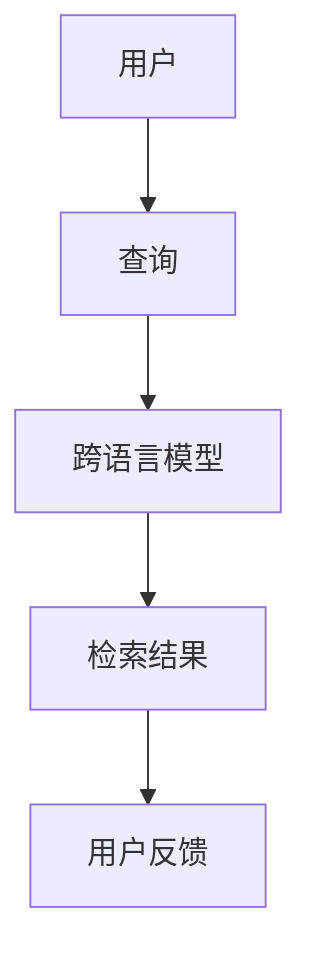
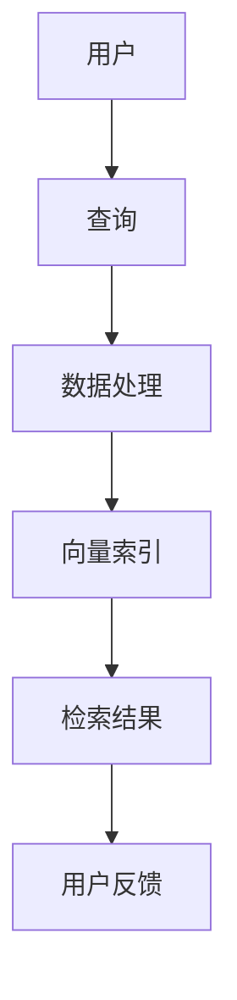
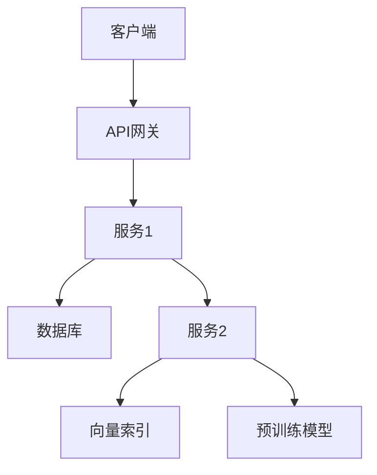
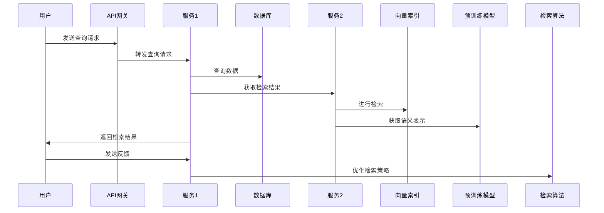

                 


# 开发具有跨语言信息检索能力的AI Agent

> 关键词：跨语言信息检索、AI Agent、自然语言处理、多语言模型、信息检索算法

> 摘要：本文将详细探讨如何开发具有跨语言信息检索能力的AI Agent。通过分析跨语言信息检索的核心概念、算法原理和系统架构，结合实际项目实战，为读者提供从理论到实践的全面指导。文章将涵盖背景介绍、核心概念、算法实现、系统设计、项目实战以及最佳实践，帮助读者深入理解并掌握跨语言信息检索的能力开发。

---

## 第1章: 跨语言信息检索的背景与挑战

### 1.1 跨语言信息检索的背景

#### 1.1.1 多语言信息检索的需求

随着全球化的发展，信息的来源变得多样化，用户可能需要在多种语言之间进行信息检索。例如，一个用户可能需要用中文查询英文资料，或者在跨国业务中需要处理多语言信息。传统的单一语言信息检索系统无法满足这种需求，跨语言信息检索因此应运而生。

#### 1.1.2 当前AI技术在跨语言检索中的应用

现代AI技术，尤其是自然语言处理（NLP）技术的进步，为跨语言信息检索提供了强有力的支持。预训练语言模型（如BERT、GPT）能够处理多种语言，并通过跨语言对齐技术实现不同语言之间的语义理解。这些技术使得AI Agent能够更好地处理跨语言信息检索任务。

#### 1.1.3 跨语言信息检索的核心问题

跨语言信息检索的核心问题在于如何在不同语言之间建立有效的语义连接。这需要解决语言之间的语义对齐、词汇映射以及跨语言文本表示等问题。此外，如何高效地检索多语言数据也是一个技术难点。

---

### 1.2 AI Agent的基本概念

#### 1.2.1 AI Agent的定义与特点

AI Agent是一种智能体，能够感知环境并执行任务以实现目标。它具有自主性、反应性、目标导向性和社会性等特点。AI Agent可以通过传感器获取信息，通过执行器与环境交互，并通过内部算法做出决策。

#### 1.2.2 跨语言能力对AI Agent的重要性

在多语言环境中，AI Agent需要能够理解、生成和检索多种语言的信息。这种能力使得AI Agent能够为全球用户提供统一的服务，提高用户体验和系统的适用性。

#### 1.2.3 跨语言信息检索在AI Agent中的作用

跨语言信息检索是AI Agent实现多语言任务的关键技术。它使得AI Agent能够从多种语言的数据库中检索信息，满足用户的多样化需求。

---

### 1.3 本章小结

本章介绍了跨语言信息检索的背景及其在AI Agent中的重要性。通过分析跨语言信息检索的核心问题，为后续章节的深入探讨奠定了基础。

---

## 第2章: 跨语言信息检索的核心概念与原理

### 2.1 跨语言信息检索的核心概念

#### 2.1.1 跨语言信息检索的原理

跨语言信息检索的核心在于通过语言对齐技术将不同语言的文本映射到相同的语义空间。这可以通过构建跨语言词汇对齐、句法分析和语义表示等方式实现。

#### 2.1.2 跨语言检索的关键技术

1. **语言对齐**：通过统计方法或深度学习模型，建立不同语言之间的词汇和语义映射关系。
2. **跨语言文本表示**：将不同语言的文本表示为相同的向量空间，以便进行检索。
3. **多语言模型**：使用预训练的多语言模型（如Marian、XLM）进行跨语言信息处理。

#### 2.1.3 跨语言检索的优缺点对比

| 特性 | 优点 | 缺点 |
|------|------|------|
| 多语言支持 | 支持多种语言，覆盖面广 | 需要处理语言间的复杂关系 |
| 语义理解 | 高语义精度 | 对模型要求高，计算复杂 |

---

### 2.2 跨语言信息检索的实现流程

#### 2.2.1 数据预处理

1. **文本清洗**：去除噪声，如停用词、标点符号。
2. **分词**：将文本分割成词语或短语。
3. **语言识别**：识别文本的语言，以便后续处理。

#### 2.2.2 模型训练

1. **训练数据准备**：收集多语言数据，并进行对齐处理。
2. **模型选择**：选择适合的模型（如BERT、XLM）进行训练。
3. **微调模型**：在特定任务上对模型进行微调，提升跨语言检索性能。

#### 2.2.3 检索与反馈

1. **向量检索**：将查询文本映射为向量，与数据库中的向量进行匹配。
2. **结果排序**：根据相似度对结果进行排序。
3. **用户反馈**：根据用户反馈优化检索结果。

---

### 2.3 跨语言信息检索的实体关系图



---

### 2.4 本章小结

本章详细介绍了跨语言信息检索的核心概念和实现流程，并通过实体关系图展示了系统的整体架构。

---

## 第3章: 跨语言信息检索的算法原理

### 3.1 基于向量空间模型的检索算法

#### 3.1.1 向量空间模型的定义

向量空间模型将文本表示为向量，通过计算向量之间的相似度来衡量文本的相关性。常用的相似度计算方法包括余弦相似度和欧氏距离。

#### 3.1.2 跨语言向量空间的构建

跨语言向量空间构建的关键在于实现语言间的语义对齐。可以通过以下步骤实现：

1. **预训练模型获取向量表示**：使用预训练的多语言模型获取文本的向量表示。
2. **语言对齐**：通过语言对齐技术将不同语言的向量映射到相同的语义空间。
3. **构建向量索引**：将处理后的向量构建索引，以便快速检索。

#### 3.1.3 基于余弦相似度的检索

余弦相似度的计算公式为：
$$\text{相似度} = \frac{\vec{A} \cdot \vec{B}}{|\vec{A}| |\vec{B}|}$$

---

### 3.2 基于神经网络的检索算法

#### 3.2.1 神经网络在跨语言检索中的应用

深度学习模型（如Transformer）在跨语言检索中表现出色。模型通过自注意力机制捕捉文本的语义信息，并生成语义表示。

#### 3.2.2 Transformer模型在检索中的作用

Transformer模型通过多头注意力机制实现了全局语义理解，能够捕捉到不同语言之间的语义关联。

#### 3.2.3 基于预训练模型的跨语言检索

预训练模型（如XLM）已经在多种语言上进行了训练，能够直接用于跨语言检索任务。

---

### 3.3 跨语言检索算法的对比分析

| 算法类型 | 向量空间模型 | 神经网络模型 |
|---------|-------------|-------------|
| 优点 | 实现简单，计算速度快 | 语义理解能力强，检索精度高 |
| 缺点 | 语义理解能力有限 | 计算复杂度高 |

---

### 3.4 本章小结

本章分析了跨语言信息检索的两种主要算法：向量空间模型和神经网络模型，并对其优缺点进行了对比。

---

## 第4章: 跨语言信息检索的系统架构设计

### 4.1 系统功能设计

#### 4.1.1 系统功能模块

1. **数据获取模块**：从多语言数据库中获取数据。
2. **数据处理模块**：对数据进行清洗、分词和向量化处理。
3. **检索模块**：根据用户查询进行跨语言检索。
4. **反馈模块**：根据用户反馈优化检索结果。

#### 4.1.2 系统功能流程



---

### 4.2 系统架构设计

#### 4.2.1 系统架构图



---

### 4.3 系统接口设计

1. **查询接口**：用户通过API发送查询请求。
2. **检索接口**：系统根据查询请求进行跨语言检索。
3. **反馈接口**：用户对检索结果进行反馈，系统根据反馈优化检索算法。

---

### 4.4 系统交互设计



---

### 4.5 本章小结

本章详细设计了跨语言信息检索系统的架构，包括功能模块、系统架构图和交互流程。

---

## 第5章: 跨语言信息检索的项目实战

### 5.1 项目介绍

#### 5.1.1 项目背景

本项目旨在开发一个支持多语言信息检索的AI Agent，能够为用户提供跨语言的信息查询服务。

#### 5.1.2 项目目标

实现一个支持多种语言的信息检索系统，能够理解用户的查询意图，并返回相关的结果。

---

### 5.2 环境安装

#### 5.2.1 安装Python

```bash
python --version
# 确保Python版本 >= 3.8
```

#### 5.2.2 安装依赖库

```bash
pip install numpy
pip install transformers
pip install faiss-cpu
```

---

### 5.3 系统核心实现

#### 5.3.1 数据预处理

```python
import pandas as pd
from transformers import AutoTokenizer, AutoModel

# 加载预训练模型
tokenizer = AutoTokenizer.from_pretrained('sentence-transformers/multi-30k')
model = AutoModel.from_pretrained('sentence-transformers/multi-30k')

# 数据预处理
def preprocess(text):
    tokens = tokenizer(text, padding=True, truncation=True, max_length=512)
    return tokens.input_ids, tokens.attention_mask

# 获取向量表示
def get_embeddings(text):
    input_ids, attention_mask = preprocess(text)
    outputs = model(input_ids=input_ids, attention_mask=attention_mask)
    return outputs.last_hidden_state[:, 0, :].numpy()
```

#### 5.3.2 检索算法实现

```python
import numpy as np
from faiss import IndexFlat, VectorFlat

# 初始化向量索引
index = IndexFlat(300)
index = VectorFlat(300)

# 添加向量到索引
def add_to_index(embeddings):
    index.add(embeddings)

# 检索相似向量
def search_vector(query_vector, top_k=5):
    D, I = index.search(query_vector, top_k)
    return I[0], D[0]
```

---

### 5.4 项目小结

本章通过一个具体的项目实战，详细展示了跨语言信息检索系统的实现过程，包括环境安装、数据预处理和检索算法实现。

---

## 第6章: 跨语言信息检索的最佳实践与总结

### 6.1 最佳实践

1. **选择合适的预训练模型**：根据任务需求选择适合的多语言模型。
2. **数据对齐**：确保训练数据的质量和多样性。
3. **性能优化**：通过索引优化和模型压缩提升检索效率。

### 6.2 项目总结

跨语言信息检索是实现AI Agent多语言能力的关键技术。通过本文的理论分析和项目实战，读者可以掌握跨语言信息检索的核心原理和实现方法。

### 6.3 注意事项

1. **模型选择**：不同任务需要选择合适的模型。
2. **数据处理**：确保数据的多样性和质量。
3. **性能优化**：平衡模型精度和计算效率。

### 6.4 拓展阅读

1. **预训练模型**：学习更多关于BERT、XLM等模型的知识。
2. **跨语言NLP技术**：深入研究语言对齐和跨语言文本表示技术。

---

## 附录

### 附录A: 常用工具与库

1. **Transformers库**：用于加载和训练预训练模型。
2. **Faiss**：用于高效的向量检索。

### 附录B: 参考文献

1. Peters et al. (2019). "BERT: Pre-training of Deep Bidirectional Transformers for Natural Language Processing."
2. Conneau et al. (2020). "Crosslingual language model."

---

## 作者信息

作者：AI天才研究院/AI Genius Institute & 禅与计算机程序设计艺术/Zen And The Art of Computer Programming

---

以上是《开发具有跨语言信息检索能力的AI Agent》的完整目录和内容框架。

