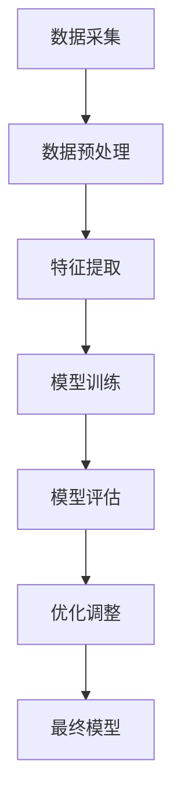
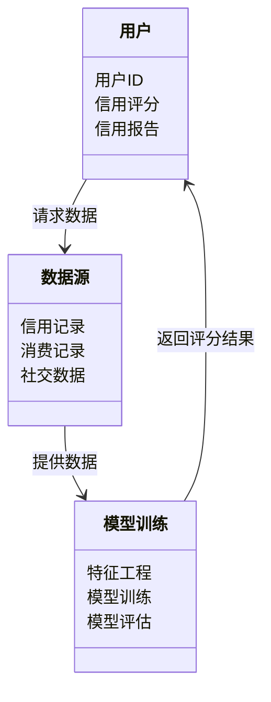
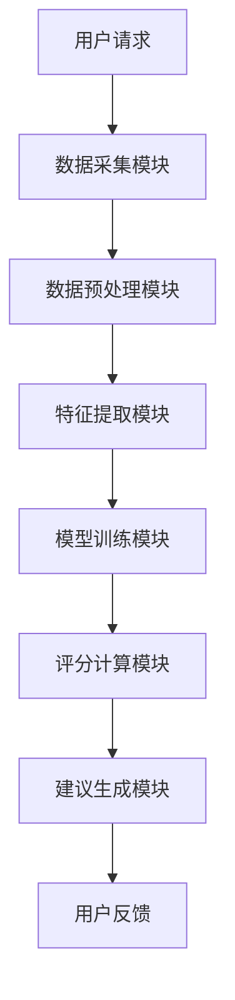
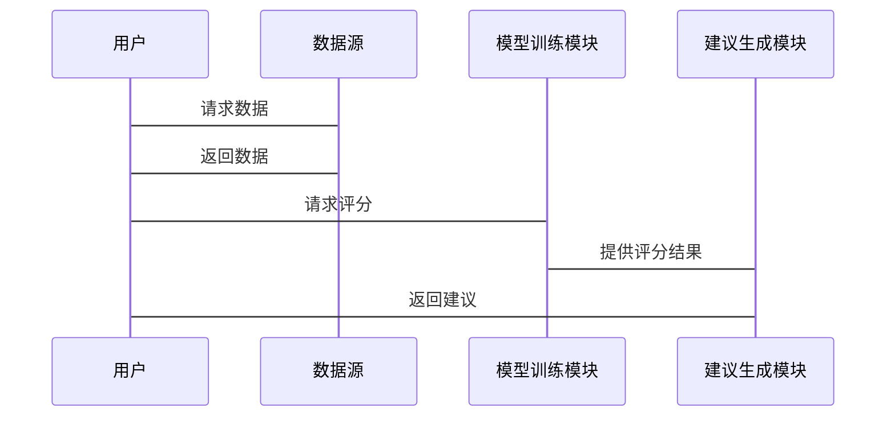

                 


# 智能个人信用评分优化建议系统

> 关键词：智能信用评分，机器学习，算法优化，系统架构，数据科学

> 摘要：本文探讨了智能个人信用评分优化建议系统的构建与优化，通过分析传统评分系统的不足，提出了基于机器学习和深度学习的智能优化方案，详细讲解了系统的核心算法、架构设计及实现过程，最后通过实际案例展示了系统的应用效果。

---

# 第1章: 智能个人信用评分系统背景与问题背景

## 1.1 个人信用评分的重要性

### 1.1.1 信用评分的定义与作用

信用评分是衡量个人信用状况的重要指标，广泛应用于银行贷款、信用卡审批、融资租赁等领域。一个准确的信用评分不仅能够帮助金融机构降低风险，还能为个人提供更便捷的金融服务。然而，传统信用评分系统存在数据维度不足、模型单一、难以实时更新等问题。

### 1.1.2 传统信用评分的局限性

传统信用评分主要依赖于简单的统计分析，例如线性回归模型。这些模型难以捕捉复杂的信用行为模式，且对非结构化数据的处理能力有限。此外，传统评分系统更新周期较长，无法实时反映个人信用状况的变化。

### 1.1.3 智能化信用评分的必要性

随着大数据和人工智能技术的发展，智能化信用评分系统能够利用机器学习算法，从多维度数据中提取特征，构建更复杂的评分模型，实现更精准的评分结果。同时，智能化系统能够实时更新模型参数，提升评分的动态适应性。

## 1.2 问题背景与目标

### 1.2.1 当前信用评分系统存在的问题

- 数据维度单一，难以覆盖个人信用行为的全貌。
- 模型复杂度不足，无法捕捉非线性特征。
- 评分结果缺乏透明性，用户难以理解评分依据。
- 系统更新周期长，无法及时反映最新信用状况。

### 1.2.2 智能优化的目标与意义

目标：通过引入机器学习和深度学习技术，构建一个动态、精准、透明的智能化信用评分系统，能够实时更新评分结果，并提供个性化改进建议。

意义：智能化信用评分系统能够显著提升评分的准确性，降低金融机构的风险敞口，同时为用户提供更透明和个性化的服务，增强用户体验。

### 1.2.3 优化后的信用评分系统的优势

- 高准确性：通过多维度数据和复杂算法提升评分精度。
- 实时性：能够快速响应信用状况的变化。
- 透明性：用户能够理解评分依据，增强信任感。
- 个性化：根据用户需求提供定制化改进建议。

## 1.3 问题描述与解决思路

### 1.3.1 信用评分系统的核心问题

信用评分系统的核心问题在于如何从多源异构数据中提取有效特征，并构建能够准确反映个人信用状况的评分模型。此外，如何实时更新模型参数，确保评分结果的动态性也是关键挑战。

### 1.3.2 智能优化的具体解决思路

- 数据采集与预处理：整合多源数据，清洗和特征工程。
- 模型选择与训练：采用先进的机器学习和深度学习算法，构建评分模型。
- 系统设计与实现：设计高效的系统架构，确保系统的实时性和可扩展性。

### 1.3.3 边界与外延

本系统仅关注个人信用评分的优化与建议，不涉及企业信用评估。系统边界包括数据采集、模型训练、评分计算和建议生成四个模块。

---

# 第2章: 智能个人信用评分系统的核心概念与原理

## 2.1 数据采集与预处理

### 2.1.1 数据来源与采集方式

数据来源主要包括：

1. **个人信用报告**：包括借款记录、还款历史、逾期情况等。
2. **社交数据**：社交媒体行为、网络互动记录。
3. **消费记录**：信用卡交易、网购行为等。
4. **身份验证数据**：包括姓名、身份证号、手机号等。

数据采集可以通过API接口、爬虫技术等方式进行。

### 2.1.2 数据清洗与特征提取

数据清洗步骤如下：

1. **去除重复数据**：确保每条数据唯一性。
2. **处理缺失值**：根据业务需求选择填充或删除。
3. **异常值处理**：识别并处理离群点。
4. **数据标准化**：将不同量纲的特征进行归一化处理。

特征提取方面，可以利用主成分分析（PCA）降低特征维度，同时保留大部分信息量。

### 2.1.3 数据标准化与归一化

标准化和归一化是常用的数据预处理方法，能够提升模型的训练效果。标准化公式如下：

$$
z = \frac{x - \mu}{\sigma}
$$

其中，$\mu$ 是均值，$\sigma$ 是标准差。

归一化公式如下：

$$
x' = \frac{x - \min(x)}{\max(x) - \min(x)}
$$

---

## 2.2 评分模型的构建与训练

### 2.2.1 模型选择与训练策略

选择模型时，需要考虑数据规模、模型复杂度和计算资源。对于中小规模数据，可以使用随机森林或梯度提升树（如XGBoost）；对于大数据量，可以考虑使用深度学习模型（如神经网络）。

训练策略包括：

1. **交叉验证**：确保模型泛化能力。
2. **超参数调优**：通过网格搜索或随机搜索优化模型参数。
3. **模型融合**：结合多个模型的预测结果，提升准确性。

### 2.2.2 模型训练的数学公式

以逻辑回归为例，其损失函数为：

$$
L = -\sum_{i=1}^{n} [y_i \ln p_i + (1 - y_i)\ln(1 - p_i)]
$$

其中，$p_i = \frac{1}{1 + e^{-w x_i - b}}$，$w$ 是权重，$b$ 是偏置，$x_i$ 是输入特征，$y_i$ 是标签。

### 2.2.3 模型评估与优化

评估指标包括准确率、精确率、召回率、F1分数等。优化方法包括调整模型结构、增加数据量、引入正则化等。

---

## 2.3 智能建议系统的设计

### 2.3.1 建议生成的逻辑

基于评分结果，系统会生成相应的改进建议，例如：

1. **提升信用评分的方法**：如按时还款、减少负债、增加信用记录等。
2. **优化消费行为的建议**：如合理使用信用卡、避免过度消费等。
3. **风险提示与预警**：当评分接近临界值时，提醒用户注意潜在风险。

### 2.3.2 建议系统的实现流程

1. **评分计算**：基于当前数据计算信用评分。
2. **分析不足**：找出影响评分的主要因素。
3. **生成建议**：根据分析结果，生成具体的改进建议。

### 2.3.3 系统的边界与限制

系统仅提供优化建议，不直接干预用户的信用行为。建议内容仅供参考，具体实施需结合用户实际情况。

---

# 第3章: 智能个人信用评分系统的算法原理

## 3.1 机器学习算法概述

### 3.1.1 线性回归与逻辑回归

线性回归用于预测连续型变量，逻辑回归用于分类问题。其数学形式如下：

$$
y = \beta_0 + \beta_1x_1 + \beta_2x_2 + \dots + \beta_nx_n
$$

### 3.1.2 支持向量机与随机森林

支持向量机（SVM）适用于高维数据分类，随机森林是一种基于决策树的集成学习方法。

### 3.1.3 神经网络与深度学习

深度学习模型（如LSTM、Transformer）能够处理复杂序列数据，提升模型的表达能力。

---

## 3.2 基于机器学习的评分模型

### 3.2.1 算法流程图



### 3.2.2 算法的数学模型

以随机森林为例，其基本思想是通过构建多个决策树并行投票的方式进行预测。

### 3.2.3 算法的优缺点分析

- 优点：计算效率高、易于实现。
- 缺点：模型解释性较差，难以捕捉复杂的非线性关系。

---

## 3.3 深度学习模型的应用

### 3.3.1 神经网络的结构

深度学习模型通常包括输入层、隐藏层和输出层。例如，一个简单的三层神经网络结构如下：

$$
y = \sigma(w_2 a_2 + b_2)
$$

其中，$a_2 = \sigma(w_1 x + b_1)$，$\sigma$ 是激活函数（如ReLU或sigmoid）。

### 3.3.2 深度学习模型的训练流程

1. **输入数据**：将特征输入模型。
2. **前向传播**：计算模型输出。
3. **计算损失**：使用损失函数计算预测值与真实值的差距。
4. **反向传播**：通过梯度下降优化模型参数。

### 3.3.3 深度学习与传统机器学习的对比

- 深度学习：自动提取特征，模型复杂度高，需要大量数据支持。
- 传统机器学习：特征工程依赖人工经验，模型简单，计算效率高。

---

# 第4章: 智能个人信用评分系统的系统架构设计

## 4.1 问题场景介绍

系统需要支持高并发请求，处理多源数据，确保评分结果的实时性和准确性。

## 4.2 系统功能设计

### 4.2.1 领域模型设计



### 4.2.2 系统架构设计



### 4.2.3 系统接口设计

系统接口包括数据接口、模型接口和用户接口。数据接口负责与第三方数据源对接，模型接口负责模型训练和预测，用户接口负责与用户交互。

### 4.2.4 系统交互设计



---

# 第5章: 智能个人信用评分系统的项目实战

## 5.1 环境安装

安装必要的库：

```bash
pip install numpy pandas scikit-learn xgboost keras tensorflow
```

## 5.2 系统核心实现源代码

### 5.2.1 数据预处理代码

```python
import pandas as pd
import numpy as np

# 数据加载
data = pd.read_csv('credit_data.csv')

# 数据清洗
data.dropna(inplace=True)

# 特征提取
from sklearn.preprocessing import StandardScaler
scaler = StandardScaler()
X_scaled = scaler.fit_transform(data.drop('score', axis=1))
y = data['score']
```

### 5.2.2 模型训练代码

```python
from sklearn.ensemble import RandomForestClassifier
from sklearn.metrics import accuracy_score

model = RandomForestClassifier(n_estimators=100, max_depth=10, random_state=42)
model.fit(X_scaled, y)

# 模型评估
y_pred = model.predict(X_scaled)
print("准确率:", accuracy_score(y, y_pred))
```

### 5.2.3 建议生成代码

```python
def generate_recommendations(score, data):
    recommendations = []
    if score < 600:
        recommendations.append("建议您及时还款，避免逾期。")
    elif 600 <= score < 700:
        recommendations.append("建议您合理规划消费，增加信用历史。")
    else:
        recommendations.append("您的信用状况良好，继续保持。")
    return recommendations

# 示例
user_score = 650
print(generate_recommendations(user_score, data))
```

## 5.3 实际案例分析

以一位信用评分为650的用户为例，系统会生成以下建议：

1. **按时还款**：确保所有贷款和信用卡账单按时还款。
2. **增加信用历史**：保持长期的信用记录，增加信用历史长度。
3. **合理消费**：避免过度消费，保持信用卡使用在信用额度的30%以内。

---

# 第6章: 总结与最佳实践

## 6.1 总结

本文详细介绍了智能个人信用评分优化建议系统的构建过程，包括数据采集、模型训练、系统设计和实际应用。通过机器学习和深度学习技术，系统能够提供更精准、实时的信用评分，并给出个性化改进建议。

## 6.2 最佳实践 tips

- **数据质量**：确保数据的完整性和准确性，数据预处理是关键。
- **模型选择**：根据数据规模和特征选择合适的模型，避免过度复杂。
- **系统优化**：采用分布式架构，提升系统的处理能力。
- **持续学习**：定期更新模型参数，保持系统的准确性。

## 6.3 小结

智能个人信用评分系统不仅能够提升评分的准确性，还能为用户提供有价值的改进建议，是未来信用评估领域的重要发展方向。

---

# 作者

作者：AI天才研究院/AI Genius Institute & 禅与计算机程序设计艺术 /Zen And The Art of Computer Programming

