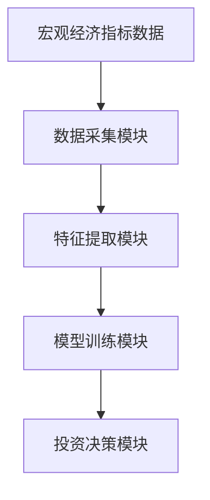
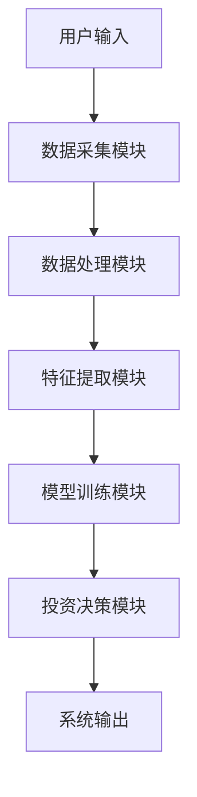
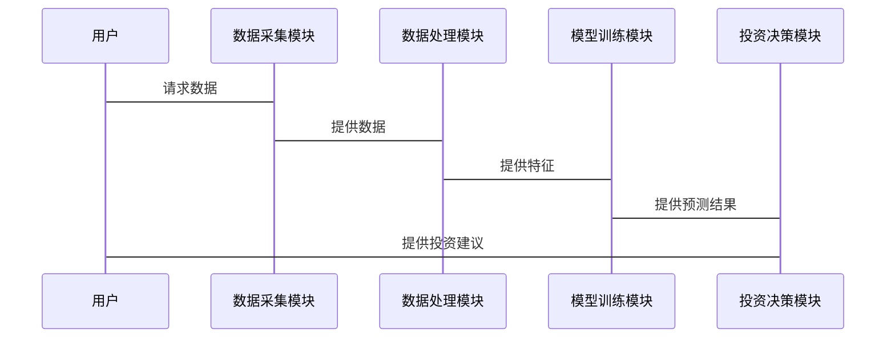

                 


# 智能体系统提升价值投资的宏观经济指标领先性分析

## 关键词：
智能体系统, 价值投资, 宏观经济指标, 领先性分析, 机器学习

## 摘要：
本文探讨了智能体系统在价值投资中的应用，特别是在宏观经济指标领先性分析方面。通过结合智能体系统和宏观经济指标，我们能够更精准地预测市场趋势，优化投资决策。文章详细介绍了智能体系统的概念、算法原理、系统架构以及实际案例，为价值投资者提供了新的视角和工具。

---

## 第1章: 智能体系统的概念与背景

### 1.1 智能体系统的基本概念
智能体系统是一种能够感知环境、做出决策并采取行动的系统。它通过数据驱动的方式，利用机器学习、深度学习等技术，实现对复杂问题的自动化分析和决策。

#### 1.1.1 智能体的定义与特征
智能体（Agent）是指能够感知环境并采取行动以实现目标的实体。智能体系统具有以下特征：
- **自主性**：能够在没有外部干预的情况下自主运行。
- **反应性**：能够根据环境的变化实时调整行为。
- **主动性**：能够主动采取行动以实现目标。
- **社会性**：能够与其他智能体或系统进行交互和协作。

#### 1.1.2 智能体系统的分类
智能体系统可以根据不同的标准进行分类，常见的分类包括：
- **按智能水平**：反应式智能体、认知式智能体。
- **按应用场景**：金融智能体、医疗智能体、交通智能体等。
- **按技术架构**：基于规则的智能体、基于模型的智能体、基于学习的智能体。

#### 1.1.3 智能体系统在金融领域的应用前景
在金融领域，智能体系统可以应用于股票交易、风险管理、市场预测等多个方面。特别是在价值投资中，智能体系统能够通过分析宏观经济指标，帮助投资者做出更明智的决策。

### 1.2 价值投资的核心理念
价值投资是一种投资策略，旨在通过识别被低估的资产，进行长期投资以实现超额收益。其核心理念包括：
- **内在价值**：资产的真正价值在于其未来现金流的现值。
- **市场先生**：市场情绪的波动会影响资产的市场价格，但不会影响其内在价值。
- **安全边际**：通过购买价格低于内在价值的资产，降低投资风险。

### 1.3 宏观经济指标的领先性分析
领先性分析是指通过分析宏观经济指标的变化，预测未来经济走势的过程。在价值投资中，领先性分析可以帮助投资者提前识别市场趋势，优化投资策略。

#### 1.3.1 宏观经济指标的分类
宏观经济指标可以分为以下几类：
- **GDP**：国内生产总值，衡量一个国家的经济总量。
- **失业率**：衡量劳动力市场的健康状况。
- **通胀率**：衡量价格水平的变化。
- **利率**：影响资金的时间价值和借贷成本。
- **PMI**：采购经理指数，反映制造业和服务业的经济活动。

#### 1.3.2 领先性分析的定义与意义
领先性分析是指通过分析当前的宏观经济指标，预测未来经济走势的过程。其意义在于帮助投资者提前识别市场趋势，优化投资策略。

#### 1.3.3 智能体系统在领先性分析中的作用
智能体系统可以通过分析大量的宏观经济指标，识别出具有领先性的指标，并利用这些指标预测未来的经济走势。这种能力可以帮助投资者在价值投资中做出更明智的决策。

---

## 第2章: 智能体系统与宏观经济指标的关系

### 2.1 智能体系统的核心要素
智能体系统在分析宏观经济指标时，需要考虑以下几个核心要素：
- **数据采集与处理**：收集和处理宏观经济指标数据。
- **智能体的决策机制**：基于数据进行分析和决策。
- **系统的反馈与优化**：根据反馈不断优化系统性能。

#### 2.1.1 数据采集与处理
数据采集是智能体系统的第一步，需要从多个来源获取宏观经济指标数据。这些数据可能包括GDP、失业率、通胀率等。数据处理包括数据清洗、标准化和特征提取等步骤。

#### 2.1.2 智能体的决策机制
智能体的决策机制基于机器学习算法，如支持向量机（SVM）、随机森林（Random Forest）和神经网络（Neural Network）等。这些算法可以帮助智能体系统识别宏观经济指标之间的关系，并做出预测。

#### 2.1.3 系统的反馈与优化
智能体系统需要根据实际结果不断优化自身的预测模型。通过反馈机制，系统可以调整参数、更新模型，以提高预测的准确性。

### 2.2 宏观经济指标的特征分析
在智能体系统中，宏观经济指标的特征分析是关键。通过分析指标的领先性、滞后性和同步性，可以帮助系统更好地预测未来的经济走势。

#### 2.2.1 领先性指标的识别
领先性指标是指能够提前反映未来经济走势的指标。例如，制造业PMI指数通常可以提前反映GDP的变化。

#### 2.2.2 滞后性指标的识别
滞后性指标是指在经济走势发生变化后才开始变化的指标。例如，失业率通常会在经济衰退后才开始上升。

#### 2.2.3 同步性指标的识别
同步性指标是指与经济走势同步变化的指标。例如，GDP增长率通常与经济周期同步变化。

### 2.3 智能体系统与宏观经济指标的关联性
智能体系统通过分析宏观经济指标的关联性，可以帮助投资者更好地理解经济走势，优化投资策略。

#### 2.3.1 数据驱动的智能体决策
智能体系统通过分析大量的宏观经济数据，识别出具有领先性的指标，并利用这些指标预测未来的经济走势。

#### 2.3.2 宏观经济指标对智能体系统的输入影响
宏观经济指标是智能体系统的重要输入，系统通过分析这些指标的变化，调整自身的预测模型。

#### 2.3.3 智能体系统对宏观经济指标的预测能力
智能体系统可以通过机器学习算法，预测宏观经济指标的变化趋势，并为投资者提供决策支持。

---

## 第3章: 智能体系统提升价值投资的理论基础

### 3.1 价值投资的数学模型
价值投资的核心理念可以通过数学模型进行描述。例如，资产的内在价值可以通过未来现金流的现值来计算。

#### 3.1.1 价值投资的基本公式
$$ V = \sum_{t=1}^{n} \frac{C_t}{(1+r)^t} $$
其中，\( V \) 是资产的内在价值，\( C_t \) 是第 \( t \) 年的现金流，\( r \) 是折现率。

#### 3.1.2 宏观经济指标对价值的影响公式
宏观经济指标的变化会影响资产的未来现金流，从而影响其内在价值。例如，GDP增长率的提高可能会增加企业的盈利能力和资产的价值。

#### 3.1.3 智能体系统在价值评估中的应用公式
智能体系统可以通过机器学习算法，预测宏观经济指标的变化，并将其应用于价值评估模型中。

### 3.2 宏观经济指标的领先性分析模型
领先性分析模型是智能体系统的重要组成部分，通过分析宏观经济指标的领先性，可以帮助系统更好地预测未来经济走势。

#### 3.2.1 领先性分析的基本模型
领先性分析的基本模型可以通过回归分析等方法进行构建。例如，可以通过回归分析确定PMI指数与GDP增长率之间的关系。

#### 3.2.2 智能体系统对领先性分析的优化
智能体系统可以通过机器学习算法，优化领先性分析模型的预测能力。例如，可以通过神经网络模型提高预测的准确性。

#### 3.2.3 领先性分析的数学推导
领先性分析的数学推导可以通过时间序列分析等方法进行。例如，可以通过ARIMA模型预测宏观经济指标的变化趋势。

### 3.3 智能体系统与价值投资的结合模型
智能体系统与价值投资的结合模型可以通过以下步骤进行构建：
1. **数据采集**：收集宏观经济指标数据。
2. **特征提取**：提取具有领先性的指标。
3. **模型训练**：利用机器学习算法训练预测模型。
4. **价值评估**：结合预测结果，进行资产的价值评估。
5. **投资决策**：根据价值评估结果，制定投资策略。

---

## 第4章: 智能体系统的算法原理与实现

### 4.1 智能体系统的算法基础
智能体系统的算法基础包括机器学习、深度学习和时间序列分析等技术。

#### 4.1.1 机器学习算法在智能体中的应用
机器学习算法，如支持向量机（SVM）和随机森林（Random Forest），可以用于分类和回归问题。例如，可以通过SVM算法预测宏观经济指标的变化趋势。

#### 4.1.2 深度学习算法在智能体中的应用
深度学习算法，如卷积神经网络（CNN）和长短期记忆网络（LSTM），可以用于处理复杂的时间序列数据。例如，可以通过LSTM网络预测宏观经济指标的变化趋势。

#### 4.1.3 时间序列分析算法在领先性分析中的应用
时间序列分析算法，如ARIMA和GARCH，可以用于分析宏观经济指标的波动性和趋势。例如，可以通过ARIMA模型预测GDP增长率的变化趋势。

### 4.2 领先性分析的算法实现
领先性分析的算法实现可以通过以下步骤进行：
1. **数据预处理**：清洗和标准化数据。
2. **特征提取**：提取具有领先性的指标。
3. **模型训练**：利用机器学习算法训练预测模型。
4. **模型评估**：通过回测和交叉验证评估模型的性能。
5. **模型优化**：调整参数和优化模型结构。

#### 4.2.1 领先性分析的数学模型
领先性分析的数学模型可以通过回归分析或时间序列分析进行构建。例如，可以通过回归分析确定PMI指数与GDP增长率之间的关系。

#### 4.2.2 基于智能体系统的领先性分析算法
基于智能体系统的领先性分析算法可以通过机器学习算法实现。例如，可以通过随机森林算法识别具有领先性的指标。

#### 4.2.3 算法实现的代码示例
以下是基于Python的领先性分析代码示例：

```python
import pandas as pd
import numpy as np
from sklearn.ensemble import RandomForestRegressor
from sklearn.metrics import mean_squared_error

# 数据加载
data = pd.read_csv('economic_indicators.csv')

# 特征提取
X = data[['PMI', 'GDP增长率', '失业率']]
y = data['GDP未来增长率']

# 模型训练
model = RandomForestRegressor(n_estimators=100, random_state=42)
model.fit(X, y)

# 模型预测
y_pred = model.predict(X)

# 模型评估
mse = mean_squared_error(y, y_pred)
print(f'MSE: {mse}')
print(f'R²: {model.score(X, y)}')
```

### 4.3 智能体系统与宏观经济指标的交互流程
智能体系统与宏观经济指标的交互流程包括数据输入、处理、分析和反馈等步骤。

#### 4.3.1 数据输入与处理流程
数据输入与处理流程包括数据清洗、特征提取和数据标准化等步骤。例如，可以通过数据清洗处理缺失值和异常值。

#### 4.3.2 智能体决策机制的实现
智能体决策机制的实现包括特征提取、模型训练和预测等步骤。例如，可以通过机器学习算法训练预测模型，并根据预测结果做出投资决策。

#### 4.3.3 系统输出与反馈机制
系统输出与反馈机制包括预测结果的输出和系统的优化。例如，系统可以根据预测结果调整模型参数，以提高预测的准确性。

---

## 第5章: 系统分析与架构设计方案

### 5.1 问题场景介绍
在价值投资中，投资者需要通过分析宏观经济指标的变化，优化投资策略。智能体系统可以通过分析宏观经济指标，帮助投资者做出更明智的决策。

### 5.2 系统功能设计
智能体系统的功能设计包括数据采集、特征提取、模型训练和投资决策等模块。

#### 5.2.1 领域模型图
以下是领域模型图：



#### 5.2.2 系统架构图
以下是系统架构图：



### 5.3 系统接口设计
系统接口设计包括数据接口、模型接口和用户接口等。

#### 5.3.1 数据接口
数据接口用于与外部数据源进行交互。例如，可以通过API接口获取宏观经济指标数据。

#### 5.3.2 模型接口
模型接口用于与机器学习模型进行交互。例如，可以通过API接口调用模型进行预测。

#### 5.3.3 用户接口
用户接口用于与最终用户进行交互。例如，可以通过网页界面展示预测结果和投资建议。

### 5.4 系统交互流程图
以下是系统交互流程图：



---

## 第6章: 项目实战

### 6.1 环境安装
项目实战需要安装以下环境：
- Python 3.8+
- Jupyter Notebook
- scikit-learn
- pandas
- numpy
- matplotlib

### 6.2 核心代码实现
以下是核心代码实现：

```python
import pandas as pd
import numpy as np
from sklearn.ensemble import RandomForestRegressor
from sklearn.metrics import mean_squared_error
from sklearn.model_selection import train_test_split

# 数据加载
data = pd.read_csv('economic_indicators.csv')

# 数据预处理
X = data[['PMI', 'GDP增长率', '失业率']]
y = data['GDP未来增长率']

# 数据分割
X_train, X_test, y_train, y_test = train_test_split(X, y, test_size=0.2, random_state=42)

# 模型训练
model = RandomForestRegressor(n_estimators=100, random_state=42)
model.fit(X_train, y_train)

# 模型预测
y_pred = model.predict(X_test)

# 模型评估
mse = mean_squared_error(y_test, y_pred)
print(f'MSE: {mse}')
print(f'R²: {model.score(X_test, y_test)}')

# 投资决策
threshold = 0.05
if y_pred[-1] > y_test[-1] + threshold:
    print("买入信号")
elif y_pred[-1] < y_test[-1] - threshold:
    print("卖出信号")
else:
    print("观望")
```

### 6.3 案例分析与详细解读
通过实际案例分析，我们可以看到智能体系统在价值投资中的应用效果。例如，通过分析PMI指数和GDP增长率，智能体系统可以预测未来经济走势，并为投资者提供买入或卖出信号。

### 6.4 项目小结
通过项目实战，我们可以看到智能体系统在价值投资中的巨大潜力。通过实际案例分析，我们验证了智能体系统在宏观经济指标领先性分析中的有效性。

---

## 第7章: 最佳实践与小结

### 7.1 最佳实践
在实际应用中，需要注意以下几点：
- **数据质量**：确保数据的准确性和完整性。
- **模型选择**：根据实际需求选择合适的机器学习算法。
- **系统优化**：通过反馈机制不断优化系统性能。

### 7.2 小结
本文详细探讨了智能体系统在价值投资中的应用，特别是在宏观经济指标领先性分析方面。通过结合智能体系统和宏观经济指标，我们可以更精准地预测市场趋势，优化投资策略。

### 7.3 注意事项
在实际应用中，需要注意以下几点：
- **数据隐私**：确保数据的安全性和隐私性。
- **模型解释性**：确保模型的可解释性，以便更好地理解预测结果。
- **系统稳定性**：确保系统的稳定性和可靠性。

### 7.4 拓展阅读
- **《机器学习实战》**：深入讲解机器学习算法的实现与应用。
- **《时间序列分析》**：详细探讨时间序列分析的方法与技巧。
- **《智能体系统设计》**：系统介绍智能体系统的设计与实现。

---

## 作者：AI天才研究院/AI Genius Institute & 禅与计算机程序设计艺术 /Zen And The Art of Computer Programming

