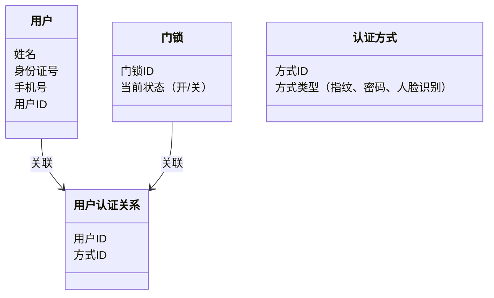

                 


# 智能门锁：AI Agent的多因素认证系统

> 关键词：智能门锁，多因素认证，AI Agent，算法原理，系统架构

> 摘要：本文详细探讨了智能门锁中AI Agent的多因素认证系统，从背景介绍、核心概念、算法原理、系统架构到项目实战，全面解析了该系统的实现与应用。通过本文，读者将深入了解如何利用AI技术提升智能门锁的安全性与智能化水平。

---

# 第一部分: 智能门锁与AI Agent的背景介绍

## 第1章: 智能门锁的现状与发展

### 1.1 智能门锁的定义与分类

#### 1.1.1 传统门锁的局限性
传统门锁主要依赖机械钥匙或简单的密码，存在以下问题：
- 容易被复制或破解。
- 密码管理复杂，容易遗忘或泄露。
- 无法记录开锁记录，缺乏数据分析能力。

#### 1.1.2 智能门锁的定义
智能门锁是一种结合了物联网、人工智能和密码学技术的电子锁具，能够通过多种认证方式（如指纹、密码、卡片、手机APP等）实现门锁的开启和管理。

#### 1.1.3 智能门锁的分类与应用场景
智能门锁可以根据认证方式和功能分为以下几类：
- **单一认证型**：仅支持一种认证方式（如指纹或密码）。
- **多因素认证型**：支持多种认证方式的结合使用。
- **智能联动型**：能够与其他智能家居设备联动（如智能门锁与智能灯光、安防系统联动）。

应用场景包括家庭、办公场所、酒店、公共场所等。

### 1.2 多因素认证的必要性

#### 1.2.1 单一认证方式的不足
单一认证方式存在以下问题：
- **安全性低**：容易被破解或复制。
- **用户体验差**：用户需要记忆多个密码，或随身携带钥匙，不方便。
- **管理复杂**：一旦钥匙丢失或密码泄露，需要重新配置。

#### 1.2.2 多因素认证的优势
多因素认证通过结合多种认证方式，显著提升了安全性：
- **安全性高**：攻击者需要同时破解多种认证方式，难度极大。
- **用户体验好**：用户可以根据自身需求选择多种认证方式，提升便利性。
- **管理方便**：可以通过后台集中管理多种认证方式，方便添加或删除用户。

#### 1.2.3 多因素认证在智能门锁中的应用
在智能门锁中，多因素认证可以通过以下方式实现：
- **指纹 + 密码**：用户需要同时提供指纹和密码才能开门。
- **卡片 + 手机APP**：用户需要使用卡片刷卡或通过手机APP验证才能开门。
- **人脸识别 + 指纹**：用户需要同时通过人脸识别和指纹验证才能开门。

### 1.3 AI Agent在智能门锁中的作用

#### 1.3.1 AI Agent的基本概念
AI Agent（智能代理）是一种能够感知环境并自主决策的智能实体。它能够根据当前环境信息和任务目标，自主选择最优的行为策略。

#### 1.3.2 AI Agent在智能门锁中的应用场景
AI Agent在智能门锁中的应用主要体现在以下几个方面：
- **认证决策**：AI Agent可以根据用户的认证信息（如指纹、密码、人脸识别等）和历史行为数据，自主决策是否允许用户开门。
- **异常检测**：AI Agent可以通过分析用户的认证行为和时间，检测是否存在异常行为（如非法入侵）。
- **行为分析**：AI Agent可以记录和分析用户的开门记录，优化认证策略，提升安全性。

#### 1.3.3 AI Agent与多因素认证的结合
通过结合多因素认证，AI Agent能够更高效地进行认证决策：
- **多因素融合**：AI Agent可以将多种认证方式的信息进行融合，综合判断用户的合法性。
- **动态调整**：根据用户的认证行为和环境信息，动态调整认证策略，提升安全性。

---

## 第2章: 多因素认证系统的核心概念

### 2.1 多因素认证的定义与特点

#### 2.1.1 多因素认证的定义
多因素认证（Multi-Factor Authentication，MFA）是指通过结合两种或多种不同的认证方式来验证用户身份的过程。常见的认证方式包括：
- **知识因素**：如密码、 PIN 码。
- **拥有因素**：如智能卡、手机APP。
- **生物因素**：如指纹、虹膜、人脸识别。

#### 2.1.2 多因素认证的特点
- **安全性高**：攻击者需要同时掌握多种认证信息才能通过认证。
- **灵活性强**：可以根据需求灵活选择和组合不同的认证方式。
- **智能化**：可以通过AI技术动态调整认证策略，提升安全性。

### 2.2 AI Agent在多因素认证中的角色

#### 2.2.1 AI Agent的智能性
AI Agent通过感知环境信息和用户行为，能够自主决策并执行任务。在多因素认证系统中，AI Agent可以：
- **分析用户的认证信息**：通过指纹、密码、人脸识别等多种方式验证用户身份。
- **判断用户的合法性**：结合历史数据和实时行为，判断用户是否合法。
- **动态调整认证策略**：根据环境和用户行为变化，优化认证策略。

#### 2.2.2 AI Agent的自主决策能力
AI Agent的核心能力在于自主决策。在多因素认证系统中，AI Agent可以根据以下信息自主决策：
- **用户的认证信息**：指纹、密码、人脸识别结果等。
- **历史行为数据**：用户的开门记录、认证失败记录等。
- **环境信息**：时间、地点、天气等。

#### 2.2.3 AI Agent的安全性保障
AI Agent通过以下方式保障安全性：
- **数据加密**：对用户的认证信息和行为数据进行加密存储和传输。
- **行为分析**：通过分析用户的认证行为，识别异常行为并及时报警。
- **动态验证**：根据用户的认证行为和环境信息，动态调整认证策略。

### 2.3 多因素认证系统的核心要素对比

#### 2.3.1 不同认证方式的优缺点对比
以下是对常见认证方式的优缺点对比：

| 认证方式 | 优点 | 缺点 |
|----------|------|------|
| 指纹认证 | 高安全性，不易被复制 | 易受环境影响（如指纹脏污） |
| 密码认证 | 易用性高，成本低 | 安全性低，容易被猜测或破解 |
| 卡片认证 | 方便携带，安全性较高 | 易丢失，容易被复制 |
| 人脸识别 | 非接触式，用户体验好 | 易受光线、角度影响，成本较高 |

#### 2.3.2 多因素认证系统的ER实体关系图

```mermaid
er
actor: 用户
role: 角色
actor --> role: 用户属于角色
role --> door_lock: 角色拥有门锁
role --> authentication_method: 角色拥有认证方式
authentication_method --> door_lock: 认证方式属于门锁
```

---

## 第3章: 多因素认证系统的算法原理

### 3.1 AI Agent的决策算法

#### 3.1.1 基于规则的决策算法
基于规则的决策算法是一种简单的决策方法，通过预定义的规则进行判断。例如：
- 规则1：如果用户输入的密码正确且指纹匹配，则允许开门。
- 规则2：如果用户输入的密码错误，则拒绝开门。

#### 3.1.2 基于概率的决策算法
基于概率的决策算法通过计算用户身份的概率，决定是否允许开门。例如：
- 使用贝叶斯定理计算用户身份的概率：
  $$ P(\text{合法}|指纹=\text{匹配}, 密码=\text{正确}) = \frac{P(\text{指纹匹配}) \cdot P(\text{密码正确}) \cdot P(\text{合法})}{P(\text{指纹匹配} \& \text{密码正确})} $$

#### 3.1.3 基于机器学习的决策算法
基于机器学习的决策算法通过训练模型来判断用户身份。例如：
- 使用决策树或随机森林模型，根据用户的认证信息（如指纹、密码、人脸识别结果）进行分类。

### 3.2 多因素认证的融合算法

#### 3.2.1 基于加权和的融合算法
基于加权和的融合算法将不同认证方式的得分进行加权求和，判断总分是否超过阈值。例如：
$$ \text{总分} = w_1 \cdot \text{指纹得分} + w_2 \cdot \text{密码得分} $$
其中，$w_1$ 和 $w_2$ 是权重系数。

#### 3.2.2 基于决策树的融合算法
基于决策树的融合算法通过构建决策树，根据用户的认证信息进行分类。例如：
- 决策树节点：指纹匹配？
- 子节点：是 -> 密码正确？
- 终叶节点：允许开门或拒绝开门。

#### 3.2.3 基于神经网络的融合算法
基于神经网络的融合算法通过深度学习模型（如卷积神经网络）对用户的认证信息进行分类。例如：
- 输入：指纹图像和密码字符串。
- 输出：用户身份的分类结果（合法或非法）。

### 3.3 算法实现的数学模型

#### 3.3.1 贝叶斯定理的应用
贝叶斯定理用于计算用户身份的概率：
$$ P(\text{合法}|指纹=\text{匹配}, 密码=\text{正确}) = \frac{P(\text{指纹匹配}|\text{合法}) \cdot P(\text{密码正确}|\text{合法}) \cdot P(\text{合法})}{P(\text{指纹匹配} \& \text{密码正确})} $$

#### 3.3.2 逻辑回归模型
逻辑回归模型用于分类用户身份：
$$ P(\text{合法}|x) = \frac{1}{1 + e^{-\beta x}} $$
其中，$x$ 是用户的认证信息，$\beta$ 是模型参数。

#### 3.3.3 支持向量机模型
支持向量机模型用于分类用户身份：
$$ y = \text{sign}(\beta \cdot x + b) $$
其中，$x$ 是用户的认证信息，$\beta$ 是模型参数，$b$ 是偏置项。

---

## 第4章: 多因素认证系统的数学模型与公式

### 4.1 认证概率计算公式

#### 4.1.1 贝叶斯定理的应用
假设我们有以下先验概率：
- $P(\text{合法}) = 0.99$（用户身份合法的概率）。
- $P(\text{指纹匹配}|\text{合法}) = 0.95$（合法用户指纹匹配的概率）。
- $P(\text{指纹匹配}|\text{非法}) = 0.05$（非法用户指纹匹配的概率）。
- $P(\text{密码正确}|\text{合法}) = 0.95$（合法用户密码正确的概率）。
- $P(\text{密码正确}|\text{非法}) = 0.05$（非法用户密码正确的概率）。

计算合法用户在指纹匹配且密码正确的概率：
$$ P(\text{合法}|指纹=\text{匹配}, 密码=\text{正确}) = \frac{P(\text{指纹匹配}|\text{合法}) \cdot P(\text{密码正确}|\text{合法}) \cdot P(\text{合法})}{P(\text{指纹匹配} \& \text{密码正确})} $$

---

# 第二部分: 系统分析与架构设计

## 第5章: 系统分析与架构设计方案

### 5.1 问题场景介绍

#### 5.1.1 项目背景
本项目旨在设计一个基于AI Agent的多因素认证智能门锁系统，提升门锁的安全性和智能化水平。

#### 5.1.2 系统目标
- 实现指纹、密码和人脸识别等多种认证方式的结合。
- 通过AI Agent动态调整认证策略，提升安全性。
- 提供用户友好的管理界面，方便管理用户的认证信息。

### 5.2 项目介绍

#### 5.2.1 系统功能设计
- 用户管理：添加、删除、修改用户信息。
- 认证管理：配置多种认证方式，动态调整认证策略。
- 开门记录：记录用户的开门记录，提供数据分析功能。

#### 5.2.2 系统功能设计的领域模型类图



#### 5.2.3 系统架构设计


#### 5.2.4 接口设计
- 用户端接口：提供指纹采集、密码输入、人脸识别等功能。
- 管理端接口：提供用户管理、认证方式配置、开门记录查询等功能。
- AI Agent接口：提供认证决策、异常检测等功能。

#### 5.2.5 交互设计

```mermaid
sequenceDiagram
    客户端 -> 门锁: 发送认证请求
    门锁 -> AI Agent: 提交认证信息
    AI Agent -> 数据库: 查询用户信息
    平行
    AI Agent -> 认证模块: 进行认证
    认证模块 -> AI Agent: 返回认证结果
    AI Agent -> 门锁: 控制门锁状态
    门锁 -> 客户端: 返回开门结果
```

---

## 第6章: 项目实战

### 6.1 环境安装与配置

#### 6.1.1 安装Python环境
- 安装Python 3.x
- 安装pip包管理工具

#### 6.1.2 安装依赖库
- 安装PyTorch、TensorFlow等深度学习框架。
- 安装scikit-learn、numpy等机器学习库。

### 6.2 系统核心功能实现

#### 6.2.1 AI Agent实现
- 使用Python编写AI Agent，实现认证决策功能。
- 示例代码：

```python
import numpy as np
from sklearn.tree import DecisionTreeClassifier

# 示例数据
X = np.array([[1, 0], [0, 1], [1, 1], [0, 0]])  # 特征向量
y = np.array([0, 1, 1, 0])  # 标签（0表示非法，1表示合法）

# 训练决策树模型
model = DecisionTreeClassifier()
model.fit(X, y)

# 预测新的样本
new_sample = np.array([[1, 1]])
predicted = model.predict(new_sample)
print(predicted)  # 输出：[1]
```

#### 6.2.2 多因素认证实现
- 实现指纹、密码、人脸识别等多种认证方式的结合。
- 示例代码：

```python
import cv2

# 示例指纹识别代码
def fingerprint_auth(fingerprint_image):
    # 使用OpenCV进行指纹识别
    # （实际实现需要指纹识别算法，如Gabor滤波器等）
    return True  # 表示指纹匹配成功

# 示例密码验证代码
def password_auth(password):
    # 简单的密码验证
    if password == "1234":
        return True
    else:
        return False

# 示例人脸识别代码
def face_auth(face_image):
    # 使用OpenCV进行人脸识别
    # （实际实现需要人脸识别算法，如PCA或深度学习模型）
    return True  # 表示人脸识别成功
```

#### 6.2.3 认证结果融合
- 根据不同的认证方式得分，进行加权融合。
- 示例代码：

```python
def multi_factor_auth(fingerprint_score, password_score, face_score, weights):
    total_score = weights[0] * fingerprint_score + weights[1] * password_score + weights[2] * face_score
    if total_score > 0.5:
        return True
    else:
        return False

# 示例权重
weights = [0.5, 0.3, 0.2]
result = multi_factor_auth(0.9, 0.8, 0.7, weights)
print(result)  # 输出：True
```

### 6.3 项目小结

---

## 第7章: 优化建议与最佳实践

### 7.1 优化建议

#### 7.1.1 算法优化
- 使用更复杂的深度学习模型（如ResNet、Inception）进行认证。
- 增加特征工程，提升模型的准确率。

#### 7.1.2 系统优化
- 优化AI Agent的决策算法，提升认证速度。
- 增加系统的容错能力，防止网络中断等问题。

#### 7.1.3 安全性优化
- 加强数据加密，防止数据泄露。
- 增加异常检测，防止攻击。

### 7.2 最佳实践

#### 7.2.1 系统设计
- 系统设计应模块化，方便扩展和维护。
- 使用成熟的第三方库（如scikit-learn、TensorFlow）进行算法实现。

#### 7.2.2 开发规范
- 遵循代码规范，提高代码可读性。
- 注重异常处理，确保系统稳定运行。

#### 7.2.3 测试与验证
- 进行充分的测试，确保系统稳定性和安全性。
- 通过实际案例验证系统性能。

### 7.3 注意事项

#### 7.3.1 数据安全
- 加强数据加密，防止用户数据泄露。
- 定期备份数据，防止数据丢失。

#### 7.3.2 系统维护
- 定期更新系统，修复漏洞。
- 监控系统运行状态，及时处理异常。

#### 7.3.3 用户教育
- 提供用户手册，指导用户正确使用系统。
- 提供培训，提升用户的使用能力。

### 7.4 拓展阅读

#### 7.4.1 相关技术
- 深度学习在智能门锁中的应用
- 多因素认证在其他领域的应用

#### 7.4.2 研究热点
- 基于AI的动态认证策略
- 多模态认证技术的研究进展

#### 7.4.3 未来趋势
- 更高的安全性：通过引入量子计算等技术，提升认证安全性。
- 更智能的AI Agent：通过强化学习等技术，提升AI Agent的自主决策能力。

---

## 第8章: 小结与展望

### 8.1 小结
本文详细探讨了智能门锁中的AI Agent多因素认证系统，从背景介绍、核心概念、算法原理到系统架构和项目实战，全面解析了该系统的实现与应用。通过本文，读者可以深入了解如何利用AI技术提升智能门锁的安全性和智能化水平。

### 8.2 展望
未来，随着AI技术的不断发展，智能门锁的多因素认证系统将更加智能化和安全化。以下是未来可能的发展方向：
1. **基于强化学习的动态认证策略**：通过强化学习，动态调整认证策略，提升安全性。
2. **多模态认证技术的研究**：结合多种生物特征（如指纹、虹膜、人脸识别等），提升认证精度。
3. **智能化的AI Agent**：通过强化学习和自适应算法，提升AI Agent的自主决策能力。

---

# 作者：AI天才研究院/AI Genius Institute & 禅与计算机程序设计艺术 /Zen And The Art of Computer Programming

