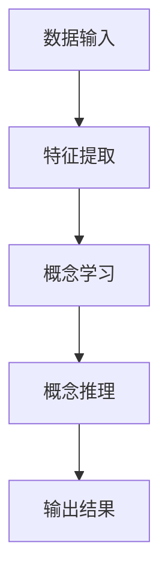

                 


# 构建具有概念学习能力的AI Agent

> 关键词：概念学习，AI Agent，算法原理，系统架构，项目实战

> 摘要：本文详细探讨了构建具有概念学习能力的AI Agent的全过程，从背景介绍、核心概念与联系、算法原理、系统分析与架构设计，到项目实战和最佳实践。文章结合理论与实践，通过丰富的案例和详细的代码实现，帮助读者全面理解并掌握如何构建具备概念学习能力的AI Agent。

---

# 第一部分: 概念学习与AI Agent基础

## 第1章: 概念学习的背景与问题背景

### 1.1 概念学习的背景

#### 1.1.1 人工智能与概念学习的关联
概念学习是人工智能领域的重要研究方向，它涉及如何让AI系统从数据中发现和理解抽象概念。随着深度学习和自然语言处理技术的快速发展，概念学习在AI Agent中的应用日益广泛。

#### 1.1.2 当前AI Agent的发展现状
AI Agent作为一种智能体，广泛应用于推荐系统、对话系统和自动驾驶等领域。然而，现有的AI Agent大多依赖于规则或特定任务的训练数据，缺乏对抽象概念的自适应学习能力。

#### 1.1.3 概念学习在AI Agent中的重要性
概念学习能够帮助AI Agent理解数据中的深层结构，从而提升其泛化能力和适应性。通过概念学习，AI Agent可以更好地处理复杂任务，如语义理解、知识推理等。

### 1.2 问题背景与问题描述

#### 1.2.1 概念学习的核心问题
概念学习的核心问题是如何从数据中发现和表示抽象概念。这需要解决数据特征提取、概念表示和概念推理等一系列问题。

#### 1.2.2 AI Agent面临的挑战
AI Agent在实际应用中面临数据稀疏性、概念漂移和多任务学习等挑战。概念学习能够帮助AI Agent更好地应对这些挑战。

#### 1.2.3 概念学习与AI Agent结合的必要性
通过将概念学习与AI Agent结合，可以提升AI Agent的通用性和适应性，使其能够更好地理解和处理复杂场景。

### 1.3 问题解决与边界定义

#### 1.3.1 概念学习如何解决AI Agent的问题
概念学习通过提取数据中的抽象特征，帮助AI Agent更好地理解输入数据，并能够根据这些理解进行推理和决策。

#### 1.3.2 AI Agent概念学习的边界与外延
概念学习的边界包括数据范围、任务目标和应用场景。其外延则涉及知识图谱构建、多模态学习等领域。

#### 1.3.3 概念学习与AI Agent的相互作用
概念学习为AI Agent提供知识表示和推理能力，而AI Agent则为概念学习提供丰富的应用场景和反馈。

### 1.4 概念结构与核心要素

#### 1.4.1 概念学习的基本结构
概念学习的基本结构包括数据输入、特征提取、概念表示和概念推理。

#### 1.4.2 AI Agent的核心要素
AI Agent的核心要素包括感知能力、决策能力和执行能力。

#### 1.4.3 概念学习与AI Agent的结合模型
结合模型包括数据流模型、知识图谱模型和强化学习模型。

### 1.5 本章小结
本章从背景、问题背景、问题解决和边界定义四个方面详细介绍了概念学习与AI Agent的关系，为后续章节的深入分析奠定了基础。

---

## 第2章: 概念学习的核心概念与联系

### 2.1 概念学习的核心原理

#### 2.1.1 概念学习的定义与原理
概念学习是一种通过数据发现和表示抽象概念的学习方法。其核心原理包括特征提取、概念表示和概念推理。

#### 2.1.2 AI Agent的核心概念
AI Agent的核心概念包括感知、决策和执行能力。这些能力通过概念学习得以增强。

#### 2.1.3 概念学习与AI Agent的联系
概念学习为AI Agent提供知识表示和推理能力，而AI Agent则为概念学习提供应用场景和反馈。

### 2.2 概念学习的属性特征对比

#### 2.2.1 概念学习的属性分析
概念学习的属性包括特征性、抽象性和可解释性。

#### 2.2.2 AI Agent的属性分析
AI Agent的属性包括智能性、自主性和交互性。

#### 2.2.3 概念学习与AI Agent的属性对比表
| 属性 | 概念学习 | AI Agent |
|------|----------|----------|
| 特征性 | 是       | 是       |
| 抽象性 | 是       | 是       |
| 可解释性 | 是       | 否       |

### 2.3 概念学习的ER实体关系图架构

```mermaid
erDiagram
    CONCEPT{
        <name> 概念
        <type> 概念
    }
    AIAGENT{
        <name> AI Agent
        <type> Agent
    }
    CONCEPT之间的关系 : 关联
    AIAGENT之间的关系 : 聚合
```

### 2.4 概念学习的数学模型

#### 2.4.1 概念学习的基本数学模型
$$
C = f(X)
$$
其中，$C$ 是概念，$X$ 是输入数据，$f$ 是概念学习模型。

#### 2.4.2 概念学习的优化算法
$$
\min_{f} \sum_{i=1}^n (f(x_i) - y_i)^2
$$
其中，$x_i$ 是输入数据，$y_i$ 是目标概念。

### 2.5 概念学习的算法流程

#### 2.5.1 数据预处理
- 数据清洗
- 特征标准化

#### 2.5.2 特征提取
- 主成分分析（PCA）
- 词袋模型（Bag of Words）

#### 2.5.3 模型训练
- 支持向量机（SVM）
- 神经网络（Neural Networks）

#### 2.5.4 模型评估
- 准确率
- 召回率

### 2.6 本章小结
本章从核心概念、属性特征和数学模型等方面详细介绍了概念学习，为后续章节的算法实现奠定了基础。

---

## 第3章: 概念学习的算法原理

### 3.1 概念学习的算法概述

#### 3.1.1 监督学习与概念学习
监督学习通过标记数据训练模型，概念学习则通过无监督或半监督学习发现概念。

#### 3.1.2 无监督学习与概念学习
无监督学习通过聚类发现数据中的概念结构。

#### 3.1.3 强化学习与概念学习
强化学习通过奖励机制优化概念学习模型。

### 3.2 概念学习的数学模型

#### 3.2.1 概念学习的基本数学模型
$$
C = f(X)
$$

#### 3.2.2 概念学习的优化算法
$$
\min_{f} \sum_{i=1}^n (f(x_i) - y_i)^2
$$

#### 3.2.3 概念学习的评估指标
- 准确率
- 召回率
- F1分数

### 3.3 概念学习的属性特征分析

#### 3.3.1 概念学习的特征提取
- PCA
- LDA

#### 3.3.2 概念学习的特征选择
- 信息增益
- 卡方检验

#### 3.3.3 概念学习的特征工程
- 文本处理
- 图像处理

### 3.4 概念学习的算法流程

#### 3.4.1 数据预处理
- 清洗
- 标准化

#### 3.4.2 特征提取
- PCA
- Word2Vec

#### 3.4.3 模型训练
- SVM
- K-Means

#### 3.4.4 模型评估
- K折交叉验证
- ROC曲线

### 3.5 概念学习的算法实现

#### 3.5.1 算法实现的代码框架
```python
def concept_learning_algorithm(X, y):
    # 数据预处理
    # 特征提取
    # 模型训练
    # 模型评估
    return model
```

#### 3.5.2 算法实现的详细步骤
1. 数据预处理：清洗和标准化数据。
2. 特征提取：使用PCA提取主成分。
3. 模型训练：训练SVM分类器。
4. 模型评估：计算准确率和召回率。

#### 3.5.3 算法实现的注意事项
- 数据分布要均衡。
- 特征选择要合理。
- 模型调参要充分。

### 3.6 本章小结
本章详细介绍了概念学习的算法原理和实现流程，为后续章节的系统设计奠定了基础。

---

## 第4章: 概念学习的系统分析与架构设计

### 4.1 系统分析

#### 4.1.1 问题场景介绍
AI Agent需要通过概念学习理解输入数据中的抽象概念。

#### 4.1.2 需求分析
- 实时性
- 可扩展性
- 可解释性

#### 4.1.3 系统功能设计
- 数据输入接口
- 特征提取模块
- 概念学习模块
- 概念推理模块

### 4.2 系统架构设计

#### 4.2.1 系统架构图


#### 4.2.2 系统组件
- 数据预处理组件
- 特征提取组件
- 模型训练组件
- 模型推理组件

#### 4.2.3 系统接口设计
- 输入接口：接收原始数据。
- 输出接口：返回学习结果。
- 调用接口：提供API供其他系统调用。

#### 4.2.4 系统交互流程
1. 数据输入
2. 特征提取
3. 模型训练
4. 模型推理
5. 输出结果

### 4.3 系统实现

#### 4.3.1 系统实现的代码框架
```python
class ConceptLearningSystem:
    def __init__(self):
        self.feature_extractor = FeatureExtractor()
        self.concept_learner = ConceptLearner()
    
    def process_data(self, data):
        features = self.feature_extractor.extract_features(data)
        result = self.concept_learner.learn_concepts(features)
        return result
```

#### 4.3.2 系统实现的详细步骤
1. 初始化系统组件。
2. 接收输入数据。
3. 提取特征。
4. 学习概念。
5. 返回结果。

#### 4.3.3 系统实现的注意事项
- 确保数据预处理的正确性。
- 选择合适的特征提取方法。
- 调优模型参数以提高性能。

### 4.4 本章小结
本章从系统分析到架构设计，详细介绍了概念学习系统的实现过程，为后续章节的项目实战奠定了基础。

---

## 第5章: 项目实战

### 5.1 环境安装

#### 5.1.1 系统环境
- Python 3.8+
- PyTorch 1.9+
- Scikit-learn 0.24+

#### 5.1.2 安装依赖
```bash
pip install numpy scikit-learn torch
```

### 5.2 核心代码实现

#### 5.2.1 数据预处理
```python
import numpy as np
from sklearn.preprocessing import StandardScaler

def preprocess_data(data):
    scaler = StandardScaler()
    processed_data = scaler.fit_transform(data)
    return processed_data
```

#### 5.2.2 特征提取
```python
from sklearn.decomposition import PCA

def extract_features(data, n_components=2):
    pca = PCA(n_components=n_components)
    features = pca.fit_transform(data)
    return features
```

#### 5.2.3 模型训练
```python
from sklearn.svm import SVC
from sklearn.metrics import accuracy_score

def train_model(features, labels):
    model = SVC()
    model.fit(features, labels)
    return model

def evaluate_model(model, features, labels):
    predictions = model.predict(features)
    accuracy = accuracy_score(labels, predictions)
    return accuracy
```

### 5.3 案例分析

#### 5.3.1 数据集选择
使用MNIST手写数字数据集。

#### 5.3.2 数据处理
```python
from sklearn.datasets import fetch_openml
import numpy as np

# 加载数据集
mnist = fetch_openml('mnist_789')
X = mnist['data'].astype(np.float32)
y = mnist['target'].astype(np.int64)
```

#### 5.3.3 模型训练与评估
```python
# 数据预处理
processed_X = preprocess_data(X)

# 特征提取
features = extract_features(processed_X, n_components=2)

# 模型训练
model = train_model(features, y)

# 模型评估
accuracy = evaluate_model(model, features, y)
print(f"模型准确率：{accuracy}")
```

### 5.4 本章小结
本章通过实际案例展示了概念学习系统的实现过程，从环境安装到代码实现，帮助读者掌握概念学习的实际应用。

---

## 第6章: 最佳实践与小结

### 6.1 最佳实践

#### 6.1.1 系统设计
- 确保系统的可扩展性。
- 选择合适的特征提取方法。
- 调优模型参数。

#### 6.1.2 代码实现
- 使用模块化设计。
- 注重代码的可读性。
- 加强异常处理。

### 6.2 小结
概念学习是构建智能AI Agent的核心技术，通过本文的介绍，读者可以全面了解概念学习的背景、原理、算法和实现。

### 6.3 注意事项
- 数据预处理要仔细。
- 模型调参要耐心。
- 系统测试要全面。

### 6.4 拓展阅读
- 《Deep Learning》
- 《Pattern Recognition and Machine Learning》

---

# 作者：AI天才研究院/AI Genius Institute & 禅与计算机程序设计艺术 /Zen And The Art of Computer Programming

---

以上是《构建具有概念学习能力的AI Agent》的技术博客文章目录和部分正文内容，您可以根据需要进一步补充和调整。

