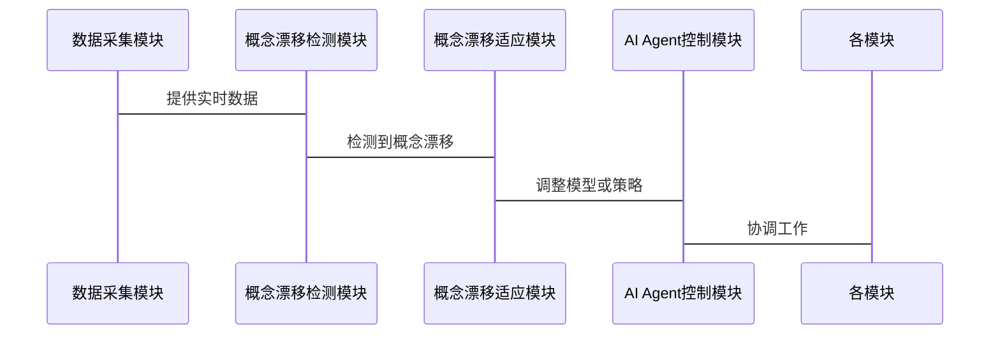

                 


# 设计AI Agent的概念漂移适应策略

**关键词**：AI Agent，概念漂移，适应策略，算法原理，系统架构，项目实战

**摘要**：本文探讨了AI Agent在动态数据环境中的概念漂移适应策略。首先介绍了概念漂移的定义、类型及其对AI Agent的影响。接着深入分析了概念漂移适应的核心算法原理，并通过数学模型和公式进行了详细解释。然后，设计了一个系统的架构方案，使用Mermaid图展示了模块交互和系统架构。最后，通过电商用户行为预测的实战案例，详细讲解了环境配置、数据处理、模型训练及部署，总结了最佳实践和注意事项。

---

# 第一部分: AI Agent的概念漂移适应策略背景与核心概念

## 第1章: 概念漂移与AI Agent概述

### 1.1 问题背景与概念结构

#### 1.1.1 概念漂移的定义与问题背景

概念漂移是指数据分布的变化导致模型性能下降的现象。在动态环境中，数据特征可能随时间变化，例如用户行为、市场趋势等。AI Agent需要实时适应这些变化，以维持其性能。

#### 1.1.2 AI Agent的核心概念与组成

AI Agent是一个智能体，能够感知环境、执行任务并做出决策。它通常由感知模块、推理模块和执行模块组成。AI Agent需要具备自适应能力，以应对概念漂移。

#### 1.1.3 概念漂移适应策略的重要性

概念漂移适应策略使AI Agent能够检测到数据分布的变化，并采取措施维持性能。这对于实时系统尤为重要，例如金融交易、医疗诊断等领域。

---

### 1.2 概念漂移的类型与特征

#### 1.2.1 渐进式漂移与突然式漂移的对比

渐进式漂移是数据分布缓慢变化，突然式漂移是数据分布突然变化。这两种类型对AI Agent的影响不同，需要不同的适应策略。

#### 1.2.2 概念漂移的检测特征与挑战

概念漂移的检测特征包括数据分布变化、性能下降等。挑战在于如何高效检测漂移，并采取适当的适应措施。

#### 1.2.3 概念漂移与数据分布变化的关系

概念漂移是数据分布变化的表现形式，数据分布变化可能导致模型性能下降。

---

### 1.3 AI Agent的基本原理与功能

#### 1.3.1 AI Agent的定义与分类

AI Agent是一个智能体，能够感知环境、执行任务并做出决策。分类包括基于规则的Agent、基于模型的Agent和基于学习的Agent。

#### 1.3.2 AI Agent的核心功能与能力

AI Agent具备感知能力、推理能力、决策能力和自适应能力。自适应能力使其能够应对概念漂移。

#### 1.3.3 AI Agent与概念漂移适应的关系

AI Agent需要具备概念漂移适应能力，以在动态环境中维持性能。

---

## 第2章: 概念漂移适应的核心概念与联系

### 2.1 概念漂移适应的原理与机制

#### 2.1.1 概念漂移适应的基本原理

概念漂移适应通过检测数据分布变化，并调整模型或策略来应对变化。基本原理包括检测漂移、触发适应机制和评估适应效果。

#### 2.1.2 概念漂移适应的实现机制

实现机制包括增量学习、动态权重调整和模型重训练。每种机制都有其优缺点，适用于不同的场景。

#### 2.1.3 概念漂移适应与AI Agent的结合

AI Agent通过集成概念漂移适应机制，能够实时检测和应对数据分布变化。

---

### 2.2 核心概念对比与ER实体关系图

#### 2.2.1 概念漂移与数据变化的对比分析

概念漂移是数据变化的一种形式，但数据变化可能还包括其他形式，如数据噪声增加。

#### 2.2.2 AI Agent与传统机器学习模型的对比

AI Agent具备动态适应能力，而传统机器学习模型通常需要重新训练才能应对数据变化。

#### 2.2.3 概念漂移适应策略的ER实体关系图

```mermaid
erd
    entity 概念漂移适应策略 {
        id (int,PK)
        检测方法 (string)
        适应方法 (string)
        应用场景 (string)
    }
    entity 数据分布变化 {
        id (int,PK)
        数据特征 (string)
        数据来源 (string)
        时间戳 (datetime)
    }
    entity AI Agent {
        id (int,PK)
        感知模块 (string)
        推理模块 (string)
        执行模块 (string)
    }
    概念漂移适应策略 -- 数据分布变化 : 监测并适应
    概念漂移适应策略 -- AI Agent : 集成策略
```

---

# 第二部分: 概念漂移适应的算法原理与数学模型

## 第3章: 概念漂移适应的核心算法原理

### 3.1 概念漂移检测算法

#### 3.1.1 基于统计的方法

基于统计的方法通过比较数据分布的统计量来检测漂移。例如，使用均值和方差的变化来判断数据分布是否变化。

#### 3.1.2 基于分布的方法

基于分布的方法通过比较数据分布的相似性来检测漂移。例如，使用Kullback-Leibler散度来衡量两个分布之间的差异。

#### 3.1.3 基于模型的方法

基于模型的方法通过训练模型来检测数据分布的变化。例如，使用时间序列模型预测数据分布的变化。

---

### 3.2 概念漂移适应算法

#### 3.2.1 增量学习算法

增量学习算法通过逐步更新模型参数来适应数据分布的变化。例如，使用在线学习算法更新分类器。

#### 3.2.2 动态权重调整算法

动态权重调整算法通过调整模型的权重来适应数据分布的变化。例如，使用集成学习方法，赋予新数据更高的权重。

#### 3.2.3 模型重训练算法

模型重训练算法通过重新训练模型来适应数据分布的变化。例如，定期收集新数据，重新训练分类器。

---

## 第4章: 概念漂移适应的数学模型与公式

### 4.1 概念漂移检测的数学模型

#### 4.1.1 基于统计的漂移检测公式

假设我们有两个数据集，$D_1$和$D_2$，分别来自两个分布$P_1$和$P_2$。我们可以使用卡方检验来检测数据分布的变化：

$$
\chi^2 = \sum_{i} \frac{(O_i - E_i)^2}{E_i}
$$

其中，$O_i$是观测频数，$E_i$是期望频数。

#### 4.1.2 基于分布的漂移检测公式

Kullback-Leibler散度用于衡量两个概率分布之间的差异：

$$
D_{KL}(P_1 || P_2) = \sum_{i} P_1(i) \log \frac{P_1(i)}{P_2(i)}
$$

如果$D_{KL}$大于某个阈值，则认为数据分布发生了变化。

#### 4.1.3 基于模型的漂移检测公式

假设我们使用线性回归模型，漂移检测可以通过比较模型的预测误差的变化来实现。例如，使用均方误差（MSE）来衡量模型的预测准确性：

$$
MSE = \frac{1}{n}\sum_{i=1}^{n}(y_i - \hat{y}_i)^2
$$

如果MSE的变化超过某个阈值，则认为数据分布发生了变化。

---

### 4.2 概念漂移适应的数学模型

#### 4.2.1 增量学习的数学表达

假设我们有一个分类器$C$，在增量学习中，我们可以通过更新权重$w$来适应数据分布的变化：

$$
w_{t+1} = w_t + \eta (y_t - C(x_t, w_t))
$$

其中，$\eta$是学习率，$y_t$是真实标签，$C(x_t, w_t)$是模型的预测值。

#### 4.2.2 动态权重调整的数学模型

动态权重调整可以通过加权投票法来实现。假设我们有多个基模型，每个基模型的权重$w_i$根据其性能进行调整：

$$
w_i = w_i + \alpha (p_i - \bar{p})
$$

其中，$\alpha$是调整系数，$p_i$是基模型的性能，$\bar{p}$是平均性能。

#### 4.2.3 模型重训练的数学公式

模型重训练可以通过重新训练整个模型来适应数据分布的变化。例如，使用随机梯度下降（SGD）算法重新训练分类器：

$$
w_{t+1} = w_t - \eta \nabla L(w_t)
$$

其中，$L$是损失函数，$\nabla$是梯度符号。

---

# 第三部分: 系统分析与架构设计方案

## 第5章: 概念漂移适应系统的架构设计

### 5.1 系统功能设计

#### 5.1.1 概念漂移检测模块

概念漂移检测模块负责监测数据分布的变化，并触发适应机制。

#### 5.1.2 概念漂移适应模块

概念漂移适应模块负责调整模型或策略以应对数据分布的变化。

#### 5.1.3 AI Agent控制模块

AI Agent控制模块负责协调各模块的工作，确保系统正常运行。

---

### 5.2 系统架构设计

#### 5.2.1 分层架构设计

分层架构包括数据层、算法层和应用层。数据层负责数据处理，算法层负责概念漂移检测和适应，应用层负责与AI Agent的交互。

#### 5.2.2 微服务架构设计

微服务架构将系统分解为多个独立的服务，每个服务负责特定的功能，例如数据采集、模型训练和结果输出。

#### 5.2.3 系统组件

系统组件包括数据采集模块、概念漂移检测模块、概念漂移适应模块和AI Agent控制模块。

---

### 5.3 系统交互设计

#### 5.3.1 系统交互流程

1. 数据采集模块收集实时数据。
2. 概念漂移检测模块分析数据，判断是否发生概念漂移。
3. 如果发生概念漂移，触发适应机制，调整模型或策略。
4. AI Agent控制模块协调各模块的工作，确保系统正常运行。

#### 5.3.2 交互序列图



---

## 第6章: 项目实战与系统实现

### 6.1 项目实战：电商用户行为预测

#### 6.1.1 环境配置

安装必要的库：

```bash
pip install pandas numpy scikit-learn
```

#### 6.1.2 数据预处理

加载数据并进行预处理：

```python
import pandas as pd
import numpy as np
from sklearn.model_selection import train_test_split
from sklearn.ensemble import RandomForestClassifier
from sklearn.metrics import accuracy_score

# 加载数据
data = pd.read_csv('user_behavior.csv')

# 数据预处理
X = data.drop('label', axis=1)
y = data['label']

# 划分训练集和测试集
X_train, X_test, y_train, y_test = train_test_split(X, y, test_size=0.2)
```

#### 6.1.3 模型训练与部署

训练模型并进行预测：

```python
# 训练模型
model = RandomForestClassifier()
model.fit(X_train, y_train)

# 预测
y_pred = model.predict(X_test)

# 评估
print("Accuracy:", accuracy_score(y_test, y_pred))
```

#### 6.1.4 概念漂移检测与适应

实现概念漂移检测和适应：

```python
from sklearn.metrics import accuracy_score
import numpy as np

# 检测概念漂移
def detect_drift(X_train, X_test, y_train, y_test):
    model = RandomForestClassifier()
    model.fit(X_train, y_train)
    y_pred = model.predict(X_test)
    accuracy = accuracy_score(y_test, y_pred)
    if accuracy < 0.8:
        return True
    else:
        return False

# 适应概念漂移
def adapt_to_drift(X_train, X_test, y_train, y_test):
    # 增量学习
    new_X_train = X_test.iloc[:int(len(X_test)/2)]
    new_y_train = y_test.iloc[:int(len(y_test)/2)]
    model.fit(new_X_train, new_y_train)
    return model

# 应用概念漂移检测和适应
drift = detect_drift(X_train, X_test, y_train, y_test)
if drift:
    model = adapt_to_drift(X_train, X_test, y_train, y_test)
else:
    pass
```

#### 6.1.5 系统实现与代码解读

完整代码实现：

```python
import pandas as pd
import numpy as np
from sklearn.model_selection import train_test_split
from sklearn.ensemble import RandomForestClassifier
from sklearn.metrics import accuracy_score

# 加载数据
data = pd.read_csv('user_behavior.csv')

# 数据预处理
X = data.drop('label', axis=1)
y = data['label']

# 划分训练集和测试集
X_train, X_test, y_train, y_test = train_test_split(X, y, test_size=0.2)

# 训练模型
model = RandomForestClassifier()
model.fit(X_train, y_train)

# 预测
y_pred = model.predict(X_test)
print("Initial Accuracy:", accuracy_score(y_test, y_pred))

# 检测概念漂移
def detect_drift(X_train, X_test, y_train, y_test):
    model = RandomForestClassifier()
    model.fit(X_train, y_train)
    y_pred = model.predict(X_test)
    accuracy = accuracy_score(y_test, y_pred)
    if accuracy < 0.8:
        return True
    else:
        return False

# 适应概念漂移
def adapt_to_drift(X_train, X_test, y_train, y_test):
    new_X_train = X_test.iloc[:int(len(X_test)/2)]
    new_y_train = y_test.iloc[:int(len(y_test)/2)]
    model.fit(new_X_train, new_y_train)
    return model

# 应用概念漂移检测和适应
drift = detect_drift(X_train, X_test, y_train, y_test)
if drift:
    model = adapt_to_drift(X_train, X_test, y_train, y_test)
    y_pred = model.predict(X_test)
    print("After Adaptation Accuracy:", accuracy_score(y_test, y_pred))
else:
    print("No Drift Detected")
```

#### 6.1.6 实际案例分析

在电商用户行为预测中，概念漂移可能导致用户购买行为的变化。通过概念漂移适应策略，模型能够及时调整，提高预测准确性。

---

## 第7章: 最佳实践与系统小结

### 7.1 最佳实践

- 定期监控数据分布的变化，及时发现概念漂移。
- 根据具体场景选择合适的概念漂移检测和适应算法。
- 使用增量学习或动态权重调整等方法，提高模型的适应能力。

### 7.2 系统小结

概念漂移适应策略是AI Agent在动态环境中维持性能的关键。通过合理的算法设计和系统架构，可以有效应对概念漂移，提高系统的鲁棒性和适应性。

---

## 第8章: 注意事项与未来展望

### 8.1 注意事项

- 概念漂移检测的阈值设置需要根据具体场景调整。
- 模型适应策略的选择需要考虑计算资源和实时性要求。
- 系统架构设计需要确保各模块之间的高效协同。

### 8.2 未来展望

未来的研究方向包括更高效的漂移检测算法、更智能的模型适应策略以及更灵活的系统架构设计。

---

## 第9章: 拓展阅读与深入学习

### 9.1 拓展阅读

- "Data Stream Mining: Algorithms and Applications" by Jiawei Han, Jian Pei, and Yiwen Dai
- "Adaptive Stream Data Mining: Theory and Practice" by Mohammed Z. Zaki and Yu Yang

### 9.2 深入学习

建议读者深入研究增量学习、在线学习和自适应算法，以进一步提高对概念漂移适应策略的理解。

---

# 作者：AI天才研究院/AI Genius Institute & 禅与计算机程序设计艺术/Zen And The Art of Computer Programming

---

**本文由AI天才研究院倾心打造，转载请注明出处。**

---

**END**

