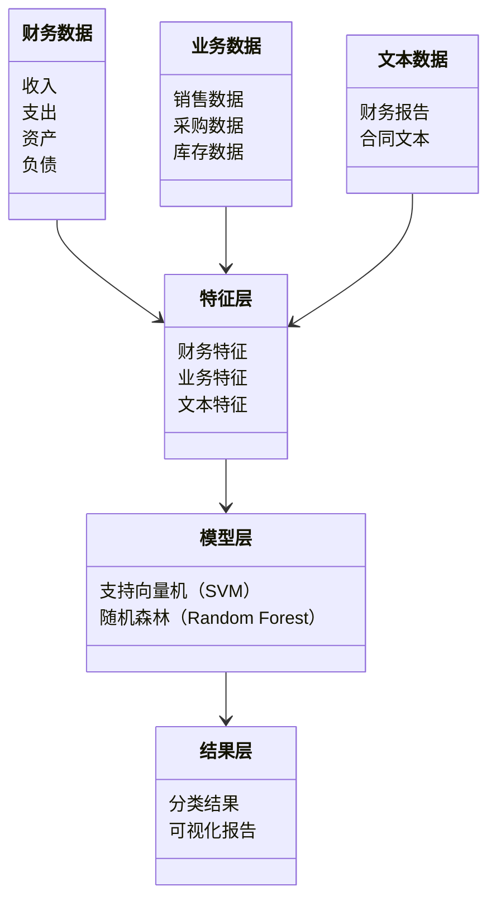
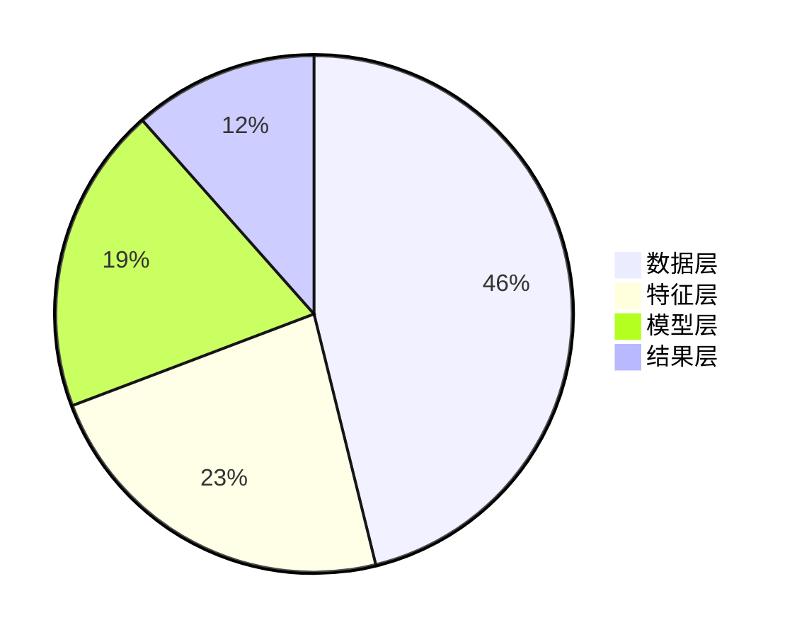
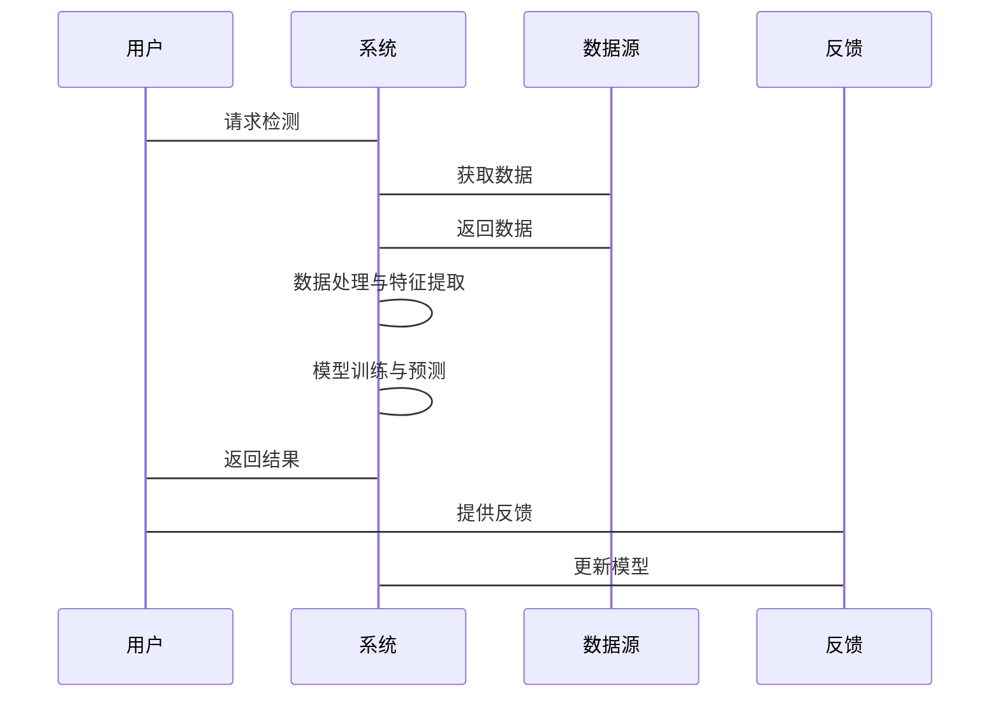

                 


# 设计智能化的企业财务报表舞弊检测系统

> 关键词：财务报表舞弊检测、人工智能、大数据分析、机器学习、系统架构设计

> 摘要：本文详细介绍了如何设计智能化的企业财务报表舞弊检测系统，从背景分析到系统架构设计，再到项目实战，逐步展开。文章首先分析了传统财务报表审计的局限性，引出智能化检测的必要性；然后详细讲解了系统的核心概念，包括数据采集与预处理、特征提取与分析、模型构建与训练以及结果分析；接着介绍了基于机器学习的舞弊检测算法，包括常见算法原理、数学模型和Python代码示例；之后设计了系统的架构，包括数据层、特征层、模型层和结果层，并用Mermaid流程图和序列图展示；最后通过项目实战，指导读者如何安装环境、编写代码、测试模型，并分析实际案例。

---

# 正文

## 第一章: 企业财务报表舞弊检测的背景与问题

### 1.1 财务报表舞弊的背景与现状

#### 1.1.1 财务报表舞弊的定义与特征

财务报表舞弊是指企业在编制财务报表时，通过虚构、隐瞒、虚假记载等手段，故意提供不真实或误导性的财务信息，以达到特定目的的行为。其主要特征包括：

- **虚构收入**：夸大收入规模，虚增利润。
- **隐瞒支出**：减少应披露的费用支出，虚增利润。
- **虚增资产**：通过虚增资产或低估负债来夸大企业实力。
- **关联交易**：利用关联交易转移利润或资产，掩盖真实财务状况。
- **财务造假**：通过伪造会计凭证、篡改财务数据等手段制造虚假财务报表。

#### 1.1.2 财务报表舞弊的常见手段

常见的财务报表舞弊手段包括：

- **虚增收入**：通过虚构交易或提前确认收入来虚增收入。
- **虚减费用**：通过隐瞒费用支出或推迟费用确认来虚增利润。
- **虚增资产**：通过虚增存货、应收账款等资产项目来夸大企业资产规模。
- **虚减负债**：通过隐瞒或推迟负债确认来降低负债比例。
- **关联交易 manipulation**：通过与关联方进行不公允的交易，转移利润或资产。

#### 1.1.3 企业财务报表舞弊的后果与影响

财务报表舞弊对企业及利益相关者造成严重后果：

- **投资者损失**：投资者基于虚假财务信息做出错误决策，导致投资损失。
- **债权人风险**：债权人无法准确评估企业信用状况，可能面临资金损失。
- **企业声誉受损**：财务舞弊行为暴露后，企业声誉受损，影响市场信任。
- **法律风险**：企业及相关人员可能面临法律追究和罚款。

### 1.2 传统财务报表审计的局限性

#### 1.2.1 传统审计方法的不足

传统财务报表审计方法存在以下问题：

- **人工审计效率低**：依赖审计人员手工检查财务数据，效率低下。
- **主观性较强**：审计结果很大程度上依赖审计人员的经验和判断，存在主观性。
- **难以应对海量数据**：随着企业数据量激增，传统审计方法难以处理海量数据。

#### 1.2.2 人工审计的低效性与主观性

人工审计的低效性主要体现在以下几个方面：

- **数据量大**：现代企业财务数据量庞大，人工审计难以在有限时间内完成。
- **信息不对称**：审计人员难以全面获取企业内部信息，导致审计结果可能存在偏差。
- **审计成本高**：人工审计需要投入大量的人力、物力和时间，成本较高。

#### 1.2.3 数据量激增对传统审计的挑战

随着企业业务规模的扩大和信息技术的发展，财务数据量呈指数级增长，传统审计方法难以应对：

- **数据来源多样化**：企业财务数据来源多样，包括ERP系统、财务报表、业务数据等，传统审计方法难以全面覆盖。
- **数据格式复杂**：数据格式多样，包括结构化数据和非结构化数据，人工处理难度大。
- **实时性要求高**：现代企业需要实时监控财务数据，传统审计方法难以满足实时性要求。

### 1.3 智能化财务报表检测的必要性

#### 1.3.1 大数据分析技术的发展

大数据分析技术的发展为企业财务报表检测提供了新的可能性：

- **数据挖掘技术**：通过数据挖掘技术可以从海量数据中发现潜在规律。
- **机器学习算法**：机器学习算法可以自动学习财务数据的特征，识别异常情况。
- **自然语言处理（NLP）**：NLP技术可以分析非结构化数据，如财务报告中的文字描述。

#### 1.3.2 人工智能技术在审计领域的应用潜力

人工智能技术在审计领域的应用潜力主要体现在以下几个方面：

- **自动化数据处理**：AI可以自动处理海量财务数据，提高审计效率。
- **模式识别**：AI可以通过模式识别发现财务数据中的异常模式。
- **预测分析**：AI可以基于历史数据预测未来的财务状况，提前发现潜在问题。

#### 1.3.3 智能化检测系统的优势与前景

智能化检测系统相比传统审计方法具有明显优势：

- **高效性**：AI系统可以快速处理海量数据，提高审计效率。
- **客观性**：AI系统基于数据进行分析，减少人为判断的主观性。
- **实时性**：AI系统可以实时监控财务数据，及时发现异常情况。
- **可扩展性**：AI系统可以轻松扩展到更多的数据源和业务场景。

### 1.4 本章小结

本章主要介绍了企业财务报表舞弊的背景与现状，分析了传统财务报表审计的局限性，提出了智能化财务报表检测的必要性。通过对比传统审计方法与智能化检测系统的优势，为后续系统设计奠定了理论基础。

---

## 第二章: 企业财务报表舞弊检测系统的核心概念

### 2.1 数据采集与预处理

#### 2.1.1 数据源的多样性

财务报表舞弊检测系统需要处理多种数据源：

- **财务数据**：包括收入、支出、资产、负债等财务数据。
- **业务数据**：包括销售数据、采购数据、库存数据等。
- **文本数据**：包括财务报告、合同文本、会议记录等非结构化数据。

#### 2.1.2 数据清洗与标准化

数据清洗与标准化是确保数据质量的重要步骤：

- **数据清洗**：去除重复数据、处理缺失值、纠正错误数据。
- **数据标准化**：将数据转换为统一的格式，便于后续处理。

#### 2.1.3 异常数据的识别与处理

异常数据识别是数据预处理的重要环节：

- **异常值检测**：通过统计方法或机器学习算法检测异常值。
- **异常数据处理**：根据检测结果，对异常数据进行标记或剔除。

### 2.2 特征提取与分析

#### 2.2.1 财务报表特征的分类

财务报表特征可以分为以下几类：

- **财务特征**：如收入增长率、毛利率、净利率等。
- **业务特征**：如销售增长率、采购周期、库存周转率等。
- **文本特征**：如财务报告中的关键词、语义信息等。

#### 2.2.2 关键特征的选择与权重分配

关键特征的选择对模型性能至关重要：

- **特征选择**：通过统计方法或机器学习算法选择重要特征。
- **特征权重分配**：根据特征的重要性分配权重，如使用特征重要性系数。

#### 2.2.3 特征之间的关联性分析

特征之间的关联性分析可以帮助发现潜在的舞弊模式：

- **相关性分析**：分析特征之间的相关性，发现异常关联。
- **聚类分析**：将相似的特征聚类，发现潜在的舞弊模式。

### 2.3 检测模型的构建与训练

#### 2.3.1 选择合适的算法模型

选择合适的算法模型是系统设计的关键：

- **监督学习算法**：如支持向量机（SVM）、随机森林（Random Forest）等。
- **无监督学习算法**：如聚类算法（K-means）、异常检测算法（Isolation Forest）等。

#### 2.3.2 模型训练与优化

模型训练与优化是确保系统性能的重要步骤：

- **数据划分**：将数据划分为训练集、验证集和测试集。
- **模型训练**：使用训练数据训练模型，调整模型参数。
- **模型优化**：通过交叉验证、网格搜索等方法优化模型参数。

#### 2.3.3 模型评估与验证

模型评估与验证是确保模型性能的重要环节：

- **评估指标**：如准确率、召回率、F1分数等。
- **验证方法**：如K折交叉验证、留出验证等。

### 2.4 检测结果的分析与反馈

#### 2.4.1 结果的分类与标注

检测结果需要进行分类与标注：

- **分类结果**：将检测结果分为正常、异常等类别。
- **标注信息**：为异常结果标注可能的舞弊类型。

#### 2.4.2 结果的可视化与解读

结果的可视化与解读是系统的重要功能：

- **可视化展示**：如柱状图、折线图、热力图等。
- **解读分析**：根据可视化结果，分析舞弊的特征和模式。

#### 2.4.3 检测系统的持续优化

系统需要根据新的数据和反馈持续优化：

- **反馈机制**：收集用户的反馈，不断优化模型。
- **动态更新**：定期更新模型参数和特征，保持系统的高性能。

### 2.5 本章小结

本章详细介绍了企业财务报表舞弊检测系统的核心概念，包括数据采集与预处理、特征提取与分析、模型构建与训练以及结果分析。这些内容为后续的系统设计奠定了坚实的基础。

---

## 第三章: 基于机器学习的舞弊检测算法

### 3.1 机器学习在财务报表检测中的应用

#### 3.1.1 监督学习与无监督学习的对比

监督学习与无监督学习在财务报表检测中有不同的应用场景：

- **监督学习**：适用于有标签的数据，如已知舞弊案例的数据。
- **无监督学习**：适用于无标签的数据，如实时监控中的数据。

#### 3.1.2 分类算法的选择与适用场景

分类算法的选择需要根据具体场景决定：

- **支持向量机（SVM）**：适用于小规模数据，分类性能好。
- **随机森林（Random Forest）**：适用于大规模数据，特征重要性分析方便。
- **神经网络（NN）**：适用于复杂非线性关系的数据。

#### 3.1.3 回归算法的潜在应用

回归算法在舞弊检测中的潜在应用包括：

- **预测模型**：如预测收入、支出等财务指标。
- **趋势分析**：如分析财务指标的变化趋势，发现异常情况。

### 3.2 常见算法原理与实现

#### 3.2.1 支持向量机（SVM）原理

支持向量机（SVM）是一种监督学习算法，用于分类和回归问题。其核心思想是将数据映射到高维空间，找到一个超平面将数据分为两类。

#### 3.2.2 随机森林（Random Forest）原理

随机森林是一种基于树的集成算法，通过构建多棵决策树并进行投票或平均来提高模型的准确性和鲁棒性。

#### 3.2.3 神经网络（NN）原理

神经网络是一种模仿人脑结构和功能的算法，通过多层神经元网络进行特征提取和分类。

### 3.3 算法实现的数学模型

#### 3.3.1 分类函数的数学表达

分类函数的数学表达如下：

$$
f(x) = \text{sign}(w \cdot x + b)
$$

其中，$w$是权重向量，$x$是输入向量，$b$是偏置项。

#### 3.3.2 损失函数的定义与优化

损失函数的定义与优化如下：

$$
L = -\frac{1}{n}\sum_{i=1}^{n} \log(\hat{y}_i)
$$

其中，$n$是样本数量，$\hat{y}_i$是模型预测的概率。

### 3.4 算法实现的Python代码示例

以下是一个使用SVM进行分类的Python代码示例：

```python
import numpy as np
from sklearn import svm

# 示例数据
X = np.array([[0.1, 0.2], [0.3, 0.4], [0.5, 0.6]])
y = np.array([0, 1, 1])

# 创建SVM分类器
clf = svm.SVC()
clf.fit(X, y)
```

### 3.5 本章小结

本章详细介绍了基于机器学习的舞弊检测算法，包括常见算法的原理与实现、数学模型以及Python代码示例。这些内容为后续的系统设计提供了算法基础。

---

## 第四章: 企业财务报表舞弊检测系统的架构设计

### 4.1 问题场景介绍

#### 4.1.1 问题描述

企业财务报表舞弊检测系统需要实时监控企业的财务数据，发现潜在的舞弊行为。系统需要处理多种数据源，包括财务数据、业务数据和文本数据等。

#### 4.1.2 边界与外延

系统边界包括数据输入、模型训练和结果输出，外延包括与其他系统的接口设计。

### 4.2 系统功能设计

#### 4.2.1 领域模型设计

领域模型设计如下：



#### 4.2.2 系统架构设计

系统架构设计如下：



#### 4.2.3 系统接口设计

系统接口设计如下：



### 4.3 本章小结

本章详细介绍了企业财务报表舞弊检测系统的架构设计，包括问题场景介绍、系统功能设计、系统架构设计以及系统接口设计。这些内容为后续的系统实现提供了指导。

---

## 第五章: 企业财务报表舞弊检测系统的项目实战

### 5.1 环境安装与配置

#### 5.1.1 安装Python与相关库

安装Python和相关库：

```bash
python -m pip install numpy pandas scikit-learn matplotlib
```

#### 5.1.2 安装Jupyter Notebook

安装Jupyter Notebook：

```bash
python -m pip install jupyter
```

### 5.2 系统核心实现源代码

#### 5.2.1 数据预处理代码

```python
import pandas as pd
import numpy as np

# 示例数据
data = {
    '收入': [100, 200, 300, 400, 500],
    '支出': [50, 100, 150, 200, 250],
    '资产': [200, 300, 400, 500, 600],
    '负债': [100, 200, 300, 400, 500]
}
df = pd.DataFrame(data)

# 数据清洗与标准化
df.drop_duplicates(inplace=True)
df.fillna(0, inplace=True)
```

#### 5.2.2 特征提取与分析代码

```python
from sklearn.feature_selection import SelectKBest, chi2

# 特征选择
selector = SelectKBest(score_func=chi2, k=2)
selector.fit_transform(df, df['收入'])
```

#### 5.2.3 模型训练与测试代码

```python
from sklearn.model_selection import train_test_split
from sklearn.svm import SVC

# 数据划分
X_train, X_test, y_train, y_test = train_test_split(df, df['收入'], test_size=0.2)

# 模型训练
model = SVC()
model.fit(X_train, y_train)

# 模型测试
print(model.score(X_test, y_test))
```

### 5.3 代码应用解读与分析

#### 5.3.1 数据预处理代码解读

上述数据预处理代码实现了以下功能：

1. **数据清洗**：去除重复数据，填充缺失值。
2. **数据标准化**：将数据转换为统一格式。

#### 5.3.2 特征提取与分析代码解读

特征提取与分析代码实现了以下功能：

1. **特征选择**：通过SelectKBest算法选择最重要的特征。
2. **特征权重分配**：通过chi2算法计算特征的权重。

#### 5.3.3 模型训练与测试代码解读

模型训练与测试代码实现了以下功能：

1. **数据划分**：将数据划分为训练集和测试集。
2. **模型训练**：使用SVM算法训练模型。
3. **模型测试**：评估模型的准确率。

### 5.4 实际案例分析与详细讲解

#### 5.4.1 案例背景介绍

假设我们有一个企业的财务数据，包括收入、支出、资产和负债等信息。我们需要检测这些数据中是否存在舞弊行为。

#### 5.4.2 数据预处理与特征提取

按照上述代码进行数据预处理和特征提取，得到最重要的两个特征。

#### 5.4.3 模型训练与测试

使用SVM算法训练模型，并测试模型的准确率。

#### 5.4.4 结果分析与解读

根据模型输出的结果，分析是否存在舞弊行为，并进行可视化展示。

### 5.5 项目小结

本章通过项目实战，详细讲解了企业财务报表舞弊检测系统的实现过程，包括环境安装、数据预处理、特征提取、模型训练与测试以及结果分析。通过实际案例分析，帮助读者更好地理解系统的应用。

---

## 第六章: 总结与展望

### 6.1 系统总结

#### 6.1.1 系统优缺点分析

- **优点**：
  - 高效性：AI系统可以快速处理海量数据，提高审计效率。
  - 客观性：AI系统基于数据进行分析，减少人为判断的主观性。
  - 实时性：AI系统可以实时监控财务数据，及时发现异常情况。
- **缺点**：
  - 数据依赖性：系统性能依赖于数据质量和数量。
  - 模型可解释性：部分机器学习模型（如神经网络）的可解释性较差。

#### 6.1.2 系统性能优化建议

- **数据多样性**：增加多样化的数据源，提高模型的泛化能力。
- **模型可解释性**：选择可解释性更强的算法（如随机森林），或使用模型解释工具（如SHAP）。
- **系统可扩展性**：设计模块化架构，方便后续功能扩展。

### 6.2 未来展望

#### 6.2.1 新技术的应用潜力

- **深度学习**：未来可以尝试使用深度学习算法（如BERT）处理非结构化文本数据。
- **联邦学习**：通过联邦学习技术，在保护数据隐私的前提下，实现跨企业的数据合作。

#### 6.2.2 系统功能的扩展

- **实时监控**：实现对财务数据的实时监控，及时发现异常情况。
- **多维度分析**：结合财务数据和业务数据，进行多维度的舞弊分析。
- **智能报告生成**：自动生成智能化的财务报告，帮助审计人员快速发现潜在问题。

### 6.3 最佳实践 tips

- **数据质量**：确保数据的完整性和准确性，数据预处理是关键。
- **模型选择**：根据具体场景选择合适的算法，避免盲目追求复杂模型。
- **系统优化**：定期更新模型参数和特征，保持系统的高性能。

### 6.4 本章小结

本章总结了企业财务报表舞弊检测系统的优缺点，并提出了性能优化建议和未来展望。通过最佳实践 tips，帮助读者更好地设计和优化系统。

---

## 作者：AI天才研究院/AI Genius Institute & 禅与计算机程序设计艺术 /Zen And The Art of Computer Programming

