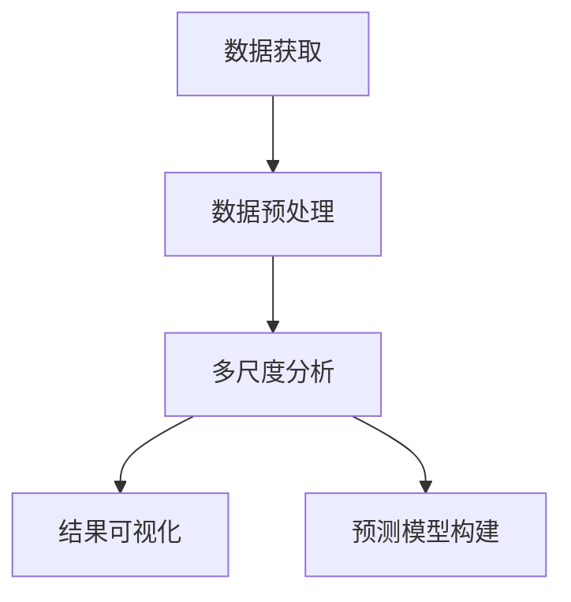
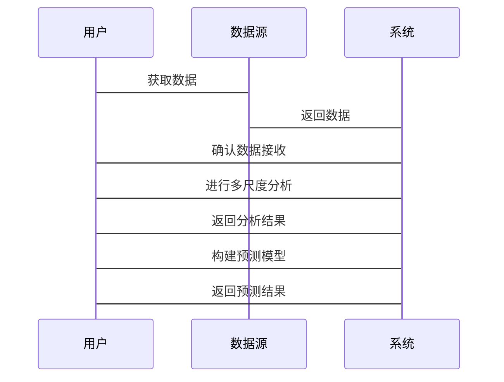

                 


# 《金融时间序列多尺度分析工具》

> **关键词**: 金融时间序列, 多尺度分析, 小波分析, 分形分析, 预测模型, 风险管理

> **摘要**: 本文详细探讨了金融时间序列分析中的多尺度分析方法，从理论基础到算法实现，再到系统设计和项目实战，全面解析了如何利用多尺度分析工具进行金融数据分析、预测和风险管理。文章结合实际案例，深入分析了小波分析和分形分析的核心原理及其在金融领域的应用，并提供了完整的代码实现和系统架构设计。

---

# 第一部分: 金融时间序列多尺度分析工具概述

---

# 第1章: 金融时间序列分析基础

## 1.1 金融时间序列的基本概念

### 1.1.1 时间序列的定义与特点

时间序列是指按照时间顺序排列的数据序列。在金融领域，时间序列通常表示资产价格、交易量等金融指标随时间的变化情况。金融时间序列具有以下特点：

- **连续性**: 数据点之间具有时间上的连续性。
- **波动性**: 数据点之间存在显著的波动，反映了市场的不确定性。
- **周期性**: 数据中可能存在周期性变化，如日周期、周周期、月周期等。
- **复杂性**: 金融时间序列往往受到多种因素的影响，如市场情绪、经济指标、政策变化等，导致其表现出复杂的非线性特征。

### 1.1.2 金融时间序列的独特性

金融时间序列与其他领域的时间序列相比，具有以下独特性：

- **高波动性**: 金融市场的波动通常较大，尤其是在股市、外汇市场等高频交易环境中。
- **非线性**: 金融时间序列往往表现出非线性特征，如幂律分布、长记忆性等。
- **异质性**: 不同金融资产的时间序列可能具有不同的特性，如股票和债券的时间序列在波动性、收益率分布等方面存在显著差异。

### 1.1.3 多尺度分析的背景与意义

在金融时间序列分析中，多尺度分析是一种重要的方法，其核心思想是将时间序列分解到不同的时间尺度上进行分析。多尺度分析的意义在于：

- **捕捉多层次特征**: 不同时间尺度上可能隐藏着不同的市场行为特征，例如高频交易中的短期波动和长周期交易中的趋势性。
- **提高分析精度**: 通过多尺度分析，可以在不同时间尺度上分别建模，从而提高分析的准确性和鲁棒性。
- **增强预测能力**: 多尺度分析可以帮助模型捕捉到更多的市场信息，从而提高预测能力。

---

## 1.2 金融时间序列分析的核心问题

### 1.2.1 时间序列的波动性与周期性

波动性是金融时间序列的核心特征之一，它反映了市场的不确定性。周期性则是指时间序列中存在某种规律性的重复模式。在实际分析中，我们需要同时考虑波动性和周期性，以便更好地理解市场行为。

### 1.2.2 多时间框架下的模式识别

金融市场的参与者通常需要在多个时间框架下进行分析和决策，例如分钟级、小时级、日级、周级等。多时间框架下的模式识别可以帮助分析师发现不同时间尺度上的市场行为特征。

### 1.2.3 多尺度分析的必要性与挑战

多尺度分析的必要性在于其能够捕捉到不同时间尺度上的市场信息，从而提高分析的全面性和准确性。然而，多尺度分析也面临一些挑战，例如如何选择合适的时间尺度、如何处理不同时间尺度之间的依赖关系等。

---

## 1.3 本章小结

本章从金融时间序列的基本概念出发，探讨了其独特性和多尺度分析的背景与意义。通过分析金融时间序列的核心问题，我们明确了多尺度分析在金融领域的必要性及其面临的挑战。

---

# 第2章: 多尺度分析的基本原理

## 2.1 多尺度分析的定义与特点

### 2.1.1 多尺度分析的定义

多尺度分析是一种通过将信号分解到不同的时间尺度上进行分析的方法。其核心思想是将信号分解为多个不同分辨率的子信号，从而在不同的时间尺度上捕捉信号的特征。

### 2.1.2 多尺度分析的核心特征

多尺度分析具有以下核心特征：

- **多分辨率分解**: 信号被分解为多个不同分辨率的子信号。
- **自相似性**: 不同时间尺度上的信号可能表现出相似的特征，尤其是在具有长记忆性的信号中。
- **灵活性**: 多尺度分析可以根据具体需求选择合适的时间尺度进行分析。

### 2.1.3 多尺度分析与单尺度分析的对比

与单尺度分析相比，多尺度分析具有以下优势：

- **捕捉多层次特征**: 多尺度分析可以在不同时间尺度上分别建模，从而捕捉到更多的市场信息。
- **提高分析精度**: 通过多尺度分析，可以在不同时间尺度上分别优化模型参数，从而提高分析的准确性和鲁棒性。
- **增强预测能力**: 多尺度分析可以帮助模型捕捉到更多的市场信息，从而提高预测能力。

---

## 2.2 多尺度分析的数学基础

### 2.2.1 时间序列分解的数学模型

时间序列分解的数学模型通常可以表示为：

$$ y(t) = \sum_{j} c_j \psi_{j,k}(t) $$

其中，$y(t)$ 是原始信号，$\psi_{j,k}(t)$ 是小波基函数，$c_j$ 是小波系数。

### 2.2.2 多尺度变换的数学表示

多尺度变换的数学表示通常可以表示为：

$$ y_j(t) = \sum_{k} c_{j,k} \psi_{j,k}(t) $$

其中，$y_j(t)$ 是第$j$个分辨率的信号，$\psi_{j,k}(t)$ 是小波基函数，$c_{j,k}$ 是小波系数。

### 2.2.3 小波分析在多尺度中的应用

小波分析是一种常用的多尺度分析方法，其核心思想是将信号分解为多个不同分辨率的子信号。通过小波分析，我们可以分别在不同分辨率上进行分析和建模。

---

## 2.3 本章小结

本章介绍了多尺度分析的基本原理，包括其定义、核心特征以及数学基础。通过对比单尺度分析和多尺度分析，我们明确了多尺度分析的优势及其在金融领域的应用价值。

---

# 第3章: 金融时间序列的多尺度分析方法

## 3.1 常见的多尺度分析工具

### 3.1.1 小波分析

小波分析是一种常用的多尺度分析工具，其核心思想是将信号分解为多个不同分辨率的子信号。小波分析在金融时间序列分析中的应用非常广泛，尤其是在高频交易和风险管理领域。

### 3.1.2 分形分析

分形分析是一种基于分形理论的多尺度分析工具，其核心思想是将信号分解为多个不同分辨率的子信号，并利用分形维数来描述信号的复杂性。分形分析在金融时间序列分析中的应用主要集中在描述市场的复杂性和预测市场的波动性。

### 3.1.3 多重分形分析

多重分形分析是一种更高级的分形分析方法，其核心思想是将信号分解为多个不同分辨率的子信号，并利用多重分形谱来描述信号的复杂性。多重分形分析在金融时间序列分析中的应用主要集中在描述市场的异质性和预测市场的波动性。

---

## 3.2 多尺度分析的实现步骤

### 3.2.1 数据预处理

数据预处理是多尺度分析的第一步，主要包括数据清洗、数据标准化和数据分割。数据清洗的目的是去除噪声和异常值，数据标准化的目的是将数据标准化到一个统一的尺度，数据分割的目的是将数据划分为训练集、验证集和测试集。

### 3.2.2 小波变换的参数选择

小波变换的参数选择是多尺度分析的关键步骤之一，主要包括小波类型的选择、分解层数的选择和小波系数的计算。小波类型的选择需要根据具体需求进行，分解层数的选择需要根据信号的复杂性进行调整，小波系数的计算需要根据具体算法进行。

### 3.2.3 分形维数的计算方法

分形维数的计算方法主要包括盒维数、曲线维数和关联维数。盒维数的计算方法是将信号分割成多个盒子，计算盒子数量随盒子大小的变化关系，曲线维数的计算方法是将信号分解成多个曲线，计算曲线长度随曲线分辨率的变化关系，关联维数的计算方法是将信号分解成多个点，计算点之间的关联性随点间距的变化关系。

---

## 3.3 本章小结

本章介绍了常见的多尺度分析工具及其实现步骤，包括小波分析、分形分析和多重分形分析。通过具体的实现步骤，我们明确了多尺度分析的实现过程及其在金融领域的应用价值。

---

# 第4章: 金融时间序列多尺度分析的算法实现

## 4.1 小波分析算法

### 4.1.1 小波分析的实现步骤

小波分析的实现步骤主要包括数据预处理、小波变换的参数选择和小波系数的计算。数据预处理的目的是去除噪声和异常值，小波变换的参数选择需要根据具体需求进行调整，小波系数的计算需要根据具体算法进行。

### 4.1.2 小波分析的数学公式

小波分析的数学公式可以表示为：

$$ y(t) = \sum_{j} c_j \psi_{j,k}(t) $$

其中，$y(t)$ 是原始信号，$\psi_{j,k}(t)$ 是小波基函数，$c_j$ 是小波系数。

### 4.1.3 小波分析的代码实现

以下是小波分析的Python代码实现：

```python
import numpy as np
import pywt

# 生成测试信号
t = np.linspace(0, 1, 1000)
signal = np.sin(2 * np.pi * t) + np.random.normal(0, 0.1, 1000)

# 小波分析
wavelet = 'db4'  # 选择小波类型
level = 3  # 分解层数

coeffs = pywt.wavedec(signal, wavelet, level=level)
recon_signal = pywt.waverec(coeffs, wavelet)

# 可视化
import matplotlib.pyplot as plt

plt.figure(figsize=(12, 6))
plt.plot(t, signal, label='Original signal')
plt.plot(t, recon_signal, label='Reconstructed signal')
plt.legend()
plt.show()
```

---

## 4.2 分形分析算法

### 4.2.1 分形分析的实现步骤

分形分析的实现步骤主要包括数据预处理、分形维数的计算和分形谱的绘制。数据预处理的目的是去除噪声和异常值，分形维数的计算需要根据具体算法进行，分形谱的绘制需要根据计算结果进行。

### 4.2.2 分形分析的数学公式

分形分析的数学公式可以表示为：

$$ D(q) = \lim_{\epsilon \to 0} \frac{\log N(q, \epsilon)}{\log (1/\epsilon)} $$

其中，$D(q)$ 是分形维数，$N(q, \epsilon)$ 是在尺度 $\epsilon$ 下的盒子数量。

### 4.2.3 分形分析的代码实现

以下是分形分析的Python代码实现：

```python
import numpy as np
import matplotlib.pyplot as plt

# 生成测试信号
t = np.linspace(0, 1, 1000)
signal = np.sin(2 * np.pi * t) + np.random.normal(0, 0.1, 1000)

# 分形分析
def calculate_fractal_dimension(signal, max_box_size=50):
    n = len(signal)
    dimensions = []
    for box_size in range(1, max_box_size + 1):
        count = 0
        for i in range(n // box_size):
            for j in range(i * box_size, (i + 1) * box_size):
                if j + box_size <= n:
                    if signal[j] >= signal[j + box_size]:
                        count += 1
        dimensions.append(count)
    return dimensions

fractal_dim = calculate_fractal_dimension(signal)
plt.figure(figsize=(12, 6))
plt.plot(fractal_dim)
plt.xlabel('Box Size')
plt.ylabel('Count')
plt.show()
```

---

## 4.3 本章小结

本章介绍了小波分析和分形分析的具体实现步骤及其数学公式，并提供了完整的Python代码实现。通过具体的代码示例，我们明确了多尺度分析的实现过程及其在金融领域的应用价值。

---

# 第5章: 金融时间序列多尺度分析的系统设计

## 5.1 系统架构设计

### 5.1.1 系统功能模块

金融时间序列多尺度分析系统的功能模块主要包括数据获取、数据预处理、多尺度分析、结果可视化和预测模型构建。

### 5.1.2 系统架构图

以下是系统架构图的Mermaid代码：



### 5.1.3 系统交互流程

以下是系统交互流程的Mermaid代码：



---

## 5.2 系统接口设计

### 5.2.1 数据接口

数据接口主要用于获取金融时间序列数据，支持多种数据源，如CSV文件、数据库和API接口。

### 5.2.2 分析接口

分析接口主要用于进行多尺度分析，支持小波分析和分形分析等多种方法。

### 5.2.3 可视化接口

可视化接口主要用于展示分析结果，支持多种可视化方式，如折线图、柱状图和热力图。

---

## 5.3 本章小结

本章介绍了金融时间序列多尺度分析系统的系统架构设计和接口设计，并提供了系统的交互流程图。通过系统的整体设计，我们明确了多尺度分析在金融领域的实际应用及其系统实现过程。

---

# 第6章: 金融时间序列多尺度分析的项目实战

## 6.1 项目背景与目标

### 6.1.1 项目背景

本项目旨在利用多尺度分析工具对金融时间序列数据进行分析和预测，从而帮助投资者更好地理解市场行为并做出科学的决策。

### 6.1.2 项目目标

项目的具体目标包括：

- 数据获取与预处理
- 多尺度分析的实现
- 预测模型的构建
- 分析结果的可视化

---

## 6.2 数据获取与预处理

### 6.2.1 数据获取

以下是数据获取的Python代码实现：

```python
import pandas as pd
import requests

# 从API获取数据
url = 'https://api.example.com/financial_data'
params = {'start_date': '2020-01-01', 'end_date': '2023-12-31'}
response = requests.get(url, params=params)
data = response.json()
df = pd.DataFrame(data)
```

### 6.2.2 数据预处理

以下是数据预处理的Python代码实现：

```python
import pandas as pd
import numpy as np

# 数据清洗
df.dropna(inplace=True)
df = df[~df['price'].isin([np.nan, pd.NaT])]

# 数据标准化
from sklearn.preprocessing import StandardScaler
scaler = StandardScaler()
df['normalized_price'] = scaler.fit_transform(df['price'].values.reshape(-1, 1))
```

---

## 6.3 多尺度分析的实现

### 6.3.1 小波分析的实现

以下是小波分析的Python代码实现：

```python
import pywt

# 小波分析
wavelet = 'db4'  # 选择小波类型
level = 3  # 分解层数

coeffs = pywt.wavedec(df['normalized_price'], wavelet, level=level)
recon_signal = pywt.waverec(coeffs, wavelet)
```

### 6.3.2 分形分析的实现

以下是分形分析的Python代码实现：

```python
def calculate_fractal_dimension(signal, max_box_size=50):
    n = len(signal)
    dimensions = []
    for box_size in range(1, max_box_size + 1):
        count = 0
        for i in range(n // box_size):
            for j in range(i * box_size, (i + 1) * box_size):
                if j + box_size <= n:
                    if signal[j] >= signal[j + box_size]:
                        count += 1
        dimensions.append(count)
    return dimensions

fractal_dim = calculate_fractal_dimension(df['normalized_price'])
```

---

## 6.4 预测模型的构建

### 6.4.1 预测模型的选择

预测模型可以选择支持向量机（SVM）或长短期记忆网络（LSTM）等。

### 6.4.2 预测模型的实现

以下是预测模型的Python代码实现：

```python
from sklearn.svm import SVR
from sklearn.model_selection import train_test_split

# 数据分割
X_train, X_test, y_train, y_test = train_test_split(df['normalized_price'], df['price'], test_size=0.2, random_state=42)

# 模型训练
model = SVR(kernel='rb

