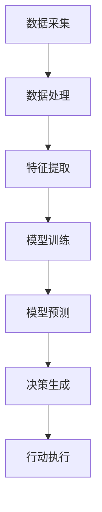
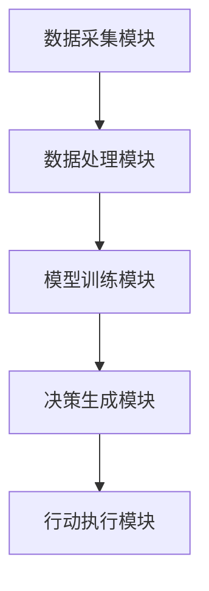

                 


# AI Agent在企业品质管理与持续改进中的应用

> 关键词：AI Agent, 企业品质管理, 持续改进, 机器学习, 自然语言处理, 强化学习

> 摘要：本文系统地探讨了AI Agent在企业品质管理与持续改进中的应用。通过分析AI Agent的核心概念、算法原理和系统架构，结合实际应用场景，展示了AI Agent如何助力企业实现智能化品质管理。文章还详细介绍了AI Agent在品质数据分析、问题诊断与解决方案生成以及持续改进中的具体应用，并通过实例分析了AI Agent的实施步骤与注意事项。

---

# 第1章: AI Agent与企业品质管理概述

## 1.1 AI Agent的基本概念

### 1.1.1 AI Agent的定义与特点

AI Agent（人工智能代理）是指能够感知环境、自主决策并执行任务的智能实体。与传统软件不同，AI Agent具有以下特点：

1. **自主性**：能够在没有外部干预的情况下自主运行。
2. **反应性**：能够实时感知环境并做出响应。
3. **学习能力**：通过数据和经验不断优化自身的决策能力。
4. **协作性**：能够与其他AI Agent或人类协同工作。

### 1.1.2 AI Agent的核心原理

AI Agent的核心原理是通过感知、推理和行动三者的结合来实现目标。感知阶段通过传感器或数据输入获取环境信息；推理阶段利用机器学习算法对信息进行分析和处理；行动阶段根据推理结果执行相应的操作。

### 1.1.3 AI Agent与传统管理工具的对比

与传统管理工具相比，AI Agent具有以下优势：

1. **智能化**：能够自主学习和优化。
2. **实时性**：能够实时响应环境变化。
3. **适应性**：能够根据环境变化自适应调整策略。

---

## 1.2 企业品质管理的背景与挑战

### 1.2.1 企业品质管理的定义与目标

企业品质管理是指通过系统化的手段，对产品或服务的品质进行规划、实施、监控和改进的过程。其目标是提高产品或服务的质量，满足客户需求，并实现持续改进。

### 1.2.2 当前企业品质管理的主要挑战

1. **数据繁杂**：企业每天产生大量数据，如何高效处理这些数据是一个挑战。
2. **问题预测难**：传统方法难以准确预测品质问题。
3. **改进效率低**：缺乏系统化的方法来快速实现品质改进。

### 1.2.3 持续改进在企业品质管理中的重要性

持续改进是企业提高竞争力的重要手段。通过持续改进，企业能够不断优化其品质管理流程，提升产品或服务质量，降低成本，并增强客户满意度。

---

## 1.3 AI Agent在企业品质管理中的应用前景

### 1.3.1 AI Agent在品质管理中的潜在价值

AI Agent能够通过数据分析、预测和优化，帮助企业实现智能化品质管理。例如，AI Agent可以实时监控生产过程，预测潜在质量问题，并提出解决方案。

### 1.3.2 企业采用AI Agent的优势与挑战

优势包括提高效率、降低成本、增强决策能力等；挑战则包括技术复杂性、数据隐私问题以及员工适应性问题。

### 1.3.3 未来发展趋势与研究方向

未来，AI Agent在企业品质管理中的应用将更加广泛，研究方向将集中在算法优化、人机协作、实时性提升等方面。

---

## 1.4 本章小结

本章介绍了AI Agent的基本概念、核心原理以及在企业品质管理中的应用前景。通过对比传统管理工具，突出了AI Agent的优势和潜力。下一章将深入探讨AI Agent的核心概念与原理。

---

# 第2章: AI Agent的核心概念与原理

## 2.1 AI Agent的结构与功能

### 2.1.1 AI Agent的组成模块

AI Agent通常由感知模块、推理模块和行动模块三个部分组成：

- **感知模块**：负责获取环境信息，例如传感器数据、日志文件等。
- **推理模块**：利用机器学习算法对感知到的信息进行分析和处理。
- **行动模块**：根据推理结果执行相应的操作，例如发出警报、调整参数等。

### 2.1.2 各模块的功能与作用

- **感知模块**：通过数据采集技术获取环境信息，并将其转化为可分析的数据格式。
- **推理模块**：利用分类、回归等机器学习算法对数据进行分析，并生成决策建议。
- **行动模块**：根据决策建议执行相应的操作，并将结果反馈给感知模块。

### 2.1.3 AI Agent的决策机制

AI Agent的决策机制通常包括以下几个步骤：

1. **数据采集**：获取环境信息。
2. **数据处理**：对数据进行清洗和预处理。
3. **模型训练**：利用机器学习算法训练模型。
4. **决策生成**：根据模型预测结果生成决策。
5. **执行决策**：将决策结果付诸实施。

---

## 2.2 AI Agent的工作流程

### 2.2.1 数据采集与处理

数据采集是AI Agent工作的第一步。常见的数据采集方法包括传感器数据采集、日志文件分析等。数据采集后需要进行清洗和预处理，以确保数据的准确性和完整性。

### 2.2.2 数据分析与建模

在数据处理完成后，AI Agent需要对数据进行分析和建模。常用的分析方法包括机器学习算法，如支持向量机（SVM）、随机森林（Random Forest）等。建模的目的是为了能够准确预测潜在的问题并生成解决方案。

### 2.2.3 决策生成与执行

根据模型预测结果，AI Agent生成相应的决策，并将决策结果执行。例如，如果预测到某个设备可能出现故障，AI Agent可以自动发出警报并建议停机维护。

---

## 2.3 AI Agent的设计原则与优化策略

### 2.3.1 设计原则

1. **模块化设计**：将AI Agent划分为多个模块，便于开发和维护。
2. **可扩展性**：确保AI Agent能够适应未来的变化和扩展。
3. **容错性**：能够容忍部分模块的故障，保证整体系统的稳定运行。

### 2.3.2 优化策略

1. **算法优化**：通过优化机器学习算法的参数，提高模型的预测精度。
2. **数据优化**：通过数据增强、特征选择等方法，提高数据的质量和利用率。
3. **系统优化**：通过并行计算、分布式架构等方法，提高系统的运行效率。

### 2.3.3 性能评估指标

1. **准确率**：模型预测的准确程度。
2. **响应时间**：AI Agent对环境变化的反应速度。
3. **可靠性**：系统在面对故障时的恢复能力。

---

## 2.4 本章小结

本章详细介绍了AI Agent的结构、功能、工作流程以及设计原则。通过模块化设计和优化策略，AI Agent能够高效地完成品质管理任务。下一章将探讨AI Agent在企业品质管理中的具体应用场景。

---

# 第3章: AI Agent在企业品质管理中的应用场景

## 3.1 企业品质管理中的关键问题

### 3.1.1 品质数据的采集与分析

品质数据的采集与分析是企业品质管理的基础。通过分析历史数据，企业可以发现潜在的问题并制定改进措施。

### 3.1.2 品质问题的预测与预警

通过AI Agent的预测能力，企业可以提前发现潜在的品质问题，并及时采取措施进行预警。

### 3.1.3 品质改进方案的制定与实施

AI Agent可以根据预测结果生成改进方案，并协助企业实施这些方案，从而实现持续改进。

---

## 3.2 AI Agent在品质管理中的具体应用

### 3.2.1 品质数据分析与可视化

通过AI Agent对品质数据进行分析和可视化，企业可以更直观地了解品质状况，并发现潜在问题。

### 3.2.2 品质问题诊断与解决方案生成

AI Agent可以通过机器学习算法对品质问题进行诊断，并生成相应的解决方案。例如，利用自然语言处理技术分析客户反馈，找出问题根源。

### 3.2.3 持续改进的自动化推进

AI Agent可以通过自动化的方式持续推进品质改进。例如，定期生成品质报告，监控改进效果，并根据反馈调整改进策略。

---

## 3.3 实施AI Agent的步骤与注意事项

### 3.3.1 实施步骤

1. **需求分析**：明确企业的品质管理需求。
2. **数据准备**：收集和整理相关数据。
3. **模型训练**：利用机器学习算法训练模型。
4. **系统集成**：将AI Agent与企业现有系统进行集成。
5. **测试与优化**：对系统进行测试，并根据反馈进行优化。

### 3.3.2 关键成功因素

- 数据质量：数据的准确性和完整性是AI Agent发挥效用的基础。
- 技术能力：企业的技术能力是AI Agent成功实施的关键。
- 用户接受度：员工的接受度和适应性是系统成功应用的重要因素。

### 3.3.3 常见问题与解决方案

- **数据隐私问题**：通过数据脱敏技术保护数据隐私。
- **系统兼容性问题**：通过与现有系统的兼容性设计解决。
- **用户操作难度**：通过简化用户界面和提供培训解决。

---

## 3.4 本章小结

本章探讨了AI Agent在企业品质管理中的具体应用场景，并详细介绍了实施AI Agent的步骤和注意事项。通过实际案例分析，展示了AI Agent在品质管理中的巨大潜力。

---

# 第4章: AI Agent的算法原理与数学模型

## 4.1 AI Agent的核心算法

### 4.1.1 机器学习算法

机器学习算法是AI Agent的核心算法之一。常用的机器学习算法包括：

1. **支持向量机（SVM）**：用于分类和回归任务。
2. **随机森林（Random Forest）**：用于分类和回归任务。
3. **神经网络（Neural Network）**：用于复杂的非线性任务。

### 4.1.2 自然语言处理算法

自然语言处理算法用于处理文本数据。常用的算法包括：

1. **词袋模型（Bag of Words）**：将文本转换为数值向量。
2. **TF-IDF**：计算文本中词语的重要性。
3. **循环神经网络（RNN）**：用于处理序列数据。

### 4.1.3 强化学习算法

强化学习算法用于决策任务。常用的算法包括：

1. **Q-learning**：通过状态和动作的奖励机制进行决策。
2. **Deep Q-Networks（DQN）**：结合深度学习和强化学习进行决策。

---

## 4.2 算法原理与流程图

### 4.2.1 算法流程图展示



### 4.2.2 算法实现步骤

1. **数据采集**：获取环境信息。
2. **数据处理**：清洗和预处理数据。
3. **特征提取**：提取数据中的有用特征。
4. **模型训练**：利用机器学习算法训练模型。
5. **模型预测**：利用训练好的模型进行预测。
6. **决策生成**：根据预测结果生成决策。
7. **行动执行**：将决策结果付诸实施。

---

## 4.3 数学模型与公式

### 4.3.1 机器学习模型的数学表达

以线性回归为例，其数学表达式为：

$$ y = \beta_0 + \beta_1 x + \epsilon $$

其中，$y$ 是目标变量，$x$ 是自变量，$\beta_0$ 是截距，$\beta_1$ 是回归系数，$\epsilon$ 是误差项。

### 4.3.2 损失函数与优化算法

常用的损失函数包括均方误差（MSE）：

$$ \text{MSE} = \frac{1}{n}\sum_{i=1}^{n}(y_i - \hat{y}_i)^2 $$

常用的优化算法包括梯度下降：

$$ \theta := \theta - \eta \frac{\partial L}{\partial \theta} $$

其中，$\theta$ 是参数，$\eta$ 是学习率，$\frac{\partial L}{\partial \theta}$ 是损失函数对参数的偏导数。

### 4.3.3 模型评估指标

常用的模型评估指标包括准确率（Accuracy）、精确率（Precision）、召回率（Recall）和F1分数（F1 Score）：

$$ \text{F1 Score} = \frac{2 \times \text{Precision} \times \text{Recall}}{\text{Precision} + \text{Recall}} $$

---

## 4.4 本章小结

本章详细介绍了AI Agent的核心算法及其数学模型。通过流程图和公式，展示了AI Agent的工作原理和实现方法。下一章将探讨AI Agent在企业品质管理中的系统架构设计。

---

# 第5章: 企业品质管理系统的AI Agent架构设计

## 5.1 系统总体架构

### 5.1.1 系统模块划分

企业品质管理系统的AI Agent架构通常包括以下几个模块：

1. **数据采集模块**：负责采集环境数据。
2. **数据处理模块**：对数据进行清洗和预处理。
3. **模型训练模块**：利用机器学习算法训练模型。
4. **决策生成模块**：根据模型预测结果生成决策。
5. **行动执行模块**：将决策结果付诸实施。

### 5.1.2 模块功能与交互关系

- **数据采集模块**与**数据处理模块**之间通过数据流进行交互。
- **数据处理模块**与**模型训练模块**之间通过数据流进行交互。
- **模型训练模块**与**决策生成模块**之间通过模型参数进行交互。
- **决策生成模块**与**行动执行模块**之间通过决策指令进行交互。

---

### 5.1.3 系统架构图



---

## 5.2 系统功能设计

### 5.2.1 问题场景介绍

企业品质管理系统需要实时监控生产过程，预测潜在质量问题，并自动采取措施进行改进。

### 5.2.2 系统功能需求

1. **实时监控**：对生产过程进行实时监控。
2. **问题预测**：预测潜在质量问题。
3. **决策生成**：根据预测结果生成决策。
4. **行动执行**：自动执行决策。

---

### 5.2.3 系统功能实现

#### 5.2.3.1 数据采集模块

数据采集模块通过传感器和日志文件获取生产过程中的数据，例如温度、压力、时间等。

#### 5.2.3.2 数据处理模块

数据处理模块对采集到的数据进行清洗和预处理，例如去除噪声、填补缺失值等。

#### 5.2.3.3 模型训练模块

模型训练模块利用机器学习算法对数据进行训练，生成预测模型。例如，利用支持向量机（SVM）进行分类任务。

#### 5.2.3.4 决策生成模块

决策生成模块根据模型预测结果生成决策。例如，如果预测到某个设备可能出现故障，决策生成模块会生成“停机维护”的决策。

#### 5.2.3.5 行动执行模块

行动执行模块根据决策生成模块的决策指令执行相应的操作。例如，自动停机维护设备。

---

## 5.3 系统架构设计

### 5.3.1 系统架构图


### 5.3.2 系统架构特点

1. **模块化设计**：系统划分为多个模块，便于开发和维护。
2. **可扩展性**：系统能够适应未来的变化和扩展。
3. **高可用性**：系统能够容忍部分模块的故障，保证整体系统的稳定运行。

---

## 5.4 系统接口设计

### 5.4.1 系统接口描述

系统接口主要分为内部接口和外部接口。内部接口用于模块之间的交互，例如数据流和模型参数；外部接口用于与企业现有系统的集成，例如与ERP系统对接。

### 5.4.2 接口交互流程

1. **数据采集模块**将数据传递给**数据处理模块**。
2. **数据处理模块**将处理后的数据传递给**模型训练模块**。
3. **模型训练模块**将训练好的模型传递给**决策生成模块**。
4. **决策生成模块**将决策指令传递给**行动执行模块**。

---

## 5.5 系统交互设计

### 5.5.1 系统交互流程图


### 5.5.2 系统交互步骤

1. **数据采集模块**获取环境数据。
2. **数据处理模块**对数据进行清洗和预处理。
3. **模型训练模块**利用机器学习算法训练模型。
4. **决策生成模块**根据模型预测结果生成决策。
5. **行动执行模块**根据决策指令执行相应操作。

---

## 5.6 本章小结

本章详细介绍了企业品质管理系统的AI Agent架构设计，包括系统模块划分、功能设计、架构图和接口设计。通过模块化设计和系统优化，企业能够实现智能化品质管理。

---

# 第6章: 项目实战与案例分析

## 6.1 项目背景与目标

### 6.1.1 项目背景

某制造企业希望利用AI Agent技术实现生产过程的智能化管理，提高产品品质，降低生产成本。

### 6.1.2 项目目标

通过AI Agent技术实现生产过程的实时监控、质量问题预测与预警、品质改进方案的制定与实施。

---

## 6.2 项目核心实现

### 6.2.1 环境配置

项目需要以下环境配置：

- **操作系统**：Linux 18.04+
- **编程语言**：Python 3.6+
- **机器学习库**：scikit-learn、TensorFlow
- **可视化工具**：Matplotlib、Seaborn
- **版本控制工具**：Git

---

### 6.2.2 核心代码实现

#### 6.2.2.1 数据采集与处理

```python
import pandas as pd
import numpy as np

# 数据采集
data = pd.read_csv('production_log.csv')

# 数据处理
data.dropna(inplace=True)
data['date'] = pd.to_datetime(data['date'])
data.set_index('date', inplace=True)
```

#### 6.2.2.2 模型训练与预测

```python
from sklearn.svm import SVC
from sklearn.metrics import accuracy_score

# 数据分割
X_train = data.drop(columns=['quality'])
y_train = data['quality']

# 模型训练
model = SVC()
model.fit(X_train, y_train)

# 模型预测
y_pred = model.predict(X_test)
print('Accuracy:', accuracy_score(y_test, y_pred))
```

#### 6.2.2.3 决策生成与执行

```python
# 决策生成
if y_pred == '异常':
    print('发出警报并建议停机维护')
else:
    print('继续生产')
```

---

## 6.3 项目小结

通过本项目，我们成功实现了AI Agent在企业品质管理中的应用。通过实时监控和预测，企业能够提前发现潜在质量问题，并及时采取措施进行改进。

---

# 第7章: 总结与展望

## 7.1 总结

本文系统地探讨了AI Agent在企业品质管理与持续改进中的应用。通过分析AI Agent的核心概念、算法原理和系统架构，结合实际应用场景，展示了AI Agent如何助力企业实现智能化品质管理。

---

## 7.2 展望

未来，随着人工智能技术的不断发展，AI Agent在企业品质管理中的应用将更加广泛。研究方向将集中在算法优化、人机协作、实时性提升等方面。企业需要不断提升技术能力，优化管理流程，以充分发挥AI Agent的潜力。

---

# 作者：AI天才研究院/AI Genius Institute & 禅与计算机程序设计艺术 /Zen And The Art of Computer Programming

