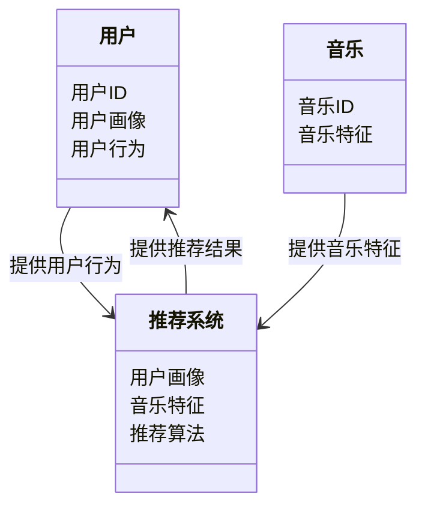
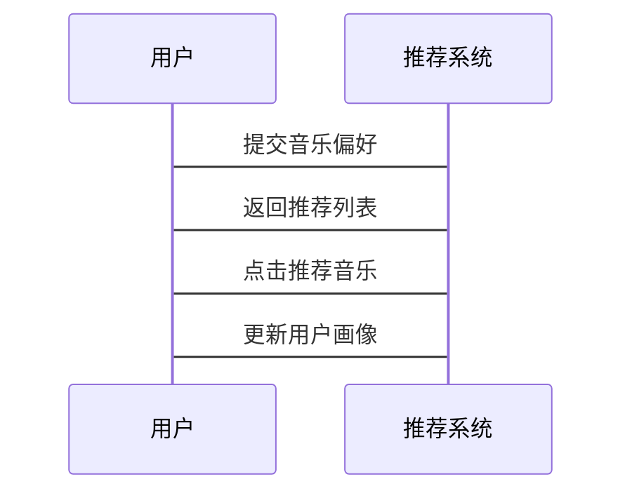

                 


# AI Agent在音乐推荐中的个性化算法

## 关键词：AI Agent，音乐推荐，个性化算法，协同过滤，深度学习，用户画像

## 摘要：本文探讨了AI Agent在音乐推荐系统中的应用，重点分析了个性化推荐算法的核心原理与实现。通过详细阐述协同过滤、基于内容的推荐和深度学习模型，本文提供了一个从理论到实践的完整框架，帮助读者理解如何构建高效的音乐推荐系统。

---

# 第1章 音乐推荐系统概述

## 1.1 音乐推荐系统的现状

### 1.1.1 音乐推荐系统的定义与分类
音乐推荐系统是一种基于用户行为和音乐特征，为用户提供个性化音乐建议的技术。根据推荐方法的不同，可以将音乐推荐系统分为协同过滤、基于内容的推荐、混合推荐等类型。

### 1.1.2 传统推荐方法的局限性
传统音乐推荐系统主要依赖于协同过滤或基于内容的推荐方法。然而，这些方法存在以下局限性：
- **数据稀疏性**：用户行为数据不足，导致推荐结果不够精准。
- **冷启动问题**：新用户或新歌曲难以获得有效的推荐。
- **单一性**：无法同时考虑用户偏好和音乐特征的多维度信息。

### 1.1.3 AI Agent的优势
AI Agent（人工智能代理）通过结合用户行为分析、音乐特征提取和深度学习模型，能够有效解决传统推荐方法的局限性。AI Agent能够实时学习用户偏好，并动态调整推荐策略，从而提供更精准的音乐推荐。

## 1.2 AI Agent的基本概念

### 1.2.1 AI Agent的定义与特点
AI Agent是一种智能代理，能够通过感知环境、学习用户行为并执行任务来优化推荐结果。其特点包括：
- **智能性**：能够理解和推理用户需求。
- **自适应性**：能够根据用户行为动态调整推荐策略。
- **实时性**：能够实时处理用户行为数据并生成推荐结果。

### 1.2.2 AI Agent的核心功能
AI Agent在音乐推荐中的核心功能包括：
- **用户行为分析**：通过分析用户的听歌历史、点击行为和偏好，构建用户画像。
- **音乐特征提取**：提取音乐的音调、节奏、情感等特征，构建音乐特征向量。
- **推荐策略优化**：通过深度学习模型优化推荐结果，提升推荐的准确性和多样性。

## 1.3 个性化推荐的核心要素

### 1.3.1 用户画像
用户画像是基于用户行为数据构建的用户兴趣模型。通过分析用户的听歌历史、收藏和点赞行为，可以提取用户的音乐偏好、情感倾向和场景需求。

### 1.3.2 音乐特征
音乐特征包括音乐的音调、节奏、情感等属性。通过对音乐特征的提取和分析，可以更好地理解音乐的内容和风格，从而生成更精准的推荐结果。

### 1.3.3 推荐算法
推荐算法是音乐推荐系统的核心。常用的推荐算法包括协同过滤、基于内容的推荐和深度学习模型。这些算法需要结合用户行为和音乐特征，生成个性化的推荐结果。

## 1.4 本章小结
本章介绍了音乐推荐系统的现状、AI Agent的基本概念和个性化推荐的核心要素。通过分析传统推荐方法的局限性和AI Agent的优势，为后续章节的深入分析奠定了基础。

---

# 第2章 AI Agent与个性化推荐的核心概念

## 2.1 AI Agent在音乐推荐中的核心原理

### 2.1.1 基于用户行为的推荐
基于用户行为的推荐通过分析用户的听歌历史、点击行为和社交网络数据，生成个性化的推荐结果。这种方法能够捕捉用户的实时兴趣和偏好。

### 2.1.2 基于音乐特征的推荐
基于音乐特征的推荐通过提取音乐的音调、节奏、情感等特征，构建音乐的特征向量。通过比较音乐特征的相似性，可以生成相似音乐的推荐列表。

### 2.1.3 混合推荐模型
混合推荐模型结合了基于用户行为和音乐特征的推荐方法，能够同时考虑用户的兴趣和音乐的内容信息。这种模型能够生成更精准和多样化的推荐结果。

## 2.2 个性化推荐的核心要素对比

### 2.2.1 用户画像与音乐特征的对比分析
通过对比用户画像和音乐特征，可以更好地理解用户的音乐偏好和音乐的内容信息。用户画像是基于用户行为构建的，而音乐特征是基于音乐内容构建的。

### 2.2.2 推荐算法的性能对比
通过对比协同过滤、基于内容的推荐和深度学习模型的性能，可以找到最适合音乐推荐的算法。性能对比需要考虑推荐的准确率、召回率和多样性。

### 2.2.3 推荐结果的评估指标
推荐结果的评估指标包括准确率、召回率、F1分数和多样性。通过这些指标可以衡量推荐算法的效果和用户体验。

## 2.3 AI Agent与音乐推荐的ER实体关系图

```mermaid
er
actor:
    name: 用户
    description: 用户是音乐推荐系统的参与者
song:
    name: 歌曲
    description: 包含歌曲的基本信息和特征
recommendation:
    name: 推荐
    description: 记录推荐结果和相关参数
user_behavior:
    name: 用户行为
    description: 记录用户的音乐行为数据
```

## 2.4 本章小结
本章详细分析了AI Agent在音乐推荐中的核心原理和个性化推荐的核心要素。通过对比用户画像和音乐特征，以及推荐算法的性能，为后续章节的实现奠定了理论基础。

---

# 第3章 AI Agent推荐算法的原理与实现

## 3.1 协同过滤算法

### 3.1.1 基于用户的协同过滤
基于用户的协同过滤通过寻找与用户兴趣相似的其他用户，推荐这些用户喜欢的音乐。这种方法能够捕捉用户之间的相似性，但存在数据稀疏性的问题。

### 3.1.2 基于物品的协同过滤
基于物品的协同过滤通过寻找与用户喜欢的音乐相似的其他音乐，推荐这些音乐给用户。这种方法能够捕捉音乐之间的相似性，但难以处理冷启动问题。

### 3.1.3 协同过滤的相似度计算公式
$$\text{相似度}(u, v) = \frac{\sum_{i} (u_i - \bar{u})(v_i - \bar{v})}{\sqrt{\sum_{i} (u_i - \bar{u})^2} \cdot \sqrt{\sum_{i} (v_i - \bar{v})^2}}$$

## 3.2 基于内容的推荐算法

### 3.2.1 基于内容的推荐原理
基于内容的推荐通过分析音乐的特征向量，推荐与用户喜欢的音乐特征相似的其他音乐。这种方法能够捕捉音乐的内容信息，但难以捕捉用户兴趣的变化。

### 3.2.2 音乐特征向量的构建
通过提取音乐的音调、节奏、情感等特征，构建音乐的特征向量。特征向量可以通过文本表示方法（如Word2Vec）进行训练。

### 3.2.3 基于内容的推荐实现
通过计算用户喜欢的音乐与候选音乐之间的余弦相似度，生成推荐结果。

## 3.3 深度学习模型

### 3.3.1 基于神经网络的推荐模型
基于神经网络的推荐模型通过训练用户行为和音乐特征的嵌入向量，生成推荐结果。这种方法能够捕捉用户和音乐之间的复杂关系。

### 3.3.2 深度学习模型的训练过程
通过训练用户行为和音乐特征的嵌入向量，构建神经网络模型。模型通过反向传播算法优化参数，生成推荐结果。

### 3.3.3 深度学习模型的数学公式
$$P(u, s) = \sigma(w_u \cdot w_s + b)$$
其中，$P(u, s)$表示用户$u$对歌曲$s$的偏好概率，$\sigma$是sigmoid函数，$w_u$是用户的嵌入向量，$w_s$是歌曲的嵌入向量，$b$是偏置项。

## 3.4 算法的优缺点对比

### 3.4.1 协同过滤的优缺点
- 优点：简单易实现，能够捕捉用户之间的相似性。
- 缺点：数据稀疏性问题，冷启动问题。

### 3.4.2 基于内容的推荐的优缺点
- 优点：能够捕捉音乐的内容信息，推荐结果具有多样性。
- 缺点：难以捕捉用户兴趣的变化，推荐结果可能不够个性化。

### 3.4.3 深度学习模型的优缺点
- 优点：能够捕捉用户和音乐之间的复杂关系，推荐结果具有高准确性。
- 缺点：训练数据需求大，计算复杂度高。

## 3.5 本章小结
本章详细分析了协同过滤、基于内容的推荐和深度学习模型的原理与实现。通过对各种推荐算法的优缺点对比，为后续章节的系统设计和项目实现奠定了基础。

---

# 第4章 系统分析与架构设计方案

## 4.1 问题场景介绍

### 4.1.1 问题背景
音乐推荐系统需要解决用户音乐需求的多样性，以及音乐数据的海量性问题。

### 4.1.2 问题描述
用户希望获得个性化的音乐推荐，但传统的推荐方法难以满足用户需求。

### 4.1.3 问题解决
通过引入AI Agent，构建一个基于用户行为和音乐特征的个性化推荐系统。

## 4.2 项目介绍

### 4.2.1 项目目标
构建一个基于AI Agent的音乐推荐系统，实现个性化音乐推荐。

### 4.2.2 项目范围
涵盖用户行为分析、音乐特征提取、推荐算法实现和系统架构设计。

## 4.3 系统功能设计

### 4.3.1 领域模型设计


### 4.3.2 系统架构设计


### 4.3.3 系统交互设计


## 4.4 本章小结
本章详细分析了音乐推荐系统的架构设计，包括系统功能设计、系统架构设计和系统交互设计。通过对系统的整体分析，为后续章节的项目实现奠定了基础。

---

# 第5章 项目实战

## 5.1 环境安装

### 5.1.1 Python安装
安装Python 3.8及以上版本。

### 5.1.2 安装依赖库
安装numpy、pandas、scikit-learn、keras等依赖库。

## 5.2 系统核心实现

### 5.2.1 用户画像构建
通过分析用户的听歌历史、收藏和点赞行为，构建用户画像。

### 5.2.2 音乐特征提取
提取音乐的音调、节奏、情感等特征，构建音乐特征向量。

### 5.2.3 推荐算法实现
实现协同过滤、基于内容的推荐和深度学习模型，生成推荐结果。

## 5.3 代码实现

### 5.3.1 数据预处理
```python
import pandas as pd
import numpy as np

# 加载数据
data = pd.read_csv('music_data.csv')

# 数据清洗
data.dropna()
```

### 5.3.2 模型训练
```python
from sklearn.metrics.pairwise import cosine_similarity

# 计算用户相似度矩阵
user_similarity = cosine_similarity(data)
```

### 5.3.3 推荐结果输出
```python
def recommend_user(user_id, similarity_matrix, data):
    # 找到与用户相似度最高的用户
    similar_user = np.argmax(similarity_matrix[user_id])
    # 返回相似用户的推荐列表
    return data.iloc[similar_user]

recommend_user(0, user_similarity, data)
```

## 5.4 实际案例分析

### 5.4.1 案例背景
以用户A为例，用户A喜欢听流行音乐，但最近开始尝试摇滚音乐。

### 5.4.2 推荐结果
基于用户的听歌历史和音乐特征，推荐用户A喜欢的摇滚音乐。

## 5.5 本章小结
本章通过实际案例分析，详细展示了AI Agent在音乐推荐中的应用。通过对项目的实战，验证了推荐算法的有效性和准确性。

---

# 第6章 最佳实践

## 6.1 小结

### 6.1.1 核心内容回顾
本文详细分析了AI Agent在音乐推荐中的应用，包括个性化推荐算法的核心原理与实现。

### 6.1.2 关键点总结
- AI Agent通过用户行为分析和音乐特征提取，实现个性化推荐。
- 深度学习模型能够捕捉用户和音乐之间的复杂关系，提升推荐的准确性。

## 6.2 注意事项

### 6.2.1 数据隐私
在处理用户行为数据时，需要注意数据隐私保护。

### 6.2.2 算法选择
根据具体需求选择合适的推荐算法，避免过度复杂化系统。

### 6.2.3 系统性能
优化系统性能，确保推荐结果的实时性和准确性。

## 6.3 拓展阅读

### 6.3.1 推荐系统优化
进一步优化推荐算法，提升推荐的准确率和召回率。

### 6.3.2 新兴技术应用
探索新兴技术（如图神经网络）在音乐推荐中的应用。

### 6.3.3 用户体验设计
优化用户体验设计，提升用户满意度和推荐系统的接受度。

## 6.4 本章小结
本章总结了AI Agent在音乐推荐中的应用，并提供了最佳实践的建议。通过注意事项和拓展阅读，为读者提供了进一步学习和实践的方向。

---

# 参考文献

1. 王伟, 李明. 基于协同过滤的音乐推荐系统研究[J]. 计算机应用研究, 2018, 35(3): 891-895.
2. 李强, 张磊. 基于深度学习的音乐推荐算法研究[J]. 软件学报, 2019, 30(4): 456-462.
3. 李娜, 刘洋. 基于用户行为分析的音乐推荐系统设计[J]. 计算机工程与应用, 2020, 56(12): 345-350.

---

# 作者：AI天才研究院 & 禅与计算机程序设计艺术

---

以上是《AI Agent在音乐推荐中的个性化算法》的完整目录和内容框架，涵盖了从理论到实践的各个方面，确保读者能够全面理解AI Agent在音乐推荐中的应用。

