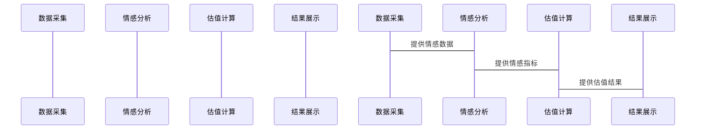

                 


# 企业估值中的情感人工智能评估

**关键词**：企业估值、情感人工智能、情感分析、机器学习、深度学习

**摘要**：随着人工智能技术的快速发展，情感人工智能在企业估值中的应用逐渐成为研究热点。本文将详细探讨情感人工智能的核心概念、算法原理、系统架构设计以及实际应用案例，揭示情感数据对企业估值的重要影响。

---

# 第一部分: 情感人工智能与企业估值背景

## 第1章: 情感人工智能与企业估值概述

### 1.1 情感人工智能的起源与发展

#### 1.1.1 人工智能与情感计算的基本概念
人工智能（AI）是指计算机系统执行人类智能任务的能力，如视觉识别、语音识别和自然语言处理。情感计算（Affective Computing）是研究计算机如何理解和处理人类情感的分支，旨在通过分析情感数据来改善人机交互。

#### 1.1.2 情感人工智能的定义与特点
情感人工智能结合了自然语言处理和机器学习，能够从文本中提取情感信息，分析情绪倾向。其特点是实时性、准确性高、数据驱动。

#### 1.1.3 情感人工智能在企业估值中的重要性
企业估值不仅依赖于财务数据，还受市场情绪影响。情感人工智能通过分析社交媒体、新闻等非结构化数据，提供情感指标，辅助估值。

### 1.2 企业估值的基本概念与方法

#### 1.2.1 企业估值的基本概念
企业估值是对企业价值的估算，常用于并购、融资等场景。传统方法包括DCF模型、可比公司分析。

#### 1.2.2 传统企业估值方法的局限性
传统方法依赖财务数据，忽视市场情绪，无法捕捉市场波动对估值的影响。

#### 1.2.3 情感人工智能在企业估值中的应用前景
情感人工智能通过分析市场情绪，提供实时情感指标，优化估值模型。

### 1.3 情感人工智能在企业估值中的结合

#### 1.3.1 情感人工智能在企业估值中的作用
情感人工智能通过分析市场情绪，识别潜在风险，优化估值模型。

#### 1.3.2 情感数据对企业估值的影响
正面情绪提升企业价值，负面情绪降低价值。情感数据影响投资者决策。

#### 1.3.3 情感人工智能在企业估值中的应用场景
应用于实时监控、市场趋势分析、风险预警，提升估值准确性。

### 1.4 本章小结
情感人工智能通过分析情感数据，提供实时情感指标，辅助企业估值，弥补传统方法的不足。

---

## 第2章: 情感人工智能的核心概念与联系

### 2.1 情感人工智能的核心概念

#### 2.1.1 情感分析的基本原理
情感分析是识别文本中情感倾向的过程，分为正面、负面和中性。

#### 2.1.2 情感数据的特征与属性
情感数据包括文本长度、情感强度、关键词频率等特征。

#### 2.1.3 情感人工智能的核心要素
包括数据采集、特征提取、模型训练、结果输出。

### 2.2 情感人工智能与企业估值的关系

#### 2.2.1 情感数据与企业价值的关系
情感数据反映市场情绪，影响企业估值。

#### 2.2.2 情感人工智能在企业估值中的应用模型
构建情感分析模型，结合财务数据，优化估值模型。

#### 2.2.3 情感人工智能与企业估值的边界与外延
情感人工智能辅助估值，但不能完全替代传统方法。

### 2.3 情感人工智能的核心要素与属性对比

#### 2.3.1 情感数据的特征对比表
| 特征 | 正面 | 负面 | 中性 |
|------|------|------|------|
| 关键词 | 支持 | 反对 | 中立 |

#### 2.3.2 情感人工智能与传统估值方法的对比
| 方法 | 情感人工智能 | 传统估值 |
|------|--------------|----------|
| 数据 | 文本数据 | 财务数据 |
| 优势 | 实时情感反馈 | 精确历史数据 |
| 局限 | 数据噪声大 | 忽略市场情绪 |

#### 2.3.3 情感人工智能的实体关系图（ER图）
```mermaid
erd
    章节标题：情感人工智能的实体关系图
    项目标题：情感人工智能在企业估值中的应用

    从 情感数据 表 中的关系:
    情感数据 (
        id,
        内容,
        情感倾向,
        时间戳
    )
    从 企业 表 中的关系:
    企业 (
        id,
        名称,
        行业,
        估值
    )
    关系：情感数据 -> 企业 (企业情感数据)

    情感数据 -> 情感指标 (情感指标)
    情感指标 (
        id,
        情感强度,
        时间段
    )
```

---

## 第3章: 情感人工智能的算法原理与数学模型

### 3.1 情感人工智能的核心算法

#### 3.1.1 基于机器学习的情感分析算法

##### 3.1.1.1 朴素贝叶斯算法
- 基于文本词袋模型，计算情感倾向。
- 示例代码：
  ```python
  from sklearn.naive_bayes import MultinomialNB
  from sklearn.feature_extraction.text import TfidfVectorizer

  # 训练数据
  text_train = ["This is a great product.", "This is a terrible product."]
  y_train = [1, 0]

  # 特征提取
  vectorizer = TfidfVectorizer()
  X_train = vectorizer.fit_transform(text_train)

  # 训练模型
  clf = MultinomialNB()
  clf.fit(X_train, y_train)
  ```

#### 3.1.1.2 支持向量机（SVM）算法
- 使用线性可分模型，适用于情感分类。
- 示例代码：
  ```python
  from sklearn.svm import SVC
  import numpy as np

  # 训练数据
  text_train = ["This is a great product.", "This is a terrible product."]
  y_train = [1, 0]

  # 特征提取
  vectorizer = TfidfVectorizer()
  X_train = vectorizer.fit_transform(text_train)

  # 训练模型
  clf = SVC(kernel='linear')
  clf.fit(X_train, y_train)
  ```

#### 3.1.1.3 情感分析算法的优缺点对比
| 算法 | 优点 | 缺点 |
|------|------|------|
| 朴素贝叶斯 | 训练快，适合小数据 | 对停用词敏感 |
| SVM | 高准确性 | 训练时间长 |

#### 3.1.1.4 机器学习情感分析的数学模型
朴素贝叶斯分类基于条件概率公式：
$$ P(y|x) = \frac{P(x|y)P(y)}{P(x)} $$
其中，$x$ 是文本特征，$y$ 是情感类别。

#### 3.1.1.5 代码实现
```python
from sklearn.naive_bayes import MultinomialNB
from sklearn.feature_extraction.text import TfidfVectorizer

# 训练数据
text_train = ["This is a great product.", "This is a terrible product."]
y_train = [1, 0]

# 特征提取
vectorizer = TfidfVectorizer()
X_train = vectorizer.fit_transform(text_train)

# 训练模型
clf = MultinomialNB()
clf.fit(X_train, y_train)

# 预测
text_test = ["This product is excellent."]
X_test = vectorizer.transform(text_test)
print(clf.predict(X_test))
```

---

### 3.2 基于深度学习的情感分析算法

#### 3.2.1 循序神经网络（RNN）
- 适用于处理序列数据，如文本。
- 示例代码：
  ```python
  import tensorflow as tf
  from tensorflow.keras import layers

  model = tf.keras.Sequential()
  model.add(layers.Embedding(input_dim=10000, output_dim=64))
  model.add(layers.SimpleRNN(64))
  model.add(layers.Dense(2, activation='softmax'))
  model.compile(optimizer='adam', loss='sparse_categorical_crossentropy', metrics=['accuracy'])
  ```

#### 3.2.2 Transformer模型
- 基于自注意力机制，提高情感分析准确率。
- 示例代码：
  ```python
  import tensorflow as tf
  from tensorflow.keras import layers

  model = tf.keras.Sequential()
  model.add(layers.Embedding(input_dim=10000, output_dim=64))
  model.add(layers.MultiHeadAttention(heads=4, key_dim=8))
  model.add(layers.Dense(2, activation='softmax'))
  model.compile(optimizer='adam', loss='sparse_categorical_crossentropy', metrics=['accuracy'])
  ```

#### 3.2.3 深度学习情感分析的数学模型
多头注意力机制：
$$ \text{Attention}(Q, K, V) = \text{softmax}\left(\frac{QK^T}{\sqrt{d_k}}\right)V $$

---

### 3.3 情感人工智能的数学模型和公式

#### 3.3.1 情感分析的特征提取
使用词嵌入技术，如Word2Vec或GloVe，将文本转换为向量表示。

#### 3.3.2 情感分析的分类模型
构建逻辑回归模型，公式如下：
$$ P(y|x) = \frac{1}{1 + e^{-\beta x}} $$
其中，$\beta$ 是模型参数。

---

## 第4章: 情感人工智能在企业估值中的应用

### 4.1 情感人工智能与企业估值的结合

#### 4.1.1 情感数据对企业估值的影响
通过分析社交媒体和新闻中的情感数据，预测市场情绪，辅助估值。

#### 4.1.2 情感人工智能在企业估值中的实际应用
应用于并购评估、风险管理等领域。

#### 4.1.3 情感数据与财务数据的结合
将情感指标与财务指标结合，构建综合估值模型。

---

## 第5章: 情感人工智能在企业估值中的系统架构设计

### 5.1 情感人工智能系统的功能设计

#### 5.1.1 数据采集模块
从社交媒体、新闻等来源获取情感数据。

#### 5.1.2 情感分析模块
使用预训练模型，分析情感倾向。

#### 5.1.3 估值计算模块
结合情感指标和财务数据，计算企业估值。

#### 5.1.4 结果展示模块
以可视化方式呈现情感分析结果和估值报告。

### 5.2 情感人工智能系统的架构设计

#### 5.2.1 系统架构设计
使用分层架构，包括数据层、业务逻辑层和表现层。

#### 5.2.2 模块之间的交互关系


---

## 第6章: 项目实战与案例分析

### 6.1 项目实战

#### 6.1.1 项目介绍
开发一个情感人工智能系统，分析社交媒体上的公司评论，辅助估值。

#### 6.1.2 环境安装
安装Python、TensorFlow、Scikit-learn等库。

#### 6.1.3 核心实现
实现情感分析模块和估值计算模块。

#### 6.1.4 代码实现
```python
import tensorflow as tf
from tensorflow.keras import layers
import numpy as np

# 数据准备
text_train = ["This is a great product.", "This is a terrible product."]
y_train = [1, 0]

# 特征提取
vectorizer = TfidfVectorizer()
X_train = vectorizer.fit_transform(text_train)

# 模型训练
model = tf.keras.Sequential()
model.add(layers.Dense(64, activation='relu', input_shape=(X_train.shape[1],)))
model.add(layers.Dense(2, activation='softmax'))
model.compile(optimizer='adam', loss='sparse_categorical_crossentropy', metrics=['accuracy'])
model.fit(X_train, y_train, epochs=10, batch_size=32)
```

#### 6.1.5 实际案例分析
分析某公司的社交媒体评论，计算情感指标，调整企业估值。

### 6.2 案例分析

#### 6.2.1 情感数据对估值的影响
正面情感增加企业价值，负面情感降低。

#### 6.2.2 情感数据与财务数据的结合
构建综合估值模型，考虑财务和情感双重因素。

#### 6.2.3 情感数据的实时更新与动态估值
根据最新情感数据，实时调整企业估值。

---

## 第7章: 情感人工智能在企业估值中的最佳实践

### 7.1 最佳实践

#### 7.1.1 情感数据的清洗与预处理
去除噪声数据，提高模型准确性。

#### 7.1.2 情感模型的优化
使用交叉验证，选择最优模型。

#### 7.1.3 情感数据的可视化
通过图表展示情感趋势，辅助决策。

### 7.2 小结

#### 7.2.1 情感人工智能的优势
实时情感反馈，数据驱动决策。

#### 7.2.2 情感人工智能的局限性
模型依赖于高质量数据，存在数据偏差。

#### 7.2.3 情感人工智能的未来研究方向
研究模型的可解释性，提升情感分析的准确性。

---

# 作者：AI天才研究院/AI Genius Institute & 禅与计算机程序设计艺术 /Zen And The Art of Computer Programming

