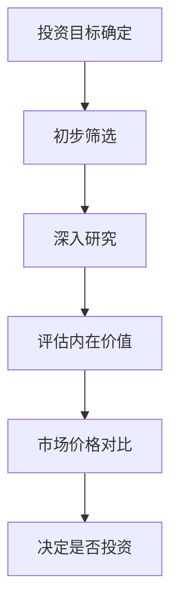

                 


# 彼得林奇的"常识投资"理念

> 关键词：常识投资，彼得·林奇，价值投资，长期投资，风险管理，投资策略

> 摘要：本文深入探讨了彼得·林奇的“常识投资”理念，分析其核心思想、策略与实际应用。通过结合基本面分析、长期投资、分散投资等方法，揭示如何在复杂市场中实现稳健投资。本文还通过具体案例，展示林奇的投资哲学在实际操作中的成功实践，为投资者提供实用的指导。

---

## 第一部分：常识投资的背景与核心理念

### 第1章：常识投资的定义与背景

#### 1.1 投资的定义与分类

- **1.1.1 投资的基本概念**
  - 投资是通过将资金投入资产或项目，以期获得未来收益的行为。
  - 投资可以分为短期投资和长期投资，股票、债券、房地产等多种形式。
  
- **1.1.2 传统投资与现代投资的区别**
  - 传统投资注重资产配置和市场趋势，现代投资更强调基本面分析和长期持有。
  - 现代投资更注重分散化和风险管理，而传统投资可能更依赖市场时机选择。
  
- **1.1.3 常识投资的起源与现状**
  - 常识投资起源于20世纪70年代，强调回归基本面，注重企业内在价值。
  - 目前，常识投资在全球范围内被广泛采用，尤其在机构投资者和个人投资者中。

#### 1.2 彼得·林奇的生平与投资哲学

- **1.2.1 彼得·林奇的个人经历**
  - 林奇是美国著名基金经理，曾管理富达麦哲伦基金，创造了辉煌的投资业绩。
  - 他的投资理念强调长期持有优质股票，注重企业基本面分析。
  
- **1.2.2 林奇的投资哲学与理念**
  - 林奇认为，投资成功的关键在于选择优秀的公司，而不是关注市场短期波动。
  - 他强调投资者应具备常识，避免被市场情绪左右。
  
- **1.2.3 林奇对投资市场的独特见解**
  - 林奇认为，市场短期是投票机，长期是称重机。
  - 投资者应关注企业的内在价值，而非市场的短期波动。

#### 1.3 常识投资的核心概念

- **1.3.1 什么是常识投资**
  - 常识投资是一种基于基本面分析的投资方法，强调长期持有优质股票。
  - 它注重企业的财务状况、行业地位和管理团队。
  
- **1.3.2 常识投资的特点与优势**
  - 低风险：通过选择优质企业分散风险。
  - 高收益：长期持有优质股票通常能带来超越市场的回报。
  - 简单易懂：基于常识和逻辑，易于理解和操作。
  
- **1.3.3 常识投资的适用场景与边界**
  - 适用于长期投资者，尤其是那些愿意深入研究的企业投资者。
  - 不太适合短期交易者或依赖市场预测的投资者。

---

## 第二部分：常识投资的核心策略

### 第2章：基本面分析与长期投资

#### 2.1 基本面分析的原理

- **2.1.1 基本面分析的定义与作用**
  - 基本面分析是通过对企业的财务报表、行业地位和管理团队进行分析，评估其内在价值。
  - 它帮助投资者识别具有长期增长潜力的企业。

- **2.1.2 常识投资中的基本面分析方法**
  - 通过分析企业的收入、利润、现金流等财务指标，评估其盈利能力。
  - 关注企业的负债情况和现金流健康状况，判断其财务风险。

- **2.1.3 如何通过基本面分析选择优质企业**
  - 寻找具有稳定收入来源和高利润率的企业。
  - 选择行业龙头或具有竞争优势的企业。

#### 2.2 长期投资的策略与优势

- **2.2.1 长期投资的定义与特点**
  - 长期投资是指将资金投入优质资产，持有数年以上，以获得复利效应。
  - 它注重企业的长期增长潜力，而非短期市场波动。

- **2.2.2 长期投资的优势与风险**
  - 优势：复利效应显著，抗短期波动能力强。
  - 风险：市场波动可能导致短期亏损，需要耐心和信心。

- **2.2.3 林奇对长期投资的建议**
  - 长期投资需要选择具有持续增长潜力的企业。
  - 定期审视投资组合，及时调整以应对市场变化。

#### 2.3 分散投资与风险管理

- **2.3.1 分散投资的原理与实践**
  - 分散投资是通过投资不同类型资产或行业，降低整体风险。
  - 林奇建议投资者分散投资于不同行业和企业，避免过度集中。

- **2.3.2 如何通过分散投资降低风险**
  - 投资多个行业，避免单一行业波动带来的影响。
  - 选择不同规模的企业，平衡风险和收益。

- **2.3.3 林奇的风险管理策略**
  - 定期评估投资组合的风险敞口，调整持仓结构。
  - 设置止损点，避免重大亏损。

---

### 第3章：价值投资与成长投资的结合

#### 3.1 价值投资的核心理念

- **3.1.1 价值投资的定义与特点**
  - 价值投资是寻找市场价格低于内在价值的企业进行投资。
  - 它注重企业的基本面，寻找被市场低估的机会。

- **3.1.2 价值投资与常识投资的联系**
  - 两者都强调基本面分析和长期持有。
  - 常识投资可以看作是价值投资的一种形式，注重企业的内在价值。

- **3.1.3 如何识别被低估的投资标的**
  - 通过对比市场价格与内在价值，寻找低估企业。
  - 关注企业的盈利能力、成长潜力和行业地位。

#### 3.2 成长投资的策略与挑战

- **3.2.1 成长投资的定义与特点**
  - 成长投资是投资于具有高速成长潜力的企业。
  - 这种投资策略风险较高，但潜在回报也更大。

- **3.2.2 成长投资与常识投资的结合**
  - 林奇认为，成长投资和价值投资可以结合，寻找具有成长性和合理估值的企业。
  - 通过基本面分析，选择具有成长潜力的优质企业。

- **3.2.3 如何平衡成长与价值投资的风险**
  - 选择具有强大财务基础和成长潜力的企业。
  - 通过分散投资降低单一投资的风险。

#### 3.3 价值与成长投资的综合应用

- **3.3.1 林奇对价值与成长投资的平衡策略**
  - 林奇倾向于投资具有稳定增长和合理估值的企业。
  - 他更喜欢那些既有成长潜力，又具备价值优势的企业。

- **3.3.2 如何根据市场环境调整投资策略**
  - 在牛市中，可以适当增加成长投资的比例。
  - 在熊市中，可以关注价值投资，寻找被低估的机会。

- **3.3.3 实际案例分析：林奇的经典投资组合**
  - 以可口可乐为例，分析林奇如何通过基本面分析选择投资标的。
  - 讨论林奇如何平衡价值与成长投资，实现长期稳健收益。

---

## 第三部分：彼得·林奇的投资体系

### 第4章：彼得·林奇的投资体系概述

#### 4.1 投资体系的核心要素

- **4.1.1 选股标准与流程**
  - 林奇的选股标准包括企业盈利能力、财务健康状况、行业地位和管理团队。
  - 选股流程包括初步筛选、深入研究和最终决策。

- **4.1.2 投资决策的逻辑与步骤**
  - 投资决策基于对企业基本面的深入分析。
  - 通过对比市场价格与内在价值，确定投资标的。

- **4.1.3 投资组合的构建与优化**
  - 构建投资组合时，注重分散化和风险控制。
  - 定期审视投资组合，根据市场变化进行调整。

#### 4.2 投资决策的关键因素

- **4.2.1 企业基本面分析的关键指标**
  - 收入、利润、现金流等财务指标。
  - 企业的负债情况和现金流健康状况。

- **4.2.2 市场趋势与宏观经济的影响**
  - 宏观经济环境和市场趋势对投资决策有重要影响。
  - 林奇更关注企业的基本面，而非宏观经济预测。

- **4.2.3 管理层能力与企业治理的重要性**
  - 管理层能力和企业治理是投资决策的重要因素。
  - 林奇更倾向于投资管理团队稳定、治理良好的企业。

#### 4.3 投资组合管理的策略

- **4.3.1 投资组合的分散化策略**
  - 通过分散投资降低风险。
  - 林奇建议投资于多个行业和企业，避免过度集中。

- **4.3.2 定期调整与优化的必要性**
  - 定期审视投资组合，根据市场变化进行调整。
  - 优化投资组合，提高整体收益。

- **4.3.3 如何应对市场波动与风险**
  - 通过分散投资和长期持有应对市场波动。
  - 设置止损点，避免重大亏损。

---

### 第5章：彼得·林奇的经典投资案例分析

#### 5.1 可口可乐的投资案例

- **5.1.1 投资背景与决策过程**
  - 可口可乐是一家具有强大品牌和市场地位的公司。
  - 林奇通过基本面分析，认为其具有长期增长潜力。

- **5.1.2 投资回报与经验总结**
  - 投资可口可乐带来了显著的回报。
  - 林奇的成功在于其对企业基本面的深入分析和长期持有的策略。

- **5.1.3 通过案例分析林奇的投资哲学**
  - 林奇注重企业的基本面和长期增长潜力。
  - 他选择那些具有强大竞争优势和合理估值的企业。

#### 5.2 星巴克的投资案例

- **5.2.1 投资背景与决策过程**
  - 星巴克是一家快速增长的咖啡连锁企业。
  - 林奇通过分析其财务状况和行业地位，认为其具有成长潜力。

- **5.2.2 投资回报与经验总结**
  - 投资星巴克带来了丰厚的回报。
  - 林奇的成功在于其对成长型企业价值的准确判断。

- **5.2.3 通过案例分析林奇的投资哲学**
  - 林奇注重企业的成长潜力和财务健康状况。
  - 他选择那些具有强大管理和市场地位的企业。

#### 5.3 华盛顿邮报的投资案例

- **5.3.1 投资背景与决策过程**
  - 华盛顿邮报是一家具有强大媒体影响力的企业。
  - 林奇通过分析其财务状况和行业地位，认为其具有长期增长潜力。

- **5.3.2 投资回报与经验总结**
  - 投资华盛顿邮报带来了显著的回报。
  - 林奇的成功在于其对行业地位和管理团队的准确判断。

- **5.3.3 通过案例分析林奇的投资哲学**
  - 林奇注重企业的行业地位和管理团队。
  - 他选择那些具有强大竞争优势和长期增长潜力的企业。

---

## 第四部分：常识投资的实战应用与风险管理

### 第6章：如何将常识投资理念应用于个人投资

#### 6.1 投资者心态与决策

- **6.1.1 投资者心态的重要性**
  - 投资心态影响投资决策和长期收益。
  - 林奇强调投资者需要具备耐心和信心。

- **6.1.2 如何克服情绪化决策**
  - 通过基本面分析和长期规划，避免情绪化决策。
  - 建立合理的投资目标和风险承受能力。

- **6.1.3 林奇对投资者的建议**
  - 保持耐心，长期持有优质股票。
  - 避免被市场情绪左右，坚持基本面分析。

#### 6.2 投资计划的制定与执行

- **6.2.1 制定投资计划的步骤**
  - 确定投资目标和风险承受能力。
  - 选择适合自己的投资策略和方法。
  
- **6.2.2 投资组合的构建与优化**
  - 根据自身情况，选择适合的投资标的。
  - 定期审视投资组合，根据市场变化进行调整。

- **6.2.3 长期投资的坚持与调整**
  - 长期投资需要坚持，避免频繁交易。
  - 根据市场变化和自身情况，适当调整投资组合。

#### 6.3 投资风险管理与心理建设

- **6.3.1 风险管理的重要性**
  - 风险管理是投资成功的关键。
  - 通过分散投资和止损点，降低投资风险。

- **6.3.2 心理建设与投资决策**
  - 心理因素对投资决策有重要影响。
  - 通过心理建设，克服情绪化决策。

- **6.3.3 如何在市场波动中保持冷静**
  - 坚持基本面分析，避免被市场情绪左右。
  - 通过长期规划和耐心，应对市场波动。

---

## 第五部分：总结与展望

### 第7章：总结与未来投资趋势

#### 7.1 全书总结

- **7.1.1 常识投资的核心理念**
  - 基于基本面分析，选择优质企业，长期持有。
  - 通过分散投资和风险管理，实现稳健收益。

- **7.1.2 林奇投资哲学的启示**
  - 投资成功的关键在于选择优质企业，而非关注市场短期波动。
  - 坚持长期投资，耐心持有优质股票。

#### 7.2 对未来投资趋势的展望

- **7.2.1 市场变化与投资策略**
  - 随着市场变化，投资策略需要不断调整。
  - 未来，科技和创新将继续推动市场增长。

- **7.2.2 新兴行业的投资机会**
  - 新兴行业如人工智能、生物技术等领域，具有巨大的增长潜力。
  - 常识投资仍将是成功的基石。

- **7.2.3 投资者教育与普及**
  - 投资者教育的重要性日益凸显。
  - 未来，更多投资者将通过基本面分析和长期投资实现财富增长。

---

## 附录：相关图表与代码

### 附录A：林奇投资决策流程图（Mermaid）



### 附录B：价值与成长投资对比表

| **指标**         | **价值投资**             | **成长投资**             |
|-------------------|--------------------------|--------------------------|
| **核心目标**     | 寻找被低估的企业         | 寻找具有成长潜力的企业   |
| **关注点**       | 市场价格与内在价值       | 企业盈利增长和未来潜力   |
| **风险**         | 较低                     | 较高                     |
| **收益**         | 稳定                     | 高，但波动大             |

### 附录C：Python代码示例（基本面分析）

```python
import pandas as pd

def calculate_intrinsic_value(financial_data):
    # 假设 financial_data 是包含收入、利润、现金流等指标的字典
    revenue = financial_data['revenue']
    profit = financial_data['profit']
    cash_flow = financial_data['cash_flow']
    
    # 简单的内在价值计算方法（仅为示例）
    intrinsic_value = (revenue + profit + cash_flow) / 3
    return intrinsic_value

# 示例数据
data = {
    'revenue': 1000000,
    'profit': 200000,
    'cash_flow': 150000
}

iv = calculate_intrinsic_value(data)
print(f"内在价值：{iv}")
```

---

## 作者：AI天才研究院/AI Genius Institute & 禅与计算机程序设计艺术 /Zen And The Art of Computer Programming

