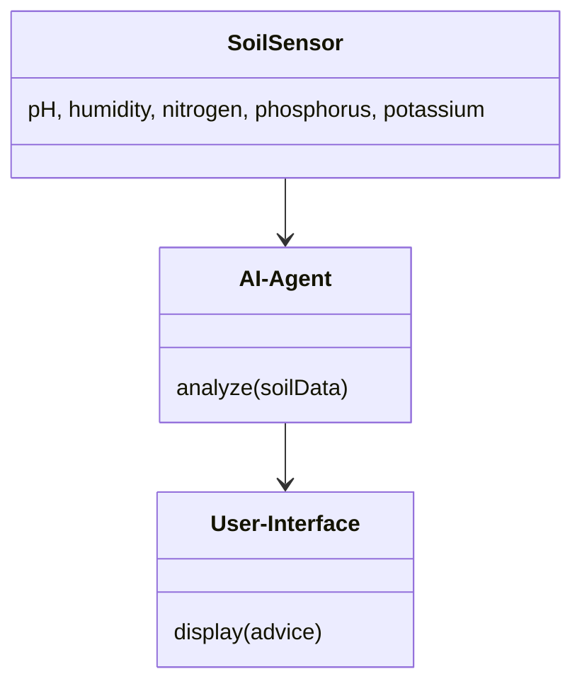
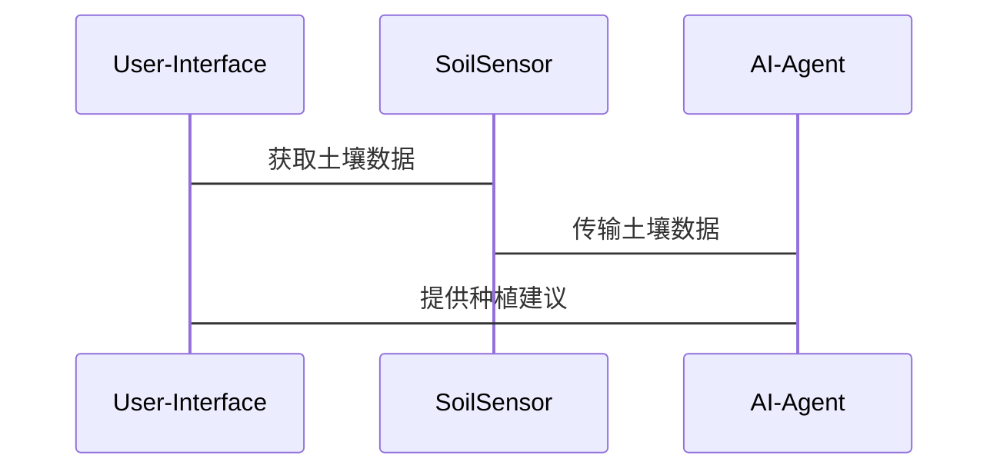

                 


# 智能园艺手套：AI Agent的土壤状况检测

---

## 关键词：
智能园艺手套，AI Agent，土壤检测，传感器技术，物联网，智能农业

---

## 摘要：
智能园艺手套是一种结合了人工智能代理和物联网技术的创新工具，用于实时检测和分析土壤状况，从而优化植物生长条件。本文深入探讨了智能园艺手套的核心技术，包括AI代理的算法原理、土壤检测技术的实现、系统架构设计以及实际应用案例。通过本文，读者将全面了解智能园艺手套的工作原理及其在现代农业中的应用价值。

---

# 第1章 智能园艺手套的发展背景

## 1.1 智能园艺手套的定义与应用
智能园艺手套是一种 wearable technology，集成了多种传感器和AI代理，能够实时检测土壤的pH值、湿度、养分含量等关键指标，并通过无线通信模块将数据传输到用户的移动设备上，提供个性化的种植建议。

### 1.1.1 智能园艺手套的定义
智能园艺手套是一种可穿戴设备，结合了传感器、AI代理和物联网技术，能够实时监测土壤状况并为用户提供种植建议。

### 1.1.2 智能园艺手套的应用场景
- **家庭园艺**：帮助业余园艺爱好者优化植物生长条件。
- **农业生产**：为农民提供精确的土壤数据，提高作物产量。
- **科研用途**：支持土壤科学研究和农业技术开发。

### 1.1.3 智能园艺手套的市场现状
随着智能农业的发展，市场对智能园艺手套的需求日益增长，尤其是在家庭园艺和精准农业领域。

## 1.2 土壤状况检测的重要性
土壤是植物生长的基础，其健康状况直接影响植物的生长和产量。传统土壤检测方法依赖于实验室分析，耗时且成本高。智能园艺手套通过实时检测，能够快速提供土壤数据，帮助用户及时调整种植策略。

### 1.2.1 土壤健康对植物生长的影响
土壤的pH值、湿度、养分含量等因素直接影响植物的吸收能力，进而影响植物的生长和产量。

### 1.2.2 现有土壤检测方法的局限性
传统土壤检测方法通常需要采集土壤样本并送至实验室分析，耗时长且成本高，难以满足实时监测的需求。

### 1.2.3 智能园艺手套的优势与创新点
智能园艺手套通过实时检测和AI代理分析，能够快速提供土壤数据，帮助用户优化种植条件，实现精准农业。

---

# 第2章 智能园艺手套的核心技术

## 2.1 AI Agent的基本原理
AI Agent是一种能够感知环境并采取行动以实现目标的智能实体。在智能园艺手套中，AI Agent用于分析传感器数据并提供种植建议。

### 2.1.1 AI Agent的定义与特点
- **定义**：AI Agent是一种能够感知环境、做出决策并采取行动的智能实体。
- **特点**：自主性、反应性、主动性、社会性。

### 2.1.2 AI Agent在土壤检测中的应用
AI Agent通过分析传感器数据，识别土壤的健康状况，并为用户提供种植建议。

### 2.1.3 AI Agent与传统传感器技术的对比
| 特性             | AI Agent                          | 传统传感器技术                     |
|------------------|-----------------------------------|------------------------------------|
| 数据处理能力     | 强大，能够进行复杂分析            | 较弱，仅能采集和传输数据            |
| 决策能力         | 能够根据数据做出决策              | 无法决策，仅能提供数据              |
| 可扩展性         | 高，能够适应不同的应用场景        | 较低，难以扩展到复杂场景             |

---

## 2.2 土壤检测技术的原理
土壤检测技术通过多种传感器采集土壤的物理和化学参数，如pH值、湿度、养分含量等。

### 2.2.1 土壤pH值检测
pH值反映了土壤的酸碱度，直接影响植物的养分吸收。智能园艺手套通过pH传感器实时监测土壤的酸碱度。

### 2.2.2 土壤湿度检测
湿度传感器用于测量土壤的含水量，帮助用户判断是否需要浇水。

### 2.2.3 土壤养分检测
养分传感器能够检测土壤中的氮、磷、钾等主要养分含量，帮助用户调整施肥策略。

---

## 2.3 智能手套的传感器集成
智能园艺手套通过多种传感器的集成，实现对土壤的全面检测。

### 2.3.1 传感器类型与功能
| 传感器类型       | 功能描述                       |
|------------------|-------------------------------|
| pH传感器         | 测量土壤的酸碱度               |
| 湿度传感器       | 测量土壤的含水量               |
| 养分传感器       | 测量土壤中的养分含量           |

### 2.3.2 传感器的数据采集与处理
传感器数据通过模数转换器（ADC）采集，并经过滤波和放大处理，确保数据的准确性。

### 2.3.3 传感器的集成与优化
传感器的集成需要考虑功耗、响应时间、精度等因素，以确保系统的稳定性和可靠性。

---

## 2.4 本章小结
本章详细介绍了智能园艺手套的核心技术，包括AI Agent的基本原理、土壤检测技术的实现以及传感器的集成与优化。

---

# 第3章 智能园艺手套的系统架构

## 3.1 系统整体架构设计
智能园艺手套的系统架构包括数据采集层、数据处理层和用户交互层。

### 3.1.1 系统功能模块划分
- **数据采集模块**：负责采集土壤的物理和化学参数。
- **数据处理模块**：对采集的数据进行分析和处理。
- **AI代理模块**：根据分析结果提供种植建议。
- **用户交互模块**：通过移动设备与用户进行数据交互。

### 3.1.2 系统架构的优缺点分析
| 优点             | 缺点                           |
|------------------|--------------------------------|
| 结构清晰           | 系统复杂度较高                 |
| 可扩展性强         | 初期开发成本较高               |

### 3.1.3 系统架构的可扩展性
系统架构设计充分考虑了可扩展性，支持未来新增更多传感器和功能模块。

---

## 3.2 系统功能模块详细设计
### 3.2.1 数据采集模块
数据采集模块通过多种传感器采集土壤的pH值、湿度和养分含量。

### 3.2.2 数据处理模块
数据处理模块对采集的数据进行预处理、特征提取和模型训练，为AI代理提供输入数据。

### 3.2.3 AI Agent决策模块
AI Agent基于土壤数据，结合预设的种植模型，为用户提供种植建议。

### 3.2.4 用户交互模块
用户交互模块通过移动设备或网页界面，向用户展示土壤数据和种植建议。

---

## 3.3 系统接口与通信设计
### 3.3.1 系统内部接口设计
系统内部接口包括传感器接口、数据处理模块接口和AI Agent接口。

### 3.3.2 系统与外部设备的通信协议
系统通过蓝牙或Wi-Fi与用户的移动设备进行数据交互。

### 3.3.3 系统与用户的交互界面
用户交互界面设计简洁直观，支持用户查看土壤数据和种植建议。

---

## 3.4 本章小结
本章详细介绍了智能园艺手套的系统架构设计，包括功能模块划分、系统接口设计和用户交互界面设计。

---

# 第4章 智能园艺手套的算法实现

## 4.1 AI Agent算法的选择与优化
AI Agent算法选择基于土壤数据的特征和分类任务的需求。

### 4.1.1 常见AI Agent算法介绍
- **决策树**：适合分类任务，易于解释。
- **随机森林**：适合分类和回归任务，具有高准确率。
- **神经网络**：适合复杂非线性关系的建模。

### 4.1.2 算法选择的依据
根据土壤数据的特征和分类任务的需求，选择随机森林算法作为AI代理的核心算法。

### 4.1.3 算法优化与调参
通过交叉验证和网格搜索，优化随机森林算法的参数，提高分类准确率。

---

## 4.2 土壤检测算法的设计与实现
土壤检测算法基于传感器数据，实现对土壤健康状况的分类。

### 4.2.1 数据预处理与特征提取
- **数据预处理**：去除噪声，标准化数据。
- **特征提取**：提取土壤的pH值、湿度和主要养分含量。

### 4.2.2 算法模型的训练与验证
使用训练数据训练随机森林模型，并通过验证集评估模型的性能。

### 4.2.3 算法的性能评估与改进
通过准确率、召回率和F1分数评估模型性能，并进行必要的改进。

---

## 4.3 算法实现的代码示例
以下是土壤检测算法的Python代码示例：

```python
import numpy as np
from sklearn.ensemble import RandomForestClassifier
from sklearn.metrics import accuracy_score

# 数据预处理
X = np.array([[pH, humidity, nitrogen, phosphorus, potassium]])
y = np.array([target_label])

# 模型训练
model = RandomForestClassifier()
model.fit(X_train, y_train)

# 模型预测
y_pred = model.predict(X_test)

# 性能评估
accuracy = accuracy_score(y_test, y_pred)
print(f"Accuracy: {accuracy}")
```

---

## 4.4 本章小结
本章详细介绍了智能园艺手套的算法实现，包括AI Agent算法的选择与优化、土壤检测算法的设计与实现，以及算法性能的评估与改进。

---

# 第5章 智能园艺手套的系统分析与架构设计

## 5.1 问题场景介绍
智能园艺手套的目标是实时检测土壤状况，帮助用户优化种植条件。

## 5.2 项目介绍
智能园艺手套是一个结合了传感器技术、AI代理和物联网的智能设备，能够实时监测土壤的pH值、湿度和养分含量，并为用户提供种植建议。

## 5.3 系统功能设计
### 5.3.1 领域模型（Mermaid 类图）


### 5.3.2 系统架构设计（Mermaid 架构图）


### 5.3.3 系统接口设计
- **传感器接口**：与土壤传感器通信，获取土壤数据。
- **AI代理接口**：接收土壤数据，进行分析并返回种植建议。
- **用户接口**：显示土壤数据和种植建议，支持用户交互。

### 5.3.4 系统交互设计（Mermaid 序列图）


---

## 5.4 本章小结
本章详细介绍了智能园艺手套的系统分析与架构设计，包括问题场景分析、系统功能设计、系统架构设计和系统交互设计。

---

# 第6章 智能园艺手套的项目实战

## 6.1 环境安装
### 6.1.1 开发环境
- **硬件**：土壤传感器、Arduino控制器、蓝牙模块。
- **软件**：Python编程环境、机器学习库（如scikit-learn）。

## 6.2 系统核心实现源代码
以下是土壤检测算法的Python代码实现：

```python
import numpy as np
from sklearn.ensemble import RandomForestClassifier
from sklearn.metrics import accuracy_score

# 数据预处理
X = np.array([[pH, humidity, nitrogen, phosphorus, potassium]])
y = np.array([target_label])

# 模型训练
model = RandomForestClassifier()
model.fit(X_train, y_train)

# 模型预测
y_pred = model.predict(X_test)

# 性能评估
accuracy = accuracy_score(y_test, y_pred)
print(f"Accuracy: {accuracy}")
```

## 6.3 代码应用解读与分析
- **数据预处理**：对传感器数据进行标准化和归一化处理，确保模型输入的数据格式一致。
- **模型训练**：使用随机森林算法训练土壤健康状况分类模型。
- **模型预测**：基于训练好的模型，对新的土壤数据进行分类，提供种植建议。

## 6.4 实际案例分析
通过实际种植案例，验证智能园艺手套在家庭园艺和农业生产中的应用效果。

## 6.5 项目总结
项目实现了智能园艺手套的核心功能，验证了AI代理在土壤检测中的有效性，并为未来的研究和应用提供了参考。

---

# 第7章 最佳实践、小结与展望

## 7.1 小结
智能园艺手套通过集成传感器技术和AI代理，实现了土壤状况的实时检测和优化种植，具有广泛的应用前景。

## 7.2 注意事项
- **数据隐私**：确保用户数据的安全和隐私。
- **传感器校准**：定期校准传感器，确保数据的准确性。
- **系统维护**：定期更新算法模型，优化系统性能。

## 7.3 拓展阅读
- **相关技术**：物联网、人工智能、传感器技术。
- **应用领域**：智能农业、精准种植、环境监测。

---

# 作者：AI天才研究院 & 禅与计算机程序设计艺术

---

通过本文，读者可以全面了解智能园艺手套的技术原理和实现方法，为智能农业的发展提供新的思路和参考。

