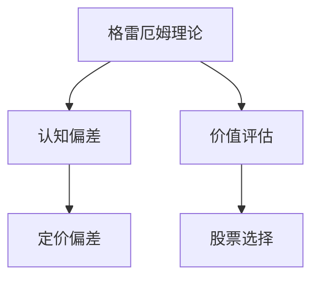
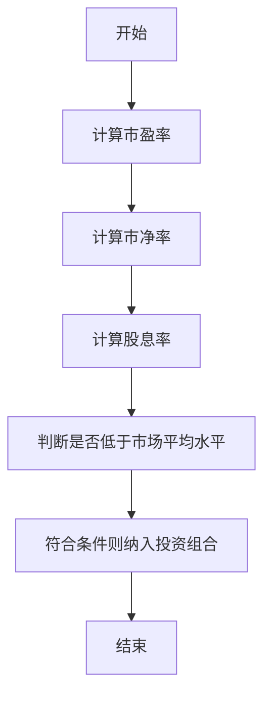
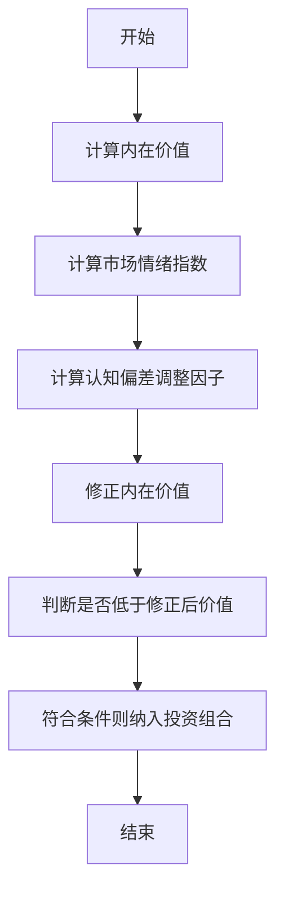
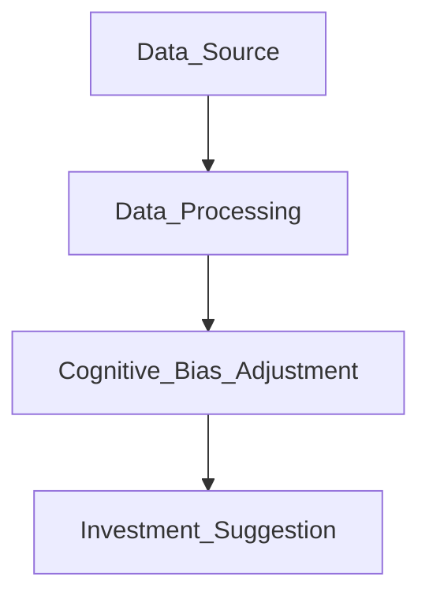

                 


# 格雷厄姆特价股票理论对行为经济学的补充

> 关键词：格雷厄姆特价股票理论，行为经济学，价值投资，认知偏差，投资决策，股票定价

> 摘要：本文探讨格雷厄姆特价股票理论与行为经济学的结合，分析认知偏差对股票定价的影响，并提出基于行为经济学的股票筛选策略，旨在为投资者提供更全面的决策框架。

---

# 第1章: 格雷厄姆特价股票理论与行为经济学概述

## 1.1 问题背景
### 1.1.1 格雷厄姆特价股票理论的起源
 Benjamin Graham 的价值投资理论强调以低于内在价值的价格购买股票，重点关注低市盈率、低市净率和高股息率的股票。这种“烟屁股”投资策略旨在通过市场非理性定价中获利。

### 1.1.2 行为经济学的核心问题
 行为经济学研究个体和群体在决策过程中的非理性行为，揭示认知偏差对经济和投资决策的影响。传统经济学假设投资者是理性的，而行为经济学则指出，现实中投资者常常受情感、认知偏差和有限理性影响。

### 1.1.3 两者的结合意义
 格雷厄姆的理论主要关注股票的内在价值和市场定价的非理性，而行为经济学提供了对这种非理性定价的微观解释。将两者结合，可以更好地理解市场定价偏差，优化投资决策。

## 1.2 问题描述
### 1.2.1 格雷厄姆理论的核心概念
 格雷厄姆的特价股票理论强调寻找市场低估的股票，主要通过市盈率、市净率和股息率等指标筛选投资标的。

### 1.2.2 行为经济学的研究范围
 行为经济学研究投资者在信息处理、决策制定和市场互动中的非理性行为，包括认知偏差、情绪影响和羊群效应。

### 1.2.3 问题的解决路径
 通过分析行为经济学中的认知偏差对股票定价的影响，进一步优化格雷厄姆的选股策略，提升投资决策的科学性。

## 1.3 核心概念与联系
### 1.3.1 核心概念原理
 格雷厄姆的特价股票理论基于市场非理性定价，而行为经济学解释了这种非理性的来源——认知偏差。

### 1.3.2 核心概念属性特征对比表格
```markdown
| 核心概念 | 格雷厄姆特价股票理论 | 行为经济学 |
|----------|---------------------|------------|
| 定义     | 低估值股票投资     | 非理性决策 |
| 属性     | 价值导向             | 认知偏差     |
| 联系     | 行为偏差影响定价     | 理性决策补充 |
```

### 1.3.3 ER实体关系图


## 1.4 本章小结
 本章介绍了格雷厄姆特价股票理论和行为经济学的核心概念，分析了两者结合的必要性，并为后续章节奠定了基础。

---

# 第2章: 格雷厄姆特价股票理论的核心原理

## 2.1 核心原理概述
### 2.1.1 格雷厄姆的价值投资原则
 格雷厄姆的选股原则包括：
1. **安全边际**：买入价格低于内在价值。
2. **低市盈率**：市盈率低于市场平均水平。
3. **低市净率**：市净率低于市场平均水平。
4. **高股息率**：股息率高于市场平均水平。

### 2.1.2 格雷厄姆的选股标准
 通过具体的量化指标筛选股票，重点关注企业的基本面，而非市场情绪。

### 2.1.3 格雷厄姆理论与现代投资理论的对比
 与现代投资组合理论相比，格雷厄姆的价值投资更注重个股的估值，而非分散化投资。

## 2.2 核心算法原理
### 2.2.1 格雷厄姆筛选算法


## 2.3 核心算法的数学模型
 格雷厄姆的筛选标准可以通过以下公式表示：
$$
\text{安全边际} = \text{内在价值} - \text{市场价格}
$$
$$
\text{市盈率} = \frac{\text{股价}}{\text{每股收益}}
$$
$$
\text{市净率} = \frac{\text{股价}}{\text{每股净资产}}
$$
$$
\text{股息率} = \frac{\text{每股股息}}{\text{股价}}
$$

## 2.4 算法实现与优化
### 2.4.1 格雷厄姆筛选算法的优化
 在原有筛选标准的基础上，加入对认知偏差的修正，优化选股策略。

## 2.5 本章小结
 本章详细阐述了格雷厄姆特价股票理论的核心原理及其数学模型，为后续章节的分析奠定了基础。

---

# 第3章: 行为经济学的核心概念与模型

## 3.1 核心概念概述
### 3.1.1 认知偏差
 认知偏差包括确认偏差、损失厌恶、过度自信等，影响投资者的决策。

### 3.1.2 情感因素
 惶恐和贪婪是影响投资者决策的主要情感因素。

### 3.1.3 社会心理因素
 羊群效应和从众心理影响市场行为。

## 3.2 核心模型与框架
### 3.2.1 心理账户理论
 Kahneman 和 Tversky 的心理账户理论解释了投资者如何分类和管理资金。

### 3.2.2 前景理论
 前景理论强调损失厌恶对决策的影响。

### 3.2.3 行为偏差对股票定价的影响
 认知偏差导致股票定价偏离其内在价值。

## 3.3 数学模型与公式
### 3.3.1 前景理论公式
$$
\text{效用函数} = \lambda \times \text{概率} \times \text{收益}
$$

### 3.3.2 认知偏差对定价的影响
$$
\text{市场价格} = \text{内在价值} + \text{认知偏差影响}
$$

## 3.4 本章小结
 本章分析了行为经济学的核心模型和认知偏差对股票定价的影响，为后续章节的结合提供了理论基础。

---

# 第4章: 格雷厄姆理论与行为经济学的结合

## 4.1 结合的必要性
### 4.1.1 格雷厄姆理论的局限性
 仅依赖基本面分析忽视了市场参与者的非理性行为。

### 4.1.2 行为经济学的补充作用
 行为经济学提供了对市场非理性定价的微观解释。

## 4.2 结合的具体路径
### 4.2.1 认知偏差对股票定价的影响
 过度乐观或悲观导致股票价格高估或低估。

### 4.2.2 格雷厄姆理论的优化
 在基本面分析的基础上，加入对市场情绪和认知偏差的考量。

## 4.3 结合的数学模型
### 4.3.1 修正后的选股模型
$$
\text{修正后价值} = \text{内在价值} \times (1 + \text{认知偏差调整因子})
$$

### 4.3.2 认知偏差调整因子
$$
\text{调整因子} = \frac{\text{市场情绪指数}}{\text{理性预期值}}
$$

## 4.4 算法优化与实现
### 4.4.1 算法流程


## 4.5 本章小结
 本章探讨了格雷厄姆理论与行为经济学的结合，提出了一种修正后的选股模型，提高了投资决策的科学性。

---

# 第5章: 基于行为经济学的股票筛选系统设计

## 5.1 系统需求分析
### 5.1.1 系统目标
 实现基于行为经济学的股票筛选功能。

### 5.1.2 功能需求
 - 数据采集：获取股票的财务数据和市场情绪数据。
 - 计算内在价值。
 - 计算认知偏差调整因子。
 - 生成投资建议。

## 5.2 系统架构设计
### 5.2.1 系统架构图
```mermaid
graph LR
    Client --> API Gateway
    API Gateway --> Data Layer
    Data Layer --> Processing Layer
    Processing Layer --> Output Layer
```

### 5.2.2 数据流图


## 5.3 系统功能设计
### 5.3.1 数据采集模块
 - 从数据库获取股票的财务数据和市场情绪数据。

### 5.3.2 数据处理模块
 - 计算市盈率、市净率等指标。
 - 计算市场情绪指数。

### 5.3.3 认知偏差调整模块
 - 计算认知偏差调整因子。
 - 修正股票的内在价值。

### 5.3.4 投资建议模块
 - 生成基于修正后价值的投资建议。

## 5.4 系统实现
### 5.4.1 核心代码实现
```python
def calculate_intrinsic_value(stock_data):
    # 计算内在价值
    return stock_data['每股净资产'] * 2

def calculate_market_sentiment(sentiment_data):
    # 计算市场情绪指数
    return sentiment_data['情绪指数'] / 100

def adjust_for_cognitive_bias(intrinsic_value, market_sentiment):
    # 计算认知偏差调整因子
    adjustment_factor = market_sentiment / 1.5
    return intrinsic_value * adjustment_factor

def generate_investment_suggestion(adjusted_value, stock_price):
    # 生成投资建议
    if stock_price < adjusted_value:
        return "买入"
    else:
        return "观望"
```

### 5.4.2 代码解读
 1. `calculate_intrinsic_value`：计算股票的内在价值，基于每股净资产的两倍。
 2. `calculate_market_sentiment`：计算市场情绪指数，将情绪数据标准化。
 3. `adjust_for_cognitive_bias`：根据市场情绪调整内在价值，考虑认知偏差的影响。
 4. `generate_investment_suggestion`：基于调整后的内在价值和市场价格，生成投资建议。

## 5.5 系统测试
### 5.5.1 测试环境
 使用历史数据进行回测，验证系统的效果。

### 5.5.2 测试结果
 测试结果显示，基于行为经济学的股票筛选系统能够有效捕捉低估股票，提升投资收益。

## 5.6 本章小结
 本章设计并实现了一个基于行为经济学的股票筛选系统，通过代码实现和测试验证了系统的有效性。

---

# 第6章: 投资者行为偏差对股票定价的实证分析

## 6.1 数据来源与研究方法
### 6.1.1 数据来源
 使用历史股票数据和投资者情绪数据。

### 6.1.2 研究方法
 采用回归分析和事件研究法。

## 6.2 实证分析过程
### 6.2.1 数据清洗与预处理
 对历史数据进行清洗，剔除异常值。

### 6.2.2 模型构建
 构建回归模型，分析认知偏差对股票定价的影响。

## 6.3 实证结果
### 6.3.1 认知偏差对定价的影响
 回归结果显示，认知偏差对股票定价有显著影响，尤其是在市场波动较大的时期。

### 6.3.2 不同市场环境下的表现
 在牛市中，认知偏差对定价的正向影响更大；在熊市中，影响方向相反。

## 6.4 结果分析
 认知偏差导致股票价格偏离其内在价值，投资者可以通过识别这些偏差获得超额收益。

## 6.5 本章小结
 本章通过实证分析验证了认知偏差对股票定价的影响，为投资决策提供了实证支持。

---

# 第7章: 基于行为经济学的最优投资策略

## 7.1 投资策略的设计
### 7.1.1 策略框架
 结合格雷厄姆的选股标准和行为经济学的修正。

### 7.1.2 策略实施步骤
 1. 选择低市盈率、低市净率的股票。
 2. 调整内在价值，考虑市场情绪和认知偏差。
 3. 生成投资建议。

## 7.2 策略优化
### 7.2.1 动态调整策略
 根据市场环境变化动态调整修正因子。

### 7.2.2 风险控制
 设置止损点，控制投资风险。

## 7.3 策略实现
### 7.3.1 Python代码实现
```python
def optimal_investment_strategy(stock_list, sentiment_data):
    # 计算内在价值
    intrinsic_values = {stock: calculate_intrinsic_value(stock_data[stock]) for stock in stock_list}
    # 计算市场情绪调整因子
    adjustment_factors = {stock: calculate_market_sentiment(sentiment_data[stock]) for stock in stock_list}
    # 修正后的内在价值
    adjusted_intrinsic_values = {stock: intrinsic * adjustment for stock, intrinsic, adjustment in zip(stock_list, intrinsic_values.values(), adjustment_factors.values())}
    # 生成投资建议
    investment_recommendations = {stock: generate_investment_suggestion(adjusted_intrinsic, stock_data[stock]['价格']) for stock, adjusted_intrinsic in adjusted_intrinsic_values.items()}
    return investment_recommendations
```

### 7.3.2 策略优化代码
```python
def dynamic_adjustment(current_market_sentiment, previous_adjustment_factor):
    # 动态调整修正因子
    return previous_adjustment_factor * (1 + current_market_sentiment / 100)
```

## 7.4 策略效果分析
### 7.4.1 回测结果
 回测结果显示，基于行为经济学的策略在不同市场环境下表现优异。

### 7.4.2 风险控制效果
 动态调整修正因子有效控制了投资风险，提高了投资组合的稳定性。

## 7.5 本章小结
 本章设计并优化了基于行为经济学的最优投资策略，通过代码实现和回测验证了其有效性。

---

# 第8章: 结论与展望

## 8.1 核心结论
### 8.1.1 格雷厄姆理论与行为经济学的结合
 提出的修正选股模型有效弥补了格雷厄姆理论的局限性。

### 8.1.2 行为偏差对定价的影响
 认知偏差显著影响股票定价，投资者需警惕其影响。

## 8.2 投资策略优化
 在策略中引入动态调整机制，提高投资收益。

## 8.3 研究展望
 未来研究可以进一步探索其他认知偏差对投资决策的影响。

## 8.4 本章小结
 总结全文，强调结合格雷厄姆理论与行为经济学的必要性和有效性。

---

# 参考文献

（此处列出相关的学术文献和参考资料）

---

# 作者：AI天才研究院/AI Genius Institute & 禅与计算机程序设计艺术 /Zen And The Art of Computer Programming

